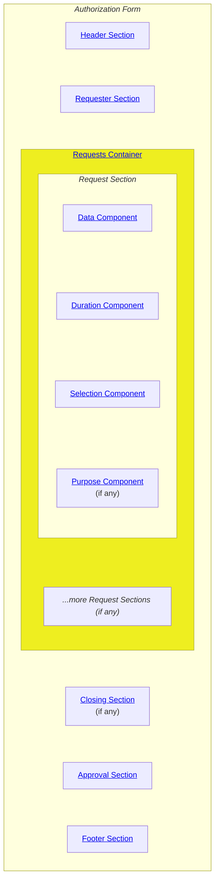

# CDS-WG3-01 - Customer Data

## Abstract <a id="abstract" href="#abstract" class="permalink">🔗</a>

This specification defines how utilities and other central entities ("Servers") may allow vendors, customers, and other external organizations ("Clients") to securely access account holder data ("Customer Data"), including in situations where Customer consent where needed or data is aggregated.
This specification extends [[CDS-WG1-02](#ref-cds-wg1-02)] ("Client Registration") to add new authorization [Scopes](#scopes) and defines new [APIs](#api) (Application Programming Interfaces) for Customer Data.

## Status <a id="status" href="#status" class="permalink">🔗</a>

<b style="color:red">WARNING: This specification is a DRAFT and has not achieved consensus by the working group.</b>

## Copyright <a id="copyright" href="#copyright" class="permalink">🔗</a>

Copyright Joint Development Foundation Projects, LLC, LF Energy Standards and Specifications Series and its contributors ("LFESS").
All rights reserved.
For more information, visit [https://lfess.energy/](https://lfess.energy/).

## Table of Contents <a id="table-of-contents" href="#table-of-contents" class="permalink">🔗</a>

* [1. Introduction](#introduction)  
* [2. Terminology](#terminology)  
* [3. CDS-WG1-02 Extension](#cds-wg1-02-extension)  
* [4. Scenarios](#scenarios)  
    * [4.1. Usage Self-Access](#scenario-usage-self-access)  
    * [4.2. Billing Self-Access](#scenario-billing-self-access) 
    * [4.3. Usage and Billing Self-Access](#scenario-self-access)   
    * [4.4. Meter Data](#scenario-meter-data)  
    * [4.5. Customer Tariffs](#scenario-customer-tariffs)  
    * [4.6. Customer Programs](#scenario-customer-programs)  
    * [4.7. Bill Amount Due](#scenario-bill-amount-due)  
    * [4.8. Customer Bills](#scenario-customer-bills)  
    * [4.9. Service Charges](#scenario-service-charges)  
    * [4.10. Meter App Transparency](#scenario-meter-app-transparency)  
    * [4.11. Whole-Building Data](#scenario-building-data)  
    * [4.12. Aggregated Data](#scenario-aggregated-data)  
* [5. Server Metadata](#server-metadata)  
    * [5.1. Registration Field Formats Extension](#registration-field-formats-extension)  
* [6. Scopes Supported](#scopes)  
    * [6.1. Customer Consent Scopes](#scopes-customer-consent)  
        * [6.1.1. Rate Plan](#scope-rate-plan)  
        * [6.1.2. Account Program Participation](#scope-account-program-participation)  
        * [6.1.3. Service Program Participation](#scope-service-program-participation)  
        * [6.1.4. Account List](#scope-account-list)  
        * [6.1.5. Service List](#scope-service-list)  
        * [6.1.6. Meter List](#scope-meter-list)  
        * [6.1.7. Bill Statements](#scope-bill-statements)  
        * [6.1.8. Service Bills](#scope-service-bills)  
        * [6.1.9. Meter Usage](#scope-meter-usage)  
        * [6.1.10. Aggregation Inclusion](#scope-aggregation-inclusion)  
    * [6.2. Direct Access Scopes](#scopes-direct-access)  
        * [6.2.1. Accounts Query](#scope-accounts-query)  
        * [6.2.2. Service Contracts Query](#scope-service-contracts-query)  
        * [6.2.3. Service Points Query](#scope-service-points-query)  
        * [6.2.4. Meters Devices Query](#scope-meter-devices-query)  
        * [6.2.5. Bill Statements Query](#scope-bill-statements-query)  
        * [6.2.6. Bill Sections Query](#scope-bill-sections-query)  
        * [6.2.7. Aggregations Query](#scope-aggregations-query)  
        * [6.2.8. Usage Query](#scope-usage-query)  
* [7. Authorization Details Fields](#auth-details-fields)  
    * [7.1. Preselection Fields](#auth-details-preselection)  
        * [7.1.1. Preselect Account Numbers](#auth-details-account-numbers)  
        * [7.1.2. Preselect Account Programs](#auth-details-account-programs)  
        * [7.1.3. Preselect Contract Numbers](#auth-details-contract-numbers)  
        * [7.1.4. Preselect Service Types](#auth-details-service-types)  
        * [7.1.5. Preselect Service Programs](#auth-details-service-programs)  
        * [7.1.6. Preselect Service Point Numbers](#auth-details-servicepoint-numbers)  
        * [7.1.7. Preselect Service Point Types](#auth-details-servicepoint-types)  
        * [7.1.8. Preselect Premise Numbers](#auth-details-premise-numbers)  
        * [7.1.9. Preselect Meter Numbers](#auth-details-meter-numbers)  
        * [7.1.10. Preselect Meter Device Types](#auth-details-meter-device-types)  
        * [7.1.11. Preselect Meter Apps](#auth-details-meter-apps)  
        * [7.1.12. Preselect Aggregation Numbers](#auth-details-aggregation-numbers)  
        * [7.1.13. Preselect Addresses](#auth-details-addresses)  
            * [7.1.13.1. Address Matching](#auth-details-address-matching)  
    * [7.2. Included Data Fields](#auth-details-included-data)  
        * [7.2.1. Include Accounts](#auth-details-include-accounts)  
            * [7.2.1.1. Include Account Numbers](#auth-details-include-account-numbers)  
            * [7.2.1.2. Include Account Details](#auth-details-include-account-details)  
            * [7.2.1.3. Include Account Programs](#auth-details-include-account-programs)  
        * [7.2.2. Include Service Contracts](#auth-details-include-service-contracts)  
            * [7.2.2.1. Include Contract Numbers](#auth-details-include-contract-numbers)  
            * [7.2.2.2. Include Rate Plans](#auth-details-include-rate-plans)  
            * [7.2.2.3. Include Service Contract Details](#auth-details-include-contract-details)  
            * [7.2.2.4. Include Service Programs](#auth-details-include-service-programs) 
        * [7.2.3. Include Service Points](#auth-details-include-service-points)  
            * [7.2.3.1. Include Premises](#auth-details-include-premises)  
            * [7.2.3.2. Include Service Point Addresses](#auth-details-include-service-point-addresses)  
            * [7.2.3.3. Include Coordinates](#auth-details-include-coordinates)  
        * [7.2.4. Include Meter Devices](#auth-details-include-meter-devices)  
            * [7.2.4.1. Include Meter Numbers](#auth-details-include-meter-numbers)  
            * [7.2.4.2. Include Meter Apps](#auth-details-include-meter-apps)  
        * [7.2.5. Include Bill Statements](#auth-details-include-bill-statements)  
            * [7.2.5.1. Include Bill Statement Files](#auth-details-include-bill-statement-files)  
            * [7.2.5.2. Include Bill Statement Charges](#auth-details-include-bill-statement-charges) 
            * [7.2.5.3. Include Bill Statement Programs](#auth-details-include-bill-statement-programs) 
        * [7.2.6. Include Bill Sections](#auth-details-include-bill-sections)  
            * [7.2.6.1. Include Bill Section Line Items](#auth-details-include-bill-section-line-items)  
        * [7.2.7. Include Aggregations](#auth-details-include-aggregations)  
            * [7.2.7.1. Include Aggregation Addresses](#auth-details-include-aggregation-addresses)  
        * [7.2.8. Include Usage Segments](#auth-details-include-usage-segments)  
            * [7.2.8.1. Include Usage Segment Value Types](#auth-details-include-usage-segment-value-types)  
        * [7.2.9. Include Energy Attribute Certificates](#auth-details-include-eacs)  
    * [7.3. Duration Fields](#auth-details-duration)  
        * [7.3.1. Sync Until](#auth-details-sync-until)  
        * [7.3.2. Bill Statement Date Start](#auth-details-statement-start)  
        * [7.3.3. Bill Statement Date End](#auth-details-statement-end)  
        * [7.3.4. Bill Section Start Date](#auth-details-bill-section-start)  
        * [7.3.5. Bill Section End Date](#auth-details-bill-section-end)  
        * [7.3.6. Usage Segment Start](#auth-details-usage-segment-start)  
        * [7.3.7. Usage Segment End](#auth-details-usage-segment-end)  
        * [7.3.8. Expires](#auth-details-expires)  
    * [7.4. Other Fields](#auth-details-other)  
        * [7.4.1. Selection Type](#auth-details-selection-type)  
        * [7.4.2. Merge Selections](#auth-details-merge-selections)  
        * [7.4.3. Error If No Preselections](#auth-details-error-if-no-preselections)  
        * [7.4.4. Purpose Identifier](#auth-details-purpose)  
        * [7.4.5. Allow Scope Modifications](#auth-details-allow-scope-modifications)  
* [8. Clients](#clients)  
    * [8.1. Client Object Extension](#client-extension)  
    * [8.2. Modifying Client Objects Extension](#clients-modify-extension)  
    * [8.3. Purpose Object Format](#purpose-format)  
* [9. Customer Authorizations](#authorizations)  
    * [9.1. Authorization Process](#auth-process)  
        * [9.1.1. Authorization Requests](#auth-requests)  
        * [9.1.2. Customer Authentication](#customer-authentication)  
        * [9.1.3. Authorization Process Diagram](#auth-diagram)  
    * [9.2. Authorization Form](#auth-form)  
        * [9.2.1. Authorization Form Layout](#auth-form-layout)  
            * [9.2.1.1. Authorization Form Header Section](#auth-form-header)  
            * [9.2.1.2. Authorization Form Requester Section](#auth-form-requester)  
            * [9.2.1.3. Authorization Form Requests Container](#auth-form-requests)  
            * [9.2.1.4. Authorization Form Request Section](#auth-form-request)  
            * [9.2.1.5. Authorization Form Closing Section](#auth-form-closing)  
            * [9.2.1.6. Authorization Form Approval Section](#auth-form-approval)  
            * [9.2.1.7. Authorization Form Footer Section](#auth-form-footer)  
        * [9.2.2. Authorization Form Components](#auth-form-components)  
            * [9.2.2.1. Data Component](#data-component)  
            * [9.2.2.2. Duration Component](#duration-component)  
            * [9.2.2.3. Selection Component](#selection-component)  
            * [9.2.2.4. Purpose Component](#purpose-component)  
        * [9.2.3. Authorization Form Selections](#auth-form-components)  
            * [9.2.3.1. Account Selection](#account-selection)  
            * [9.2.3.2. Service Contract Selection](#contract-selection)  
            * [9.2.3.3. Service Point Selection](#servicepoint-selection)  
            * [9.2.3.4. Meter Device Selection](#meter-selection)  
            * [9.2.3.5. Aggregation Selection](#aggregation-selection)  
    * [9.3. Authorization Errors](#auth-errors)  
        * [9.3.1. Preselection Error](#preselection-error)  
        * [9.3.2. Invalid Request Error](#request-error)  
        * [9.3.3. Default Redirect Error](#default-redirect-error)  
    * [9.4. Authorization Receipt](#auth-receipt)  
* [10. Customer Data API](#api)
    * [10.1. Accounts API](#accounts-api)  
        * [10.1.1. Account Object Format](#account-format)  
        * [10.1.2. Account Types](#account-types)  
        * [10.1.3. Account Statuses](#account-statuses)  
        * [10.1.4. Entity Object Format](#entity-format)  
        * [10.1.5. Entity Types](#entity-types)  
        * [10.1.6. Account Contact Object Format](#account-contact-format)  
        * [10.1.7. Account Contact Types](#account-contact-types)  
        * [10.1.8. Account Program Object Format](#account-program-format)  
        * [10.1.9. Account Program Types](#account-program-types)  
        * [10.1.10. Listing Accounts](#accounts-list)  
    * [10.2. Service Contracts API](#service-contracts-api)  
        * [10.2.1. Service Contract Object Format](#service-contract-format)  
        * [10.2.2. Contract Types](#contract-types)  
        * [10.2.3. Contract Statuses](#contract-statuses)  
        * [10.2.4. Service Types](#service-types)  
        * [10.2.5. Service Program Object Format](#service-program-format)  
        * [10.2.6. Service Program Types](#service-program-types)  
        * [10.2.7. Listing Service Contracts](#service-contracts-list)  
    * [10.3. Service Points API](#service-points-api)  
        * [10.3.1. Service Point Object Format](#service-point-format)  
        * [10.3.2. Service Point Types](#service-point-types)  
        * [10.3.3. Premise Object Format](#premise-format)  
        * [10.3.4. Premise Types](#premise-types)  
        * [10.3.5. Listing Service Points](#service-points-list)  
    * [10.4. Meter Devices API](#meter-devices-api)  
        * [10.4.1. Meter Device Object Format](#meter-device-format)  
        * [10.4.2. Meter Types](#meter-types)  
        * [10.4.3. Meter App Object Format](#meter-app-format)  
        * [10.4.4. Meter App Types](#meter-app-types)  
        * [10.4.5. Listing Meter Devices](#meter-devices-list)  
    * [10.5. Bill Statements API](#bill-statements-api)  
        * [10.5.1. Bill Statement Object Format](#bill-statement-format)  
        * [10.5.2. New Charge Object Format](#new-charge-format)  
        * [10.5.3. New Charge Types](#new-charge-types)  
        * [10.5.4. Listing Bill Statements](#bill-statements-list)  
    * [10.6. Bill Sections API](#bill-sections-api)  
        * [10.6.1. Bill Section Object Format](#bill-section-format)  
        * [10.6.2. Bill Section Types](#bill-section-types)  
        * [10.6.3. Bill Section Usage Detail Object Format](#bill-section-usage-detail-format)  
        * [10.6.4. Bill Section Usage Detail Types](#bill-section-usage-detail-types)  
        * [10.6.5. Bill Section Cost Detail Object Format](#bill-section-cost-detail-format)  
          * [10.6.5.1. Cost Detail Summation Clarifications](#bill-section-cost-detail-sums)  
        * [10.6.6. Bill Section Cost Detail Types](#bill-section-cost-detail-types)  
        * [10.6.7. Bill Section Line Item Object Format](#bill-section-line-item-format)  
        * [10.6.8. Bill Section Line Item Types](#bill-section-line-item-types)  
        * [10.6.9. Listing Bill Sections](#bill-sections-list)  
    * [10.7. Aggregations API](#aggregations-api)  
        * [10.7.1. Aggregation Object Format](#aggregation-format)  
        * [10.7.2. Aggregation Types](#aggregation-types)  
        * [10.7.3. Aggregation Region Object Format](#aggregation-region-format)  
        * [10.7.4. Aggregation Region Types](#aggregation-region-types)  
        * [10.7.5. Consent Requirement Object Format](#consent-requirement-format)  
        * [10.7.6. Consent Requirement Types](#consent-requirement-types)  
        * [10.7.7. Accessing Data for Aggregations](#aggregation-data-access)  
        * [10.7.8. Listing Aggregations](#aggregations-list)  
    * [10.8. Usage Segments API](#usage-segments-api)  
        * [10.8.1. Usage Segment Objects](#usage-segment-format)  
        * [10.8.2. Value Format Objects](#usage-segment-value-formats)  
        * [10.8.3. Value Sets](#usage-segment-value-set-format)  
        * [10.8.4. Value Objects](#usage-segment-value-objects)  
        * [10.8.5. Value Types](#usage-segment-value-types)  
            * [10.8.5.1. Electric Usage](#usage-segment-electric-usage)  
                * [10.8.5.1.1. Electric Usage Value Format Objects](#usage-segment-electric-usage-value-format)  
                * [10.8.5.1.2. Electric Usage Value Objects](#usage-segment-electric-usage-value-object)  
            * [10.8.5.2. Electric Demand](#usage-segment-electric-demand)  
                * [10.8.5.2.1. Electric Demand Value Format Objects](#usage-segment-electric-demand-value-format)  
                * [10.8.5.2.2. Electric Demand Value Objects](#usage-segment-electric-demand-value-object)  
            * [10.8.5.3. Electric Supply Mix](#usage-segment-supply-mix)  
                * [10.8.5.3.1. Electric Supply Mix Value Format Objects](#usage-segment-supply-mix-value-format)  
                * [10.8.5.3.2. Electric Supply Mix Value Objects](#usage-segment-supply-mix-value-object)  
            * [10.8.5.4. Water Usage](#usage-segment-water-usage)  
                * [10.8.5.4.1. Water Usage Value Format Objects](#usage-segment-water-usage-value-format)  
                * [10.8.5.4.2. Water Usage Value Objects](#usage-segment-water-usage-value-object)  
            * [10.8.5.5. Natural Gas Usage](#usage-segment-gas-usage)  
                * [10.8.5.5.1. Natural Gas Usage Value Format Objects](#usage-segment-gas-usage-value-format)  
                * [10.8.5.5.2. Natural Gas Usage Value Objects](#usage-segment-gas-usage-value-object)  
            * [10.8.5.6. Fuel Oil Usage](#usage-segment-fueloil-usage)  
                * [10.8.5.6.1. Fuel Oil Usage Value Format Objects](#usage-segment-fueloil-usage-value-format)  
                * [10.8.5.6.2. Fuel Oil Usage Value Objects](#usage-segment-fueloil-usage-value-object)  
            * [10.8.5.7. Interval Cost](#usage-segment-interval-cost)  
                * [10.8.5.7.1. Interval Cost Value Format Objects](#usage-segment-interval-cost-value-format)  
                * [10.8.5.7.2. Interval Cost Value Objects](#usage-segment-interval-cost-value-object)  
            * [10.8.5.8. Meter Readings](#usage-segment-meter-readings)  
                * [10.8.5.8.1. Meter Readings Value Format Objects](#usage-segment-meter-readings-value-format)  
                * [10.8.5.8.2. Meter Readings Value Objects](#usage-segment-meter-readings-value-object)  
        * [10.8.6. Value Type Description Objects](#usage-segment-value-type-description)  
        * [10.8.7. Field Types](#usage-segment-value-format-field-types)  
            * [10.8.7.1. Unit Types](#usage-segment-unit-types)  
            * [10.8.7.2. Direction Types](#usage-segment-direction-types)  
            * [10.8.7.3. Time-of-Use Types](#usage-segment-tou-types)  
            * [10.8.7.4. Tier Types](#usage-segment-tier-types)  
            * [10.8.7.5. Season Types](#usage-segment-season-types)  
            * [10.8.7.6. Reading Quality Types](#usage-segment-reading-quality-types)  
            * [10.8.7.7. Demand Types](#usage-segment-demand-types)  
            * [10.8.7.8. Supply Attribution Types](#usage-segment-supply-attribution-types)  
            * [10.8.7.9. Supply Types](#usage-segment-supply-types)  
        * [10.8.8. Listing Usage Segments](#usage-segments-list)  
    * [10.9. Energy Attribute Certificates API](#eac-api)  
        * [10.9.1. Energy Attribute Certificate Object Format](#eac-format)  
        * [10.9.2. Beneficiary Types](#eac-beneficiary-types)  
        * [10.9.3. EAC Data Format Description Object](#eac-data-format-descriptions)  
        * [10.9.4. Listing Energy Attribute Certificates](#eacs-list)  
* [11. Extensions](#extensions)  
    * [11.1. Scenario Extensions](#scenario-extensions)  
    * [11.2. Scope Extensions](#scope-extensions)  
    * [11.3. Authorization Details Field Extensions](#auth-details-field-extensions)  
    * [11.4. Customer Authorization Extensions](#customer-authorization-extensions)  
    * [11.5. API Endpoint Extensions](#api-extensions)  
    * [11.6. Data Object Extensions](#object-extensions)  
    * [11.7. Enumerated Values Extensions](#enum-extensions)  
* [12. Security Considerations](#security)  
    * [12.1. Inherited Security Considerations](#security-inheritance)  
    * [12.2. Obligation to Server Jurisdiction Requirements](#security-jurisdiction-requirements)  
    * [12.3. Data Anonymization](#security-data-anonymization)  
* [13. Examples](#examples)  
* [14. References](#references)  
* [15. Acknowledgments](#acknowledgments)  
* [16. Authors' Addresses](#authors-addresses)  

## 1. Introduction <a id="introduction" href="#introduction" class="permalink">🔗</a>

This specification was developed as part of the global effort to facilitate grid modernization and the energy transition.
Specifically, in order to scalably deploy and economically operate and analyze new energy technologies, external organizations and Customers need an automated means of requesting access to Customer Data from utilities and other central entities.

There are thousands of utilities serving Customers across the world, and each have their own way of providing access to and formatting Customer Data.
This specification defines a way for these utilities and other central entities ("Servers") to provide a standardized, structured process for external companies and organizations ("Clients") to access Customer Data, requesting consent from Customers if needed.
By offering a standardized a Customer Data access protocol, utilities and other central entities can offer secure, automated, managed means of access to Customer Data.

## 2. Terminology <a id="terminology" href="#terminology" class="permalink">🔗</a>

<a id="server" href="#server" class="permalink">🔗</a> **"Server"** - The entity hosting the specified endpoints.
A Server can be an energy utility or another type of entity that want to provide access to privileged functionality or data.
These entities can include, but are not limited to, distribution utilities, grid operators, electric retailers, community choice aggregators, government agencies, data warehouses, and private infrastructure providers.

<a id="client" href="#client" class="permalink">🔗</a> **"Client"** - The entity requesting [Server's](#server) metadata endpoints.
A Client can be any person, company, or organization seeking to access Customer Data with a Server for a specific scope of access.
These entities can include, but are not limited to, energy efficiency contractors, utility vendors, distributed energy resource companies, building energy management platforms, and even Customers themselves (to gain automated access their own data).

<a id="customer" href="#customer" class="permalink">🔗</a> **"Customer"** - The entity who's [Customer Data](#customer-data-def) is being requested from a [Server](#server) by a [Client](#client).
For grants that require customer authorization, the Customer is the [User](#user) who authorizes the access.
Customers are typically the account holder, also commonly called the "customer of record", such as homeowners, renters, businesses, and industrial companies.
Customers may also be a representative of the customer of record, such as an energy management company, provided that the reprentative has been duly authorized give consent on the customer of record's behalf according to local regulatory requirements.

<a id="customer-data-def" href="#customer-data-def" class="permalink">🔗</a> **"Customer Data"** - Data that is made available by a Server via the various [APIs](#api) defined in this specification.
This data is typically confidential data that is tied to an individual Customer ([Accounts](#account-format), [Bill Statements](#bill-statement-format), etc.), but can also be other data such as details about utility [Service Points](#service-point-format), regional usage [Aggregations](#aggregation-format), or system wide [Energy Attribute Certificates](#eac-format).
This means that this specification does not distinguish between what is Customer personally identifiable information (PII), what is utility or central entity confidential information, and what is public information.
Instead, this specification assumes that all information being accessed by Clients is confidential and requires a valid access token for an authorized [Scope](#scopes).
It is up to a Server to manage which Clients have which Scopes available to use, what resources are available to query for those Clients, which Clients require [Customer consent](#scopes-customer-consent) to access data, and which Clients may [query data directly](#scopes-direct-access).

<a id="user" href="#user" class="permalink">🔗</a> **"User"** - The person who is navigating the [Authorization Process](#authorizations).
For the Authorization Process, the User is assumed to be the [Customer](#customer) (if the Customer is a person) or the Customer's representative (if the Customer is a business).
So for the purposes of this specification, anytime the "User" is mentioned it can be assumed that the Customer is the User, whether or not they have completed [Customer Authentication](#customer-authentication).

<a id="array" href="#array" class="permalink">🔗</a> "Array" - A list of objects or values as defined by `Arrays` in [[RFC 8259 Section 5](#ref-rfc8259-arrays)].

<a id="country-code" href="#country-code" class="permalink">🔗</a> "country code" - A two-character string representing a country as defined in [ISO 3166](#ref-iso3166) (e.g. "US").

<a id="date" href="#date" class="permalink">🔗</a> "date" - A string representing date in the format of `full-date` as defined by [[RFC 3339 Section 5.6](#ref-rfc3339-datetime)] (e.g. "2024-01-01").

<a id="datetime" href="#datetime" class="permalink">🔗</a> "datetime" - A string representing date and time in the format of `date-time` as defined by [[RFC 3339 Section 5.6](#ref-rfc3339-datetime)] (e.g. "2024-01-01T00:00:00Z").

<a id="decimal" href="#decimal" class="permalink">🔗</a> "decimal" - A decimal value as defined by `number` in [[RFC 8259 Section 6](#ref-rfc8259-numbers)].
Decimal values MAY have any number of significant digits after the decimal point.
When storing a decimal value, Servers MUST preserve the decimal precision of the value exactly.
This means Servers MUST NOT store a decimal value as a float, since that format does not preserve the significant figures of the decimal value.

<a id="email-address" href="#email-address" class="permalink">🔗</a> "email address" - An electronic mail address as defined by [[RFC 5322 Section 3.4.1](#ref-rfc5322-email-address)].

<a id="geojson" href="#geojson" class="permalink">🔗</a> "GeoJSON" - A [JSON](#json) object that defines a geographic territory as specified in [[RFC 7946 Section 3](#ref-rfc7946-geojson)].

<a id="get" href="#get" class="permalink">🔗</a> "GET" - A request method defined in [[RFC 9110 Section 9](#ref-rfc9110-methods)].

<a id="https" href="#https" class="permalink">🔗</a> "HTTPS" - A secure web request protocol defined in [[RFC 9110 Section 4.2.2](#ref-rfc9110-https)].

<a id="integer" href="#integer" class="permalink">🔗</a> "integer" - A positive integer value as defined by `int` in [[RFC 8259 Section 6](#ref-rfc8259-numbers)].

<a id="json" href="#json" class="permalink">🔗</a> "JSON" - A data format defined in [[RFC 8259](#ref-rfc8259)].

<a id="map" href="#map" class="permalink">🔗</a> "Map" - A JSON object as defined by `Objects` in [[RFC 8259 Section 4](#ref-rfc8259-objects)].

<a id="mime-type" href="#mime-type" class="permalink">🔗</a> "MIME type" - A string representing a document media type as defined in [[RFC 6838](#ref-rfc6838)] (e.g. "image/png").

<a id="null" href="#null" class="permalink">🔗</a> "null" - The `null` value defined in [[RFC 8259 Section 3](#ref-rfc8259-values)].

<a id="status-code" href="#status-code" class="permalink">🔗</a> "Status Code" - A response status code defined in [[RFC 9110 Section 15](#ref-rfc9110-codes)].

<a id="string" href="#string" class="permalink">🔗</a> "string" - A series of unicode characters as defined in [[RFC 8259 Section 7](#ref-rfc8259-strings)].

<a id="url" href="#url" class="permalink">🔗</a> "URL" - A string representing resource as defined in [[RFC 3986 Section 1.1.3](#ref-rfc3986-url)] (e.g. "https://example.com/page1").

<a id="key-words" href="#key-words" class="permalink">🔗</a> Key Words: "MUST", "MUST NOT", "REQUIRED", "SHALL", "SHALL NOT", "SHOULD", "SHOULD NOT", "RECOMMENDED", "NOT RECOMMENDED", "MAY", and "OPTIONAL" are defined in accordance with [[BCP 14](#ref-bcp14)].

## 3. CDS-WG1-02 Extension <a id="cds-wg1-02-extension" href="#CDS-WG1-02-extension" class="permalink">🔗</a>

As the framework for providing Client registration, onboarding, communication, management, and grant authorizations, Servers MUST implement CDS's Client Registration specification [[CDS-WG1-02](#ref-cds-wg1-02)] in order to implement the functionality defined in this specification.
This specification also extends the CDS's Client Registration framework by defining additional fields, values, and APIs that are relevant to Customer Data access, so that Servers implementing this specification can satisfy Customer Data use cases.

Specifically, the following sections are extended from [[CDS-WG1-02](#ref-cds-wg1-02)]:

* The Authorization Server Metadata object [[CDS-WG1-02 Section 3.2](#ref-cds-wg1-02-metadata)] is extended to include [additional fields](#server-metadata).
* The Registration Field Formats [[CDS-WG1-02 Section 3.7](#ref-cds-wg1-02-registration-field-formats)] is extended to include [additional fields](#registration-field-formats-extension).
* The Scopes Supported section [[CDS-WG1-02 Section 3.3](#ref-cds-wg1-02-scopes)] is extended to include [additional Scopes](#scopes).
* The Client object [[CDS-WG1-02 Section 5.1](#ref-cds-wg1-02-client-object)] is extended to include [additional fields](#client-extension).
* The Client modification API [[CDS-WG1-02 Section 5.5](#ref-cds-wg1-02-modifying-clients)] is extended to include [additional requirements](#clients-modify-extension).

## 4. Scenarios <a id="scenarios" href="#scenarios" class="permalink">🔗</a>

Customer Data access is necessary for many different use cases, but not all use cases require the same type of access or same fields of Customer Data.
For example, an energy efficiency auditor working with a Customer may need historical usage intervals, but no bill data.
In contrast, another example is for a building management company to need ongoing access to a Customer's bill statements for accounting and reporting.

This section defines "Scenarios" as sets of [Scopes](#scopes) and configuration requirements for Scope Descriptions that are intended to meet the Scenario's use cases.
Because Scenarios are defined sets of Scopes and configuration requirements, they don't actually appear in any API responses by the Server.
Rather, Scenarios are intended to aide regulators, governing authorities, and [Extensions](#extensions) in choosing which Scopes, data fields, and functionality they require Servers to implement.

Regulators, governing authorities, and extensions MAY choose to require implementation of any combination of Scenarios defined in this specification or choose to define new Scenarios.
For example, a regulator could define a new Scenario that extends the [Meter Data](#scenario-meter-data) Scenario by requiring an additional `CAISO_zone_id` field be included in the [Service Contract](#service-contract-format) object.
See the [Scenario Extensions](#scenario-extensions) section for details on how to modify and extend Scenarios.

In addition to implementing requirements for their jurisdiction, Servers MAY implement any Scope or configuration that helps provide Customer Data access for relevant internal or external use cases.
For example, a utility could enable Scopes that streamline how they transfer program participant meter data to their contracted program administrator vendor for internal program analysis and reporting.

Clients MUST NOT rely on stated Scenario compliance from regulators or Servers.
Instead, Clients MUST parse the [Server Metadata](#server-metadata) to evaluate if a Server's offered Scopes and functionality is adequate for their use case.

### 4.1. Usage Self-Access <a id="scenario-usage-self-access" href="#scenario-usage-self-access" class="permalink">🔗</a>

This section defines the Scenario "Usage Self-Access" in which a utility Customer wants to access their own accounts' meter and usage data.
For example, a commercial customer would like to download their historical meter usage feed for their owned properties, so that their energy management team can evaluate their buildings' energy profiles.
Another example is for a data center owner to want to integrate an automatic nightly update of their previous day's meter usage, so that they can check their operations for discrepancies between their own energy monitoring systems.

To implement the "Usage Self-Access" Scenario, Servers MUST implement the following requirements:

* Servers MUST include support for the following Scopes in their Server Metadata's `scopes_supported` array [[CDS-WG1-02 Section 3.2](#ref-cds-wg1-02-metadata)]:
    * [Accounts Query](#scope-accounts-query)
    * [Service Contracts Query](#scope-service-contracts-query)
    * [Service Points Query](#scope-service-points-query)
    * [Meter Devices Query](#scope-meter-devices-query)
    * [Usage Query](#scope-usage-query)
* Servers MUST include any required steps for verifying the identity of a Client as the Customer in the Scope Description `registration_requirements` list.
  For example, if a Server requires Customers to associate their online web account with Clients they register, the Server would include a Registration Field [[CDS-WG1-02 Section 3.5](#ref-cds-wg1-02-registration-fields)] with a `type` value of `sso_verification`.
* Once Servers have verified the identity of the Client as the Customer, Servers MUST configure the Customer's Accounts and Service Contracts to be accessible to the Client using the [Accounts Query](#scope-accounts-query) and [Service Contracts Query](#scope-service-contracts-query) scopes.
* Servers MUST configure any Meter Devices, Service Points, and Usage Segments associated with the Customer's Accounts and Service Contracts to be accessible to the Client using the [Service Points Query](#scope-service-points-query), [Meter Devices Query](#scope-meter-devices-query), and [Usage Query](#scope-usage-query) scopes.
* For the [Accounts Query](#scope-accounts-query), [Service Contracts Query](#scope-service-contracts-query), [Service Points Query](#scope-service-points-query), and [Meter Devices Query](#scope-meter-devices-query) Scopes, in addition to the requirements for each Scope, the following [Authorization Details Fields](#auth-details-fields) MUST also be supported by the Server:
    * [`account_numbers`](#auth-details-account-numbers)
    * [`contract_numbers`](#auth-details-contract-numbers)
    * [`servicepoint_numbers`](#auth-details-servicepoint-numbers)
    * [`premise_numbers`](#auth-details-premise-numbers)
    * [`meter_numbers`](#auth-details-meter-numbers)
    * [`include_accounts`](#auth-details-include-accounts)
    * [`include_account_numbers`](#auth-details-include-account-numbers)
    * [`include_account_details`](#auth-details-include-account-details)
    * [`include_service_contracts`](#auth-details-include-service-contracts)
    * [`include_contract_numbers`](#auth-details-include-contract-numbers)
    * [`include_rate_plans`](#auth-details-include-rate-plans)
    * [`include_service_contract_details`](#auth-details-include-contract-details)
    * [`include_service_points`](#auth-details-include-service-points)
    * [`include_premises`](#auth-details-include-premises)
    * [`include_service_point_addresses`](#auth-details-include-service-point-addresses)
    * [`include_coordinates`](#auth-details-include-coordinates)
    * [`include_meter_devices`](#auth-details-include-meter-devices)
    * [`include_meter_numbers`](#auth-details-include-meter-numbers)
    * [`include_meter_apps`](#auth-details-include-meter-apps)
    * [`error_if_no_preselections`](#auth-details-error-if-no-preselections)
* For the [Usage Query](#scope-usage-query) Scope, in addition to its requirements, the following Authorization Details Fields MUST also be supported by the Server:
    * [`meter_numbers`](#auth-details-meter-numbers)
    * [`include_meter_devices`](#auth-details-include-meter-devices)
    * [`include_meter_numbers`](#auth-details-include-meter-numbers)
    * [`error_if_no_preselections`](#auth-details-error-if-no-preselections)
* The following are requirements for supported Authorization Details Field Objects [[CDS-WG1-02 Section 3.8](#ref-cds-wg1-02-auth-details-object)]:
    * For the [`segment_start`](#auth-details-usage-segment-start) field, the Server MUST allow the Client to access for each connected Service Contract's usage at least 1 year of historical usage data (i.e. `minimum` value set to at least `P1Y`).
    * For the [`segment_end`](#auth-details-usage-segment-end) field, the Server MUST set the `maximum` value to `"infinite"` (i.e. Clients MAY authorize access to ongoing usage access indefinitely).
    * For the [`sync_until`](#auth-details-sync-until) field, the Server MUST set the `maximum` value to `"infinite"` (i.e. Clients MAY authorize access to ongoing updates to their Accounts, Service Contracts, Service Points, and Meter Devices indefinitely).
* Servers MUST keep the list of Accounts, Service Contracts, Service Points, Meter Devices, and Usage Segments that are associated with the Grant updated to reflect any changes to the Customer, in accordance with the requirements of the `sync_until` and `segment_end` authorization details fields.
  For example, if a Customer has a `sync_until` and `segment_end` fields set to `"infinite"` and builds a new warehouse on their property, the Client will see any new Accounts, Service Contracts, Service Points, Meter Devices, and Usage Segments for the new warehouse included in API objects returned when data is next synced to the Server from the Server's source of truth (e.g. the utility's internal Meter Data Management system).

### 4.2. Billing Self-Access <a id="scenario-billing-self-access" href="#scenario-billing-self-access" class="permalink">🔗</a>

This section defines the Scenario "Billing Self-Access" in which a utility Customer wants to access their own accounts' utility bills.
For example, an enterprise customer would like automate importing their utility bills into their accounting software.

To implement the "Billing Self-Access" Scenario, Servers MUST implement the following requirements:

* Servers MUST include support for the following Scopes in their Server Metadata's `scopes_supported` array [[CDS-WG1-02 Section 3.2](#ref-cds-wg1-02-metadata)]:
    * [Accounts Query](#scope-accounts-query)
    * [Service Contracts Query](#scope-service-contracts-query)
    * [Bill Statements Query](#scope-bill-statements-query)
    * [Bill Sections Query](#scope-bill-sections-query)
* Servers MUST include any required steps for verifying the identity of a Client as the Customer in the Scope Description `registration_requirements` list.
  For example, if a Server requires Customers to associate their online web account with Clients they register, the Server would include a Registration Field [[CDS-WG1-02 Section 3.5](#ref-cds-wg1-02-registration-fields)] with a `type` value of `sso_verification`.
* Once Servers have verified the identity of the Client as the Customer, Servers MUST configure the Customer's Accounts and Service Contracts to be accessible to the Client using the [Accounts Query](#scope-accounts-query) and [Service Contracts Query](#scope-service-contracts-query) scopes.
* Servers MUST also configure any Bill Statements and Bill Sections associated with the Customer's Accounts and Service Contracts to be accessible to the Client using the [Bill Statements Query](#scope-bill-statements-query) and [Bill Sections Query](#scope-bill-sections-query) scopes.
* Servers MUST keep the list of Accounts, Service Contracts, Bill Statements, and Bill Sections that are associated with the Client updated to reflect any changes to the Customer.
  For example, if a Customer buys a property and transfers the utility services for that property to a new account under their profile, the Client should see any new Accounts, Service Contracts, Bill Statements, and Bill Sections for the new account in API objects returned when data is next synced from the Server.
* For the [Accounts Query](#scope-accounts-query) and [Service Contracts Query](#scope-service-contracts-query) Scopes, in addition to the requirements for each Scope, the following [Authorization Details Fields](#auth-details-fields) MUST also be supported by the Server:
    * [`account_numbers`](#auth-details-account-numbers)
    * [`contract_numbers`](#auth-details-contract-numbers)
    * [`include_accounts`](#auth-details-include-accounts)
    * [`include_account_numbers`](#auth-details-include-account-numbers)
    * [`include_account_details`](#auth-details-include-account-details)
    * [`include_service_contracts`](#auth-details-include-service-contracts)
    * [`include_contract_numbers`](#auth-details-include-contract-numbers)
    * [`include_rate_plans`](#auth-details-include-rate-plans)
    * [`include_service_contract_details`](#auth-details-include-contract-details)
    * [`error_if_no_preselections`](#auth-details-error-if-no-preselections)
* For the [Bill Statements Query](#scope-bill-statements-query) Scope, in addition to its requirements, the following Authorization Details Fields MUST also be supported by the Server:
    * [`account_numbers`](#auth-details-account-numbers)
    * [`include_accounts`](#auth-details-include-accounts)
    * [`include_account_numbers`](#auth-details-include-account-numbers)
    * [`include_bill_statement_files`](#auth-details-include-bill-statement-files)
    * [`include_bill_statement_charges`](#auth-details-include-bill-statement-charges)
    * [`include_bill_statement_programs`](#auth-details-include-bill-statement-programs)
    * [`error_if_no_preselections`](#auth-details-error-if-no-preselections)
* For the [Bill Sections Query](#scope-bill-sections-query) Scope, in addition to its requirements, the following Authorization Details Fields MUST also be supported by the Server:
    * [`account_numbers`](#auth-details-account-numbers)
    * [`contract_numbers`](#auth-details-contract-numbers)
    * [`include_accounts`](#auth-details-include-accounts)
    * [`include_account_numbers`](#auth-details-include-account-numbers)
    * [`include_service_contracts`](#auth-details-include-service-contracts)
    * [`include_contract_numbers`](#auth-details-include-contract-numbers)
    * [`include_bill_section_line_items`](#auth-details-include-bill-section-line-items)
* The following are requirements for supported Authorization Details Field Objects [[CDS-WG1-02 Section 3.8](#ref-cds-wg1-02-auth-details-object)]:
    * For the [`statement_date_start`](#auth-details-statement-start) field, the Server MUST allow the Client to access for each connected Account at least 1 year of historical bills (i.e. `minimum` value set to at least `P1Y`).
    * For the [`statement_date_end`](#auth-details-statement-end) field, the Server MUST set the `maximum` value to `infinite` (i.e. Clients MAY authorize access to ongoing bill access indefinitely).
    * For the [`start_date`](#auth-details-bill-section-start) field, the Server MUST allow the Client to access for each connected Service Contract at least 1 year of historical billing data (i.e. `minimum` value set to at least `P1Y`).
    * For the [`end_date`](#auth-details-bill-section-end) field, the Server MUST set the `maximum` value to `infinite` (i.e. Clients MAY authorize access to ongoing service billing data indefinitely).
    * For the [`sync_until`](#auth-details-sync-until) field, the Server MUST set the `maximum` value to `infinite` (i.e. Clients MAY authorize access to ongoing updates to their Accounts and Service Contracts indefinitely).
* Servers MUST keep the list of Accounts, Service Contracts, Bill Statements, and Bill Sections that are associated with the Grant updated to reflect any changes to the Customer, in accordance with the requirements of the `sync_until`, `statement_date_end`, and `end_date` authorization details fields.
  For example, if a Customer has a `sync_until` and `statement_date_end` fields set to `"infinite"` and builds a new warehouse on their property, the Client will see any new Accounts, Service Contracts, and Bill Statements for the new warehouse included in API objects returned when data is next synced to the Server from the Server's source of truth (e.g. the utility's internal billing system).

### 4.3. Usage and Billing Self-Access <a id="scenario-self-access" href="#scenario-self-access" class="permalink">🔗</a>

This section defines the Scenario "Usage and Billing Self-Access" in which a utility Customer wants to access their own accounts' usage and bills.
For example, an enterprise customer would like automate a energy billing.

To implement the "Usage and Billing Self-Access" Scenario, Servers MUST implement the following requirements:

* Servers MUST implement the [Usage Self-Access](#scenario-usage-self-access) Scenario.
* Servers MUST implement the [Billing Self-Access](#scenario-billing-self-access) Scenario.
* For the [Bill Sections Query](#scope-bill-sections-query) Scope, in addition to the Billing Self-Access Scenario requirements, the following Authorization Details Fields MUST also be supported by the Server:
    * [`include_service_points`](#auth-details-include-service-points)
    * [`include_meter_devices`](#auth-details-include-meter-devices)
* For the [Usage Query](#scope-usage-query) Scope, in addition to the Usage Self-Access Scenario requirements, the following Authorization Details Fields MUST also be supported by the Server:
    * [`include_bill_sections`](#auth-details-include-bill-sections)

### 4.4. Meter Data <a id="scenario-meter-data" href="#scenario-meter-data" class="permalink">🔗</a>

This section defines the Scenario "Meter Data" in which a Client requests access to a Customer's historical and/or ongoing usage data.
For example, an energy efficiency auditor is working with building owner, and needs to download their previous year's usage.

To implement the "Meter Data" Scenario, Servers MUST implement the following requirements:

* Servers MUST include support for the following Scopes in their Server Metadata's `scopes_supported` array [[CDS-WG1-02 Section 3.2](#ref-cds-wg1-02-metadata)]:
    * [Service List](#scope-service-list)
    * [Meter List](#scope-meter-list)
    * [Meter Usage](#scope-meter-usage)
* Servers MUST include any steps in the `registration_requirements` that the Client or Server needs to complete before the Server will create a Client object that has the `production` status in it's `cds_status_options` array.
  For example, if the Server requires a manual review of the Client's registration before approving production access, the Server would include a Registration Field [[CDS-WG1-02 Section 3.5](#ref-cds-wg1-02-registration-fields)] with a `type` value of `internal_review`.
* For the [Service List](#scope-service-list) Scope, in addition to its requirements, the following [Authorization Details Fields](#auth-details-fields) MUST also be supported by the Server:
    * [`account_numbers`](#auth-details-account-numbers)
    * [`meter_numbers`](#auth-details-meter-numbers)
    * [`addresses`](#auth-details-addresses)
    * [`include_account_numbers`](#auth-details-include-account-numbers)
    * [`include_rate_plans`](#auth-details-include-rate-plans)
    * [`include_service_contract_details`](#auth-details-include-contract-details)
    * [`include_service_points`](#auth-details-include-service-points)
    * [`include_premises`](#auth-details-include-premises)
    * [`include_service_point_addresses`](#auth-details-include-service-point-addresses)
    * [`include_coordinates`](#auth-details-include-coordinates)
    * [`include_meter_devices`](#auth-details-include-meter-devices)
* For the [Meter List](#scope-meter-list) Scope, in addition to its requirements, the following Authorization Details Fields MUST also be supported by the Server:
    * [`account_numbers`](#auth-details-account-numbers)
    * [`contract_numbers`](#auth-details-contract-numbers)
    * [`service_types`](#auth-details-service-types)
    * [`servicepoint_numbers`](#auth-details-servicepoint-numbers)
    * [`servicepoint_types`](#auth-details-servicepoint-types)
    * [`premise_numbers`](#auth-details-premise-numbers)
    * [`addresses`](#auth-details-addresses)
    * [`include_accounts`](#auth-details-include-accounts)
    * [`include_account_numbers`](#auth-details-include-account-numbers)
    * [`include_service_contracts`](#auth-details-include-service-contracts)
    * [`include_contract_numbers`](#auth-details-include-contract-numbers)
    * [`include_rate_plans`](#auth-details-include-rate-plans)
    * [`include_service_contract_details`](#auth-details-include-contract-details)
    * [`include_service_points`](#auth-details-include-service-points)
    * [`include_premises`](#auth-details-include-premises)
    * [`include_service_point_addresses`](#auth-details-include-service-point-addresses)
    * [`include_coordinates`](#auth-details-include-coordinates)
* For the [Meter Usage](#scope-meter-usage) Scope, in addition to its requirements, the following Authorization Details Fields MUST also be supported by the Server:
    * [`account_numbers`](#auth-details-account-numbers)
    * [`contract_numbers`](#auth-details-contract-numbers)
    * [`service_types`](#auth-details-service-types)
    * [`servicepoint_numbers`](#auth-details-servicepoint-numbers)
    * [`servicepoint_types`](#auth-details-servicepoint-types)
    * [`premise_numbers`](#auth-details-premise-numbers)
    * [`meter_numbers`](#auth-details-meter-numbers)
    * [`addresses`](#auth-details-addresses)
* For the [Meter List](#scope-meter-list) and [Meter Usage](#scope-meter-usage) Scopes, the [`authorization_form_selection_type`](#auth-details-selection-type) Authorization Details Field object MUST contain a Choice with the `id` value of [`"service_contract_selection"`](#contract-selection) in its `choices` array.
  This is to enable Clients to merge any of Service List, Meter List, Meter Usage Scopes into the same [Service Contract Selection](#contract-selection) in the [Authorization Form](#auth-form) so that Customers only have to make one selection of which Service Contracts to include in an authorization of meter usage data.
* The following are requirements for supported Authorization Details Field Objects [[CDS-WG1-02 Section 3.8](#ref-cds-wg1-02-auth-details-object)]:
    * For the [`segment_start`](#auth-details-usage-segment-start) field, the Server MUST allow Customers to authorize access to at least 3 years of historical usage (i.e. `minimum` value set to at least `P3Y`).
    * For the [`segment_end`](#auth-details-usage-segment-end) field, the Server MUST set the `maximum` value to `"infinite"` (i.e. Customers MAY authorize access to ongoing usage until they choose to revoke it).
    * For the [`sync_until`](#auth-details-sync-until) field, the Server MUST set the `maximum` value to `"infinite"` (i.e. Customers MAY authorize access to ongoing updates to their Accounts, Service Contracts, Service Points, and Meter Devices until they choose to revoke it).
* Servers MUST keep the list of Accounts, Service Contracts, Service Points, Meter Devices, and Usage Segments that are associated with the Grant updated to reflect any changes to the Customer, in accordance with the requirements of the `sync_until` and `segment_end` authorization details fields.
  For example, if a Customer has authorized `"infinite"` as the value for `sync_until` and `segment_end`, as well as selected `"_include_future"` for Service Contracts, then builds a new warehouse on their property, the Client will see any new Accounts, Service Contracts, Service Points, Meter Devices, and Usage Segments for the new warehouse included in API objects returned when data is next synced to the Server from the Server's source of truth (e.g. the utility's internal Meter Data Management system).
* When a Server will provide access to granular meter data that includes [Usage Segment](#usage-segment-format) `interval` values of less or equal to 90000 (i.e. daily intervals and shorter), the Server MUST sync updates from its source of truth at least once per day, so that Client's may receive daily updates to meter usage and any changes to the Customer's resources.
* When a Server will provide access to granular meter data that includes [Usage Segment](#usage-segment-format) `interval` values of greater than 90000 (i.e. longer than daily intervals), the Server MUST sync updates from its source of truth at least once per week, so that Client's may receive changes to the Customer's resources within a week of their occurrence and meter usage updates within a week of them being saved to the Server's source of truth.

### 4.5. Customer Tariffs <a id="scenario-customer-tariffs" href="#scenario-customer-tariffs" class="permalink">🔗</a>

This section defines the Scenario "Customer Tariffs" in which a Client requests access to a Customer's current rate plan(s).
For example, an energy rebate app wants to see if a Customer qualifies for certain utility rebate programs while minimizing the Customer Data request.

To implement the "Rate Plan" Scenario, Servers MUST implement the following requirements:

* Servers MUST include support for the following Scopes in their Server Metadata's `scopes_supported` array [[CDS-WG1-02 Section 3.2](#ref-cds-wg1-02-metadata)]:
    * [Rate Plan](#scope-rate-plan)
* Servers MUST include any steps in the `registration_requirements` that the Client or Server needs to complete before the Server will create a Client object that has the `production` status in it's `cds_status_options` array.
  For example, if the Server requires a manual review of the Client's registration before approving production access, the Server would include a Registration Field [[CDS-WG1-02 Section 3.5](#ref-cds-wg1-02-registration-fields)] with a `type` value of `internal_review`.
* For the [Rate Plan](#scope-rate-plan) Scope, in addition to its requirements, the following [Authorization Details Fields](#auth-details-fields) MUST also be supported by the Server:
    * [`account_numbers`](#auth-details-account-numbers)
    * [`meter_numbers`](#auth-details-meter-numbers)
    * [`addresses`](#auth-details-addresses)
    * [`include_accounts`](#auth-details-include-accounts)
    * [`include_account_numbers`](#auth-details-include-account-numbers)
    * [`include_service_contract_details`](#auth-details-include-contract-details)
    * [`include_meter_devices`](#auth-details-include-meter-devices)
    * [`include_meter_numbers`](#auth-details-include-meter-numbers)
* The following are requirements for supported Authorization Details Field Objects [[CDS-WG1-02 Section 3.8](#ref-cds-wg1-02-auth-details-object)]:
    * For the [`sync_until`](#auth-details-sync-until) field, the Server MUST set the `maximum` value to `"infinite"` (i.e. Customers MAY authorize access to ongoing updates to their rate plans and associated details until they choose to revoke it).
* Servers MUST keep the [API](#api) objects that are associated with the Grant updated to reflect any changes to the Customer, in accordance with the requirements of the `sync_until` authorization details field.
  For example, if a Customer has authorized `"infinite"` as the value for `sync_until` and later changes their rate plan from a fixed to time-of-use rate, the Client will see the Service Contract's `rateplan_code` and `rateplan_name` values updated when data is next synced to the Server from the Server's source of truth (e.g. the utility's internal Customer Resource Management system).
* The Server MUST sync updates from its source of truth at least once per week, so that Client's may receive changes to the Customer's resources within a week of their occurrence.

### 4.6. Customer Programs <a id="scenario-customer-programs" href="#scenario-customer-programs" class="permalink">🔗</a>

This section defines the Scenario "Customer Programs" in which a Client requests access to a Customer's current rate plan(s).
For example, an energy rebate app wants to see if a Customer is eligible or is currently participating in a list of potentially applicable utility programs.

To implement the "Customer Programs" Scenario, Servers MUST implement the following requirements:

* Servers MUST include support for at least one the following Scopes in their Server Metadata's `scopes_supported` array [[CDS-WG1-02 Section 3.2](#ref-cds-wg1-02-metadata)]:
    * [Account Program Participation](#scope-account-program-participation)
    * [Service Program Participation](#scope-service-program-participation)
* Servers MUST include any steps in the `registration_requirements` that the Client or Server needs to complete before the Server will create a Client object that has the `production` status in it's `cds_status_options` array.
  For example, if the Server requires a manual review of the Client's registration before approving production access, the Server would include a Registration Field [[CDS-WG1-02 Section 3.5](#ref-cds-wg1-02-registration-fields)] with a `type` value of `internal_review`.
* For [Account Program Participation](#scope-account-program-participation) and [Service Program Participation](#scope-service-program-participation) Scopes, in addition to their requirements, the following [Authorization Details Fields](#auth-details-fields) MUST also be supported by the Server:
    * [`account_numbers`](#auth-details-account-numbers)
    * [`meter_numbers`](#auth-details-meter-numbers)
    * [`addresses`](#auth-details-addresses)
    * [`include_accounts`](#auth-details-include-accounts)
    * [`include_account_numbers`](#auth-details-include-account-numbers)
    * [`include_service_contracts`](#auth-details-include-service-contracts)
    * [`include_contract_numbers`](#auth-details-include-contract-numbers)
    * [`include_rate_plans`](#auth-details-include-rate-plans)
    * [`include_service_contract_details`](#auth-details-include-contract-details)
    * [`include_meter_devices`](#auth-details-include-meter-devices)
    * [`include_meter_numbers`](#auth-details-include-meter-numbers)
* The following are requirements for supported Authorization Details Field Objects [[CDS-WG1-02 Section 3.8](#ref-cds-wg1-02-auth-details-object)]:
    * For [Account Program Participation](#scope-account-program-participation) Scopes, the [`account_programs`](#auth-details-account-programs) authorization details field for each Scope MUST include a `choices` array that includes Choice objects where the `id` values are supported [Service Program](#service-program-format) `program_number` values for which the Server is providing access.
      This can include programs for which the Customer is eligible, in addition to programs in which the Customer is currently participating or has previously participated.
    * For [Service Program Participation](#scope-service-program-participation) Scopes, the [`service_programs`](#auth-details-service-programs) authorization details field for each Scope MUST include a `choices` array that includes Choice objects where the `id` values are supported [Service Program](#service-program-format) `program_number` values for which the Server is providing access.
      This can include programs for which the Customer is eligible, in addition to programs in which the Customer is currently participating or has previously participated.
    * For the [`sync_until`](#auth-details-sync-until) field, the Server MUST set the `maximum` value to `"infinite"` (i.e. Customers MAY authorize access to ongoing updates to their relevant programs and associated details until they choose to revoke it).
* Servers MUST keep the [API](#api) objects that are associated with the Grant updated to reflect any changes to the Customer, in accordance with the requirements of the `sync_until` authorization details field.
  For example, if a Customer has authorized `"infinite"` as the value for `sync_until` and later joins a supported utility demand response program, the Client will see that [Service Program](#service-program-format) in the relevant Service Contract be updated to reflect their participation and eligibility status when data is next synced to the Server from the Server's source of truth (e.g. the utility's internal Customer Resource Management system).
* The Server MUST sync updates from its source of truth at least once per week, so that Client's may receive changes to the Customer's resources within a week of their occurrence.

### 4.7. Bill Amount Due <a id="scenario-bill-amount-due" href="#scenario-bill-amount-due" class="permalink">🔗</a>

This section defines the Scenario "Bill Amount Due" in which a Client requests access to a Customer's [Bill Statement's](#bill-statement-format) amount due.
For example, a bank wants to integrate the Customer's utility bill amounts into their banking app.

To implement the "Bill Amount Due" Scenario, Servers MUST implement the following requirements:

* Servers MUST include support for the following Scopes in their Server Metadata's `scopes_supported` array [[CDS-WG1-02 Section 3.2](#ref-cds-wg1-02-metadata)]:
    * [Bill Statements](#scope-bill-statements)
* Servers MUST include any steps in the `registration_requirements` that the Client or Server needs to complete before the Server will create a Client object that has the `production` status in it's `cds_status_options` array.
  For example, if the Server requires a manual review of the Client's registration before approving production access, the Server would include a Registration Field [[CDS-WG1-02 Section 3.5](#ref-cds-wg1-02-registration-fields)] with a `type` value of `internal_review`.
* For the [Bill Statements](#scope-bill-statements) Scope, in addition to its requirements, the following [Authorization Details Fields](#auth-details-fields) MUST also be supported by the Server:
    * [`addresses`](#auth-details-addresses)
* The following are requirements for supported Authorization Details Field Objects [[CDS-WG1-02 Section 3.8](#ref-cds-wg1-02-auth-details-object)]:
    * For the [`statement_date_start`](#auth-details-statement-start) field, the Server MUST ignore any values configured by the Client and always set this value in the relevant Grant's `authorization_details` value to be the date of the Customer's last bill statement or the creation time of the Grant, whichever is sooner.
      This prevents this Scenario from being used to collect the historical Bill Statement data for Customers, when then intent of this Scenario is for a Customer providing access to their bill amount due going forward.
    * For the [`statement_date_end`](#auth-details-statement-end) field, the Server MUST set the `maximum` value to `infinite` (i.e. Customers MAY authorize access to ongoing bill amount due access indefinitely).
* Servers MUST keep the [API](#api) objects that are associated with the Grant updated to reflect any changes to the Customer, in accordance with the requirements of the `statement_date_end` authorization details field.
  For example, if a Customer has authorized `"infinite"` as the value for `statement_date_end`, the Client will see new [Bill Statements](#bill-statement-format) when data is next synced to the Server from the Server's source of truth (e.g. the utility's internal billing system).
* The Server MUST sync updates from its source of truth at least once per week, so that Client's may receive changes to the Customer's resources within a week of their creation.

### 4.8. Customer Bills <a id="scenario-customer-bills" href="#scenario-customer-bills" class="permalink">🔗</a>

This section defines the Scenario "Customer Bills" in which a Client requests access to a Customer's [Bill Statement](#bill-statement-format).
For example, a loan provider for an energy efficiency upgrade project wants to obtain a Customer's historical bills to verify the financial feasibility of the project.

To implement the "Customer Bills" Scenario, Servers MUST implement the following requirements:

* Servers MUST include support for the following Scopes in their Server Metadata's `scopes_supported` array [[CDS-WG1-02 Section 3.2](#ref-cds-wg1-02-metadata)]:
    * [Bill Statements](#scope-bill-statements)
* Servers MUST include any steps in the `registration_requirements` that the Client or Server needs to complete before the Server will create a Client object that has the `production` status in it's `cds_status_options` array.
  For example, if the Server requires a manual review of the Client's registration before approving production access, the Server would include a Registration Field [[CDS-WG1-02 Section 3.5](#ref-cds-wg1-02-registration-fields)] with a `type` value of `internal_review`.
* For the [Bill Statements](#scope-bill-statements) Scope, in addition to its requirements, the following [Authorization Details Fields](#auth-details-fields) MUST also be supported by the Server:
    * [`addresses`](#auth-details-addresses)
    * [`include_bill_statement_files`](#auth-details-include-bill-statement-files)
    * [`include_bill_statement_charges`](#auth-details-include-bill-statement-charges)
* The following are requirements for supported Authorization Details Field Objects [[CDS-WG1-02 Section 3.8](#ref-cds-wg1-02-auth-details-object)]:
    * For the [`statement_date_start`](#auth-details-usage-segment-start) field, the Server MUST allow Customers to authorize access to at least 3 years of historical bills (i.e. `minimum` value set to at least `P3Y`).
    * For the [`statement_date_end`](#auth-details-usage-segment-end) field, the Server MUST set the `maximum` value to `"infinite"` (i.e. Customers MAY authorize access to ongoing bills until they choose to revoke it).
* Servers MUST keep the [API](#api) objects that are associated with the Grant updated to reflect any changes to the Customer, in accordance with the requirements of the `statement_date_end` authorization details field.
  For example, if a Customer has authorized `"infinite"` as the value for `statement_date_end`, the Client will see new [Bill Statements](#bill-statement-format) when data is next synced to the Server from the Server's source of truth (e.g. the utility's internal billing system).
* The Server MUST sync updates from its source of truth at least once per week, so that Client's may receive changes to the Customer's resources within a week of their creation.

### 4.9. Service Charges <a id="scenario-service-charges" href="#scenario-service-charges" class="permalink">🔗</a>

This section defines the Scenario "Service Charges" in which a Client requests access to a Customer's [Bill Sections](#bill-statement-format).
For example, an energy service company (ESCO) wants to request access to a Customer's billed charges for their buildings so that the ESCO can calculate the shared savings for their contracts with the Customer.

To implement the "Service Charges" Scenario, Servers MUST implement the following requirements:

* Servers MUST include support for the following Scopes in their Server Metadata's `scopes_supported` array [[CDS-WG1-02 Section 3.2](#ref-cds-wg1-02-metadata)]:
    * [Service Bills](#scope-service-bills)
* Servers MUST include any steps in the `registration_requirements` that the Client or Server needs to complete before the Server will create a Client object that has the `production` status in it's `cds_status_options` array.
  For example, if the Server requires a manual review of the Client's registration before approving production access, the Server would include a Registration Field [[CDS-WG1-02 Section 3.5](#ref-cds-wg1-02-registration-fields)] with a `type` value of `internal_review`.
* For the [Service Bills](#scope-service-bills) Scope, in addition to its requirements, the following [Authorization Details Fields](#auth-details-fields) MUST also be supported by the Server:
    * [`account_numbers`](#auth-details-account-numbers)
    * [`meter_numbers`](#auth-details-meter-numbers)
    * [`addresses`](#auth-details-addresses)
    * [`include_bill_section_line_items`](#auth-details-include-bill-section-line-items)
* The following are requirements for supported Authorization Details Field Objects [[CDS-WG1-02 Section 3.8](#ref-cds-wg1-02-auth-details-object)]:
    * For the [`start_date`](#auth-details-usage-segment-start) field, the Server MUST allow Customers to authorize access to at least 3 years of historical service charges (i.e. `minimum` value set to at least `P3Y`).
    * For the [`end_date`](#auth-details-usage-segment-end) field, the Server MUST set the `maximum` value to `"infinite"` (i.e. Customers MAY authorize access to ongoing billed charges until they choose to revoke it).
* Servers MUST keep the [API](#api) objects that are associated with the Grant updated to reflect any changes to the Customer, in accordance with the requirements of the `end_date` authorization details field.
  For example, if a Customer has authorized `"infinite"` as the value for `end_date`, the Client will see new [Bill Sections](#bill-statement-format) when data is next synced to the Server from the Server's source of truth (e.g. the utility's internal billing system).
* The Server MUST sync updates from its source of truth at least once per week, so that Client's may receive changes to the Customer's resources within a week of their creation.

### 4.10. Meter App Transparency <a id="scenario-meter-app-transparency" href="#scenario-meter-app-transparency" class="permalink">🔗</a>

This section defines the Scenario "Meter App Transparency" in which a Client requests access to a Customer's list of applications that are installed on the Customer's meters.
For example, an electric vehicle charging infrastructure installer may need to see if there's a specific grid edge application is capable of being installed on a Customer's meter.

To implement the "Meter App Transparency" Scenario, Servers MUST implement the following requirements:

* Servers MUST include support for the following Scopes in their Server Metadata's `scopes_supported` array [[CDS-WG1-02 Section 3.2](#ref-cds-wg1-02-metadata)]:
    * [Meter List](#scope-meter-list)
* Servers MUST include any steps in the `registration_requirements` that the Client or Server needs to complete before the Server will create a Client object that has the `production` status in it's `cds_status_options` array.
  For example, if the Server requires a manual review of the Client's registration before approving production access, the Server would include a Registration Field [[CDS-WG1-02 Section 3.5](#ref-cds-wg1-02-registration-fields)] with a `type` value of `internal_review`.
* For the [Meter List](#scope-meter-list) Scope, in addition to its requirements, the following Authorization Details Fields MUST also be supported by the Server:
    * [`meter_apps`](#auth-details-meter-apps)
    * [`addresses`](#auth-details-addresses)
    * [`include_meter_apps`](#auth-details-include-meter-apps)
* Servers MUST keep the list of Meter Devices that are associated with the Grant updated to reflect any changes to the Customer, in accordance with the requirements of the `sync_until` authorization details fields.

### 4.11. Whole-Building Data <a id="scenario-building-data" href="#scenario-building-data" class="permalink">🔗</a>

This section defines the Scenario "Whole-Building Data" in which a Client requests access to the aggregated energy usage for a set of buildings.
For example, a building management company wants to request access to the whole-building energy usage for the properties they operate in order to submit the municipality's required benchmarking reports.

To implement the "Whole-Building Data" Scenario, Servers MUST implement the following requirements:

* Servers MUST include support for the following Scopes in their Server Metadata's `scopes_supported` array [[CDS-WG1-02 Section 3.2](#ref-cds-wg1-02-metadata)]:
    * [Aggregations Query](#scope-aggregations-query)
    * [Usage Query](#scope-usage-query)
    * [Aggregation Inclusion](#scope-aggregation-inclusion)
* For the [Aggregations Query](#scope-aggregations-query) and [Usage Query](#scope-usage-query) Scopes, the Server MUST include the `"client_credentials"` value the Scope Description's `grant_types_supported` array.
  This means the Clients will be able to use OAuth's Client Credentials Grant flow [[RFC 6749 Section 4.4](#ref-rfc6749-client-credentials)] to be able to issue access tokens that they can then use to query the [Aggregations API](#aggregations-api) and [Usage Segments API](#usage-segments-api).
* Servers MUST include any steps in the `registration_requirements` that the Client or Server needs to complete before the Server will create a Client object that has the `production` status in it's `cds_status_options` array.
  For example, if the Server requires a manual review of the Client's registration before approving production access, the Server would include a Registration Field [[CDS-WG1-02 Section 3.5](#ref-cds-wg1-02-registration-fields)] with a `type` value of `internal_review`.
* Servers MUST create an [Aggregation](#aggregation-format) object with an `aggregation_number` value for each building that needs to be accessible for this Scenario.
  Typically, a Server would set the building's Building Identifier (e.g. BuildingID) as the Aggregation's `aggregation_number`, if that is what Clients have previously used for requesting whole-building energy usage.
  For example, if a utility is required by a municipality to offer whole-building data the buildings in their territory, the utility Server will need to create Aggregation objects for each of the buildings.
* Servers MUST create [Service Point](#service-point-format) objects that are included in aggregated usage data for each Aggregation and include the relevant Service Points in each Aggregation's `grouped_servicepoints` array.
  This let's Clients see which Service Point `service_point_address` and any Premise `premise_number` values are associated with the Aggregation.
* For the [Aggregations Query](#scope-aggregations-query) Scope, in addition to its requirements, the following [Authorization Details Fields](#auth-details-fields) MUST also be supported by the Server:
    * [`servicepoint_numbers`](#auth-details-servicepoint-numbers)
    * [`aggregation_numbers`](#auth-details-aggregation-numbers)
    * [`addresses`](#auth-details-addresses)
    * [`include_service_points`](#auth-details-include-service-points)
    * [`include_premises`](#auth-details-include-premises)
    * [`include_service_point_addresses`](#auth-details-include-service-point-addresses)
    * [`include_aggregation_addresses`](#auth-details-include-aggregation-addresses)
* For the [Usage Query](#scope-usage-query) Scope, in addition to its requirements, the following Authorization Details Fields MUST also be supported by the Server:
    * [`aggregation_numbers`](#auth-details-aggregation-numbers)
    * [`include_aggregations`](#auth-details-include-aggregations)
    * [`include_aggregation_addresses`](#auth-details-include-aggregation-addresses)
* For the [Aggregations Query](#scope-aggregations-query) Scope, the Server MUST only return [Aggregations](#aggregation-format) that the Client is authorized to access.
  For example, if a Server restricts Clients to only see their owned properties, the Server MUST configure each Client to be able to query that subset of the Aggregations in the Server's systems.
* The Server MAY return an empty `aggregations` array for [Aggregations listings](#aggregations-list) in which the access token's Scope does not contain enumerated preselection values.
  This can be useful when the Server wants allow Clients to search for an Aggregation based on an identifier or address, but does not want the Client to be able to enumerate all Aggregations.
* When the Client makes an Access Token Request [[RFC 6749 Section 4.4.2](#ref-rfc6749-token-request)] and the request contains the [Usage Query](#scope-usage-query) Scope, the Server MUST reject the request if the [Usage Query](#scope-usage-query) Scope does not contain a populated `aggregation_numbers` authorization details field.
  This means that Clients will need to specifically enumerate the Aggregation `aggregation_numbers` in Scopes for which they wish to access the whole-building usage data.
* If the Server creates a Grant that has the [Usage Query](#scope-usage-query) Scope with `aggregation_numbers` for whole-building Aggregations, the Server MUST implement the following requirements:
    * The Server MUST initially set the Grant's `status` to the value `"pending"`.
    * The Server MUST evaluate whether the Client can access Usage Segments for the requested buildings' `aggregation_numbers` with or without Customer authorization.
    * If the Server determines that the Client can access the aggregated usage data (e.g. the number of Customers aggregated is above a threshold to sufficiently anonymize the data), the Server MUST update the Grant's `status` to be the appropriate value (e.g. `"active"`) that allows the Client to query the Usage Segments requested.
    * If the Server determines that the Client requires additional Customer authorizations in order to access the aggregated usage (e.g. there are too few Customers in a building to sufficiently anonymize the data), the Server MUST implement the following requirements:
        * The Server MUST create Grant objects for each required Customer authorization that have the following values:
            * The `parent` value MUST be the `grant_id` value of the Grant that contains the Usage Query Scope.
              This makes this a sub-Grant to the originally created Grant.
            * The `status` value MUST be `"needs_authorization"`.
            * The `client_id` value MUST be the Client object `client_id` for which the [Aggregation Inclusion](#scope-aggregation-inclusion) is an approved Scope.
              This `client_id` will not be the same as the parent Grant's `client_id` because the parent Grant's contains the [Usage Query](#scope-usage-query) Scope, and [Direct Access Scopes](#scopes-direct-access) like that MUST NOT be included in the same Client object as [Customer Consent Scopes](#scopes-customer-consent).
            * The `scope` value MUST contain only the [Aggregation Inclusion](#scope-aggregation-inclusion) Scope.
            * The `authorization_details` array MUST contain an object with the [`aggregation_numbers`](#auth-details-aggregation-numbers) and [`premise_numbers`](#auth-details-premise-numbers) preselection fields that contain the Aggregation values relevant to that Customer.
              From these authorization details fields, the Client can derive from the Premise numbers which Customer needs to get which Grant's Authorization Request (by associating the Premise number with a Service Point address using the [Aggregations Query](#scope-aggregations-query) Scope).
            * The `authorization_details` array MAY contain the `addresses` preselection field to further make clear to the Client for which address the sub-Grant is targeted.
        * The Server MUST update the parent Grant with the following values:
            * Include the created sub-Grants' `grant_id` values in the parent Grant's `children` array
            * Set the `status` value to `"needs_sub_grants"`
            * Set the `enabled_scope` to be an empty string (`""`)
            * Set the `enabled_authorization_details` to be an empty array (`[]`)
        * The Client can then use the Grant Authorization Request process [[CDS-WG1-02 Section 8.3](#ref-cds-wg1-02-grant-auth-requests)] for each sub-Grant to obtain Customer authorization.
        * The Server and Client MAY use the Messages API [[CDS-WG1-02 Section 6](#ref-cds-wg1-02-messages-api)] to communicate and modify sub-Grants as needed or to submit paperwork attachments if Customer authorization is obtained using paper forms.
        * If the Server determines a sub-Grant is completed using some other means (e.g. the Client sent a Message with a scanned paper-based Customer authorization form), the Server MUST update or remove sub-Grants accordingly to reflect the current requirements for the sub-Grants and parent Grant.
        * Once the Server has determined that the Client has completed the required Customer consents or other steps required to allow access to an Aggregation's Usage Segments, the Server MUST update the Grant's `status` to be the appropriate value (e.g. `"active"`) that allows the Client to query the Usage Segments requested.
* When the Client makes an Access Token Request, the Server MAY create a Grant that has a `status` value of `"pending"` if the Server needs to perform some asynchronous tasks before providing access to the requested Scopes.
  For example, if a Client requests an [Aggregations Query](#scope-aggregations-query) Scope with the `addresses` preselection field set to a list of addresses for which they are searching for Aggregations and the Server needs to asynchronously look up which Aggregations are for those addresses, the Server MAY response with an access token and create a Grant with `status` as `"pending"` and `enabled_scope` as an empty string (`""`).
  Then when the Server has completed its asynchronous tasks, the Server MUST update the Grant's `status` to be an appropriate value (e.g. `"active"`) based on the asynchronous tasks results.

### 4.12. Aggregated Data <a id="scenario-aggregated-data" href="#scenario-aggregated-data" class="permalink">🔗</a>

This section defines the Scenario "Aggregated Data" in which a Client requests access to aggregated energy usage.
For example, an academic institution wants to obtain energy usage aggregated by zip code from a utility.

To implement the "Aggregated Data" Scenario, Servers MUST implement the following requirements:

* Servers MUST include support for the following Scopes in their Server Metadata's `scopes_supported` array [[CDS-WG1-02 Section 3.2](#ref-cds-wg1-02-metadata)]:
    * [Aggregations Query](#scope-aggregations-query)
    * [Usage Query](#scope-usage-query)
* For the [Aggregations Query](#scope-aggregations-query) and [Usage Query](#scope-usage-query) Scopes, the Server MUST include the `"client_credentials"` value the Scope Description's `grant_types_supported` array.
  This means the Clients will be able to use OAuth's Client Credentials Grant flow [[RFC 6749 Section 4.4](#ref-rfc6749-client-credentials)] to be able to issue access tokens that they can then use to query the [Aggregations API](#aggregations-api) and [Usage Segments API](#usage-segments-api).
* Servers MUST include any steps in the `registration_requirements` that the Client or Server needs to complete before the Server will create a Client object that has the `production` status in it's `cds_status_options` array.
  For example, if the Server requires a manual review of the Client's registration before approving production access, the Server would include a Registration Field [[CDS-WG1-02 Section 3.5](#ref-cds-wg1-02-registration-fields)] with a `type` value of `internal_review`.
* Servers MUST create an [Aggregation](#aggregation-format) object with an `aggregation_number` value for each aggregated set of data that needs to be accessible for this Scenario.
  For example, if a utility is required by their regulator to release regional aggregated usage data, the utility Server will need to create Aggregation objects for each of the regions that need to have aggregated usage.
* For the [Aggregations Query](#scope-aggregations-query) Scope, in addition to its requirements, the following [Authorization Details Fields](#auth-details-fields) MUST also be supported by the Server:
    * [`aggregation_numbers`](#auth-details-aggregation-numbers)
* For the [Usage Query](#scope-usage-query) Scope, in addition to its requirements, the following Authorization Details Fields MUST also be supported by the Server:
    * [`aggregation_numbers`](#auth-details-aggregation-numbers)
    * [`include_aggregations`](#auth-details-include-aggregations)
* For the [Aggregations Query](#scope-aggregations-query) Scope, the Server MUST only return [Aggregations](#aggregation-format) that the Client is authorized to access.
  For example, if a Server restricts Clients to only see Aggregations for their home regions, the Server MUST configure each Client to be able to query that subset of the Aggregations in the Server's systems.
* When the Client makes an Access Token Request and the request contains the [Usage Query](#scope-usage-query) Scope, the Server MUST reject the request if the [Usage Query](#scope-usage-query) Scope does not contain a populated `aggregation_numbers` authorization details field.
  This means that Clients will need to specifically enumerate the Aggregation `aggregation_numbers` in Scopes for which they wish to access the whole-building usage data.
* When the Client makes an Access Token Request [[RFC 6749 Section 4.4.2](#ref-rfc6749-token-request)], the Server MAY create a Grant that has a `status` value of `"pending"` if the Server needs to perform some asynchronous tasks before providing access to the requested Scopes.
  For example, if a Client requests a [Usage Query](#scope-usage-query) Scope with the `aggregation_numbers` preselection field set to a list of Aggregations for which they are requesting usage data and the Server needs to asynchronously look up the aggregated usage, the Server MAY response with an access token and create a Grant with `status` as `"pending"` and `enabled_scope` as an empty string (`""`).
  Then when the Server has completed its asynchronous tasks, the Server MUST update the Grant's `status` to be an appropriate value (e.g. `"active"`) based on the asynchronous tasks results.

## 5. Server Metadata <a id="server-metadata" href="#server-metadata" class="permalink">🔗</a>

This specification extends CDS's Authorization Server Metadata object [[CDS-WG1-02 Section 3.2](#ref-cds-wg1-02-metadata)] to include the following named values:

* `cds_customerdata_version` - string - (REQUIRED) The version of the CDS-WG3-01 Customer Data specification that the Server has implemented, which for this version of the specification is v1.
* `cds_accounts_api` - _[URL](#url)_ - (OPTIONAL) The base url for the [Accounts listing API](#accounts-list).
  This is REQUIRED if any Scopes included in the `scopes_supported` array has the [`include_accounts`](#auth-details-include-accounts) authorization details field or it is required as part of the Scope.
* `cds_servicecontracts_api` - _[URL](#url)_ - (OPTIONAL) The base url for the [Service Contracts listing API](#service-contracts-list).
  This is REQUIRED if any Scopes included in the `scopes_supported` array has the [`include_service_contracts`](#auth-details-include-service-contracts) authorization details field or it is required as part of the Scope.
* `cds_servicepoints_api` - _[URL](#url)_ - (OPTIONAL) The base url for the [Service Points listing API](#service-points-list).
  This is REQUIRED if any Scopes included in the `scopes_supported` array has the [`include_service_points`](#auth-details-include-service-points) authorization details field or it is required as part of the Scope.
* `cds_meterdevices_api` - _[URL](#url)_ - (OPTIONAL) The base url for the [Meter Devices listing API](#meter-devices-list).
  This is REQUIRED if any Scopes included in the `scopes_supported` array has the [`include_meter_devices`](#auth-details-include-meter-devices) authorization details field or it is required as part of the Scope.
* `cds_billstatement_api` - _[URL](#url)_ - (OPTIONAL) The base url for the [Bill Statements listing API](#bill-statements-list).
  This is REQUIRED if any Scopes included in the `scopes_supported` array has the [`include_bill_statements`](#auth-details-include-bill-statements) authorization details field or it is required as part of the Scope.
* `cds_billsection_api` - _[URL](#url)_ - (OPTIONAL) The base url for the [Bill Sections listing API](#bill-sections-list).
  This is REQUIRED if any Scopes included in the `scopes_supported` array has the [`include_bill_sections`](#auth-details-include-bill-sections) authorization details field or it is required as part of the Scope.
* `cds_aggregations_api` - _[URL](#url)_ - (OPTIONAL) The base url for the [Aggregations listing API](#aggregations-list).
  This is REQUIRED if any Scopes included in the `scopes_supported` array has the [`include_aggregations`](#auth-details-include-aggregations) authorization details field or it is required as part of the Scope.
* `cds_usagesegments_api` - _[URL](#url)_ - (OPTIONAL) The base url for the [Usage Segments listing API](#usage-segments-list).
  This is REQUIRED if any Scopes included in the `scopes_supported` array has the [`include_usage_segments`](#auth-details-include-usage-segments) authorization details field or it is required as part of the Scope.
* `cds_usagesegments_additional_value_types` - _Map[[ValueTypeDescription](#usage-segment-value-type-description)]_ - (OPTIONAL) A reference object of possible Usage Segment [Value Types](#usage-segment-value-types) that the Server could include in a Usage Segment's `formats` array, in addition to the Value Types that are defined in this specification.
  This object is composed of keys that represent the `type` value of the additional Value Type, and values that are [Value Type Description](#usage-segment-value-type-description) objects of the additional Value Type.
  This is REQUIRED if the `cds_usagesegments_api` field is populated in the Server Metadata object.
  If the Server does will not provide any additional Value Types in their Usage Segment objects, this is an empty object (`{}`).
* `cds_eacs_api` - _[URL](#url)_ - (OPTIONAL) The base url for the [Energy Attribute Certificates listing API](#eacs-list).
  This is REQUIRED if any Scopes included in the `scopes_supported` array has the [`include_eacs`](#auth-details-include-eacs) authorization details field or it is required as part of the Scope.
* `cds_eac_formats` - _Map[[EACDataFormatDescription](#eac-data-format-descriptions)]_ - (OPTIONAL) An object providing additional information about each Energy Attribute Certificate (EAC) data format value that may be provided as the [EAC object](#eac-format) `eac_format`, with the [EAC Data Format Description's](#eac-data-format-descriptions) `id` as the keys of the object and values being the [EAC Data Format Description](#eac-data-format-descriptions) object itself.
  This is REQUIRED if the `cds_eacs_api` field is populated in the Server Metadata object.

Clients MUST obtain the correct Server Metadata object from the relevant Client object's `cds_server_metadata` URL [[CDS-WG1-02 Section 5.1](#ref-cds-wg1-02-client-object)], since Servers MAY only provide the above fields in the Client objects for which they are appropriate.

### 5.1. Registration Field Formats Extension <a id="registration-field-formats-extension" href="#registration-field-formats-extension" class="permalink">🔗</a>

This specification extends the CDS's Registration Field Format options [[CDS-WG1-02 Section 3.7](#ref-cds-wg1-02-registration-field-formats)] to define additional formats that can be used for defining Registration Fields [[CDS-WG1-02 Section 3.5](#ref-cds-wg1-02-registration-fields)].

Specifically, the additional Registration Field Formats are defined:

* `purposes` - _Array[[Purpose](#purpose-format)]_ - A list of one or more Purpose objects where each object's `id` value MUST be an empty string (`""`) and `scopes_supported` value MUST be an empty list (`[]`).
* `purposes_or_null` - _Array[[Purpose](#purpose-format)] or `null`_ - Same as `purpose`, only with `null` being an additional possible value which indicates that no Purpose objects are submitted.

## 6. Scopes Supported <a id="scopes" href="#scopes" class="permalink">🔗</a>

This specification extends CDS's Client Registration Scopes Supported [[CDS-WG1-02 Section 3.3](#ref-cds-wg1-02-scopes)] to define the following additional Scope Descriptions [[CDS-WG1-02 Section 3.4](#ref-cds-wg1-02-scope-descriptions)] that a Server MAY add to the `scopes_supported` field in the Authorization Server Metadata object [[CDS-WG1-02 Section 3.2](#ref-cds-wg1-02-metadata)].

To support a Scope defined in this section, in addition to that Scope's defined requirements, the Server MUST also implement the following:

* When a Client is granted access, the Server MUST synchronously create a Grant object on the Grants API [[CDS-WG1-02 Section 8.1](#ref-cds-wg1-02-grant-object)] with the Scopes that were authorized or included, except as defined in individual Scope requirements (e.g. not including preselection fields for Scopes that require Customer authorization).
* For Grants that were created from authorization requests (i.e. the Customer authorization form was used), Servers MUST record the authorization's selections using the same type as the [Selection Component](#selection-component) used, so that the data access matches the selected entries by the Customer authorizing the access.
  For example, if the [Service Contract Selection Component](#contract-selection) was used to select Service Contracts in an authorization request for the [Meter List Scope](#scope-meter-list), and the access is granted to sync data for 1 year (`"sync_until": "P1Y"`), and then if there's a meter swap during that period, the Server MUST change which Meter Devices are accessible to the Client so as to match what the Customer authorized (i.e. all the Meter Devices under their selected Service Contracts).
* If the Server asynchronously makes data available to the Client (e.g. the Server has to internally query for the data then load it into Customer Data API cached objects), the Server MUST implement the following:
    * When the Grant object is initially created, the  MUST have the following default values:
        * The `status` value MUST be `"pending"`.
        * The `enabled_scope` value MUST be an empty string (`""`).
        * The `enabled_authorization_details` value MUST be an empty array (`[]`).
        * The `eta` value MUST NOT be `null`.
    * During asynchronous data loading, if some data objects are accessible but others are not (e.g. the Account objects are available, but the Usage Segments are still being loaded), it is RECOMMENDED that the Server update the Grant's `enabled_scope` and `enabled_authorization_details` values to be the appropriate values representing which data is now accessible.
      That way, Client's can start requesting and processing data from the Customer Data APIs while the Server continues to make available the rest of the granted data.
    * During asynchronous data loading, if the estimated time for completing the asynchronous tasks changes (e.g. there is an unexpected delay in the queries for data internally), the Server MUST update the Grant's `eta` value with the Server's new estimate for when its asynchronous tasks will be completed.
    * When the Server completes its asynchronous tasks for making data available, the Server MUST update the `status` value from `pending` to the appropriate status value based on the asynchronous task's results.
      The Server MUST also update the `enabled_scope` and `enabled_authorization_details` values to the appropriate access now available to the Client.

Additionally, the Server MAY include other [Authorization Details Fields](#auth-details-fields) beyond what is required in the `authorization_details_types_supported` array as needed to support the Server's use cases.

### 6.1. Customer Consent Scopes <a id="scopes-customer-consent" href="#scopes-customer-consent" class="permalink">🔗</a>

The Scopes defined in this section proves a means by which a Client can request authorization from a Customer, for situations where Customer consent is required to be able to access data on the Server.
The Customer authorization process uses the Server's OAuth Authorization Code Grant flow [[RFC 6749 Section 4.1](#ref-rfc6749-code-grant)], so these the Scopes in this section require at least the `"code"` response type to be available in the Server's Scope Description object for the supported Scope.

When a Server supports any of the Scopes in this section, the Server MUST implement the following:

* The Server MUST implement the [Customer Authorizations](#authorizations) framework, which defines the process and user interfaces for a Server obtaining Customer consent.

#### 6.1.1. Rate Plan <a id="scope-rate-plan" href="#scope-rate-plan" class="permalink">🔗</a>

For some use cases, a Client only needs to obtain a Customer's rate plans (i.e. the tariffs they are assigned for their utility services).
For example, a demand response app Client may need the rate plan for a Customer in order to determine if the Customer has any services that could join a demand response aggregation program.
In these relevant use cases, Clients only need access to Customers' rate plans, so this Scope provides the ability for Servers to limit access to only rate plan related fields.

To support this Scope, the Scope Description object MUST meet the following requirements:

* The `type` value MUST be `"cds_rate_plan"`.
* The `response_types_supported` value must contain at least the value `"code"`.
* The `grant_types_supported` value MUST contain at least the values `"authorization_code"` and `"refresh_token"` and MUST NOT contain the value `"client_credentials"`.
* The `authorization_details_types_supported` array MUST contain at least the following values and support those authorization details fields as defined in the [Authorization Details Fields](#auth-details-fields) section:
    * [`"contract_numbers"`](#auth-details-contract-numbers)
    * [`"service_types"`](#auth-details-service-types)
    * [`"include_contract_numbers"`](#auth-details-include-contract-numbers)
    * [`"sync_until"`](#auth-details-sync-until)
    * [`"authorization_form_selection_type"`](#auth-details-selection-type)
    * [`"merge_selection_with"`](#auth-details-merge-selections)
    * [`"error_if_no_preselections"`](#auth-details-error-if-no-preselections)
    * [`"allow_scope_modifications"`](#auth-details-allow-scope-modifications)
* The `authorization_details_types_supported` array MUST contain any the following values and support the authorization details field when the Server has access to the data that allows for support of that field:
    * [`"account_numbers"`](#auth-details-account-numbers)
    * [`"meter_numbers"`](#auth-details-meter-numbers)
    * [`"addresses"`](#auth-details-addresses)
    * [`"include_accounts"`](#auth-details-include-accounts)
    * [`"include_account_numbers"`](#auth-details-include-account-numbers)
    * [`"include_meter_devices"`](#auth-details-include-meter-devices)
    * [`"include_meter_numbers"`](#auth-details-include-meter-numbers)
* The `authorization_details_types_supported` array MUST NOT contain any the following values:
    * [`"include_bill_statements"`](#auth-details-include-bill-statements)
    * [`"include_bill_sections"`](#auth-details-include-bill-sections)
    * [`"include_usage_segments"`](#auth-details-include-usage-segments)
* The following is required for Authorization Details Field Objects in the Scope Description's `authorization_details_fields_supported` field:
    * For the object with an `id` value of `authorization_form_selection_type`, it MUST meet the following requirements:
        * The `choices` array MUST contain only one object, and that object MUST have its `id` value be [`"service_contract_selection"`](#contract-selection).

Additionally, to support this Scope, the Server MUST implement the following requirements:

* The Server MUST treat this Scope as having included `true` values for the following authorization details fields, so that the data defined by those fields is included (this is the default access granted by this Scope):
    * [`include_service_contracts`](#auth-details-include-service-contracts)
    * [`include_rate_plans`](#auth-details-include-rate-plans)
* The Server MUST make available the Service Contract objects that were selected by the Customer during authorization.
* The Server MUST include any fields or objects as set by the Grant's authorization details fields.
* The Server MUST NOT include [Preselection Fields](#auth-details-preselection) in the Server response's and Grant object's `authorization_details` arrays.

#### 6.1.2. Account Program Participation <a id="scope-account-program-participation" href="#scope-account-program-participation" class="permalink">🔗</a>

For some use cases, a Client only needs to obtain a list of which [Account-level programs](#account-program-format) which apply to a Customer.
For example, a utility rebate program contractor Client may need to know if a Customer is on low-income assistance for their  utility account in order to know if they are qualified for a specific set of utility rebates.
In these relevant use cases, Clients only need access to Customers' relevant account-level programs, so this Scope provides the ability for Servers to limit access to only [Account](#account-format) `account_programs`.

To support this Scope, the Scope Description object MUST meet the following requirements:

* The `type` value MUST be `"cds_account_programs"`.
* The `response_types_supported` value must contain at least the value `"code"`.
* The `grant_types_supported` value MUST contain at least the values `"authorization_code"` and `"refresh_token"` and MUST NOT contain the value `"client_credentials"`.
* The `authorization_details_types_supported` array MUST contain at least the following values and support those authorization details fields as defined in the [Authorization Details Fields](#auth-details-fields) section:
    * [`"account_numbers"`](#auth-details-account-numbers)
    * [`"account_programs"`](#auth-details-account-programs)
    * [`"include_account_numbers"`](#auth-details-include-account-numbers)
    * [`"sync_until"`](#auth-details-sync-until)
    * [`"authorization_form_selection_type"`](#auth-details-selection-type)
    * [`"merge_selection_with"`](#auth-details-merge-selections)
    * [`"error_if_no_preselections"`](#auth-details-error-if-no-preselections)
    * [`"allow_scope_modifications"`](#auth-details-allow-scope-modifications)
* The `authorization_details_types_supported` array MUST contain any the following values and support the authorization details field when the Server has access to the data that allows for support of that field:
    * [`"addresses"`](#auth-details-addresses)
* The `authorization_details_types_supported` array MUST NOT contain any the following values:
    * [`"include_bill_statements"`](#auth-details-include-bill-statements)
    * [`"include_bill_sections"`](#auth-details-include-bill-sections)
    * [`"include_usage_segments"`](#auth-details-include-usage-segments)
* The following is required for Authorization Details Field Objects in the Scope Description's `authorization_details_fields_supported` field:
    * For the object with an `id` value of `authorization_form_selection_type`, it MUST meet the following requirements:
        * The `choices` array MUST contain only one object, and that object MUST have its `id` value be [`"account_selection"`](#account-selection).

Additionally, to support this Scope, the Server MUST implement the following requirements:

* The Server MUST reject Client authorization requests with an `invalid_authorization_details` error [[RFC 9396 Section 5](#ref-rfc9396-error-response)] where the `account_programs` authorization details field is set to `null`, meaning that Clients MUST include which specific Account programs to which they are requesting access.
  Servers MAY set the `default` value for the `account_programs` field to a non-`null` value, so that Client requests have a default set of programs for which they are asking the Customer to authorize access.
* The Server MUST treat this Scope as having included `true` values for the following authorization details fields, so that the data defined by those fields is included (this is the default access granted by this Scope):
    * [`include_accounts`](#auth-details-include-accounts)
    * [`include_account_programs`](#auth-details-include-account-programs)
* The Server MUST make available the Account objects that were selected by the Customer during authorization.
* The Server MUST include any fields or objects as set by the Grant's authorization details fields.
* The Server MUST include the `account_programs` field in this scopes authorization details object in the Server response's and Grant object's `authorization_details` arrays.
* Except for the `account_programs` field, the Server MUST NOT include [Preselection Fields](#auth-details-preselection) in this scopes authorization details object in the Server response's and Grant object's `authorization_details` arrays.
* It is RECOMMENDED for the Server to have a Client-specific `cds_server_metadata` URL value for Client objects in the Client API [[CDS-WG1-02 Section 5.1](#ref-cds-wg1-02-grant-object)] where this scope is included in the Client object's `scope` value, rather than a generic public CDS Server Metadata endpoint.
  That way the Server can customize the list of Choice objects in the `choices` list for the `account_programs` Authorization Details Field object in this Scope's `authorization_details_types_supported` field, which lets the Server tailor which Program objects are available for sharing based on which Client is requesting access.

#### 6.1.3. Service Program Participation <a id="scope-service-program-participation" href="#scope-service-program-participation" class="permalink">🔗</a>

For some use cases, a Client only needs to obtain a list of which [Service Contract-level programs](#service-program-format) which apply to a Customer.
For example, a demand response app Client may need to know if an enterprise Customer is already signed up for a demand response program for their buildings.
In these relevant use cases, Clients only need access to Customers' relevant service-level programs, so this Scope provides the ability for Servers to limit access to only [Service Contract](#service-contract-format) `service_programs`.

To support this Scope, the Scope Description object MUST meet the following requirements:

* The `type` value MUST be `"cds_service_programs"`.
* The `response_types_supported` value must contain at least the value `"code"`.
* The `grant_types_supported` value MUST contain at least the values `"authorization_code"` and `"refresh_token"` and MUST NOT contain the value `"client_credentials"`.
* The `authorization_details_types_supported` array MUST contain at least the following values and support those authorization details fields as defined in the [Authorization Details Fields](#auth-details-fields) section:
    * [`"contract_numbers"`](#auth-details-contract-numbers)
    * [`"service_programs"`](#auth-details-service-programs)
    * [`"service_types"`](#auth-details-service-types)
    * [`"include_contract_numbers"`](#auth-details-include-contract-numbers)
    * [`"sync_until"`](#auth-details-sync-until)
    * [`"authorization_form_selection_type"`](#auth-details-selection-type)
    * [`"merge_selection_with"`](#auth-details-merge-selections)
    * [`"error_if_no_preselections"`](#auth-details-error-if-no-preselections)
    * [`"allow_scope_modifications"`](#auth-details-allow-scope-modifications)
* The `authorization_details_types_supported` array MUST contain any the following values and support the authorization details field when the Server has access to the data that allows for support of that field:
    * [`"account_numbers"`](#auth-details-account-numbers)
    * [`"meter_numbers"`](#auth-details-meter-numbers)
    * [`"addresses"`](#auth-details-addresses)
    * [`"include_accounts"`](#auth-details-include-accounts)
    * [`"include_account_numbers"`](#auth-details-include-account-numbers)
    * [`"include_rate_plans"`](#auth-details-include-rate-plans)
    * [`"include_meter_devices"`](#auth-details-include-meter-devices)
    * [`"include_meter_numbers"`](#auth-details-include-meter-numbers)
* The `authorization_details_types_supported` array MUST NOT contain any the following values:
    * [`"include_bill_statements"`](#auth-details-include-bill-statements)
    * [`"include_bill_sections"`](#auth-details-include-bill-sections)
    * [`"include_usage_segments"`](#auth-details-include-usage-segments)
* The following is required for Authorization Details Field Objects in the Scope Description's `authorization_details_fields_supported` field:
    * For the object with an `id` value of `authorization_form_selection_type`, it MUST meet the following requirements:
        * The `choices` array MUST contain only one object, and that object MUST have its `id` value be [`"service_contract_selection"`](#contract-selection).

Additionally, to support this Scope, the Server MUST implement the following requirements:

* The Server MUST reject Client authorization requests with an `invalid_authorization_details` error [[RFC 9396 Section 5](#ref-rfc9396-error-response)] where the `service_programs` authorization details field is set to `null`, meaning that Clients MUST include which specific Service Contract programs to which they are requesting access.
  Servers MAY set the `default` value for the `service_programs` field to a non-`null` value, so that Client requests have a default set of programs for which they are asking the Customer to authorize access.
* The Server MUST treat this Scope as having included `true` values for the following authorization details fields, so that the data defined by those fields is included (this is the default access granted by this Scope):
    * [`include_service_contracts`](#auth-details-include-service-contracts)
    * [`include_service_programs`](#auth-details-include-service-programs)
* The Server MUST make available the Service Contract objects that were selected by the Customer during authorization.
* The Server MUST include any fields or objects as set by the Grant's authorization details fields.
* The Server MUST include the `service_programs` field in this scopes authorization details object in the Server response's and Grant object's `authorization_details` arrays.
* Except for the `service_programs` field, the Server MUST NOT include [Preselection Fields](#auth-details-preselection) in this scopes authorization details object in the Server response's and Grant object's `authorization_details` arrays.
* It is RECOMMENDED for the Server to have a Client-specific `cds_server_metadata` URL value for Client objects in the Client API [[CDS-WG1-02 Section 5.1](#ref-cds-wg1-02-grant-object)] where this scope is included in the Client object's `scope` value, rather than a generic public CDS Server Metadata endpoint.
  That way the Server can customize the list of Choice objects in the `choices` list for the `service_programs` Authorization Details Field object in this Scope's `authorization_details_types_supported` field, which lets the Server tailor which Program objects are available for sharing based on which Client is requesting access.

#### 6.1.4. Account List <a id="scope-account-list" href="#scope-account-list" class="permalink">🔗</a>

For some use cases, a Client needs access to the Customer's account list.
For example, a financial auditor Client may need to know the full list of Accounts for an enterprise Customer as part of their accounting audit of the enterprise's organization.
In these relevant use cases, Clients only need access to a Customer's list of Accounts, so this Scope provides the ability for Servers to limit access to only Account objects.

To support this Scope, the Scope Description object MUST meet the following requirements:

* The `type` value MUST be `"cds_accounts"`.
* The `response_types_supported` value must contain at least the value `"code"`.
* The `grant_types_supported` value MUST contain at least the values `"authorization_code"` and `"refresh_token"` and MUST NOT contain the value `"client_credentials"`.
* The `authorization_details_types_supported` array MUST contain at least the following values and support those authorization details fields as defined in the [Authorization Details Fields](#auth-details-fields) section:
    * [`"account_numbers"`](#auth-details-account-numbers)
    * [`"include_account_numbers"`](#auth-details-include-account-numbers)
    * [`"sync_until"`](#auth-details-sync-until)
    * [`"authorization_form_selection_type"`](#auth-details-selection-type)
    * [`"merge_selection_with"`](#auth-details-merge-selections)
    * [`"error_if_no_preselections"`](#auth-details-error-if-no-preselections)
    * [`"allow_scope_modifications"`](#auth-details-allow-scope-modifications)
* The `authorization_details_types_supported` array MUST contain any the following values and support the authorization details field when the Server has access to the data that allows for support of that field:
    * [`"addresses"`](#auth-details-addresses)
    * [`"include_account_details"`](#auth-details-include-account-details)
    * [`"include_account_programs"`](#auth-details-include-account-programs)
    * [`"include_aggregations"`](#auth-details-include-aggregations)
* The `authorization_details_types_supported` array MUST NOT contain any the following values:
    * [`"include_bill_statements"`](#auth-details-include-bill-statements)
    * [`"include_bill_sections"`](#auth-details-include-bill-sections)
    * [`"include_usage_segments"`](#auth-details-include-usage-segments)
* The following is required for Authorization Details Field Objects in the Scope Description's `authorization_details_fields_supported` field:
    * For the object with an `id` value of `authorization_form_selection_type`, it MUST meet the following requirements:
        * The `choices` array MUST contain only one object, and that object MUST have its `id` value be [`"account_selection"`](#account-selection).

Additionally, to support this Scope, the Server MUST implement the following requirements:

* The Server MUST treat this Scope as having included `true` values for the following authorization details fields, so that the data defined by those fields is included (this is the default access granted by this Scope):
    * [`include_accounts`](#auth-details-include-accounts)
* The Server MUST make available the Account objects that were selected by the Customer during authorization.
* The Server MUST include any fields or objects as set by the Grant's authorization details fields.
* The Server MUST NOT include [Preselection Fields](#auth-details-preselection) in the Server response's and Grant object's `authorization_details` arrays.

#### 6.1.5. Service List <a id="scope-service-list" href="#scope-service-list" class="permalink">🔗</a>

For some use cases, a Client needs access to the Customer's list of Service Contracts (e.g. their list of electric and gas services from a utility).
For example, an energy consultant Client working with an enterprise Customer may need to review which of the business's buildings have which utility services.
In these relevant use cases, Clients only need access to a Customer's list of Service Contracts, so this Scope provides the ability for Servers to limit access to only Service Contract objects.

To support this Scope, the Scope Description object MUST meet the following requirements:

* The `type` value MUST be `"cds_service_contracts"`.
* The `response_types_supported` value must contain at least the value `"code"`.
* The `grant_types_supported` value MUST contain at least the values `"authorization_code"` and `"refresh_token"` and MUST NOT contain the value `"client_credentials"`.
* The `authorization_details_types_supported` array MUST contain at least the following values and support those authorization details fields as defined in the [Authorization Details Fields](#auth-details-fields) section:
    * [`"contract_numbers"`](#auth-details-contract-numbers)
    * [`"service_types"`](#auth-details-service-types)
    * [`"include_contract_numbers"`](#auth-details-include-contract-numbers)
    * [`"sync_until"`](#auth-details-sync-until)
    * [`"authorization_form_selection_type"`](#auth-details-selection-type)
    * [`"merge_selection_with"`](#auth-details-merge-selections)
    * [`"error_if_no_preselections"`](#auth-details-error-if-no-preselections)
    * [`"allow_scope_modifications"`](#auth-details-allow-scope-modifications)
* The `authorization_details_types_supported` array MUST contain any the following values and support the authorization details field when the Server has access to the data that allows for support of that field:
    * [`"account_numbers"`](#auth-details-account-numbers)
    * [`"meter_numbers"`](#auth-details-meter-numbers)
    * [`"addresses"`](#auth-details-addresses)
    * [`"include_account_numbers"`](#auth-details-include-account-numbers)
    * [`"include_account_details"`](#auth-details-include-account-details)
    * [`"include_account_programs"`](#auth-details-include-account-programs)
    * [`"include_rate_plans"`](#auth-details-include-rate-plans)
    * [`"include_service_contract_details"`](#auth-details-include-contract-details)
    * [`"include_service_programs"`](#auth-details-include-service-programs)
    * [`"include_meter_devices"`](#auth-details-include-meter-devices)
    * [`"include_meter_numbers"`](#auth-details-include-meter-numbers)
    * [`"include_meter_apps"`](#auth-details-include-meter-apps)
    * [`"include_aggregations"`](#auth-details-include-aggregations)
* The `authorization_details_types_supported` array MUST NOT contain any the following values:
    * [`"include_bill_statements"`](#auth-details-include-bill-statements)
    * [`"include_bill_sections"`](#auth-details-include-bill-sections)
    * [`"include_usage_segments"`](#auth-details-include-usage-segments)
* The following is required for Authorization Details Field Objects in the Scope Description's `authorization_details_fields_supported` field:
    * For the object with an `id` value of `authorization_form_selection_type`, it MUST meet the following requirements:
        * The `choices` array MUST contain objects with the following `id` values:
            * [`"service_contract_selection"`](#contract-selection)
        * The `choices` array MAY contain objects with the following `id` values:
            * [`"account_selection"`](#account-selection)

Additionally, to support this Scope, the Server MUST implement the following requirements:

* The Server MUST treat this Scope as having included `true` values for the following authorization details fields, so that the data defined by those fields is included (this is the default access granted by this Scope):
    * [`include_accounts`](#auth-details-include-accounts)
    * [`include_service_contracts`](#auth-details-include-service-contracts)
* The Server MUST make available the Service Contract objects that were selected by the Customer during authorization.
    * If the Account Selection Component was used to select Accounts for this scope, selected Service Contracts are any with `cds_account_id` values that match the selected Accounts from the Account Selection Component.
* The Server MUST include any fields or objects as set by the Grant's authorization details fields.
* The Server MUST NOT include [Preselection Fields](#auth-details-preselection) in the Server response's and Grant object's `authorization_details` arrays.

#### 6.1.6. Meter List <a id="scope-meter-list" href="#scope-meter-list" class="permalink">🔗</a>

For some use cases, a Client needs access to a Customer's list of Meters Devices.
For example, an energy auditor Client working with an enterprise Customer may need to review which of the meters are at which building for the utility.
In these relevant use cases, Clients only need access to a Customer's list of Service Contracts, so this Scope provides the ability for Servers to limit access to only Service Contract objects.

To support this Scope, the Scope Description object MUST meet the following requirements:

* The `type` value MUST be `"cds_meters"`.
* The `response_types_supported` value must contain at least the value `"code"`.
* The `grant_types_supported` value MUST contain at least the values `"authorization_code"` and `"refresh_token"` and MUST NOT contain the value `"client_credentials"`.
* The `authorization_details_types_supported` array MUST contain at least the following values and support those authorization details fields as defined in the [Authorization Details Fields](#auth-details-fields) section:
    * [`"meter_numbers"`](#auth-details-meter-numbers)
    * [`"meter_types"`](#auth-details-meter-types)
    * [`"include_meter_numbers"`](#auth-details-include-meter-numbers)
    * [`"sync_until"`](#auth-details-sync-until)
    * [`"authorization_form_selection_type"`](#auth-details-selection-type)
    * [`"merge_selection_with"`](#auth-details-merge-selections)
    * [`"error_if_no_preselections"`](#auth-details-error-if-no-preselections)
    * [`"allow_scope_modifications"`](#auth-details-allow-scope-modifications)
* The `authorization_details_types_supported` array MUST contain any the following values and support the authorization details field when the Server has access to the data that allows for support of that field:
    * [`"account_numbers"`](#auth-details-account-numbers)
    * [`"contract_numbers"`](#auth-details-contract-numbers)
    * [`"service_types"`](#auth-details-service-types)
    * [`"servicepoint_numbers"`](#auth-details-servicepoint-numbers)
    * [`"servicepoint_types"`](#auth-details-servicepoint-types)
    * [`"premise_numbers"`](#auth-details-premise-numbers)
    * [`"addresses"`](#auth-details-addresses)
    * [`"include_accounts"`](#auth-details-include-accounts)
    * [`"include_account_numbers"`](#auth-details-include-account-numbers)
    * [`"include_account_details"`](#auth-details-include-account-details)
    * [`"include_account_programs"`](#auth-details-include-account-programs)
    * [`"include_service_contracts"`](#auth-details-include-service-contracts)
    * [`"include_contract_numbers"`](#auth-details-include-contract-numbers)
    * [`"include_rate_plans"`](#auth-details-include-rate-plans)
    * [`"include_service_contract_details"`](#auth-details-include-contract-details)
    * [`"include_service_programs"`](#auth-details-include-service-programs)
    * [`"include_service_points"`](#auth-details-include-service-points)
    * [`"include_premises"`](#auth-details-include-premises)
    * [`"include_service_point_addresses"`](#auth-details-include-service-point-addresses)
    * [`"include_coordinates"`](#auth-details-include-coordinates)
    * [`"include_meter_apps"`](#auth-details-include-meter-apps)
    * [`"include_aggregations"`](#auth-details-include-aggregations)
* The `authorization_details_types_supported` array MUST NOT contain any the following values:
    * [`"include_bill_statements"`](#auth-details-include-bill-statements)
    * [`"include_bill_sections"`](#auth-details-include-bill-sections)
    * [`"include_usage_segments"`](#auth-details-include-usage-segments)
* The following is required for Authorization Details Field Objects in the Scope Description's `authorization_details_fields_supported` field:
    * For the object with an `id` value of `authorization_form_selection_type`, it MUST meet the following requirements:
        * The `choices` array MUST contain objects with the following `id` values:
            * [`"meter_device_selection"`](#meter-selection)
        * The `choices` array MAY contain objects with the following `id` values:
            * [`"service_contract_selection"`](#contract-selection)
            * [`"account_selection"`](#account-selection)
            * [`"servicepoint_selection"`](#servicepoint-selection)

Additionally, to support this Scope, the Server MUST implement the following requirements:

* The Server MUST treat this Scope as having included `true` values for the following authorization details fields, so that the data defined by those fields is included (this is the default access granted by this Scope):
    * [`include_meter_devices`](#auth-details-include-meter-devices)
* When rendering the [Service Contract Selection](#contract-selection) Component, the Server MUST include the list of Meter Devices that will be shared under each Service Contract entry that is able to be selected.
  This is to make sure the Customer knows which meters they are sharing for this authorization request.
* The Server MUST make available the Meter Device objects that were selected by the Customer during authorization.
    * If the Account Selection Component was used to select Accounts for this scope, selected Meter Devices are any that have a Service Point listed the Meter Device's `current_servicepoints` and has a Service Contract listed in that Service Point's `current_servicecontracts` that also has a selected Account set as the Service Contract's `cds_account_id`.
    * If the Service Contract Selection Component was used to select Service Contracts for this scope, selected Meter Devices are any that have a Service Point listed the Meter Device's `current_servicepoints` that also has a selected Service Contract listed in the Service Point's `current_servicecontracts`.
    * If the Service Point Selection Component was used to select Service Points for this scope, selected Meter Devices are any that have a selected Service Point listed the Meter Device's `current_servicepoints`.
* The Server MUST include any fields or objects as set by the Grant's authorization details fields.
* The Server MUST NOT include [Preselection Fields](#auth-details-preselection) in the Server response's and Grant object's `authorization_details` arrays.

#### 6.1.7. Bill Statements <a id="scope-bill-statements" href="#scope-bill-statements" class="permalink">🔗</a>

For some use cases, a Client needs access to a Customer's Bill Statements.
For example, a financial auditor Client may need to review a Customer's utility bills as part of a business's financial audit.
In these relevant use cases, Clients need access to a Customer's set of Bill Statements, so this Scope provides the ability for Servers to offer tailored access to Bill Statement objects.

To support this Scope, the Scope Description object MUST meet the following requirements:

* The `type` value MUST be `"cds_bill_statements"`.
* The `response_types_supported` value must contain at least the value `"code"`.
* The `grant_types_supported` value MUST contain at least the values `"authorization_code"` and `"refresh_token"` and MUST NOT contain the value `"client_credentials"`.
* The `authorization_details_types_supported` array MUST contain at least the following values and support those authorization details fields as defined in the [Authorization Details Fields](#auth-details-fields) section:
    * [`"account_numbers"`](#auth-details-account-numbers)
    * [`"statement_date_start"`](#auth-details-statement-start)
    * [`"statement_date_end"`](#auth-details-statement-end)
    * [`"authorization_form_selection_type"`](#auth-details-selection-type)
    * [`"merge_selection_with"`](#auth-details-merge-selections)
    * [`"error_if_no_preselections"`](#auth-details-error-if-no-preselections)
    * [`"allow_scope_modifications"`](#auth-details-allow-scope-modifications)
* The `authorization_details_types_supported` array MUST contain any the following values and support the authorization details field when the Server has access to the data that allows for support of that field:
    * [`"contract_numbers"`](#auth-details-contract-numbers)
    * [`"meter_numbers"`](#auth-details-meter-numbers)
    * [`"addresses"`](#auth-details-addresses)
    * [`"include_bill_statement_files"`](#auth-details-include-bill-statement-files)
    * [`"include_bill_statement_charges"`](#auth-details-include-bill-statement-charges)
    * [`"include_bill_statement_programs"`](#auth-details-include-bill-statement-programs)
* The `authorization_details_types_supported` array MUST NOT contain any the following values:
    * [`"include_usage_segments"`](#auth-details-include-usage-segments)
* The following is required for Authorization Details Field Objects in the Scope Description's `authorization_details_fields_supported` field:
    * For the object with an `id` value of `authorization_form_selection_type`, it MUST meet the following requirements:
        * The `choices` array MUST contain only one object, and that object MUST have its `id` value be [`"account_selection"`](#account-selection).

Additionally, to support this Scope, the Server MUST implement the following requirements:

* The Server MUST treat this Scope as having included `true` values for the following authorization details fields, so that the data defined by those fields is included (this is the default access granted by this Scope):
    * [`include_bill_statements`](#auth-details-include-bill-statements)
    * [`include_accounts`](#auth-details-include-accounts)
    * [`include_account_numbers`](#auth-details-include-account-numbers)
* The Server MUST make available the Bill Statement objects that have a `cds_account_id` value that matches the Accounts selected by the Customer during authorization.
* The Server MUST include any fields or objects as set by the Grant's authorization details fields (e.g. `include_bill_statement_files`) and MUST NOT include any fields or objects that are constrained by the Grant's authorization details fields (e.g. `statement_date_start`).
* The Server MUST NOT include [Preselection Fields](#auth-details-preselection) in the Server response's and Grant object's `authorization_details` arrays.

#### 6.1.8. Service Bills <a id="scope-service-bills" href="#scope-service-bills" class="permalink">🔗</a>

For some use cases, a Client needs access to a breakdown of bill charges for a Customer's set of Service Contracts.
For example, an energy service company Client that is working with an enterprise Customer may need to analyze the historical energy charges for some of the Customer's utility services for a building.
In these relevant use cases, Clients need access to a Customer's set of Bill Sections, so this Scope provides the ability for Servers to offer tailored access to Bill Section objects.

To support this Scope, the Scope Description object MUST meet the following requirements:

* The `type` value MUST be `"cds_service_bills"`.
* The `response_types_supported` value must contain at least the value `"code"`.
* The `grant_types_supported` value MUST contain at least the values `"authorization_code"` and `"refresh_token"` and MUST NOT contain the value `"client_credentials"`.
* The `authorization_details_types_supported` array MUST contain at least the following values and support those authorization details fields as defined in the [Authorization Details Fields](#auth-details-fields) section:
    * [`"contract_numbers"`](#auth-details-contract-numbers)
    * [`"service_types"`](#auth-details-service-types)
    * [`"start_date"`](#auth-details-bill-section-start)
    * [`"end_date"`](#auth-details-bill-section-end)
    * [`"authorization_form_selection_type"`](#auth-details-selection-type)
    * [`"merge_selection_with"`](#auth-details-merge-selections)
    * [`"error_if_no_preselections"`](#auth-details-error-if-no-preselections)
    * [`"allow_scope_modifications"`](#auth-details-allow-scope-modifications)
* The `authorization_details_types_supported` array MUST contain any the following values and support the authorization details field when the Server has access to the data that allows for support of that field:
    * [`"account_numbers"`](#auth-details-account-numbers)
    * [`"meter_numbers"`](#auth-details-meter-numbers)
    * [`"addresses"`](#auth-details-addresses)
    * [`"statement_date_start"`](#auth-details-statement-start)
    * [`"statement_date_end"`](#auth-details-statement-end)
    * [`"include_bill_statements"`](#auth-details-include-bill-statements)
    * [`"include_bill_statement_files"`](#auth-details-include-bill-statement-files)
    * [`"include_bill_statement_charges"`](#auth-details-include-bill-statement-charges)
    * [`"include_bill_statement_programs"`](#auth-details-include-bill-statement-programs)
    * [`"include_bill_section_line_items"`](#auth-details-include-bill-section-line-items)
    * [`"include_aggregations"`](#auth-details-include-aggregations)
    * [`"include_service_points"`](#auth-details-include-service-points)
    * [`"include_meter_devices"`](#auth-details-include-meter-devices)
    * [`"include_meter_numbers"`](#auth-details-include-meter-numbers)
* The `authorization_details_types_supported` array MUST NOT contain any the following values:
    * [`"include_usage_segments"`](#auth-details-include-usage-segments)
* The following is required for Authorization Details Field Objects in the Scope Description's `authorization_details_fields_supported` field:
    * For the object with an `id` value of `authorization_form_selection_type`, it MUST meet the following requirements:
        * The `choices` array MUST contain objects with the following `id` values:
            * [`"service_contract_selection"`](#contract-selection)
            * [`"account_selection"`](#account-selection)

Additionally, to support this Scope, the Server MUST implement the following requirements:

* The Server MUST treat this Scope as having included `true` values for the following authorization details fields, so that the data defined by those fields is included (this is the default access granted by this Scope):
    * [`include_bill_sections`](#auth-details-include-bill-sections)
    * [`include_accounts`](#auth-details-include-accounts)
    * [`include_account_numbers`](#auth-details-include-account-numbers)
    * [`include_service_contracts`](#auth-details-include-service-contracts)
    * [`include_contract_numbers`](#auth-details-include-contract-numbers)
* If the Customer used the [Account Selection](#account-selection) Component for an authorization Grant, the Server MUST treat the Accounts that were selected as the basis for determining which objects to include.
    * Included Service Contracts are those which have a selected Account as the Service Contract's `cds_account_id` value.
    * Included Bill Sections are those which have a selected Account as the Bill Section's `cds_account_id` value.
* If the Customer used the [Service Contract Selection](#contract-selection) Component for an authorization Grant, the Server MUST treat the Service Contracts that were selected as the basis for determining which objects to include.
    * Included Accounts are those which are referenced by a selected Service Contract's `cds_account_id` value.
    * Included Bill Sections are those which have a selected Service Contract listed in the Bill Section's `related_servicecontracts` array and an included Account referenced in the Bill Section's `cds_account_id`.
* The Server MUST include any fields or objects as set by the Grant's authorization details fields (e.g. `include_bill_section_line_items`) and MUST NOT include any fields or objects that are constrained by the Grant's authorization details fields (e.g. `start_date`).
* The Server MUST NOT include [Preselection Fields](#auth-details-preselection) in the Server response's and Grant object's `authorization_details` arrays.

#### 6.1.9. Meter Usage <a id="scope-meter-usage" href="#scope-meter-usage" class="permalink">🔗</a>

For some use cases, a Client needs access to the usage data for a Customer's set of Meter Devices.
For example, a building energy management platform Client being used by an enterprise Customer may need to collect and monitor the meter usage for the Customer's properties.
In these relevant use cases, Clients need access to a Customer's Usage Segments, so this Scope provides the ability for Servers to offer tailored access to Usage Segment objects.

To support this Scope, the Scope Description object MUST meet the following requirements:

* The `type` value MUST be `"cds_usage"`.
* The `response_types_supported` value must contain at least the value `"code"`.
* The `grant_types_supported` value MUST contain at least the values `"authorization_code"` and `"refresh_token"` and MUST NOT contain the value `"client_credentials"`.
* The `authorization_details_types_supported` array MUST contain at least the following values and support those authorization details fields as defined in the [Authorization Details Fields](#auth-details-fields) section:
    * [`"include_meter_devices"`](#auth-details-include-meter-devices)
    * [`"include_meter_numbers"`](#auth-details-include-meter-numbers)
    * [`"include_usage_segment_value_types"`](#auth-details-include-usage-segment-value-types)
    * [`"segment_start"`](#auth-details-usage-segment-start)
    * [`"segment_end"`](#auth-details-usage-segment-end)
    * [`"authorization_form_selection_type"`](#auth-details-selection-type)
    * [`"merge_selection_with"`](#auth-details-merge-selections)
    * [`"error_if_no_preselections"`](#auth-details-error-if-no-preselections)
    * [`"allow_scope_modifications"`](#auth-details-allow-scope-modifications)
* The `authorization_details_types_supported` array MUST contain any the following values and support the authorization details field when the Server has access to the data that allows for support of that field:
    * [`"account_numbers"`](#auth-details-account-numbers)
    * [`"contract_numbers"`](#auth-details-contract-numbers)
    * [`"service_types"`](#auth-details-service-types)
    * [`"servicepoint_numbers"`](#auth-details-servicepoint-numbers)
    * [`"servicepoint_types"`](#auth-details-servicepoint-types)
    * [`"premise_numbers"`](#auth-details-premise-numbers)
    * [`"meter_numbers"`](#auth-details-meter-numbers)
    * [`"meter_types"`](#auth-details-meter-types)
    * [`"aggregation_numbers"`](#auth-details-aggregation-numbers)
    * [`"addresses"`](#auth-details-addresses)
    * [`"include_accounts"`](#auth-details-include-accounts)
    * [`"include_account_numbers"`](#auth-details-include-account-numbers)
    * [`"include_service_contracts"`](#auth-details-include-service-contracts)
    * [`"include_contract_numbers"`](#auth-details-include-contract-numbers)
    * [`"include_service_points"`](#auth-details-include-service-points)
    * [`"include_premises"`](#auth-details-include-premises)
    * [`"include_service_point_addresses"`](#auth-details-include-service-point-addresses)
    * [`"include_coordinates"`](#auth-details-include-coordinates)
    * [`"include_aggregations"`](#auth-details-include-aggregations)
    * [`"include_aggregation_addresses"`](#auth-details-include-aggregation-addresses)
    * [`"include_bill_sections"`](#auth-details-include-bill-sections)
    * [`"include_bill_section_line_items"`](#auth-details-include-bill-section-line-items)
* The following is required for Authorization Details Field Objects in the Scope Description's `authorization_details_fields_supported` field:
    * For the object with an `id` value of `authorization_form_selection_type`, it MUST meet the following requirements:
        * The `choices` array MUST contain at least one object and objects MUST have one of following `id` values:
            * [`"account_selection"`](#account-selection)
            * [`"service_contract_selection"`](#contract-selection)
            * [`"servicepoint_selection"`](#servicepoint-selection)
            * [`"meter_device_selection"`](#meter-selection)
            * [`"aggregation_selection"`](#aggregation-selection)
    * If the Server includes `account_selection` as a choice in the `authorization_form_selection_type` authorization details object, the Server MUST include the following values in the `authorization_details_types_supported` array:
        * `"sync_until"`
        * `"account_numbers"`
        * `"include_accounts"`
        * `"include_account_numbers"`
        * `"include_service_contracts"`
        * `"include_contract_numbers"`
    * If the Server includes `"service_contract_selection"` as a choice in the `authorization_form_selection_type` authorization details object, the Server MUST include the following values in the `authorization_details_types_supported` array:
        * `"sync_until"`
        * `"account_numbers"`
        * `"contract_numbers"`
        * `"include_accounts"`
        * `"include_account_numbers"`
        * `"include_service_contracts"`
        * `"include_contract_numbers"`
    * If the Server includes `"servicepoint_selection"` as a choice in the `authorization_form_selection_type` authorization details object, the Server MUST include the following values in the `authorization_details_types_supported` array:
        * `"sync_until"`
        * `"servicepoint_numbers"`
        * `"include_service_points"`
    * If the Server includes `"meter_device_selection"` as a choice in the `authorization_form_selection_type` authorization details object, the Server MUST include the following values in the `authorization_details_types_supported` array:
        * `"sync_until"`
        * `"meter_numbers"`
    * If the Server includes `"aggregation_selection"` as a choice in the `authorization_form_selection_type` authorization details object, the Server MUST include the following values in the `authorization_details_types_supported` array:
        * `"sync_until"`
        * `"aggregation_numbers"`
        * `"include_aggregations"`

Additionally, to support this Scope, the Server MUST implement the following requirements:

* The Server MUST treat this Scope as having included `true` values for the following authorization details fields, so that the data defined by those fields is included (this is the default access granted by this Scope):
    * [`include_usage_segments`](#auth-details-include-usage-segments)
* If the Customer used the [Account Selection](#account-selection) Component for an authorization Grant, the Server MUST treat the Accounts that were selected as the basis for determining which objects to include.
    * Included Usage Segments are those which have a selected Account listed in the Usage Segment's `related_accounts` array.
* If the Customer used the [Service Contract Selection](#contract-selection) Component for an authorization Grant, the Server MUST treat the Service Contracts that were selected as the basis for determining which objects to include.
    * Included Usage Segments are those which have a selected Service Contract listed in the Usage Segment's `related_servicecontracts` array.
* If the Customer used the [Service Point Selection](#servicepoint-selection) Component for an authorization Grant, the Server MUST treat the Service Points that were selected as the basis for determining which objects to include.
    * Included Usage Segments are those which have a selected Service Points listed in the Usage Segment's `related_servicepoints` array.
* If the Customer used the [Meter Device Selection](#meter-selection) Component for an authorization Grant, the Server MUST treat the Meter Devices that were selected as the basis for determining which objects to include.
    * Included Usage Segments are those which have a selected Meter Devices listed in the Usage Segment's `related_meterdevices` array.
* If the Customer used the [Aggregations Selection](#aggregation-selection) Component for an authorization Grant, the Server MUST treat the Aggregations that were selected as the basis for determining which objects to include.
    * Included Usage Segments are those which have a selected Aggregations listed in the Usage Segment's `related_aggregations` array.
* The Server MUST include any fields or objects as set by the Grant's authorization details fields (e.g. `include_contract_numbers`) and MUST NOT include any fields or objects that are constrained by the Grant's authorization details fields (e.g. `segment_start`).
* The Server MUST NOT include [Preselection Fields](#auth-details-preselection) in the Server response's and Grant object's `authorization_details` arrays.

#### 6.1.10. Aggregation Inclusion <a id="scope-aggregation-inclusion" href="#scope-aggregation-inclusion" class="permalink">🔗</a>

For some use cases, a Client needs a Customer to approve being included in an Aggregation.
For example, a building owner Client needs to get the aggregated energy usage for their property, but the number of tenants in the property falls below a privacy threshold and individual tenant Customer consent is required, so the Server needs the Client to request individual authorizations from Customers.
In these relevant use cases, Clients need to be able to obtain an authorization from a Customer to be included in an Aggregation, so this Scope provides the ability for Servers to perform these authorization requests.

Typically, this scope is used when a Client requests access to Usage Data via the [`cds_query_usage`](#scope-usage-query) scope with an [`aggregation_numbers`](#auth-details-aggregation-numbers) authorization details field value (e.g. request whole-building energy usage for two buildings, which have aggregation numbers `B1111` and `B2222`), but the requested Aggregations require consent from Customers before releasing the Usage Segments.
In these cases, the Server will create a Grant for the `cds_query_usage` scope, set that Grant status to `needs_sub_grants`, create sub-Grants for the individual Customer authorizations required, set those Grant scopes to `cds_aggregation_consent` and statuses of `needs_authorization`.
This allows the Client to detect that individual Customer authorizations are required and use the Grant Authorization Request process [[CDS-WG1-02 Section 8.3](#ref-cds-wg1-02-grant-auth-requests)] to request authorization from relevant Customers.
Then, when all relevant Customers have authorized the sub-Grants (which have the `cds_aggregation_consent` scope), the Server can update the original Grant status to `active` and release the Usage Segments to the Client.

To support this Scope, the Scope Description object MUST meet the following requirements:

* The `type` value MUST be `"cds_aggregation_consent"`.
* The `response_types_supported` value must contain at least the value `"code"`.
* The `grant_types_supported` value MUST contain at least the values `"authorization_code"` and `"refresh_token"` and MUST NOT contain the value `"client_credentials"`.
* The `authorization_details_types_supported` array MUST contain at least the following values and support those authorization details fields as defined in the [Authorization Details Fields](#auth-details-fields) section:
    * [`"aggregation_numbers"`](#auth-details-aggregation-numbers)
    * [`"premise_numbers"`](#auth-details-premise-numbers)
    * [`"expires"`](#auth-details-expires)
    * [`"authorization_form_selection_type"`](#auth-details-selection-type)
    * [`"error_if_no_preselections"`](#auth-details-error-if-no-preselections)
    * [`"allow_scope_modifications"`](#auth-details-allow-scope-modifications)
* The following is required for Authorization Details Field Objects in the Scope Description's `authorization_details_fields_supported` field:
    * For the object with an `id` value of `authorization_form_selection_type`, it MUST meet the following requirements:
        * The `choices` array MUST contain only one object, and that object MUST have its `id` value be [`"aggregation_selection"`](#aggregation-selection).
    * For the object with an `id` value of `error_if_no_preselections`, it MUST meet the following requirements:
        * The `default` value MUST be set to `true`.
    * For the object with an `id` value of `allow_scope_modifications`, it MUST meet the following requirements:
        * The `default` value MUST be set to `false`.

Additionally, to support this Scope, the Server MUST implement the following requirements:

* The Server MUST reject Client authorization requests with an `invalid_authorization_details` error [[RFC 9396 Section 5](#ref-rfc9396-error-response)] where the `aggregation_numbers` authorization details field is set to `null`, meaning that Clients MUST specify which Aggregations for which they are requesting the Customer to authorize inclusion.
* The Server MUST reject Client authorization requests with an `invalid_authorization_details` error [[RFC 9396 Section 5](#ref-rfc9396-error-response)] where the `premise_numbers` authorization details field is set to `null`, meaning that Clients MUST specify which Premises for which they are requesting the Customer to authorize inclusion.
* The Server MUST reject Client authorization requests with an `invalid_authorization_details` error [[RFC 9396 Section 5](#ref-rfc9396-error-response)] where the `error_if_no_preselections` authorization details field is set to `false`, meaning that Customer MUST have an applicable Aggregation in the `aggregation_numbers` included in the authorization request's authorization details.
* The Server MUST reject Client authorization requests with an `invalid_authorization_details` error [[RFC 9396 Section 5](#ref-rfc9396-error-response)] where the `allow_scope_modifications` authorization details field is set to `true`, meaning that the Customer MUST NOT be able to edit the authorization request's scope, since the request is specifically for requesting consent to be included in a set of Aggregations.

### 6.2. Direct Access Scopes <a id="scopes-direct-access" href="#scopes-direct-access" class="permalink">🔗</a>

The Scopes defined in this section proves a means by which a Client can directly query the Server for Customer Data, for situations where the Client does not first need Customer consent before accessing the Customer Data.
For the Scopes defined in this section, the Client uses the Server's OAuth Client Credentials Grant flow [[RFC 6749 Section 4.4](#ref-rfc6749-client-credentials)], so these the Scopes in this section require at least the `"client_credentials"` grant type to be available in the Server's Scope Description object for the supported Scope.

The following are examples of situations where Customer Data access can be provided by a utility without Customer consent:

* Situations where the Customer is themselves registered as a Client, and using that Client to query and access their own Customer Data.
  For example, a large datacenter owner (the Client) wants to automate retrieving their own interval energy usage from the utility (the Server) on a regular basis.
* Situations where the Client is a directly contracted vendor and has met the utility's security requirements, so their data access is considered "internal" to the utility, and thus Customer consent is not required for access.
  For example, a utility vendor (the Client) needs to download a limited set of energy usage data for a subset of accounts in order to analyze as part of their contracted project with the utility.
* Situations where the Client is accessing data that has been generated or aggregated or properly anonymized such that individual Customer consent is not required by local regulatory requirements.
  For example, an academic institution (the Client) may be able to access energy usage that has been aggregated across a large region of the utility's territory (the Server).

For direct access Scopes defined in this section, the Server MUST implement the following:

* If any [Preselection Fields](#auth-details-preselection) are included in a Grant's authorization details, the Server MUST constrain responses to only contain objects matching those preselection fields.

For direct access Scopes defined in this section, the Server MAY impose additional request restrictions for Clients that further limit access beyond what is defined in this section.
The following are some examples of possible additional restrictions:

* If the Server has limited the Client to only be able to access objects for Grants with [Preselection Fields](#auth-details-preselection), the Server MAY reject Client Credentials requests [[RFC 6749 Section 4.4](#ref-rfc6749-client-credentials)] that do not have or have invalid Preselection Field values.
  For example, if a utility vendor Client is only permitted to access [Accounts](#account-api) for which they have obtained the Account number (e.g. as part of a rebate program verification contract), the utility Server can limit the vendor's Client by requiring they always include the `account_numbers` preselection field in Client Credentials requests, so if the vendor Client requests to create an access token that is unbounded (i.e. no `account_numbers` included), the Server is able to reject the request.
* If the Server wants to limit a Client's ability to enumerate all objects on an API, the Server MAY return an error response for API requests that do not have granular enough request parameters.
  For example, if a building owner Client has been given the ability to search a Server's list of building identifiers (stored by the server as [Aggregation](#aggregation-format) objects with the building ID as the `aggregation_number`) for their own building, the Server can limit the [Aggregations listing API](#aggregations-list) to only respond successfully to requests that use request parameters (e.g. `q={building_address}`) and return a limited number of results, and return an error response if there are too many results.
  By imposing this limitation, in combination with [Rate Limiting](#rate-limiting), the Client will not be able to enumerate all building IDs stored on the Server.

#### 6.2.1. Accounts Query <a id="scope-accounts-query" href="#scope-accounts-query" class="permalink">🔗</a>

For some use cases, a Client needs to be able to access a list of [Accounts](#account-format).
For example, an enterprise Customer, acting as the Client, may need to review their list of utility accounts from the utility, acting as the Server.
As another example, a utility vendor Client may need to search for a specific Account in the utility's Customer list.
In these relevant use cases, Clients need access to a set of Account objects directly, so this Scope provides the ability for Servers to offer managed access to Account objects.

To support this Scope, the Scope Description object MUST meet the following requirements:

* The `type` value MUST be `"cds_query_accounts"`.
* The `response_types_supported` value must be an empty array (`[]`).
* The `authorization_details_types_supported` array MUST contain at least the following values and support those authorization details fields as defined in the [Authorization Details Fields](#auth-details-fields) section:
    * [`"sync_until"`](#auth-details-sync-until)

Additionally, to support this Scope, the Server MUST implement the following requirements:

* The Server MUST treat this Scope as having included `true` values for the following authorization details fields, so that the data defined by those fields is included (this is the default access granted by this Scope):
    * [`include_accounts`](#auth-details-include-accounts)

#### 6.2.2. Service Contracts Query <a id="scope-service-contracts-query" href="#scope-service-contracts-query" class="permalink">🔗</a>

For some use cases, a Client needs to be able to access a list of [Service Contracts](#service-contract-format).
For example, a utility vendor Client working with the utility Server may need to be able to look up a specific set of utility services for analysis as part of their project with the utility.
In these relevant use cases, Clients need access to a set of Service Contract objects directly, so this Scope provides the ability for Servers to offer managed access to Service Contract objects.

To support this Scope, the Scope Description object MUST meet the following requirements:

* The `type` value MUST be `"cds_query_service_contracts"`.
* The `response_types_supported` value must be an empty array (`[]`).
* The `authorization_details_types_supported` array MUST contain at least the following values and support those authorization details fields as defined in the [Authorization Details Fields](#auth-details-fields) section:
    * [`"sync_until"`](#auth-details-sync-until)

Additionally, to support this Scope, the Server MUST implement the following requirements:

* The Server MUST treat this Scope as having included `true` values for the following authorization details fields, so that the data defined by those fields is included (this is the default access granted by this Scope):
    * [`include_accounts`](#auth-details-include-accounts)
    * [`include_service_contracts`](#auth-details-include-service-contracts)

#### 6.2.3. Service Points Query <a id="scope-service-points-query" href="#scope-service-points-query" class="permalink">🔗</a>

For some use cases, a Client needs to be able to access a list of [Service Points](#service-point-format).
For example, a utility vendor Client working with the utility Server may need to be able to look up a specific set of service locations in order to create a map as part of their project with the utility.
In these relevant use cases, Clients need access to a set of Service Point objects directly, so this Scope provides the ability for Servers to offer managed access to Service Point objects.

To support this Scope, the Scope Description object MUST meet the following requirements:

* The `type` value MUST be `"cds_query_service_points"`.
* The `response_types_supported` value must be an empty array (`[]`).
* The `authorization_details_types_supported` array MUST contain at least the following values and support those authorization details fields as defined in the [Authorization Details Fields](#auth-details-fields) section:
    * [`"sync_until"`](#auth-details-sync-until)

Additionally, to support this Scope, the Server MUST implement the following requirements:

* The Server MUST treat this Scope as having included `true` values for the following authorization details fields, so that the data defined by those fields is included (this is the default access granted by this Scope):
    * [`include_service_points`](#auth-details-include-service-points)

#### 6.2.4. Meter Devices Query <a id="scope-meter-devices-query" href="#scope-meter-devices-query" class="permalink">🔗</a>

For some use cases, a Client needs to be able to access a list of [Meter Devices](#meter-device-format).
For example, a utility vendor Client working with the utility Server may need to be able to look up if a meter exists for a given `meter_number` in the utility's system.
In these relevant use cases, Clients need access to a set of Meter Device objects directly, so this Scope provides the ability for Servers to offer managed access to Meter Device objects.

To support this Scope, the Scope Description object MUST meet the following requirements:

* The `type` value MUST be `"cds_query_meter_devices"`.
* The `response_types_supported` value must be an empty array (`[]`).
* The `authorization_details_types_supported` array MUST contain at least the following values and support those authorization details fields as defined in the [Authorization Details Fields](#auth-details-fields) section:
    * [`"sync_until"`](#auth-details-sync-until)

Additionally, to support this Scope, the Server MUST implement the following requirements:

* The Server MUST treat this Scope as having included `true` values for the following authorization details fields, so that the data defined by those fields is included (this is the default access granted by this Scope):
    * [`include_meter_devices`](#auth-details-include-meter-devices)

#### 6.2.5. Bill Statements Query <a id="scope-bill-statements-query" href="#scope-bill-statements-query" class="permalink">🔗</a>

For some use cases, a Client needs to be able to access a list of [Bill Statements](#bill-statement-format).
For example, a technical support contractor Client working with the utility Server may need to look up a Customer's bills while while investigating a customer support ticket.
In these relevant use cases, Clients need access to a set of Bill Statement objects directly, so this Scope provides the ability for Servers to offer managed access to Bill Statement objects.

To support this Scope, the Scope Description object MUST meet the following requirements:

* The `type` value MUST be `"cds_query_bill_statements"`.
* The `response_types_supported` value must be an empty array (`[]`).
* The `authorization_details_types_supported` array MUST contain at least the following values and support those authorization details fields as defined in the [Authorization Details Fields](#auth-details-fields) section:
    * [`"sync_until"`](#auth-details-sync-until)
    * [`"statement_date_start"`](#auth-details-statement-start)
    * [`"statement_date_end"`](#auth-details-statement-end)

Additionally, to support this Scope, the Server MUST implement the following requirements:

* The Server MUST treat this Scope as having included `true` values for the following authorization details fields, so that the data defined by those fields is included (this is the default access granted by this Scope):
    * [`include_bill_statements`](#auth-details-include-bill-statements)

#### 6.2.6. Bill Sections Query <a id="scope-bill-sections-query" href="#scope-bill-sections-query" class="permalink">🔗</a>

For some use cases, a Client needs to be able to access a list of [Bill Sections](#bill-section-format).
For example, a technical support contractor Client working on customer support ticket for the utility Server may need to look up a Customer's charges for a specific service to understand why a Customer was charged a certain amount for their electric service last month.
In these relevant use cases, Clients need access to a set of Bill Section objects directly, so this Scope provides the ability for Servers to offer managed access to Bill Section objects.

To support this Scope, the Scope Description object MUST meet the following requirements:

* The `type` value MUST be `"cds_query_bill_sections"`.
* The `response_types_supported` value must be an empty array (`[]`).
* The `authorization_details_types_supported` array MUST contain at least the following values and support those authorization details fields as defined in the [Authorization Details Fields](#auth-details-fields) section:
    * [`"sync_until"`](#auth-details-sync-until)
    * [`"start_date"`](#auth-details-bill-section-start)
    * [`"end_date"`](#auth-details-bill-section-end)

Additionally, to support this Scope, the Server MUST implement the following requirements:

* The Server MUST treat this Scope as having included `true` values for the following authorization details fields, so that the data defined by those fields is included (this is the default access granted by this Scope):
    * [`include_bill_sections`](#auth-details-include-bill-sections)

#### 6.2.7. Aggregations Query <a id="scope-aggregations-query" href="#scope-aggregations-query" class="permalink">🔗</a>

For some use cases, a Client needs to be able to access a list of [Aggregations](#aggregation-format).
For example, an academic researcher Client that needs to look up aggregated energy usage on a utility Server would need to query the list of available regional aggregations available for download.
Another example is a building owner Client needing to search for their property's building identifier, which the Server is storing as an Aggregation with the `aggregation_number` as the building ID, so that the owner can download the whole-building energy usage for benchmarking reporting.
In these relevant use cases, Clients need access to a set of Aggregation objects directly, so this Scope provides the ability for Servers to offer managed access to Aggregation objects.

To support this Scope, the Scope Description object MUST meet the following requirements:

* The `type` value MUST be `"cds_query_aggregations"`.
* The `response_types_supported` value must be an empty array (`[]`).
* The `authorization_details_types_supported` array MUST contain at least the following values and support those authorization details fields as defined in the [Authorization Details Fields](#auth-details-fields) section:
    * [`"sync_until"`](#auth-details-sync-until)

Additionally, to support this Scope, the Server MUST implement the following requirements:

* The Server MUST treat this Scope as having included `true` values for the following authorization details fields, so that the data defined by those fields is included (this is the default access granted by this Scope):
    * [`include_aggregations`](#auth-details-include-aggregations)

#### 6.2.8. Usage Query <a id="scope-usage-query" href="#scope-usage-query" class="permalink">🔗</a>

For some use cases, a Client needs to be able to access a list of [Usage Segments](#usage-segment-format).
For example, an enterprise Customer, acting as the Client, needs to access their latest month of energy usage from the utility Server so that they can run their monthly energy report for the company's leadership.
In these relevant use cases, Clients need access to a set of Usage Segment objects directly, so this Scope provides the ability for Servers to offer managed access to Usage Segment objects.

To support this Scope, the Scope Description object MUST meet the following requirements:

* The `type` value MUST be `"cds_query_usage"`.
* The `response_types_supported` value must be an empty array (`[]`).
* The `authorization_details_types_supported` array MUST contain at least the following values and support those authorization details fields as defined in the [Authorization Details Fields](#auth-details-fields) section:
    * [`"sync_until"`](#auth-details-sync-until)
    * [`"segment_start"`](#auth-details-usage-segment-start)
    * [`"segment_end"`](#auth-details-usage-segment-end)

Additionally, to support this Scope, the Server MUST implement the following requirements:

* The Server MUST treat this Scope as having included `true` values for the following authorization details fields, so that the data defined by those fields is included (this is the default access granted by this Scope):
    * [`include_usage_segments`](#auth-details-include-usage-segments)
    * [`include_usage_segment_value_types`](#auth-details-include-usage-segment-value-types)

## 7. Authorization Details Fields <a id="auth-details-fields" href="#auth-details-fields" class="permalink">🔗</a>

This section defines Authorization Details Fields that are available to be included in [Scope](#scopes) definitions.
When supported, these fields can be used in `authorization_details` parameters as part of OAuth's Rich Authorization Requests [[RFC 9396](#ref-rfc9396)] to define tailored authorization experiences and scopes of access that meet specific use case needs.

When a Server supports an Authorization Details Field defined by this section, the Server MUST include an Authorization Details Field Object [[CDS-WG1-02 Section 3.8](#ref-cds-wg1-02-auth-details-object)] for the field in the `authorization_details_fields_supported` array in the Server's relevant Scope Description objects [[CDS-WG1-02 Section 3.4](#ref-cds-wg1-02-scope-descriptions)].
This allows Clients to automate discovery of which Authorization Details Fields are supported when formatting authorization and token request parameters.

For all authorization details fields specified in this section, if the Server defines a default value for the field in the Authorization Details Field Object [[CDS-WG1-02 Section 3.8](#ref-cds-wg1-02-auth-details-object)], the Server MUST treat requests for scopes in which the authorization details field is available, but not included in the request, as if the authorization details field was included and has the default value.
Additionally, when Servers use an authorization details field's default value as part of issuing a Grant, the Server MUST include that value for the authorization field's value in the Token response's `authorization_details` array, so that the Client may see which values are used in that Grant's authorization details.
By including the default values used in each Grant, Servers MAY change the default values in their Scope Descriptions as needed because those default values are only intended for new Client requests and not for prior issued Grants.
Clients MUST use the authorization details values in a Grant to determine that Grant's scope and authorization details and treat default values in the Server's Scope Descriptions as the default values going forward and not representative of past default values.

### 7.1. Preselection Fields <a id="auth-details-preselection" href="#auth-details-preselection" class="permalink">🔗</a>

Use cases for customer data access, especially commercial use cases, frequently require that Clients to be granted limit access to a subset of the Customer's data.
In these situations, it is useful for a Client to "preselect" the specific accounts, contracts, devices, etc. for which the Customer needs to authorize access.

This section defines authorization details fields that allow a Client to set preselections for the Server's authorization form, so that Customer doesn't have to individually select the subset of accounts, contracts, devices, etc. that are relevant for the Client's needs.
Additionally, the preselection authorization details fields defined in this section MAY also be used by Clients to minimize and tailor scopes of access when making access token requests that do not require authorization (e.g. the `client_credentials` grant flow).

For all preselection fields defined in this section, the Server MUST implement the following requirements:

* Any matched objects for preselection MUST be able to be matched by the Client's base set of permissions.
  This means that if the Server has limited a Client to only having permissions to preselect a specific set of objects or fields, using preselection fields will not be able to extend beyond what the Server permits for that Client.
  For example, if a energy contractor Client is set to only have permission to preselect `premise_numbers` but not `account_numbers`, when the Client uses the `account_numbers` preselection field to try to match specific Accounts, the Server will act as if there were not preselection matches for those Accounts, even if the Server does have Accounts with matching `account_number` values stored in its system.
* If multiple preselection authorization details field are used (i.e. multiple values are not `null`), Servers MUST determine which resources are preselected by intersecting the preselected resources matched by each individual preselection authorization details field.
  If the preselected resources from each individual preselection authorization details field do not have any overlap, then the intersection is an empty set, and no resources are preselected.

#### 7.1.1. Preselect Account Numbers <a id="auth-details-account-numbers" href="#auth-details-account-numbers" class="permalink">🔗</a>

For some use cases, a Client may need to request access to datasets for a specific list of Customer accounts.
For example, an energy services company may be working with a property management Customer to analyze the energy use for a specific subset of utility accounts that the Customer has specified.
In these relevant use cases, Clients benefit from being able to configure an authorization request that preselects a set of [Accounts](#account-format) or [Service Contract](#service-contract-format) with provided `account_number` values.

To support this authorization details field, the Authorization Details Field Object MUST meet the following requirements:

* The `id` value MUST be `"account_numbers"`.
* The `format` value MUST be `"string_list_or_null"` or `"choice_list_or_null"`.
* If this object is included in a Scope Description where the `response_types_supported` field is not empty array (e.g. Customer authorization is supported):
    * The `is_required` value MUST be `false`.

When rendering [Account Selections](#account-selection) for this field's scope and this field is included, the Server MUST preselect Accounts based on the following criteria:

* If the value is an array and `"_all"` is included as a value in the array, all Accounts are preselected.
* If the value is an array and `"_include_future"` is included as a value in the array, the Account Selection's Include Future option, if present, is preselected.
* If the value is an array, Accounts are preselected that match their `account_number` to any of the array's values.

When rendering [Service Contract Selections](#contract-selection) for this field's scope and this field is included, the Server MUST preselect Service Contracts based on the following criteria:

* If the value is an array and `"_all"` is included as a value in the array, all Service Contracts are preselected.
* If the value is an array and `"_include_future"` is included as a value in the array, the Service Contract Selection's Include Future option, if present, is preselected.
* If the value is an array, Service Contracts are preselected that match their `account_number` to any of the array's values.

For scopes where the Scope Description's `response_types_supported` array is empty (i.e. no authorization request method is available) and this field is included in `authorization_details_fields_supported` object, Servers MUST implement the following requirements:

* If the value is `null`, this field has no effect on the filtering API responses.
* If the value is an array, the following filters MUST be applied for API responses:
    * Account objects in API responses that do not match their `account_number` to any of the array's values MUST NOT be included.
    * The following arrays MUST only include references to Accounts that are included:
        * Aggregation `grouped_accounts`
        * Usage Segment `related_accounts`

#### 7.1.2. Preselect Account Programs <a id="auth-details-account-programs" href="#auth-details-account-programs" class="permalink">🔗</a>

For some use cases, a Client may need to request access to Customer account details for accounts related to a set of Account Programs.
For example, an energy rebate contractor may need to verify which, if any, of a Customer's accounts are part of a low-income program.
In these relevant use cases, Clients benefit from being able to configure an authorization request that preselects a set of [Accounts](#account-format) that have certain `account_programs` objects.

To support this authorization details field, the Authorization Details Field Object MUST meet the following requirements:

* The `id` value MUST be `"account_programs"`.
* The `format` value MUST be `"choice_list_or_null"`.
* If this object is included in a Scope Description where the `response_types_supported` field is not empty array (e.g. Customer authorization is supported):
    * The `is_required` value MUST be `false`.

When rendering [Account Selections](#account-selection) for this field's scope and this field is included, the Server MUST preselect Accounts based on the following criteria:

* If the value is an array, Accounts are preselected that contain Account Program objects that have a matching `program_number` value to any of the array's values.

For scopes where the Scope Description's `response_types_supported` array is empty (i.e. no authorization request method is available) and this field is included in `authorization_details_fields_supported` object, Servers MUST implement the following requirements:

* If the value is `null`, this field has no effect on the filtering API responses.
* If the value is an array, the following filters MUST be applied for API responses:
    * Account objects in API responses that do not contain Account Program objects that have a matching `program_number` value to any of the array's values MUST NOT be included.
    * The following arrays MUST only include references to Accounts that are included:
        * Aggregation `grouped_accounts`
        * Usage Segment `related_accounts`

#### 7.1.3. Preselect Contract Numbers <a id="auth-details-contract-numbers" href="#auth-details-contract-numbers" class="permalink">🔗</a>

For some use cases, a Client may need to request access to datasets for a specific list of Customer service contracts.
For example, an energy auditor may be working with a commercial Customer to produce a report on the energy use for a specific set of electric services on a Customer's property.
In these relevant use cases, Clients benefit from being able to configure an authorization request that preselects a set of [Service Contract](#service-contract-format) with the provided `contract_number` values.

To support this authorization details field, the Authorization Details Field Object MUST meet the following requirements:

* The `id` value MUST be `"contract_numbers"`.
* The `format` value MUST be `"string_list_or_null"` or `"choice_list_or_null"`.
* If this object is included in a Scope Description where the `response_types_supported` field is not empty array (e.g. Customer authorization is supported):
    * The `is_required` value MUST be `false`.

When rendering [Account Selections](#account-selection) for this field's scope and this field is included, the Server MUST preselect Accounts based on the following criteria:

* If the value is an array and `"_all"` is included as a value in the array, all Accounts are preselected.
* If the value is an array and `"_include_future"` is included as a value in the array, the Account Selection's Include Future option, if present, is preselected.
* If the value is an array, Accounts are preselected that have a Service Contract with a matching `contract_number` to any of the array's values that also has the Account as that Service Contract's `cds_account_id`.

When rendering [Service Contract Selections](#contract-selection) for this field's scope and this field is included, the Server MUST preselect Service Contracts based on the following criteria:

* If the value is an array and `"_all"` is included as a value in the array, all Service Contracts are preselected.
* If the value is an array and `"_include_future"` is included as a value in the array, the Service Contract Selection's Include Future option, if present, is preselected.
* If the value is an array, Service Contracts are preselected that match their `contract_number` to any of the array's values.

For scopes where the Scope Description's `response_types_supported` array is empty (i.e. no authorization request method is available) and this field is included in `authorization_details_fields_supported` object, Servers MUST implement the following requirements:

* If the value is `null`, this field has no effect on the filtering API responses.
* If the value is an array, the following filters MUST be applied for API responses:
    * Service Contract objects in API responses that do not match their `contract_number` to any of the array's values MUST NOT be included.
    * The following arrays MUST only include references to Service Contracts that are included:
        * Service Point `current_servicecontracts`
        * Service Point `previous_servicecontracts`
        * Bill Section `related_servicecontracts`
        * Aggregation `grouped_servicecontracts`
        * Usage Segment `related_servicecontracts`

#### 7.1.4. Preselect Service Types <a id="auth-details-service-types" href="#auth-details-service-types" class="permalink">🔗</a>

For some use cases, a Client may need to request access to Customer contract details for specific types of services.
For example, an electrician may need details about a Customer's electric services, but not any gas or water services.
In these relevant use cases, Clients benefit from being able to configure an authorization request that preselects a set of [Service Contract](#service-contract-format) with the provided [Service Type](#service-types) values.

To support this authorization details field, the Authorization Details Field Object MUST meet the following requirements:

* The `id` value MUST be `"service_types"`.
* The `format` value MUST be `"choice_list_or_null"`.
* If this object is included in a Scope Description where the `response_types_supported` field is not empty array (e.g. Customer authorization is supported):
    * The `is_required` value MUST be `false`.

When rendering [Account Selections](#account-selection) for this field's scope and this field is included, the Server MUST preselect Accounts based on the following criteria:

* If the value is an array, Accounts are preselected that have a Service Contract in which any of its `service_types` values match any of the array's values that also has the Account as that Service Contract's `cds_account_id`.

When rendering [Service Contract Selections](#contract-selection) for this field's scope and this field is included, the Server MUST preselect Service Contracts based on the following criteria:

* If the value is an array, Service Contracts are preselected in which any of their `service_types` values match any of the array's values.

For scopes where the Scope Description's `response_types_supported` array is empty (i.e. no authorization request method is available) and this field is included in `authorization_details_fields_supported` object, Servers MUST implement the following requirements:

* If the value is `null`, this field has no effect on the filtering API responses.
* If the value is an array, the following filters MUST be applied for API responses:
    * Service Contract objects in API responses that do not match any of their `service_types` values to any of the array's values MUST NOT be included.
    * The following arrays MUST only include references to Service Contracts that are included:
        * Service Point `current_servicecontracts`
        * Service Point `previous_servicecontracts`
        * Bill Section `related_servicecontracts`
        * Aggregation `grouped_servicecontracts`
        * Usage Segment `related_servicecontracts`

#### 7.1.5. Preselect Service Programs <a id="auth-details-service-programs" href="#auth-details-service-programs" class="permalink">🔗</a>

For some use cases, a Client may need to request access to Customer contract details for services related to a set of Service Programs.
For example, a demand response app may need to confirm which, if any, of a Customer's services are participating in a demand response program.
In these relevant use cases, Clients benefit from being able to configure an authorization request that preselects a set of [Service Contract](#service-contract-format) that have certain `service_programs` objects.

To support this authorization details field, the Authorization Details Field Object MUST meet the following requirements:

* The `id` value MUST be `"service_programs"`.
* The `format` value MUST be `"choice_list_or_null"`.
* If this object is included in a Scope Description where the `response_types_supported` field is not empty array (e.g. Customer authorization is supported):
    * The `is_required` value MUST be `false`.

When rendering [Service Contract Selections](#contract-selection) for this field's scope and this field is included, the Server MUST preselect Service Contracts based on the following criteria:

* If the value is an array, Service Contracts are preselected that contain Service Program objects that have a matching `program_number` value to any of the array's values.

For scopes where the Scope Description's `response_types_supported` array is empty (i.e. no authorization request method is available) and this field is included in `authorization_details_fields_supported` object, Servers MUST implement the following requirements:

* If the value is `null`, this field has no effect on the filtering API responses.
* If the value is an array, the following filters MUST be applied for API responses:
    * Service Contract objects in API responses that do not contain Service Program objects that have a matching `program_number` value to any of the array's values MUST NOT be included.
    * The following arrays MUST only include references to Service Contracts that are included:
        * Service Point `current_servicecontracts`
        * Service Point `previous_servicecontracts`
        * Bill Section `related_servicecontracts`
        * Aggregation `grouped_servicecontracts`
        * Usage Segment `related_servicecontracts`

#### 7.1.6. Preselect Service Point Numbers <a id="auth-details-servicepoint-numbers" href="#auth-details-servicepoint-numbers" class="permalink">🔗</a>

For some use cases, a Client may need to request access to datasets for a specific list of Service Points.
For example, a utility vendor may need to run an analysis of energy usage over a specific set of Service Points provided by the utility.
In these relevant use cases, Clients benefit from being able to configure an authorization request that preselects a set of [Service Point](#service-point-format) with the provided `servicepoint_number` values.

To support this authorization details field, the Authorization Details Field Object MUST meet the following requirements:

* The `id` value MUST be `"servicepoint_numbers"`.
* The `format` value MUST be `"string_list_or_null"` or `"choice_list_or_null"`.
* If this object is included in a Scope Description where the `response_types_supported` field is not empty array (e.g. Customer authorization is supported):
    * The `is_required` value MUST be `false`.

When rendering [Account Selections](#account-selection) for this field's scope and this field is included, the Server MUST preselect Accounts based on the following criteria:

* If the value is an array, Accounts are preselected that have a Service Point with a matching `servicepoint_number` to any of the array's values and a Service Contract is listed in the Service Point's `current_servicecontracts` array that also has the Account set as the Service Contract's `cds_account_id`.

When rendering [Service Contract Selections](#contract-selection) for this field's scope and this field is included, the Server MUST preselect Service Contracts based on the following criteria:

* If the value is an array, Service Contracts are preselected that have a Service Point with a matching `servicepoint_number` to any of the array's values that also has the Service Contract listed in the Service Point's `current_servicecontracts`.

When rendering [Service Point Selections](#servicepoint-selection) for this field's scope and this field is included, the Server MUST preselect Service Points based on the following criteria:

* If the value is an array and `"_all"` is included as a value in the array, all Service Points are preselected.
* If the value is an array, Service Points are preselected that match their `servicepoint_number` to any of the array's values.

When rendering [Meter Device Selections](#meter-selection) for this field's scope and this field is included, the Server MUST preselect Meter Devices based on the following criteria:

* If the value is an array, Meter Devices are preselected that have Service Points in their `current_servicepoints` which have matching `servicepoint_number` values to any of the array's values.

For scopes where the Scope Description's `response_types_supported` array is empty (i.e. no authorization request method is available) and this field is included in `authorization_details_fields_supported` object, Servers MUST implement the following requirements:

* If the value is `null`, this field has no effect on the filtering API responses.
* If the value is an array, the following filters MUST be applied for API responses:
    * Service Point objects in API responses that do not match their `servicepoint_number` to any of the array's values MUST NOT be included.
    * The following arrays MUST only include references to Service Points that are included:
        * Meter Device `current_servicepoints`
        * Meter Device `previous_servicepoints`
        * Bill Section `related_servicepoints`
        * Aggregation `grouped_servicepoints`
        * Usage Segment `related_servicepoints`

#### 7.1.7. Preselect Service Point Types <a id="auth-details-servicepoint-types" href="#auth-details-servicepoint-types" class="permalink">🔗</a>

For some use cases, a Client may need to request access to datasets for a specific types of Service Points.
For example, a utility vendor may need to run an analysis of energy usage over a Customer's electric service points.
In these relevant use cases, Clients benefit from being able to configure an authorization request that preselects a set of [Service Point](#service-point-format) with the provided [Service Point Type](#service-point-types) values.

To support this authorization details field, the Authorization Details Field Object MUST meet the following requirements:

* The `id` value MUST be `"servicepoint_types"`.
* The `format` value MUST be `"choice_list_or_null"`.
* If this object is included in a Scope Description where the `response_types_supported` field is not empty array (e.g. Customer authorization is supported):
    * The `is_required` value MUST be `false`.

When rendering [Account Selections](#account-selection) for this field's scope and this field is included, the Server MUST preselect Accounts based on the following criteria:

* If the value is an array, Accounts are preselected that have a Service Point in which any of its `servicepoint_types` values match any of the array's values and a Service Contract is listed in the Service Point's `current_servicecontracts` array that also has the Account set as the Service Contract's `cds_account_id`.

When rendering [Service Contract Selections](#contract-selection) for this field's scope and this field is included, the Server MUST preselect Service Contracts based on the following criteria:

* If the value is an array, Service Contracts are preselected that have a Service Point in which any of its `servicepoint_types` values match any of the array's values that also has the Service Contract listed in the Service Point's `current_servicecontracts`.

When rendering [Service Point Selections](#servicepoint-selection) for this field's scope and this field is included, the Server MUST preselect Service Points based on the following criteria:

* If the value is an array, Service Points are preselected in which any of their `servicepoint_types` values match any of the array's values.

When rendering [Meter Device Selections](#meter-selection) for this field's scope and this field is included, the Server MUST preselect Meter Devices based on the following criteria:

* If the value is an array, Meter Devices are preselected that have Service Points in their `current_servicepoints` in which any of their `servicepoint_types` values match any of the array's values.

For scopes where the Scope Description's `response_types_supported` array is empty (i.e. no authorization request method is available) and this field is included in `authorization_details_fields_supported` object, Servers MUST implement the following requirements:

* If the value is `null`, this field has no effect on the filtering API responses.
* If the value is an array, the following filters MUST be applied for API responses:
    * Service Point objects in API responses that do not match any of their `servicepoint_types` values to any of the array's values MUST NOT be included.
    * The following arrays MUST only include references to Service Points that are included:
        * Meter Device `current_servicepoints`
        * Meter Device `previous_servicepoints`
        * Bill Section `related_servicepoints`
        * Aggregation `grouped_servicepoints`
        * Usage Segment `related_servicepoints`

#### 7.1.8. Preselect Premise Numbers <a id="auth-details-premise-numbers" href="#auth-details-premise-numbers" class="permalink">🔗</a>

For some use cases, a Client may need to request access to datasets for a specific premises.
For example, an building benchmarking tool may need to run an analysis of energy usage for a specific list of premises.
In these relevant use cases, Clients benefit from being able to configure an authorization request that preselects a set of [Service Point](#service-point-format) with the provided `premise_number` values.

To support this authorization details field, the Authorization Details Field Object MUST meet the following requirements:

* The `id` value MUST be `"premise_numbers"`.
* The `format` value MUST be `"string_list_or_null"` or `"choice_list_or_null"`.
* If this object is included in a Scope Description where the `response_types_supported` field is not empty array (e.g. Customer authorization is supported):
    * The `is_required` value MUST be `false`.

When rendering [Account Selections](#account-selection) for this field's scope and this field is included, the Server MUST preselect Accounts based on the following criteria:

* If the value is an array, Accounts are preselected that have a Service Point with a matching `premise_number` to any of the array's values and a Service Contract is listed in the Service Point's `current_servicecontracts` array that also has the Account set as the Service Contract's `cds_account_id`.

When rendering [Service Contract Selections](#contract-selection) for this field's scope and this field is included, the Server MUST preselect Service Contracts based on the following criteria:

* If the value is an array, Service Contracts are preselected that have a Service Point with a matching `premise_number` to any of the array's values that also has the Service Contract listed in the Service Point's `current_servicecontracts`.

When rendering [Service Point Selections](#servicepoint-selection) for this field's scope and this field is included, the Server MUST preselect Service Points based on the following criteria:

* If the value is an array, Service Points are preselected that match their `premise_number` to any of the array's values.

When rendering [Meter Device Selections](#meter-selection) for this field's scope and this field is included, the Server MUST preselect Meter Devices based on the following criteria:

* If the value is an array, Meter Devices are preselected that have Service Points in their `current_servicepoints` which have matching `premise_number` values to any of the array's values.

For scopes where the Scope Description's `response_types_supported` array is empty (i.e. no authorization request method is available) and this field is included in `authorization_details_fields_supported` object, Servers MUST implement the following requirements:

* If the value is `null`, this field has no effect on the filtering API responses.
* If the value is an array, the following filters MUST be applied for API responses:
    * Service Point objects in API responses that do not match their `premise_number` to any of the array's values MUST NOT be included.
    * The following arrays MUST only include references to Service Points that are included:
        * Meter Device `current_servicepoints`
        * Meter Device `previous_servicepoints`
        * Bill Section `related_servicepoints`
        * Aggregation `grouped_servicepoints`
        * Usage Segment `related_servicepoints`

#### 7.1.9. Preselect Meter Numbers <a id="auth-details-meter-numbers" href="#auth-details-meter-numbers" class="permalink">🔗</a>

For some use cases, a Client may need to request access to datasets for a specific list of Meter Devices.
For example, a building energy app may need to run an analysis of energy usage over a specific set of Meter Devices for a Customer.
In these relevant use cases, Clients benefit from being able to configure an authorization request that preselects a set of [Meter Devices](#meter-device-format) with the provided `meter_number` values.

To support this authorization details field, the Authorization Details Field Object MUST meet the following requirements:

* The `id` value MUST be `"meter_numbers"`.
* The `format` value MUST be `"string_list_or_null"` or `"choice_list_or_null"`.
* If this object is included in a Scope Description where the `response_types_supported` field is not empty array (e.g. Customer authorization is supported):
    * The `is_required` value MUST be `false`.

When rendering [Account Selections](#account-selection) for this field's scope and this field is included, the Server MUST preselect Accounts based on the following criteria:

* If the value is an array, Accounts are preselected that have a Meter Device Point with a matching `meter_number` to any of the array's values and a Service Point is listed in the Meter Device's `current_servicepoints` array and Service Contract listed in the Service Point's `current_servicecontracts` array that also has the Account set as the Service Contract's `cds_account_id`.

When rendering [Service Contract Selections](#contract-selection) for this field's scope and this field is included, the Server MUST preselect Service Contracts based on the following criteria:

* If the value is an array, Service Contracts are preselected that have a Meter Device with a matching `meter_number` to any of the array's values and a Service Point is listed in the Meter Device's `current_servicepoints` array that also has the Service Contract listed in that Service Point's `current_servicecontracts`.

When rendering [Service Point Selections](#servicepoint-selection) for this field's scope and this field is included, the Server MUST preselect Service Points based on the following criteria:

* If the value is an array, Service Points are preselected that have a Meter Device with a matching `meter_number` to any of the array's values and the Service Point is listed in the Meter Device's `current_servicepoints` array.

When rendering [Meter Device Selections](#meter-selection) for this field's scope and this field is included, the Server MUST preselect Meter Devices based on the following criteria:

* If the value is an array and `"_all"` is included as a value in the array, all Meter Devices are preselected.
* If the value is an array, Meter Devices are preselected that match their `meter_number` to any of the array's values.

For scopes where the Scope Description's `response_types_supported` array is empty (i.e. no authorization request method is available) and this field is included in `authorization_details_fields_supported` object, Servers MUST implement the following requirements:

* If the value is `null`, this field has no effect on the filtering API responses.
* If the value is an array, the following filters MUST be applied for API responses:
    * Meter Device objects in API responses that do not match their `meter_number` to any of the array's values MUST NOT be included.
    * The following arrays MUST only include references to Meter Devices that are included:
        * Bill Section `related_meterdevices`
        * Aggregation `grouped_meterdevices`
        * Usage Segment `related_meterdevices`

#### 7.1.10. Preselect Meter Device Types <a id="auth-details-meter-types" href="#auth-details-meter-types" class="permalink">🔗</a>

For some use cases, a Client may need to request access to datasets for a specific type of Meter Devices.
For example, a demand response provider may need to analyze only meters that are bidirectional for a Customer.
In these relevant use cases, Clients benefit from being able to configure an authorization request that preselects a set of [Meter Devices](#meter-device-format) with the provided `meter_type` values.

To support this authorization details field, the Authorization Details Field Object MUST meet the following requirements:

* The `id` value MUST be `"meter_types"`.
* The `format` value MUST be `"choice_list_or_null"`.
* If this object is included in a Scope Description where the `response_types_supported` field is not empty array (e.g. Customer authorization is supported):
    * The `is_required` value MUST be `false`.

When rendering [Account Selections](#account-selection) for this field's scope and this field is included, the Server MUST preselect Accounts based on the following criteria:

* If the value is an array, Accounts are preselected that have a Meter Device Point with a matching `meter_type` to any of the array's values and a Service Point is listed in the Meter Device's `current_servicepoints` array and Service Contract listed in the Service Point's `current_servicecontracts` array that also has the Account set as the Service Contract's `cds_account_id`.

When rendering [Service Contract Selections](#contract-selection) for this field's scope and this field is included, the Server MUST preselect Service Contracts based on the following criteria:

* If the value is an array, Service Contracts are preselected that have a Meter Device with a matching `meter_type` to any of the array's values and a Service Point is listed in the Meter Device's `current_servicepoints` array that also has the Service Contract listed in that Service Point's `current_servicecontracts`.

When rendering [Meter Device Selections](#meter-selection) for this field's scope and this field is included, the Server MUST preselect Meter Devices based on the following criteria:

* If the value is an array, Meter Devices are preselected that match their `meter_type` to any of the array's values.

When rendering [Service Point Selections](#servicepoint-selection) for this field's scope and this field is included, the Server MUST preselect Service Points based on the following criteria:

* If the value is an array, Service Points are preselected that have a Meter Device with a matching `meter_type` to any of the array's values and the Service Point is listed in the Meter Device's `current_servicepoints` array.

For scopes where the Scope Description's `response_types_supported` array is empty (i.e. no authorization request method is available) and this field is included in `authorization_details_fields_supported` object, Servers MUST implement the following requirements:

* If the value is `null`, this field has no effect on the filtering API responses.
* If the value is an array, the following filters MUST be applied for API responses:
    * Meter Device objects in API responses that do not match their `meter_type` to any of the array's values MUST NOT be included.
    * The following arrays MUST only include references to Meter Devices that are included:
        * Bill Section `related_meterdevices`
        * Aggregation `grouped_meterdevices`
        * Usage Segment `related_meterdevices`

#### 7.1.11. Preselect Meter Apps <a id="auth-details-meter-apps" href="#auth-details-meter-apps" class="permalink">🔗</a>

For some use cases, a Client may need to request access to Customer meter details for services related to a set of [Meter Apps](#meter-app-format).
For example, an electric vehicle charging app Client may need to confirm if their grid edge application is capable of being installed on a Customer's meters.
In these relevant use cases, Clients benefit from being able to configure an authorization request that preselects a set of [Meter App](#meter-app-format) that have certain `meter_apps` objects.

To support this authorization details field, the Authorization Details Field Object MUST meet the following requirements:

* The `id` value MUST be `"meter_apps"`.
* The `format` value MUST be `"choice_list_or_null"`.
* If this object is included in a Scope Description where the `response_types_supported` field is not empty array (e.g. Customer authorization is supported):
    * The `is_required` value MUST be `false`.

When rendering [Service Contract Selections](#contract-selection) for this field's scope and this field is included, the Server MUST preselect Service Contracts based on the following criteria:

* If the value is an array, Service Contracts are preselected that have a Meter Device with a Meter App with a matching `app_number` to any of the array's values and a Service Point is listed in the Meter Device's `current_servicepoints` array that also has the Service Contract listed in that Service Point's `current_servicecontracts`.

When rendering [Meter Device Selections](#meter-selection) for this field's scope and this field is included, the Server MUST preselect Meter Devices based on the following criteria:

* If the value is an array, Meter Devices are preselected that contain Meter App objects that have a matching `app_number` value to any of the array's values.

For scopes where the Scope Description's `response_types_supported` array is empty (i.e. no authorization request method is available) and this field is included in `authorization_details_fields_supported` object, Servers MUST implement the following requirements:

* If the value is `null`, this field has no effect on the filtering API responses.
* If the value is an array, the following filters MUST be applied for API responses:
    * Meter Device objects in API responses that do not contain Meter App objects that have a matching `app_number` value to any of the array's values MUST NOT be included.
    * The following arrays MUST only include references to Meter Devices that are included:
        * Bill Section `related_meterdevices`
        * Aggregation `grouped_meterdevices`
        * Usage Segment `related_meterdevices`

#### 7.1.12. Preselect Aggregation Numbers <a id="auth-details-aggregation-numbers" href="#auth-details-aggregation-numbers" class="permalink">🔗</a>

For some use cases, a Client may need to request access to datasets for a specific list of Aggregations.
For example, an energy auditor may need request access to a list of whole-building energy usage aggregrations for region to do a benchmarking analysis for the local municipality.
In these relevant use cases, Clients benefit from being able to configure an authorization request that preselects a set of [Aggregations](#aggregation-format) with the provided `aggregation_number` values.

To support this authorization details field, the Authorization Details Field Object MUST meet the following requirements:

* The `id` value MUST be `"aggregation_numbers"`.
* The `format` value MUST be `"string_list_or_null"` or `"choice_list_or_null"`.
* If this object is included in a Scope Description where the `response_types_supported` field is not empty array (e.g. Customer authorization is supported):
    * The `is_required` value MUST be `false`.

When rendering [Account Selections](#account-selection) for this field's scope and this field is included, the Server MUST preselect Accounts based on the following criteria:

* If the value is an array, Accounts are preselected that have an Aggregation with a matching `aggregation_number` to any of the array's values and the Account is listed in the Aggregation's `grouped_accounts` array.

When rendering [Service Contract Selections](#contract-selection) for this field's scope and this field is included, the Server MUST preselect Service Contracts based on the following criteria:

* If the value is an array, Service Contracts are preselected that have an Aggregation with a matching `aggregation_number` to any of the array's values and the Service Contract is listed in the Aggregation's `grouped_servicecontracts` array.

When rendering [Service Point Selections](#servicepoint-selection) for this field's scope and this field is included, the Server MUST preselect Service Points based on the following criteria:

* If the value is an array, Service Points are preselected that have an Aggregation with a matching `aggregation_number` to any of the array's values and the Service Point is listed in the Aggregation's `grouped_servicepoints` array.

When rendering [Meter Device Selections](#meter-selection) for this field's scope and this field is included, the Server MUST preselect Meter Devices based on the following criteria:

* If the value is an array, Meter Devices are preselected that have an Aggregation with a matching `aggregation_number` to any of the array's values and the Meter Device is listed in the Aggregation's `grouped_meterdevices` array.

When rendering [Aggregation Selections](#aggregation-selection) for this field's scope and this field is included, the Server MUST preselect Aggregations based on the following criteria:

* If the value is an array, Aggregations are preselected that match their `aggregation_number` to any of the array's values.

For scopes where the Scope Description's `response_types_supported` array is empty (i.e. no authorization request method is available) and this field is included in `authorization_details_fields_supported` object, Servers MUST implement the following requirements:

* If the value is `null`, this field has no effect on the filtering API responses.
* If the value is an array, the following filters MUST be applied for API responses:
    * Aggregation objects in API responses that do not match their `aggregation_number` to any of the array's values MUST NOT be included.
    * The following arrays MUST only include references to Aggregations that are included:
        * Aggregation `grouped_aggregations`
        * Usage Segment `related_aggregations`

#### 7.1.13. Preselect Addresses <a id="auth-details-addresses" href="#auth-details-addresses" class="permalink">🔗</a>

For some use cases, a Client may need to request access to datasets for a specific list of addresses.
For example, an energy benchmarking app may request access to the whole-building energy usage aggregration for a building using the building's address.
In these relevant use cases, Clients benefit from being able to configure an authorization request that preselects resources with the provided address values.

To support this authorization details field, the Authorization Details Field Object MUST meet the following requirements:

* The `id` value MUST be `"addresses"`.
* The `format` value MUST be `"string_list_or_null"` or `"choice_list_or_null"`.
* If this object is included in a Scope Description where the `response_types_supported` field is not empty array (e.g. Customer authorization is supported):
    * The `is_required` value MUST be `false`.
* This object MUST NOT be included in a Scope Description where the `response_types_supported` field is an empty array.
  This means that that limiting objects by address using this preselection field is not available on [Direct Access Scopes](#scopes-direct-access).

When rendering [Account Selections](#account-selection) for this field's scope and this field is included, the Server MUST preselect Accounts based on the following criteria:

* If the value is an array, Accounts are preselected that match their `account_address` to any of the array's values.

When rendering [Service Contract Selections](#contract-selection) for this field's scope and this field is included, the Server MUST preselect Service Contracts based on the following criteria:

* If the value is an array, Service Contracts are preselected that match their `contract_address` to any of the array's values.

When rendering [Service Point Selections](#servicepoint-selection) for this field's scope and this field is included, the Server MUST preselect Service Points based on the following criteria:

* If the value is an array, Service Points are preselected that match their `servicepoint_address` to any of the array's values.

When rendering [Meter Device Selections](#meter-selection) for this field's scope and this field is included, the Server MUST preselect Meter Devices based on the following criteria:

* If the value is an array, Meter Devices are preselected that have a Service Point with a matching `servicepoint_address` to any of the array's values and the Service Point is listed in the Meter Devices's `current_servicepoints` array.

When rendering [Aggregation Selections](#aggregation-selection) for this field's scope and this field is included, the Server MUST preselect Aggregations based on the following criteria:

* If the value is an array, Aggregations are preselected that match any of their `addresses` values to any of the array's values.

##### 7.1.13.1. Address Matching <a id="auth-details-address-matching" href="#auth-details-address-matching" class="permalink">🔗</a>

Other preselection authorization details fields that have a `string_list_or_null` format as an option (e.g. `account_numbers`)  are matched by exact string matching. However, address string syntax is often difficult to reliably match when only using exact string matching.

To help mitigate some of the difficulties in Clients being able to effectively use the `addresses` preselection authorization details field, this specification requires that Servers MUST implement the following when including this authorization details field:

* For each address value that could be matched by this authorization details field, Servers MUST categorize the address value as a Typical Address or an Atypical Address.
    * Typical Addresses are defined as address values that Customers would largely consider to be able to be used in common mapping services in the Customers' locales. For example, `"123 Main St #123, Anytown, CA"` would be considered to be a Typical Address in the United States locale.
    * Atypical Addresses is any format of address string that is still valid for the Server's uses, but is not a Typical Address. For example, `"Acme Farm Irrigation, 12 mi North on FM 5555, 150 ft West into the field"` could be a valid Service Point address for a utility's own reference, but would not be largely considered by Customers to be an address able to be used in common mapping servcies for the United States.
* For each Typical Address, Servers MUST convert the address to a Normalized Address value using the following steps:
    * Remove the address name, if any (e.g. `"Acme Co., 123 Main  St. #234\n ..."` to `" 123 Main  St. #234\n ..."`).
    * Convert any postal abbreviations to their full names (e.g. `" 123 Main  St. #234\n ..."` to `" 123 Main  Street Unit 234\n ..."`).
    * Convert all characters to lowercase (e.g. `" 123 Main  Street Unit 234\n ..."` to `" 123 main  street unit 234\n ..."`).
    * Convert address segments breaks, whether line breaks or spaces, to the locale's address segment separator to make the address one line (e.g. `" 123 main  street unit 234\n ..."` to `" 123 main  street unit 234, ..."`).
    * Remove any duplicate whitespace (e.g. `" 123 main  street unit 234, ..."` to `" 123 main street unit 234, ..."`)
    * Remove any surrounding whitespace (e.g. `" 123 main street unit 234, ..."` to `"123 main street unit 234, ..."`)
    * The result is the Normalized Address used in address matching (e.g. `"123 main street unit 234, ..."`).
* For each Atypical Address, Servers MUST convert the address to a Normalized Address value using the following steps:
    * Convert all characters to lowercase (e.g. `" 12 mi  North on FM 5555\n ..."` to `" 12 mi  north on fm 5555\n ..."`).
    * Convert line breaks to single spaces (e.g. `" 12 mi  north on fm 5555\n ..."` to `" 12 mi  north on fm 5555  ..."`).
    * Remove any duplicate whitespace (e.g. `" 12 mi  north on fm 5555  ..."` to `" 12 mi north on fm 5555 ..."`)
    * Remove any surrounding whitespace (e.g. `" 12 mi north on fm 5555 ..."` to `"12 mi north on fm 5555 ..."`)
    * The result is the Normalized Address used in address matching (e.g. `"12 mi north on fm 5555 ..."`).
* For each string value ("Input Address") from the authorization details field array, perform a matching comparison using the following steps:
    * Normalize the Input Address using the same steps as normalizing an Atypical Address.
    * Determine if any of the Server's Normalized Addresses exactly match the normalized Input Address and are available to be matched for this scope and Client.
    * If there are no matches, treat the Input Address as having no matches.
    * If there are two or more matches, the Input Address is insufficiently unique and treat it as having no matches.
    * If there is exactly one match, consider that resource to be matched and include it in the results.
* On the page linked by the `documentation` URL value in the Authorization Details Field Object for any `addresses` field, Servers MUST include the following information for each of the Server's locales, so that Clients can format their authorization details field values appropriately:
    * What postal abbreviations are expanded during Typical Address normalization
    * What is used as the address segment separator and what address segments are included in a normalized Typical Address (e.g. `{street address}, {city}, {state}, {zip code}, {country}`)
    * Examples of Typical Addresses and Atypical Address, along with their Normalized Address strings

While the above normalization and matching requirements for Servers helps mitigate many of the common pitfalls for address matching, Clients are RECOMMENDED to take the following measures before constructing address strings for use in the authorization details fields:

* Reviewing the Server's documentation for the locale specifics for Normalized Addresses.
* For Typical Addresses:
    * Ensuring that postal abbreviations are expanded in line with the Server's documentation (e.g. `St.` to `street`).
    * Ensuring that all address segments are included in line with the Server's documentation (city, state, zip code, etc.).
    * Ensuring that apartment or office building unit numbers are included, when the Server's address for the resource includes a unit number.

### 7.2. Included Data Fields <a id="auth-details-included-data" href="#auth-details-included-data" class="permalink">🔗</a>

Many use cases for customer data access require a specific set of data fields to be populated in order for the Client to perform the requisite tasks with the data.
For example, a building energy manager Client may need access to both the energy usage intervals and bill section line items for a set of the Customer's properties in order to perform the energy cost analyses that they have been hired to do by the Customer.
However, in other use cases, the need for bill section line items may not be needed so a Customer may not wish their bill cost breakdowns be shared with a Client.

To provide the flexibility needed for Servers to cover a broad set of use cases, this specification defines authorization data fields that let the Client define which data fields they are requesting to be be included.
That way, Clients can customize the scopes of their requests to select the data fields they need, and ignore others which are not needed.
Additionally, by defining these authorization data fields, Servers will be able to disclose which data fields they support in their `authorization_details_fields_supported` array in their Server Metadata's Scope Descriptions [[CDS-WG1-02 Section 3.4](#ref-cds-wg1-02-scope-descriptions)].

For all included data fields defined in this section, the Server MUST implement the following requirements:

* Any included objects or object fields MUST be able to be accessed by the Client's base set of permissions.
  This means that if the Server has limited a Client to only having access to a specific set of objects or fields, including other data using these authorization details fields will not be able to extend access beyond what the Server permits for that Client.
  For example, if a utility vendor Client is set to only have access to Meter Devices and Usage Segments for a specific list of meters, when the Client uses the `include_aggregations` field to try to enable access to related Aggregations, the Server will return an empty list of Aggregations on the Aggregations API, because the Client is not permitted to see Aggregations, even if the Server does have related Aggregation objects stored in its system.
* If the field's value is `false`, the field does not change access beyond what is provided by the field's scope and other fields included in the scope's authorization details.

#### 7.2.1. Include Accounts <a id="auth-details-include-accounts" href="#auth-details-include-accounts" class="permalink">🔗</a>

For some use cases, Clients need to have access to a Customer's [Accounts](#account-format).
For example, a contracted vendor may need catalog and organize the list of accounts for an enterprise Customer's locations.
To enable whether Account objects access is included in addition to the data normally provided for a scope, this specification defines an authorization details field that controls additional Account access.

To support this authorization details field, the Authorization Details Field Object MUST meet the following requirements:

* The `id` value MUST be `"include_accounts"`.
* The `format` value MUST be `"boolean"`.
* If this object is included in a Scope Description where the `response_types_supported` field is not empty array (e.g. Customer authorization is supported):
    * The `is_required` value MUST be `false`.

Additionally, Servers MUST implement the following behavior to support this authorization details field:

* If this field's value is `true`, in addition to the data access defined with this field's scope, the Server MUST provide access to related Account objects.
  Related Account objects are any Account that are referenced by `cds_account_id`, `grouped_accounts`, or `related_accounts` values in any included [Service Contract](#service-contract-format), [Bill Statement](#bill-statment-format), [Bill Section](#bill-section-format), [Aggregation](#aggregation-format), or [Usage Segment](#usage-segment-format).
  Additionally, parent Accounts that are referenced by any included Accounts' `cds_account_parent` values MUST also be included.
* Servers MUST NOT include OPTIONAL fields for Accounts unless those fields are enabled to be included by the Grant's scope or other authorization details fields.

Additional authorization details fields are defined in subsections to this section to enable the inclusion of OPTIONAL Account object fields.

##### 7.2.1.1. Include Account Numbers <a id="auth-details-include-account-numbers" href="#auth-details-include-account-numbers" class="permalink">🔗</a>

For some use cases, Clients need to have access to a Customer's account number for reference with other Customer materials (e.g. paper copies of the bills they received from the Customer).
For example, an energy service company Client doing and initial feasibility analysis for what energy upgrade projects would be viable at an enterprise Customer's locations may need to understand how the Customer's accounts are organized with the utility.
To address these use cases, this specification defines an authorization details field that controls whether Account `account_number` access is enabled.

To support this authorization details field, the Authorization Details Field Object MUST meet the following requirements:

* The `id` value MUST be `"include_account_numbers"`.
* The `format` value MUST be `"boolean"`.
* If this object is included in a Scope Description where the `response_types_supported` field is not empty array (e.g. Customer authorization is supported):
    * The `is_required` value MUST be `false`.

Additionally, Servers MUST implement the following behavior to support this authorization details field:

* If this field's value is `true`, Servers MUST include the following field values in the following objects if they are accessible using this field's scope and other authorization details fields:
    * [Account](#account-format) object's `customer_number`
    * [Account](#account-format) object's `account_number`
    * [Service Contract](#service-contract-format) object's `account_number`
    * [Bill Statement](#bill-statement-format) object's `account_number`
    * [Bill Section](#bill-section-format) object's `account_number`

##### 7.2.1.2. Include Account Details <a id="auth-details-include-account-details" href="#auth-details-include-account-details" class="permalink">🔗</a>

For some use cases, Clients need to have access to a Customer's account details for reference with other Customer materials (e.g. the Customer's provided contact details).
For example, an energy consultant Client working with an enterprise Customer may need to understand which divisions of the business are associated with which utility accounts.
To address these use cases, this specification defines an authorization details field that controls whether account details access is enabled.

To support this authorization details field, the Authorization Details Field Object MUST meet the following requirements:

* The `id` value MUST be `"include_account_details"`.
* The `format` value MUST be `"boolean"`.
* If this object is included in a Scope Description where the `response_types_supported` field is not empty array (e.g. Customer authorization is supported):
    * The `is_required` value MUST be `false`.

Additionally, Servers MUST implement the following behavior to support this authorization details field:

* If this field's value is `true`, Servers MUST include the following field values in any Account objects accessible using this field's scope:
    * `account_name`
    * `account_address`
    * `account_types`
    * `account_status`
    * `account_contacts`

##### 7.2.1.3. Include Account Programs <a id="auth-details-include-account-programs" href="#auth-details-include-account-programs" class="permalink">🔗</a>

For some use cases, Clients need to have access to a Customer's account programs for assessing the Customer's eligibility with various utility programs.
For example, an electric vehicle charging app Client may need to determine if a Customer is eligible for a low-income charging rebate offered by a utility.
To address these use cases, this specification defines an authorization details field that controls whether [Account Program](#account-program-format) access is enabled.

To support this authorization details field, the Authorization Details Field Object MUST meet the following requirements:

* The `id` value MUST be `"include_account_programs"`.
* The `format` value MUST be `"boolean"`.
* If this object is included in a Scope Description where the `response_types_supported` field is not empty array (e.g. Customer authorization is supported):
    * The `is_required` value MUST be `false`.

Additionally, Servers MUST implement the following behavior to support this authorization details field:

* If this field's value is `true`, Servers MUST include the following field values in any [Account](#account-format) objects accessible using this field's scope:
    * `account_programs`

#### 7.2.2. Include Service Contracts <a id="auth-details-include-service-contracts" href="#auth-details-include-service-contracts" class="permalink">🔗</a>

For some use cases, Clients need to have access to a Customer's [Service Contracts](#service-contract-format).
For example, a contracted vendor may need get a business Customer's list of services so that they can determine which locations are feasible for a project.
To enable whether Service Contract objects access is included in addition to the data normally provided for a scope, this specification defines an authorization details field that controls additional Service Contract access.

To support this authorization details field, the Authorization Details Field Object MUST meet the following requirements:

* The `id` value MUST be `"include_service_contracts"`.
* The `format` value MUST be `"boolean"`.
* If this object is included in a Scope Description where the `response_types_supported` field is not empty array (e.g. Customer authorization is supported):
    * The `is_required` value MUST be `false`.

Additionally, Servers MUST implement the following behavior to support this authorization details field:

* If this field's value is `true`, in addition to the data access defined with this field's scope, the Server MUST provide access to related Service Contract objects.
  Related Service Contract objects are any Service Contract that are referenced by `cds_servicecontract_id`, `current_servicecontracts`, `previous_servicecontracts`, `related_servicecontracts`, `grouped_servicecontracts`, or `beneficiaries` values in any included [Service Point](#service-point-format), [Bill Section](#bill-section-format), [Aggregation](#aggregation-format), [Usage Segment](#usage-segment-format), or [Energy Attribute Certificate](#eac-format) object.
  Additionally, Service Contracts that have an `cds_account_id` value that matches any included Accounts MUST also be included.
* If this field's value is `true` and the scope also have the [`include_meter_devices`](#auth-details-include-meter-devices) field value as `true` or the scope includes Meter Device access, the Server MUST treat this scope as also having the [`include_service_points`](#auth-details-include-service-points) field value as `true`.
  This means that Service Point objects connecting Service Contracts and Meter Devices MUST be included when both Service Contracts and Meter Devices are included, so that Clients can know which Service Contracts are related to which Meter Devices.
* Servers MUST NOT include OPTIONAL fields for Service Contracts unless those fields are enabled to be included by the Grant's scope or other authorization details fields.

Additional authorization details fields are defined in subsections to this section to enable the inclusion of OPTIONAL Service Contract object fields.

##### 7.2.2.1. Include Contract Numbers <a id="auth-details-include-contract-numbers" href="#auth-details-include-contract-numbers" class="permalink">🔗</a>

For some use cases, Clients need to have access to a Customer's contract number for reference with other Customer materials (e.g. paper copies of the bills they received from the Customer).
For example, an energy service company Client doing and initial feasibility analysis for what energy upgrade projects would be viable at an enterprise Customer's locations may need to match up the service charges from the paper utility bills to the list service contract numbers in the Customer's online accounts.
To address these use cases, this specification defines an authorization details field that controls whether Service Contract `contract_number` access is enabled.

To support this authorization details field, the Authorization Details Field Object MUST meet the following requirements:

* The `id` value MUST be `"include_contract_numbers"`.
* The `format` value MUST be `"boolean"`.
* If this object is included in a Scope Description where the `response_types_supported` field is not empty array (e.g. Customer authorization is supported):
    * The `is_required` value MUST be `false`.

Additionally, Servers MUST implement the following behavior to support this authorization details field:

* If this field's value is `true`, Servers MUST include the following field values in any Service Contract objects accessible using this field's scope:
    * `contract_number`

##### 7.2.2.2. Include Rate Plans <a id="auth-details-include-rate-plans" href="#auth-details-include-rate-plans" class="permalink">🔗</a>

For some use cases, Clients need to have access to a Customer's service rate plan details to use in analyses for the Customer.
For example, a demand response app Client working with a residential Customer may want to know if the Customer's home is one a time-of-use rate plan, which could impact whether they would save money by joining a demand response program.
To address these use cases, this specification defines an authorization details field that controls whether service contract details access is enabled.

To support this authorization details field, the Authorization Details Field Object MUST meet the following requirements:

* The `id` value MUST be `"include_rate_plans"`.
* The `format` value MUST be `"boolean"`.
* If this object is included in a Scope Description where the `response_types_supported` field is not empty array (e.g. Customer authorization is supported):
    * The `is_required` value MUST be `false`.

Additionally, Servers MUST implement the following behavior to support this authorization details field:

* If this field's value is `true`, Servers MUST include the following field values in any Service Contract objects accessible using this field's scope:
    * `rateplan_code`
    * `rateplan_name`

##### 7.2.2.3. Include Service Contract Details <a id="auth-details-include-contract-details" href="#auth-details-include-contract-details" class="permalink">🔗</a>

For some use cases, Clients need to have access to a Customer's service contract details for reference with other Customer materials (e.g. the Customer's service addresses).
For example, an energy consultant Client working with an enterprise Customer may need to understand which locations have how many and which types of utility services.
To address these use cases, this specification defines an authorization details field that controls whether service contract details access is enabled.

To support this authorization details field, the Authorization Details Field Object MUST meet the following requirements:

* The `id` value MUST be `"include_service_contract_details"`.
* The `format` value MUST be `"boolean"`.
* If this object is included in a Scope Description where the `response_types_supported` field is not empty array (e.g. Customer authorization is supported):
    * The `is_required` value MUST be `false`.

Additionally, Servers MUST implement the following behavior to support this authorization details field:

* If this field's value is `true`, Servers MUST include the following field values in any Service Contract objects accessible using this field's scope:
    * `contract_address`
    * `contract_start`
    * `contract_end`

##### 7.2.2.4. Include Service Programs <a id="auth-details-include-service-programs" href="#auth-details-include-service-programs" class="permalink">🔗</a>

For some use cases, Clients need to have access to a Customer's service programs for assessing the Customer's eligibility with various utility programs.
For example, a demand response aggregation app Client may need to determine if a Customer is already participating in a utility's demand response program.
To address these use cases, this specification defines an authorization details field that controls whether service programs access is enabled.

To support this authorization details field, the Authorization Details Field Object MUST meet the following requirements:

* The `id` value MUST be `"include_service_programs"`.
* The `format` value MUST be `"boolean"`.
* If this object is included in a Scope Description where the `response_types_supported` field is not empty array (e.g. Customer authorization is supported):
    * The `is_required` value MUST be `false`.

Additionally, Servers MUST implement the following behavior to support this authorization details field:

* If this field's value is `true`, Servers MUST include the following field values in any Service Contract objects accessible using this field's scope:
    * `service_programs`

#### 7.2.3. Include Service Points <a id="auth-details-include-service-points" href="#auth-details-include-service-points" class="permalink">🔗</a>

For some use cases, Clients need to have access to a specific list of [Service Points](#service-point-format).
For example, a utility vendor Client may need access to the list of relevant service point locations for the data analysis project with which they are working with the Server utility.
To enable whether Service Point objects access is included in addition to the data normally provided for a scope, this specification defines an authorization details field that controls additional Service Point access.

To support this authorization details field, the Authorization Details Field Object MUST meet the following requirements:

* The `id` value MUST be `"include_service_points"`.
* The `format` value MUST be `"boolean"`.
* If this object is included in a Scope Description where the `response_types_supported` field is not empty array (e.g. Customer authorization is supported):
    * The `is_required` value MUST be `false`.

Additionally, Servers MUST implement the following behavior to support this authorization details field:

* If this field's value is `true`, in addition to the data access defined with this field's scope, the Server MUST provide access to related Service Point objects.
  Related Service Point objects are any Service Point that are referenced by `current_servicepoints`, `previous_servicepoints`, `related_servicepoints`, or `grouped_servicepoints` values in any included [Meter Device](#meter-device-format), [Bill Section](#bill-section-format), [Aggregation](#aggregation-format), or [Usage Segment](#usage-segment-format) object.
* Servers MUST NOT include OPTIONAL fields for Service Points unless those fields are enabled to be included by the Grant's scope or other authorization details fields.

Additional authorization details fields are defined in subsections to this section to enable the inclusion of OPTIONAL Service Point object fields.

##### 7.2.3.1. Include Premises <a id="auth-details-include-premises" href="#auth-details-include-premises" class="permalink">🔗</a>

For some use cases, Clients need to have access to the Server's premise identifiers and details for reference with other materials (e.g. the local municipality's building permit records).
For example, a utility vendor Client may need cross reference which of the utility's service points have had construction work performed on that premise's property.
To address these use cases, this specification defines an authorization details field that controls whether Service Point premise information is enabled.

To support this authorization details field, the Authorization Details Field Object MUST meet the following requirements:

* The `id` value MUST be `"include_premises"`.
* The `format` value MUST be `"boolean"`.
* If this object is included in a Scope Description where the `response_types_supported` field is not empty array (e.g. Customer authorization is supported):
    * The `is_required` value MUST be `false`.

Additionally, Servers MUST implement the following behavior to support this authorization details field:

* If this field's value is `true`, Servers MUST include the following field values in any Service Point objects accessible using this field's scope:
    * `premises`

##### 7.2.3.2. Include Service Point Addresses <a id="auth-details-include-service-point-addresses" href="#auth-details-include-service-point-addresses" class="permalink">🔗</a>

For some use cases, Clients need to have access to a Customer's service point addresses for reference with other materials (e.g. municipal maps).
For example, a utility vendor Client may need cross reference which of the utility's service point locations are within areas designated as commercial zoning.
To address these use cases, this specification defines an authorization details field that controls whether service point address access is enabled.

To support this authorization details field, the Authorization Details Field Object MUST meet the following requirements:

* The `id` value MUST be `"include_service_point_addresses"`.
* The `format` value MUST be `"boolean"`.
* If this object is included in a Scope Description where the `response_types_supported` field is not empty array (e.g. Customer authorization is supported):
    * The `is_required` value MUST be `false`.

Additionally, Servers MUST implement the following behavior to support this authorization details field:

* If this field's value is `true`, Servers MUST include the following field values in any Service Point objects accessible using this field's scope:
    * `servicepoint_address`

##### 7.2.3.3. Include Coordinates <a id="auth-details-include-coordinates" href="#auth-details-include-coordinates" class="permalink">🔗</a>

For some use cases, Clients need to have access to a Customer's service point coordinates for reference with other materials (e.g. flood zone maps).
For example, a utility vendor Client may need cross reference which of the utility's rural service points are within a specific local municipal jurisdiction.
To address these use cases, this specification defines an authorization details field that controls whether service point coordinates access is enabled.

To support this authorization details field, the Authorization Details Field Object MUST meet the following requirements:

* The `id` value MUST be `"include_coordinates"`.
* The `format` value MUST be `"boolean"`.
* If this object is included in a Scope Description where the `response_types_supported` field is not empty array (e.g. Customer authorization is supported):
    * The `is_required` value MUST be `false`.

Additionally, Servers MUST implement the following behavior to support this authorization details field:

* If this field's value is `true`, Servers MUST include the following field values in any Service Point objects accessible using this field's scope:
    * `latitude`
    * `longitude`

#### 7.2.4. Include Meter Devices <a id="auth-details-include-meter-devices" href="#auth-details-include-meter-devices" class="permalink">🔗</a>

For some use cases, Clients need to have access to a specific list of [Meter Devices](#meter-device-format).
For example, a utility vendor Client may need access to the list of relevant meters for the data analysis project with which they are working with the Server utility.
To enable whether Meter Device objects access is included in addition to the data normally provided for a scope, this specification defines an authorization details field that controls additional Meter Device access.

To support this authorization details field, the Authorization Details Field Object MUST meet the following requirements:

* The `id` value MUST be `"include_meter_devices"`.
* The `format` value MUST be `"boolean"`.
* If this object is included in a Scope Description where the `response_types_supported` field is not empty array (e.g. Customer authorization is supported):
    * The `is_required` value MUST be `false`.

Additionally, Servers MUST implement the following behavior to support this authorization details field:

* If this field's value is `true`, in addition to the data access defined with this field's scope, the Server MUST provide access to related Meter Device objects.
  Related Meter Device objects are any Meter Device that are referenced by `related_meterdevices` or `grouped_meterdevices` values in any included [Bill Section](#bill-section-format), [Aggregation](#aggregation-format), or [Usage Segment](#usage-segment-format) object.
* If this field's value is `true` and the scope also have the [`include_service_contracts`](#auth-details-include-service-contracts) field value as `true` or the scope includes Service Contract access, the Server MUST treat this scope as also having the [`include_service_points`](#auth-details-include-service-points) field value as `true`.
  This means that Service Point objects connecting Meter Devices and Service Contracts MUST be included when both Meter Devices and Service Contracts are included, so that Clients can know which Meter Devices are related to which Service Contracts.
* Servers MUST NOT include OPTIONAL fields for Service Points unless those fields are enabled to be included by the Grant's scope or other authorization details fields.

Additional authorization details fields are defined in subsections to this section to enable the inclusion of OPTIONAL Service Point object fields.

##### 7.2.4.1. Include Meter Numbers <a id="auth-details-include-meter-numbers" href="#auth-details-include-meter-numbers" class="permalink">🔗</a>

For some use cases, Clients need to have access to a Customer's meter numbers for reference with other Customer materials (e.g. their notes from an on-site inspection).
For example, an energy service company Client doing and initial feasibility analysis for an enterprise Customer's locations may need to match up the meter numbers written down during their on-site inspection to the list of Meter Devices obtained when requesting usage data from the Server for the Customer.
To address these use cases, this specification defines an authorization details field that controls whether Meter Device `meter_number` access is enabled.

To support this authorization details field, the Authorization Details Field Object MUST meet the following requirements:

* The `id` value MUST be `"include_meter_numbers"`.
* The `format` value MUST be `"boolean"`.
* If this object is included in a Scope Description where the `response_types_supported` field is not empty array (e.g. Customer authorization is supported):
    * The `is_required` value MUST be `false`.

Additionally, Servers MUST implement the following behavior to support this authorization details field:

* If this field's value is `true`, Servers MUST include the following field values in any Meter Device objects accessible using this field's scope:
    * `meter_number`

##### 7.2.4.2. Include Meter Apps <a id="auth-details-include-meter-apps" href="#auth-details-include-meter-apps" class="permalink">🔗</a>

For some use cases, Clients need to have access to a [Meter Device's](#meter-device-format) installed or capable of being installed applications.
For example, a Customer may wish to discover what grid edge applications are installed on their own meters by their utility.
To address these use cases, this specification defines an authorization details field that controls whether [Meter App](#meter-app-format) access is enabled.

To support this authorization details field, the Authorization Details Field Object MUST meet the following requirements:

* The `id` value MUST be `"include_meter_apps"`.
* The `format` value MUST be `"boolean"`.
* If this object is included in a Scope Description where the `response_types_supported` field is not empty array (e.g. Customer authorization is supported):
    * The `is_required` value MUST be `false`.

Additionally, Servers MUST implement the following behavior to support this authorization details field:

* If this field's value is `true`, Servers MUST include the following field values in any [Meter Device](#meter-device-format) objects accessible using this field's scope:
    * `meter_apps`

#### 7.2.5. Include Bill Statements <a id="auth-details-include-bill-statements" href="#auth-details-include-bill-statements" class="permalink">🔗</a>

For some use cases, Clients need to have access to a Customer's [Bill Statements](#bill-statement-format).
For example, a financial auditor Client may need to review a Customer's utility bills as part of a business's financial audit.
To enable whether Bill Statement objects access is included in addition to the data normally provided for a scope, this specification defines an authorization details field that controls additional Bill Statement access.

To support this authorization details field, the Authorization Details Field Object MUST meet the following requirements:

* The `id` value MUST be `"include_bill_statements"`.
* The `format` value MUST be `"boolean"`.
* If this object is included in a Scope Description where the `response_types_supported` field is not empty array (e.g. Customer authorization is supported):
    * The `is_required` value MUST be `false`.

Additionally, Servers MUST implement the following behavior to support this authorization details field:

* If this field's value is `true`, in addition to the data access defined with this field's scope, the Server MUST provide access to related Bill Statement objects.
  Related Bill Statement objects are any Bill Statements that have a `cds_account_id` value equal to the Accounts for which the scope is providing access.
* Servers MUST NOT include OPTIONAL fields for Bill Statements unless those fields are enabled to be included by the Grant's scope or other authorization details fields.

Additional authorization details fields are defined in subsections to this section to enable the inclusion of OPTIONAL Bill statement object fields.

##### 7.2.5.1. Include Bill Statement Files <a id="auth-details-include-bill-statement-files" href="#auth-details-include-bill-statement-files" class="permalink">🔗</a>

For some use cases, Clients need to have access to a Customer's [Bill Statements](#bill-statement-format) raw files, such as the PDF files provided to the Customer as their official from the utility.
For example, an energy efficiency upgrade contractor Client may need a Customer's bill PDFs to include in a loan application for financing a Customer's energy efficiency upgrade.
To address these use cases, this specification defines an authorization details field that controls whether Bill Statement raw file access is enabled.

To support this authorization details field, the Authorization Details Field Object MUST meet the following requirements:

* The `id` value MUST be `"include_bill_statement_files"`.
* The `format` value MUST be `"boolean"`.
* If this object is included in a Scope Description where the `response_types_supported` field is not empty array (e.g. Customer authorization is supported):
    * The `is_required` value MUST be `false`.

Additionally, Servers MUST implement the following behavior to support this authorization details field:

* If this field's value is `true`, Servers MUST include the following field values in any Bill Statement objects accessible using this field's scope:
    * `file_uri`

##### 7.2.5.2. Include Bill Statement Charges <a id="auth-details-include-bill-statement-charges" href="#auth-details-include-bill-statement-charges" class="permalink">🔗</a>

For some use cases, Clients need to have access to a granular breakdown of a Customer's [Bill Statement](#bill-statement-format) charges for a bill.
For example, a commercial billing contractor Client may need the summary charge breakdown for Customer's bills to perform their contracted tasks for logging and paying a business Customer's utility bills.
To address these use cases, this specification defines an authorization details field that controls whether Bill Statement charge breakdown details are included.

To support this authorization details field, the Authorization Details Field Object MUST meet the following requirements:

* The `id` value MUST be `"include_bill_statement_charges"`.
* The `format` value MUST be `"boolean"`.
* If this object is included in a Scope Description where the `response_types_supported` field is not empty array (e.g. Customer authorization is supported):
    * The `is_required` value MUST be `false`.

Additionally, Servers MUST implement the following behavior to support this authorization details field:

* If this field's value is `true`, Servers MUST include the following field values in any Bill Statement objects accessible using this field's scope:
    * `previous_balance_amount`
    * `previous_balance_paid`
    * `previous_balance_unpaid`
    * `new_charges_amount`
    * `new_charges`
    * `new_balance_amount`

##### 7.2.5.3. Include Bill Statement Programs <a id="auth-details-include-bill-statement-programs" href="#auth-details-include-bill-statement-programs" class="permalink">🔗</a>

For some use cases, Clients need to have access which Account Programs in which a Customer participated for each [Bill Statement](#bill-statement-format) period.
For example, a rebate review contractor may need to see if a Customer was participating in a low-income program for the previous 6 months in order to qualify for a new rebate.
To address these use cases, this specification defines an authorization details field that controls whether Bill Statement program participation details are included.

To support this authorization details field, the Authorization Details Field Object MUST meet the following requirements:

* The `id` value MUST be `"include_bill_statement_programs"`.
* The `format` value MUST be `"boolean"`.
* If this object is included in a Scope Description where the `response_types_supported` field is not empty array (e.g. Customer authorization is supported):
    * The `is_required` value MUST be `false`.

Additionally, Servers MUST implement the following behavior to support this authorization details field:

* If this field's value is `true`, Servers MUST include the following field values in any Bill Statement objects accessible using this field's scope:
    * `account_programs`

#### 7.2.6. Include Bill Sections <a id="auth-details-include-bill-sections" href="#auth-details-include-bill-sections" class="permalink">🔗</a>

For some use cases, Clients need to have access to a Customer's [Bill Sections](#bill-section-format).
For example, an energy service company Client may need to analyze a Customer's billed energy charges to settle an energy savings contract they have with the Customer.
To enable whether Bill Section objects access is included in addition to the data normally provided for a scope, this specification defines an authorization details field that controls additional Bill Section access.

To support this authorization details field, the Authorization Details Field Object MUST meet the following requirements:

* The `id` value MUST be `"include_bill_sections"`.
* The `format` value MUST be `"boolean"`.
* If this object is included in a Scope Description where the `response_types_supported` field is not empty array (e.g. Customer authorization is supported):
    * The `is_required` value MUST be `false`.

Additionally, Servers MUST implement the following behavior to support this authorization details field:

* If this field's value is `true`, in addition to the data access defined with this field's scope, the Server MUST provide access to related Bill Section objects.
  Related Bill Section objects are any of the following:
    * Any Bill Section that have both a `cds_account_id` value equal to an included [Account](#account-format) and contains at least one included [Service Contract](#service-contract-format) listed in the Bill Section's `related_servicecontracts` array.
    * Any Bill Section that is referenced by `related_billsections` values in any included [Usage Segment](#usage-segment-format) or [New Charge](#new-charge-format) object.
* Servers MUST NOT include OPTIONAL fields for Bill Statements unless those fields are enabled to be included by the Grant's scope or other authorization details fields.

Additional authorization details fields are defined in subsections to this section to enable the inclusion of OPTIONAL Bill statement object fields.

##### 7.2.6.1. Include Bill Section Line Items <a id="auth-details-include-bill-section-line-items" href="#auth-details-include-bill-section-line-items" class="permalink">🔗</a>

For some use cases, Clients need to have access to a Customer's [Bill Section](#bill-section-format) detailed line items from their utility bills.
For example, an enterprise's internal accounting team, in this case acting as the Client, may need to analyze the details energy cost breakdown for their enterprise, the Customer, to keep track of where energy costs are being allocated.
To address these use cases, this specification defines an authorization details field that controls whether Bill Section detailed line item access is enabled.

To support this authorization details field, the Authorization Details Field Object MUST meet the following requirements:

* The `id` value MUST be `"include_bill_section_line_items"`.
* The `format` value MUST be `"boolean"`.
* If this object is included in a Scope Description where the `response_types_supported` field is not empty array (e.g. Customer authorization is supported):
    * The `is_required` value MUST be `false`.

Additionally, Servers MUST implement the following behavior to support this authorization details field:

* If this field's value is `true`, Servers MUST include the following field values in any Bill Section objects accessible using this field's scope:
    * `line_items`

#### 7.2.7. Include Aggregations <a id="auth-details-include-aggregations" href="#auth-details-include-aggregations" class="permalink">🔗</a>

For some use cases, Clients need to have access to a specific list of [Aggregations](#aggregation-format).
For example, an academic research Client may need access aggregated usage data as part of their energy grid project with their university.
To enable whether Aggregation objects access is included in addition to the data normally provided for a scope, this specification defines an authorization details field that controls additional Aggregation access.

To support this authorization details field, the Authorization Details Field Object MUST meet the following requirements:

* The `id` value MUST be `"include_aggregations"`.
* The `format` value MUST be `"boolean"`.
* If this object is included in a Scope Description where the `response_types_supported` field is not empty array (e.g. Customer authorization is supported):
    * The `is_required` value MUST be `false`.

Additionally, Servers MUST implement the following behavior to support this authorization details field:

* If this field's value is `true`, in addition to the data access defined with this field's scope, the Server MUST provide access to related Aggregation objects.
  Related Aggregation objects are any of the following:
    * Any Aggregation objects that are referenced by `grouped_aggregations` or `related_aggregations` values in any included [Aggregation](#aggregation-format) or [Usage Segment](#usage-segment-format) object.
    * Any Aggregation objects that have `grouped_accounts` for any included Account objects.
    * Any Aggregation objects that have `grouped_servicecontracts` for any included Service Contract objects.
    * Any Aggregation objects that have `grouped_meterdevices` for any included Meter Device objects.
* Servers MUST NOT include OPTIONAL fields for Aggregations unless those fields are enabled to be included by the Grant's scope or other authorization details fields.

Additional authorization details fields are defined in subsections to this section to enable the inclusion of OPTIONAL Aggregation object fields.

##### 7.2.7.1. Include Aggregation Addresses <a id="auth-details-include-aggregation-addresses" href="#auth-details-include-aggregation-addresses" class="permalink">🔗</a>

For some use cases, Clients need to have access to an [Aggregation](#aggregation-format)'s grouped set of addresses.
For example, a utility vendor Client may need access to an Aggregation's set of addresses to cross reference them with other municipal details (e.g. the distribution zoning designations for the aggregated data).
To address these use cases, this specification defines an authorization details field that controls whether Aggregation `grouped_addresses` access is enabled.

To support this authorization details field, the Authorization Details Field Object MUST meet the following requirements:

* The `id` value MUST be `"include_aggregation_addresses"`.
* The `format` value MUST be `"boolean"`.
* If this object is included in a Scope Description where the `response_types_supported` field is not empty array (e.g. Customer authorization is supported):
    * The `is_required` value MUST be `false`.

Additionally, Servers MUST implement the following behavior to support this authorization details field:

* If this field's value is `true`, Servers MUST include the following field values in any Aggregation objects accessible using this field's scope:
    * `grouped_addresses`

#### 7.2.8. Include Usage Segments <a id="auth-details-include-usage-segments" href="#auth-details-include-usage-segments" class="permalink">🔗</a>

For some use cases, Clients need to have access to a set of [Usage Segments](#usage-segment-format).
For example, a utility vendor Client may need to access the electric usage for a set of Customer Accounts to analyze the impact of a rebate program.
To enable whether Usage Segment objects access is included in addition to the data normally provided for a scope, this specification defines an authorization details field that controls additional Usage Segment access.

To support this authorization details field, the Authorization Details Field Object MUST meet the following requirements:

* The `id` value MUST be `"include_usage_segments"`.
* The `format` value MUST be `"boolean"`.
* If this object is included in a Scope Description where the `response_types_supported` field is not empty array (e.g. Customer authorization is supported):
    * The `is_required` value MUST be `false`.

Additionally, Servers MUST implement the following behavior to support this authorization details field:

* If this field's value is `true`, in addition to the data access defined with this field's scope, the Server MUST provide access to related Usage Segment objects.
  Related Usage Segment objects are any Usage Segments that have the following relationships with other objects included in this field's scope or other authorization details fields:
    * Usage Segments that have `related_aggregations` values that match the `cds_aggregation_id` for any included Aggregation object.
    * Usage Segments that have `related_accounts` values that match the `cds_account_id` for any included Account object.
    * Usage Segments that have `related_servicecontracts` values that match the `cds_servicecontract_id` for any included Service Contract object.
    * Usage Segments that have `related_servicepoints` values that match the `cds_servicepoint_id` for any included Service Point object.
    * Usage Segments that have `related_meterdevices` values that match the `cds_meterdevice_id` for any included Meter Device object.
    * Usage Segments that have `related_billsections` values that match the `cds_billsection_id` for any included Bill Section object.
* If this field's value is `false`, Servers MUST NOT include Usage Segment objects in the Client's access.

##### 7.2.8.1. Include Usage Segment Formats <a id="auth-details-include-usage-segment-value-types" href="#auth-details-include-usage-segment-value-types" class="permalink">🔗</a>

For some use cases, Clients need to have access to [Usage Segments](#usage-segment-format) with a specific set of [Value Types](#usage-segment-value-types) (e.g. both electric usage and demand readings).
For example, a utility vendor Client may need to access the electric usage, demand, and supply mix for a specific set of Meter Devices with which they are contracted in analyzing.
To enable which Usage Segment Value Types access is included in addition to the data normally provided for a scope, this specification defines an authorization details field that controls additional Usage Segment access.

To support this authorization details field, the Authorization Details Field Object MUST meet the following requirements:

* The `id` value MUST be `"include_usage_segment_value_types"`.
* The `format` value MUST be `"choice_list_or_null"`.
* The `choices` array contains Choice objects who's `id` values are one of the defined [Value Types](#usage-segment-value-types) in this specification or included in the [Server Metadata's](#server-metadata) `cds_usagesegments_additional_value_types` reference object.
  Servers MAY include additional Choice objects that do not represent one of the defined Value Types defined in this specification in order to accommodate extensions and Server-specific use cases (e.g. cloud coverage readings).
  Servers MUST NOT have custom Choice `id` values that represent an already defined Value Type in this specification, so that Clients can be interoperable with Servers for the set of Value Types defined in this specification.
  Clients MUST ignore any Choice `id` values that they do not understand, so that Servers are able to include extension and Server-specific `id` values without breaking Client integrations.
* If this object is included in a Scope Description where the `response_types_supported` field is not empty array (e.g. Customer authorization is supported):
    * The `is_required` value MUST be `false`.

Additionally, Servers MUST implement the following behavior to support this authorization details field:

* If the value is `null`, Usage Segments included as part of this field's scope MUST have empty arrays (`[]`) for their `values` and `format` values.
  This can be useful if the Server is only providing durations (e.g. month cutoff dates) for a Usage Segment, but no values, for example as part of an Aggregation.
* If the value is an array, Usage Segments included as part of this field's scope MUST have `format` values that are [Value Formats](#usage-segment-value-formats) that have the same or a subset of [Value Types](#usage-segment-value-types) in this field's array.
  Servers MAY order Usage Segment `format` arrays in any order, so it does not have to be in the same order as this field's array values.
  Clients MUST be able to parse Value Format objects in any order and in any subset of this field's array values in the Usage Segment's `format` array.

#### 7.2.9. Include Energy Attribute Certificates <a id="auth-details-include-eacs" href="#auth-details-include-eacs" class="permalink">🔗</a>

For some use cases, Clients need to have access to a set of [Energy Attribute Certificates](#eac-format) (EACs).
For example, a emissions auditor Client may need to access the utility's EACs that have been applied to a set of enterprise Customer's Accounts in order to verify the Customer's corporate emissions reporting.
To enable whether EAC objects access is included in addition to the data normally provided for a scope, this specification defines an authorization details field that controls additional EAC access.

To support this authorization details field, the Authorization Details Field Object MUST meet the following requirements:

* The `id` value MUST be `"include_eacs"`.
* The `format` value MUST be `"boolean"`.
* If this object is included in a Scope Description where the `response_types_supported` field is not empty array (e.g. Customer authorization is supported):
    * The `is_required` value MUST be `false`.

Additionally, Servers MUST implement the following behavior to support this authorization details field:

* If this field's value is `true`, in addition to the data access defined with this field's scope, the Server MUST provide access to related EAC objects.
  Related EAC objects are any EACs that have the following relationships with other objects included in this field's scope or other authorization details fields:
    * EACs that have a `beneficiary_type` value of `customer` and `beneficiaries` values that match the `customer_number` for any included Account object.
    * EACs that have a `beneficiary_type` value of `account` and `beneficiaries` values that match the `cds_account_id` for any included Account object.
    * EACs that have a `beneficiary_type` value of `servicecontract` and `beneficiaries` values that match the `cds_servicecontract_id` for any included Service Contract object.
    * EACs that have a `beneficiary_type` value of `rateplan` and `beneficiaries` values that match the `rateplan_code` for any included Service Contract object.
    * EACs that have a `beneficiary_type` value of `program` and `beneficiaries` values that match the `program_number` for any included Account object's `account_programs` entries or Service Contract object's `service_programs` entries.
    * EACs that are referenced in [`eacs`](#usage-segment--eacs) formatted [Value Objects](#usage-segment-value-objects) in any included [Usage Segment](#usage-segment-format) object.
    * Any additional EACs that the Server determines are related to this field's scope or other authorization details fields (e.g. EACs that have a `beneficiary_type` value of `general` and applicable to the Client's use case).
* If this field's value is `false`, Servers MUST NOT include EAC objects in the Client's access.

### 7.3. Duration Fields <a id="auth-details-duration" href="#auth-details-duration" class="permalink">🔗</a>

Many use cases for customer data access have a defined date range of data that should be accessible to the Client.
For example, an energy auditor Client may only need access to the past three years of historical energy usage intervals, but not any ongoing energy usage intervals, because the audit period is a fixed date range (e.g. over the past three years).
However, in other use cases, a Client may also be the Customer and is using the Server's implementation of this specification as a means for self-accessing their own data, in which case an authorization or grant duration is indefinite.

To provide the flexibility needed for Servers to cover a broad set of use cases, this specification defines authorization details fields that let the Client request customized durations of access that appropriately match their scope of work.
Additionally, by defining these authorization details fields, Servers will be able to disclose the maximum date ranges they support in their `authorization_details_fields_supported` array in their Server Metadata's Scope Descriptions [[CDS-WG1-02 Section 3.4](#ref-cds-wg1-02-scope-descriptions)].

For all duration authorization details fields defined in this section, a Server MUST implement the following requirements:

* Any included objects or object fields MUST be able to be accessed by the Client's base set of permissions.
  This means that if the Server has limited a Client to only having access to a specific time range of objects or fields, including other data using these duration fields will not be able to extend access beyond what the Server permits for that Client.
  For example, if a utility vendor Client is set to only have access to one year of data for Usage Segments, when the Client uses the `start_date` and `end_date` fields to try to enable access for two years, the Server will still only return one year of Usage Segment data, even if the Server does have the two years of Usage Segment objects stored in its system.
* If the field is part of an authorization details array that is returned by the Server in a Token Response [[RFC 9396 Section 7](#ref-rfc9396-token-response)] or the Grants API [[CDS-WG1-02 Section 8.1](#ref-cds-wg1-02-grant-object)], the value of the field MUST be a `date` or `datetime` or `"infinite"` string, subject to the field's other constraints (e.g. the `maximum` value), and MUST NOT be a `relative date` or `relative datetime` string.
  This ensures Clients are provided an absolute time for field's value.
* Clients MAY set formats that are any valid relative date or datetime format when including the field in any authorization details array as part of a request to the Server.
  When receiving a relative formatted string (e.g. `"P30DT2H"`) from a Client's request for the field, as part of any Token Response and for any Grant created, the Server MUST convert that relative string into an absolute string (i.e. `absolute date` or `absolute datetime`) that is the Server's Grant creation time plus the duration of the relative string for the authorization details field.
  This ensures that Clients can specify a relative duration during authorization and token requests, then when a Grant is issued, the Client can know the absolute date or datetime for the field that the Server has set.

#### 7.3.1. Sync Until <a id="auth-details-sync-until" href="#auth-details-sync-until" class="permalink">🔗</a>

For some use cases, Clients need to have ongoing access to Customer Data that may change over time.
For example, a demand response app may need continuing access to a Customer's rate plan details for a defined period of time for a program.
To control how long a Client has access to updated data for a Customer, this specification defines an authorization details field that allows configuration of when the Server will stop syncing updates to objects made available to the Client.

To support this authorization details field, the Authorization Details Field Object MUST meet the following requirements:

* The `id` value MUST be `"sync_until"`.
* The `format` value MUST be `"relative_or_absolute_datetime"`.
* If this object is included in a Scope Description where the `response_types_supported` field is not empty array (e.g. Customer authorization is supported):
    * The `is_required` value MUST be `false`.

Additionally, Servers MUST implement the following behavior to support this authorization details field:

* Data available under the scope for this authorization details field MUST be populated with data that is valid on or before the `sync_until` datetime.
* If the Server provides Customer Data objects when requested by the Client that are populated synchronously from the Server's source of truth (e.g. by internally proxying requests to the utility's internal customer database), the Server MUST NOT populate data that is valid after the `sync_until` datetime.
  This means that a Server MUST freeze the Customer Data as of the `sync_until` time for Client requests made after the end of the `sync_until` datetime so that Clients do not have access to changes to the data after that.
* If the Server populates data objects for the Grant asynchronously after a Grant is created, the Server MUST ensure that the data populated is not from a time after the `sync_until` value.
  This means that if a Client submits this field as part of a request and the value has no duration (e.g. `"P0S"`), the Server's expiration for syncing will be the time of creation of any Grant, and the Server MUST populate the data objects with data synced before or exactly the same as the Grant's creation time.
* In the situation that a Server that asynchronously updates data objects finds that their asynchronous task for a Grant is running after the `sync_until` datetime has expired, the Server MUST continue the task and update any data objects with data that was previously synchronized before the `sync_until` datetime.
  This means that new Grants that have no duration will still have their data objects populated with data, even if the asynchronous task to update data happens after the `sync_until` datetime.
  This also means that it is possible for a `cds_modified` datetime to be after the `sync_until` datetime, if the object's data is updated after the `sync_until` datetime with data that was valid before the `sync_until` datetime.
* If a Server receives updated data from their source of truth (e.g. a utility's internal meter data management system or customer database) that is valid as of a time after a data objects `cds_synced` datetime and before or on the Grant's `sync_until` value, the Server MUST update the object's data, if anything, and update the `cds_synced` value to match the datetime of the source of truth's data validity, even if no changes to the object's data were made.
  This ensures that Clients know when the last confirmation of validity was for a data object.

#### 7.3.2. Bill Statement Date Start <a id="auth-details-statement-start" href="#auth-details-statement-start" class="permalink">🔗</a>

For some use cases, Clients need to have access to a Customer's [Bill Statements](#bill-statement-format) for a specific period of time.
For example, a financial auditor Client may need to review a Customer's utility bills for the prior calendar year as part of a business's financial audit.
To control how many Bill Statements a Client has access to for a Customer, this specification defines an authorization details field that allows configuration of date ranges of Bill Statements.

To support this authorization details field, the Authorization Details Field Object MUST meet the following requirements:

* The `id` value MUST be `"statement_date_start"`.
* The `format` value MUST be `"relative_or_absolute_date"`.
* If this object is included in a Scope Description where the `response_types_supported` field is not empty array (e.g. Customer authorization is supported):
    * The `is_required` value MUST be `false`.

Additionally, Servers MUST implement the following behavior to support this authorization details field:

* Bill Statement objects available under the scope for this authorization details field MUST have a `statement_date` value that is equal to or after this field's value.

#### 7.3.3. Bill Statement Date End <a id="auth-details-statement-end" href="#auth-details-statement-end" class="permalink">🔗</a>

For some use cases, Clients need to have access to a Customer's [Bill Statements](#bill-statement-format) for a specific period of time.
For example, a financial auditor Client may need to review a Customer's utility bills for the prior calendar year as part of a business's financial audit.
To control how many Bill Statements a Client has access to for a Customer, this specification defines an authorization details field that allows configuration of date ranges of Bill Statements.

To support this authorization details field, the Authorization Details Field Object MUST meet the following requirements:

* The `id` value MUST be `"statement_date_end"`.
* The `format` value MUST be `"relative_or_absolute_date"`.
* If this object is included in a Scope Description where the `response_types_supported` field is not empty array (e.g. Customer authorization is supported):
    * The `is_required` value MUST be `false`.

Additionally, Servers MUST implement the following behavior to support this authorization details field:

* Bill Statement objects available under the scope for this authorization details field MUST have a `statement_date` value that is equal to or before this field's value.

#### 7.3.4. Bill Section Start Date <a id="auth-details-bill-section-start" href="#auth-details-bill-section-start" class="permalink">🔗</a>

For some use cases, Clients need to have access to a Customer's [Bill Sections](#bill-section-format) for a specific period of time.
For example, an energy service company Client may need to compare a Customer's utility service costs with the contracted savings guarantees they have with the Customer.
To control how many Bill Sections a Client has access to for a Customer, this specification defines an authorization details field that allows configuration of date ranges of Bill Sections.

To support this authorization details field, the Authorization Details Field Object MUST meet the following requirements:

* The `id` value MUST be `"start_date"`.
* The `format` value MUST be `"relative_or_absolute_date"`.
* If this object is included in a Scope Description where the `response_types_supported` field is not empty array (e.g. Customer authorization is supported):
    * The `is_required` value MUST be `false`.

Additionally, Servers MUST implement the following behavior to support this authorization details field:

* Bill Section objects available under the scope for this authorization details field MUST have a `start_date` value that is equal to or after this field's value.

#### 7.3.5. Bill Section End Date <a id="auth-details-bill-section-end" href="#auth-details-bill-section-end" class="permalink">🔗</a>
For some use cases, Clients need to have access to a Customer's [Bill Sections](#bill-section-format) for a specific period of time.
For example, an energy service company Client may need to compare a Customer's utility service costs with the contracted savings guarantees they have with the Customer.
To control how many Bill Sections a Client has access to for a Customer, this specification defines an authorization details field that allows configuration of date ranges of Bill Sections.

To support this authorization details field, the Authorization Details Field Object MUST meet the following requirements:

* The `id` value MUST be `"end_date"`.
* The `format` value MUST be `"relative_or_absolute_date"`.
* If this object is included in a Scope Description where the `response_types_supported` field is not empty array (e.g. Customer authorization is supported):
    * The `is_required` value MUST be `false`.

Additionally, Servers MUST implement the following behavior to support this authorization details field:

* Bill Section objects available under the scope for this authorization details field MUST have a `end_date` value that is equal to or before this field's value.

#### 7.3.6. Usage Segment Start <a id="auth-details-usage-segment-start" href="#auth-details-usage-segment-start" class="permalink">🔗</a>

For some use cases, Clients need to have access to a Customer's [Usage Segments](#usage-segment-format) for a specific period of time.
For example, an electric vehicle charging app Client may need to display a Customer's energy meter interval usage compared to the Customer's electric vehicle charging schedule.
To control how many Usage Segments a Client has access to for a Customer, this specification defines an authorization details field that allows configuration of time ranges of Usage Segments.

To support this authorization details field, the Authorization Details Field Object MUST meet the following requirements:

* The `id` value MUST be `"segment_start"`.
* The `format` value MUST be `"relative_or_absolute_datetime"`.
* If this object is included in a Scope Description where the `response_types_supported` field is not empty array (e.g. Customer authorization is supported):
    * The `is_required` value MUST be `false`.

Additionally, Servers MUST implement the following behavior to support this authorization details field:

* Usage Segment objects available under the scope for this authorization details field MUST have a `segment_start` value that is equal to or after this field's value.
* If a Usage Segment contains [Value Sets](#usage-segment-value-set-format) `values` that represent intervals that start on or after this field's value, the Server MUST create a new Usage Segment with `values` that contain only Value Sets representing intervals that start on or after this field's value.
  For example, if the Server normally provides 30 day long Usage Segments with daily intervals (i.e. 30 Value Sets per Usage Segment), and the Client sets this field's value to start 10 days into a normal Usage Segment period, the Server MUST not provided access to the normal Usage Segment and instead create a Usage Segment that has the remaining 20 days worth of Value Sets as the Usage Segment's `values` and provide access to that trimmed Usage Segment.
  This means that Clients will still be granted access to authorized interval data even if the normally provided Usage Segment is partially cut off by this field's value.

#### 7.3.7. Usage Segment End <a id="auth-details-usage-segment-end" href="#auth-details-usage-segment-end" class="permalink">🔗</a>

For some use cases, Clients need to have access to a Customer's [Usage Segments](#usage-segment-format) for a specific period of time.
For example, an electric vehicle charging app Client may need to display a Customer's energy meter interval usage compared to the Customer's electric vehicle charging schedule.
To control how many Usage Segments a Client has access to for a Customer, this specification defines an authorization details field that allows configuration of time ranges of Usage Segments.

To support this authorization details field, the Authorization Details Field Object MUST meet the following requirements:

* The `id` value MUST be `"segment_end"`.
* The `format` value MUST be `"relative_or_absolute_datetime"`.
* If this object is included in a Scope Description where the `response_types_supported` field is not empty array (e.g. Customer authorization is supported):
    * The `is_required` value MUST be `false`.

Additionally, Servers MUST implement the following behavior to support this authorization details field:

* Usage Segment objects available under the scope for this authorization details field MUST have a `segment_end` value that is equal to or before this field's value.
* If a Usage Segment contains [Value Sets](#usage-segment-value-set-format) `values` that represent intervals that end on or before this field's value, the Server MUST create a new Usage Segment with `values` that contain only Value Sets representing intervals that start on or after this field's value.
  For example, if the Server normally provides 30 day long Usage Segments with daily intervals (i.e. 30 Value Sets per Usage Segment), and the Client sets this field's value to end 10 days from the end of a normal Usage Segment period, the Server MUST not provided access to the normal Usage Segment and instead create a Usage Segment that has the first 20 days worth of Value Sets as the Usage Segment's `values` and provide access to that trimmed Usage Segment.
  This means that Clients will still be granted access to authorized interval data even if the normally provided Usage Segment is partially cut off by this field's value.

#### 7.3.8. Expires <a id="auth-details-expires" href="#auth-details-expires" class="permalink">🔗</a>

For some use cases, Clients and Customers need to be able to set an expiration date for a Grant.
For example, a tenant Customer may be only able to consent to being included in an Aggregation for whole-building data for a 1-year period, and have to reauthorize each subsequent year.
To control how long a Grant lasts, this specification defines an authorization details field that allows configuration of a Grant's `expires` value.

To support this authorization details field, the Authorization Details Field Object MUST meet the following requirements:

* The `id` value MUST be `"expires"`.
* The `format` value MUST be `"relative_or_absolute_datetime"`.
* If this object is included in a Scope Description where the `response_types_supported` field is not empty array (e.g. Customer authorization is supported):
    * The `is_required` value MUST be `false`.

Additionally, Servers MUST implement the following behavior to support this authorization details field:

* When a Grant is created with this field as an authorization details field, provided that all scope and authorization details are valid, the Server MUST set to the Grant's `expires` value to this field's value.
* When the Grant expires, the Server MUST remove the Client's access that was provided by the Grant.

### 7.4. Other Fields <a id="auth-details-other" href="#auth-details-other" class="permalink">🔗</a>

This section defines authorization details fields that do not fall under the preselection, data fields, or duration categories, but are still important user experience or constraining factors that help Clients customize their requests to more seamlessly integrate their applications with Servers.

#### 7.4.1. Selection Type <a id="auth-details-selection-type" href="#auth-details-selection-type" class="permalink">🔗</a>

For some [Scopes](#scopes), the Server has multiple [Selections](#selection-component) as choices to use when rendering the authorization form for a Customer.
While this specification requires that the Server define a default Selection used for a given Scope, in some use cases a Client could need to have the Server render an alternative Selection for the Customer to choose their resources on the authorization form.
To allow this Client customization behavior, this specification defines an authorization detail that is applied to Scopes that have multiple Selection choices, so that Clients opt to have the Server render a non-default Selection on the authorization form.

To support this authorization details field, the Authorization Details Field Object MUST meet the following requirements:

* The `id` value MUST be `"authorization_form_selection_type"`.
* The `format` value MUST be `"choice"`.
* The `is_required` value MUST be `false`.

Servers MUST include an object for this authorization field in a Scope Description's `authorization_details_fields_supported` array when the [Scope](#scopes) definition lists multiple Selections as possible ways to render the Customer's resource selection in the authorization form.
Servers MAY support any number of the possible Selection choices for a scope, but Servers MUST always support this authorization details field when supporting that scope.
So even if a Server supports only one of the Selections listed as possibilities in a given scope definition in this specification, the Server MUST include this authorization details field in it's scope Description with one choice available and the default choice defined, so that the Client knows which Selection will be rendered in the authorization form the scope by default.

When this authorization field is included in an authorization request, Servers MUST implement the following requirements:

* The Server MUST render the chosen Selection as the Selection Component for that scope's [Request Section](#auth-form-request).

#### 7.4.2. Merge Selections <a id="auth-details-merge-selections" href="#auth-details-merge-selections" class="permalink">🔗</a>

For some use cases, a Client may send authorization request that contains multiple scopes that are intended to be applied of the same selection of Customer accounts or service contracts.
For example, a demand response provided may need to request access to both interval energy usage intervals (e.g. the `cds_meter_usage` scope) and the Customer's rate plan (e.g. the `cds_rate_plan` scope), and the Client needs the list of Service Contracts for which the Customer authorizes to be the same.

In these relevant use cases, Clients benefit from being able to have the Server "merge" [Selections](#selection-component) in the authorization form into a single Selection Component that constrains multiple scopes to the same set of resources (e.g. Service Contracts).

To support this authorization details field, the Authorization Details Field Object MUST meet the following requirements:

* The `id` value MUST be `"merge_selection_with"`.
* The `format` value MUST be `"string_or_null"`.
* The `is_required` value MUST be `false`.

Servers MUST NOT include an object for this authorization field in a Scope Description's `authorization_details_fields_supported` array when the Scope Description's `response_types_supported` list is empty (i.e. no authorization request method is available).

When this authorization field is included in an authorization request, Servers MUST implement the following requirements:

* When the field value is a string, the Server MUST match the string to another individual scope included in the scope string request parameter.
  Additionally, the Server MUST implement the following behavior:
    * If the string does not match any of these values in the authorization request, the Server MUST reject the authorization request with an `invalid_authorization_details` error as defined in [[RFC 9396 Section 5](#ref-rfc9396-error-response)].
    * If there are multiple matches in the authorization request, the Server MUST choose the first matched scope as the one intended to be grouped with this authorization details' scope.
    * When a match is found for this field's string value, the Server MUST require the matches pass the following validation requirements:
        * Matches MUST have a non-`null` value for that scope's `merge_selection_with` authorization details field.
        * Matches MUST have the same Selection type to be rendered on the authorization form, so that the [Selection Component](#selection-component) can be unified.
        * Matches MUST have the same `purpose` value, if used, so that the [Purpose Component](#purpose-component) can be unified.
        * Matches MUST have the same `allow_scope_modifications`, if used, so that the Server can render the [Request Section](#auth-form-request) as editable or non-editable.
        * For preselection authorization details fields that exist both in both match's Scope Description `authorization_details_fields_supported`, the field's object MUST have the same values, so that the field's value in the request has the same validation process for both scopes.
        * For preselection authorization details fields that only exist in one or the other Scope Descriptions `authorization_details_fields_supported`, the field's value in the request MUST be `null` or `null` by default, so that there is no preselection impact for combining the Scopes into a single Selection Component.
    * If a match does not pass validation, the Server MUST reject the authorization request with an `invalid_authorization_details` error.
    * If a match passes validation, the Server MUST render the [Request Section](#auth-form-request) for this field's scope and the matched scope as having a single Selection Component, such that the Customer only needs to select the resources in that Selection and those resources will be applied to all of the scopes grouped together via this authorization details field.
    * Servers MUST support merging the any number of scopes together that reference each other via this authorization details field, so that Clients can group any number of scopes together into a single Selection Component for an authorization form.
* When the field value is `null`, Servers MUST treat the scope for this authorization details field as an individually rendered [Request Section](#auth-form-request) with an individual Selection Component.
  This means that when a scope uses this authorization details field to reference another scope, that other scope MUST also have a non-`null` value for its `merge_selection_with` authorization details field.

#### 7.4.3. Error If No Preselections <a id="auth-details-error-if-no-preselections" href="#auth-details-error-if-no-preselections" class="permalink">🔗</a>

For some use cases, when requesting authorization from a Customer, a Client may want to preselect certain fields on the authorization form.
These preselections are configured by other authorization details fields (e.g. `service_types`).
However, sometimes a Customer does not have any Accounts, Meter Devices, or other relevant objects that meet the preselection criteria.
For example, an energy audit contractor Client may request access to all of a Customer's electric Service Contracts using the [`service_types`](#auth-details-service-types) authorization details field (i.e. `"service_types": ["electric"]`).
If the Customer does not have any electric meters (e.g. they are a gas-only customer), the authorization form will not be able to have any Service Contracts preselected.
In other situations, a Customer may have multiple accounts they control, such as a commercial Customer with multiple locations, and may need to reauthenticate as a different Customer if they are accidentally logged in as the wrong Customer for an authorization request with a specific list of preselected [account numbers](#auth-details-account-numbers) (e.g. `"account_numbers": ["1234-5"]`).

In these relevant use cases, Clients benefit from being able to configure the authorization request to automatically render a [Preselection Error](#preselection-error) for an authenticated Customer if they do not have any objects that can be preselected.
That way, Customers are given a chance to reauthenticate as a different Customer or decline the authorization and be redirected back to the Client with a specific error.
This allows Clients to present relevant messages to Customers that do not have required objects for the Client's use case (e.g. "You don't appear to have any electric meters, so we won't be able to run an energy audit for your account.").

To support this authorization details field, the Authorization Details Field Object MUST meet the following requirements:

* The `id` value MUST be `"error_if_no_preselections"`.
* The `format` value MUST be `"boolean"`.

For scopes where the Scope Description's `response_types_supported` array is not empty (i.e. authorization requests are required) and this field is included in `authorization_details_fields_supported` object, Servers MUST implement the following requirements:

* When this field value is `true`, after the User is authenticated as a Customer and prior to rendering the authorization form to the Customer, the Server MUST determine if the Customer will need to select any objects relevant to preselection fields included in the authorization details of the request (e.g. `"account_numbers": ["1234-5"]`) didn't match any of the Customer's Account `account_number` values, so no Accounts will be preselected and the Customer will be asked to select the Accounts they want to apply to this authorization).
  If the Customer will need to select any objects relevant to preselection fields included in the authorization details of the request, the Server MUST render and present a [Preselection Error](#preselection-error) to the Customer, which allows the Customer to either reauthenticate or cancel the authorization request.
 If the Customer selects to cancel the authorization request, the Server MUST redirect the Customer back to the Client's `redirect_uri` with an `error` parameter value of `no_preselections`.
* If the authorization request did not include any preselection fields, defined by Section 7.1, or this field value is `false`, the Server MUST ignore this field and treat the authorization request as if this field was not included.

For scopes where the Scope Description's `response_types_supported` array is empty (i.e. no authorization request method is available) and this field is included in `authorization_details_fields_supported` object, Servers MUST implement the following requirements:

* When this field value is `true`, the Server MUST determine if the preselection fields (e.g. `"account_numbers": ["1234-5"]`) are acceptable for the Client's Access Token request and the Server can filter the scope to the preselected resources (e.g. only grant access to the provided account numbers).
  If the Server determines that the preselection field values are insufficient or invalid (e.g. the Client provided too many account numbers in the request), the Server MUST respond to the Access Token request with the error `invalid_authorization_details` as defined in [[RFC 9396 Section 5](#ref-rfc9396-error-response)].
* If this field value is `false`, the Server MUST ignore this field and treat the token request as if this field was not included.

#### 7.4.4. Purpose Identifier <a id="auth-details-purpose" href="#auth-details-purpose" class="permalink">🔗</a>

For some use cases, a Client may need to disclose to the Customer the purpose or restrictions for an authorization request.
For example, a energy upgrade contractor may need to let the Customer know that their historical energy usage data will only be used for the purposes of calculating the feasibility of various energy efficiency upgrade projects.

These disclosures of purpose and data use can be included included in the Authorization Form's [Purpose Component](#purpose-component), and this section defines an authorization details field that the Client can use to configure which [Purpose Object](#purpose-format) to use when rendering the Purpose Component.

To support this authorization details field, the Authorization Details Field Object MUST meet the following requirements:

* The `id` value MUST be `"purpose"`.
* The `format` value MUST be `"choice"` or `"choice_or_null"`.
* The `is_required` value MUST be `false`.
* The `choices` list MUST contain Choice objects that have an `id` value equal to an equivalent [Purpose Object](#purpose-format) `id` value in the Client object's `cds_purposes` field that also has the field's Scope listed in the Purpose's `scopes_supported` array.
  For public Server Metadata objects that are not specific to one Client, the Server MUST contain the Choice objects that have `id` values that match the Server's default Purposes that are automatically added to the Client object's `cds_purposes` field when a Client registers for that Scope, and the Choice's `documentation` URL must link to the Server's documentation that includes the default values for the equivalent Purpose object.

Servers MUST NOT include an object for this authorization field in a Scope Description's `authorization_details_fields_supported` array when the Scope Description's `response_types_supported` list is empty (i.e. no authorization request method is available).

When this authorization field is included in an authorization request, Servers MUST implement the following requirements:

* When this field is not included in a Scope Description, the Server MUST NOT include the [Purpose Component](#purpose-component) in the [Request Section](#auth-form-request) for that Scope.
* When the field value is `null`, the Server MUST NOT include the [Purpose Component](#purpose-component) in the [Request Section](#auth-form-request) for that field's Scope.
* When the field value is not `null`, the Server MUST render the [Purpose Component](#purpose-component) in the [Request Section](#auth-form-request) for that field's Scope, where the content is the [Purpose Object](#purpose-format) from the Client's `cds_purposes` field.

#### 7.4.5. Allow Scope Modifications <a id="auth-details-allow-scope-modifications" href="#auth-details-allow-scope-modifications" class="permalink">🔗</a>

For some use cases, a Client may have a specific set of data fields that they are required to have to complete their process.
For example, an energy audit contractor could be required to obtain the last 12 months of meter usage data from a Customer in order to complete their energy audit report.

In these relevant use cases, Clients benefit from being able to configure an authorization request that cannot be modified by a Customer during the authorization process, so that the Customer does not inadvertently remove required data fields or ranges.
This authorization data field is intended to allow Clients a way to configure a Server's authorization form as editable or non-editable.

To support this authorization details field, the Authorization Details Field Object MUST meet the following requirements:

* The `id` value MUST be `"allow_scope_modifications"`.
* The `format` value MUST be `"boolean"`.

Servers MUST NOT include an object for this authorization field in a Scope Description's `authorization_details_fields_supported` array when the Scope Description's `response_types_supported` list is empty (i.e. no authorization request method is available).

When this authorization field is included in an authorization request, Servers MUST implement the following requirements:

* When the field value is `true`, Servers MAY render authorization form presented to the Customer as editable, meaning that the Customer MAY modify the requested scope or authorization details values within the authorization form and then authorize that modified scope.
* When this field value is `false`, Servers MUST render the authorization from presented to the Customer as non-editable, meaning that the Customer MUST be able to only authorize or decline the authorization request as a whole and cannot modify the requested scope.

If the Server supports the ability for a Customer to modify the requested Scope in the [Authorization Form](#auth-form), the Server MUST include this authorization details field for all Scopes that may be used for that Authorization Form.
This means that in this situation, Servers MUST support a Client's ability to toggle the ability for a Customer to edit their authorization request.

## 8. Clients <a id="clients" href="#client" class="permalink">🔗</a>

To enable Customer Data [Scopes](#scopes), this section expands on the Client framework defined in [[CDS-WG1-02](#ref-cds-wg1-02)].

### 8.1. Client Object Extension <a id="client-extension" href="#client-extension" class="permalink">🔗</a>

This specification extends the CDS's Client object [[CDS-WG1-02 Section 5.1](#ref-cds-wg1-02-client-object)] to define additional fields that are used for configuring functionality related to Customer Data [Scopes](#scopes).

Specifically, the additional Client object fields are defined:

* `cds_purposes` - _Map[[Purpose](#purpose-format)]_ - (OPTIONAL) An object for configuring available disclosures of purpose, data use, and other information that needs to be communicated to the Customer on an [Authorization Form](#auth-form).
  This object MUST be formatted with the value of each entry as a Purpose object, and the key as that Purpose's `id` value.

### 8.2. Modifying Client Objects Extension <a id="clients-modify-extension" href="#clients-modify-extension" class="permalink">🔗</a>

This specification extends the CDS's Client modification API [[CDS-WG1-02 Section 5.5](#ref-cds-wg1-02-modifying-clients)] to define the following additional requirements:

* When an otherwise valid request contains a modified `cds_purposes` value, the Server MUST implement the following requirements:
    * The Server MUST ignore any removal or modifications to default [Purpose](#purpose-format) objects that are included by the Server by default.
    * The Server MUST ignore any changes to Purpose object `id` or `scopes_supported` values.
    * If a Purpose is currently included in the Client's `cds_purposes` object, but the request does not include that Purpose and the Purpose is not a Server default, the Server MUST treat this as the Client requesting to remove the Purpose and the Server MUST remove the Purpose from the Client's `cds_purposes` object.
    * For included Purpose objects with unknown `id` values, the Server MUST treat that Purpose object as a new Purpose object and assign a Server-generated `id` value and assign applicable `scopes_supported`, ignoring the values submitted submitted for `id` and `scopes_supported` in the request.
      This allows Clients to request to add new Purposes.
      If the Server requires an asynchronous review of added Purposes, the Server MUST follow the asynchronous procedure defined in [[CDS-WG1-02 Section 5.5](#ref-cds-wg1-02-modifying-clients)].

### 8.3. Purpose Object Format <a id="purpose-format" href="#purpose-format" class="permalink">🔗</a>

Purpose objects are formatted as JSON objects and contain the following named values:

* `id` - _[string](#string)_ - (REQUIRED) The unique identifier for the Purpose on the Server's system.
* `name` - _[string](#string)_ - (REQUIRED) The display name for the Client's own reference.
  This is not shown to the Customer when rendering the [Purpose Component](#purpose-component).
* `content` - _[string](#string)_ - (REQUIRED) The contents to be rendered in the [Purpose Component](#purpose-component) when this Purpose is configured to be included using the [Purpose Identifier](#auth-details-purpose) authorization details field.
  This value MUST contain at least one non-whitespace character and MAY contain line breaks.
* `related_uri` - _[URL](#url) or `null`_ - (REQUIRED) An additional link that Clients can provide to include in the [Purpose Component](#purpose-component) for Customers to review along with the `content`.
  This is typically a link to the terms of service for a Client or more detailed documentation about how a Customer's data will be used for this Purpose.
* `related_name` - _[string](#string) or `null`_ - (OPTIONAL) This is the content to be rendered in the [Purpose Component](#purpose-component) for the link to the `related_uri`.
  This is typically a description of what the `related_uri` links (e.g. `See our full Terms of Service`).
  If the `related_uri` is not `null`, this value is REQUIRED and MUST contain at least one non-whitespace character and MUST NOT contain line breaks.
* `scopes_supported` - _Array[[string](#string)]_ - (REQUIRED) The list of [Scope](#scopes) values for which this Purpose can be included using the [Purpose Identifier](#auth-details-purpose) authorization details field.
  If the Purpose is not available for use in any Scopes, this value can be an empty list (`[]`).

Clients MUST ignore unknown fields in this object, such as those added by Servers or [Extensions](#extensions).

## 9. Customer Authorizations <a id="authorizations" href="#authorizations" class="permalink">🔗</a>

This section defines a set of requirements that Servers MUST follow when implementing the Customer authorization process required for [Customer Consent Scopes](#scopes-customer-consent).
Requirements include how authorization requests are handled and the layout of the authorization form page.

In addition to the requirements defined in this section, Servers MUST implement required authorization functionality defined in specification on which this specification is based (e.g. supporting OAuth's Rich Authorization Requests [[RFC 9396](#ref-rfc9396)], which is required by [[CDS-WG1-02](#ref-cds-wg1-02)]).
Servers MAY add additional functionality beyond the requirements defined in this section, so long as the authorization process continues to comply with the requirements of this section.

These requirements are intended to help clarify and streamline the request handling and user interface aspects of the Customer authorization process, so that Servers can start with a base set of functionality onto which they can build their implementations and do not have to figure out the entire authorization process from scratch.

If the Server has regulatory or government requirements that directly conflict with Customer Authorization requirements in this specification, the Server MUST implement the regulatory or government requirements instead of the requirements in this specification.
If the regulatory or government requirements only partially or incidentally conflicts with requirements in this specification, it is RECOMMENDED that the Server implement functionality that is close to and in the spirit of the requirements of this specification while still remaining in compliance with their regulatory or government requirements.
For example, if government regulations for a Server require that the Header Section include the Customer always go through the authentication process for each authorization request (e.g. have to login each time they try to load the authorization form), then the Server MUST disregard the requirement in this specification for a retained authenticated session for at least 10 minutes, but instead the Server could implement a feature where they retain the Customer's username so that field is prefilled when the Customer tries to load the Authorization Form multiple times.

### 9.1. Authorization Process <a id="auth-process" href="#auth-process" class="permalink">🔗</a>

[Customer Consent Scopes](#scopes-customer-consent) defined in this specification require that Servers implement the OAuth Authorization Code Grant flow [[RFC 6749 Section 4.1](#ref-rfc6749-code-grant)] as the protocol by which Clients may request authorizations from Customers.
Servers MAY implement additional authorization protocols to accommodate specific use cases (e.g. the Device Authorization Grant [[RFC 8628](#ref-rfc8628-device-grant)]), but at minimum they MUST implement the Authorization Code Grant flow.
This specification only defines requirements for Servers when implementing the Authorization Code Grant flow process, and defining requirements for supporting other authorization processes is outside the scope of this specification.

#### 9.1.1. Authorization Requests <a id="auth-requests" href="#auth-requests" class="permalink">🔗</a>

The first step of the OAuth Authorization Code Grant flow is the Authorization Request [[RFC 6749 Section 4.1.1](#ref-rfc6749-auth-request)], where the authorizing user (i.e. Customer in this specification) opens a URL to the Server's Authorization Endpoint [[RFC 6749 Section 3.1](#ref-rfc6749-auth-endpoint)].

When a authorization request is received by a Server, the Server MUST implement the following:

* Upon receiving an authorization request, prior to the [Customer Authentication](#customer-authentication) process, the Server MUST:
    * Validate at least the following URL parameters:
        * `response_type` - validate as defined in [[RFC 6749 Section 4.1.1](#ref-rfc6749-auth-request)].
        * `client_id` - validate as defined in [[RFC 6749 Section 4.1.1](#ref-rfc6749-auth-request)].
        * `scope` - validate as defined in [[RFC 6749 Section 4.1.1](#ref-rfc6749-auth-request)] insofar as the Server is able without knowing Customer's identity.
            * Validation includes checking each Scope for syntax and schema errors and whether the Client can use the Scope.
            * If the `scope` parameter is not included in the authorization request, the Server MUST use the `cds_default_scope` value in the Client's Client object [[CDS-WG1-02 Section 5.1](#ref-cds-wg1-02-client-object)] as the default `scope` value.
        * `authorization_details` - validate as defined in [[RFC 9396](#ref-rfc9396)] insofar as the Server is able without knowing Customer's identity.
            * Validation includes checking authorization details for syntax and schema errors and whether the Client can use the authorization details types included.
            * If the `authorization_details` parameter is not included in the authorization request, the Server MUST use the `cds_default_authorization_details` value in the Client's Client object [[CDS-WG1-02 Section 5.1](#ref-cds-wg1-02-client-object)] as the default `authorization_details` value.
        * `redirect_uri` - validate as defined in [[RFC 6749 Section 4.1.1](#ref-rfc6749-auth-request)].
            * If the `redirect_uri` parameter is not included in the authorization request, the Server MUST use the `cds_default_redirect_uri` value in the Client's Client object [[CDS-WG1-02 Section 5.1](#ref-cds-wg1-02-client-object)] as the default `redirect_uri` value.
        * `request_uri` (if included) - validate as defined in [[RFC 9126](#ref-9126-pushed-auth-requests)].
    * If the `response_type`, `response_type`, or `redirect_uri` parameters in the authorization request are invalid, the Server MUST show the Customer a [Invalid Request Error](#request-error).
    * If any other parameters are invalid, the Server MUST redirect the User back to the Client's `redirect_uri` with an Error Response as defined in [[RFC 6749 Section 4.1.2.1](#ref-rfc6749-error-response)].
* If the URL parameters for the authorization request pass the Server's initial validation, the Server MUST:
    * Determine if the [Authorization Form](#auth-form) requires [Customer Authentication](#customer-authentication).
      Customer Authentication MUST be required when the Authorization Form will render with Customer details that are sourced from a confidential dataset, such as rendering the Customer's full list of accounts in the [Account Selection](#account-selection).
      Customer Authentication MAY not be required if the Authorization Form is only rendering information that is provided by the Client, such as the `client_name` and any prefilled fields (e.g. [`account_numbers`](#auth-details-account-numbers)).
      It is RECOMMENDED that Customer Authentication is required when the Server has the ability to authenticate the Customer (e.g. when the Server is integrated wit a utility's Single Sign-On (SSO)) and the Server has access to render the Customer's list of resources for the [Selection Component](#selection-component) of the Authorization.
        * If Customer Authentication is required, the Server MUST follow the [Customer Authentication](#customer-authentication) process.
        * If Customer Authentication is not required, the Server MUST skip the Customer Authentication process and proceed to rendering the Authorization Form.
* If the User completes the Customer Authentication process and is now authenticated as a Customer, the Server MUST:
    * Validate the authorization request URL parameters again, now under the context of knowing the Customer's identity.
    * If any parameters are invalid, the Server MUST redirect the Customer back to the Client's `redirect_uri` with an Error Response as defined in [[RFC 6749 Section 4.1.2.1](#ref-rfc6749-error-response)].
    * If the [`error_if_no_preselections`](#auth-details-error-if-no-preselections) authorization details field is enabled, the Server MUST evaluate if the Customer has any resources selected by default.
      If there are no [selections](#selection-component), the Server MUST show the Customer a [Preselection Error](#preselection-error).
* If the URL parameters for the authorization request are valid, the Server MUST:
    * Render and show the Customer the [Authorization Form](#auth-form).
* If the Customer declines the authorization request, the Server MUST:
    * Redirect the Customer back to the Client's `redirect_uri` with an `access_denied` error as defined in [[RFC 6749 Section 4.1.2.1](#ref-rfc6749-error-response)].
* If the Customer authorizes the authorization request, the Server MUST:
    * Create a Grant as defined by the authorized [Scopes](#scopes), or if the request is a Grant Authorization Request [[CDS-WG1-02 Section 8.3](#ref-cds-wg1-02-grant-auth-requests)], update the referenced Grant.
    * Create an [Authorization Receipt](#auth-receipt) for the authorization.
    * If the Server has the ability to contact the Customer, send the Customer an [Authorization Receipt](#auth-receipt).
    * If the Customer has an associated online profile or user account, include in the Customer's authenticated interface (e.g. their user settings) a location where the Customer can open and view the [Authorization Receipt](#auth-receipt) for the Grant.
    * Redirect the Customer back to the Client's `redirect_uri` with an Authorization Response as defined in [[RFC 6749 Section 4.1.2](#ref-rfc6749-auth-response)].
* If the authorization request's `redirect_uri` paramter is the Server's default `redirect_uri` value that is created by the Server as part of the Client object setup [[CDS-WG1-02 Section 4.2](#ref-cds-wg1-02-registration-response)], the Server will end up redirecting the User to a Server controlled endpoint and not to the Client's interfaces.
  This means that the User will end their authorization process without being redirected back to the Client's interface with success (e.g. `code=...`) or error (e.g. `error=...`) parameters, and the Client will not know the outcome of the authorization request.
  This result is expected behavior, be Client deliberately set the authorization request `redirect_uri` parameter to the Server's default `redirect_uri` value, meaning they knew that the User would not be redirected back to the Client's interfaces and instead be redirected to the Server's default redirect interfaces.
  Thus, when the authorization request's `redirect_uri` parameter is set to the Server's default `redirect_uri` value, the Server MUST implement the following:
    * If the redirect contains success parameters (e.g. `code=...`), the Server MUST further redirect the Customer to the [Authorization Receipt](#auth-receipt) website page.
      This allows the Customer to view a confirmation of their authorization approval.
    * If the redirect contains error parameters (e.g. `error=...`), the Server MUST render and show the User the [Default Redirect Error](#default-redirect-error) page.
    * The Server MUST allow the Client to use their Client with the Grant Admin Scope to obtain an `access_token` that is able to access the Grant's enabled scope as required in [[CDS-WG1-02 Section 3.3.2](#ref-cds-wg1-02-grant-admin)].
      This is how Client's will be able access Customer authorized data when the Server's default `redirect_uri` is used.
      Additionally, if the Client included a `state` parameter in the authorization request, the Client can query for the Grant, if any, that was created or updated as a result of the authorization request by querying the Grants API listing endpoint with the `states` request parameter, which filters for Grants with matching `states` values [[CDS-WG1-02 Section 8.5](#ref-cds-wg1-02-grant-list)].
      Alternatively, if the Customer provides a Client with their [Authorization Receipt](#auth-receipt) confirmation number, and the Client can query the Grants API listing endpoint with the `receipt_confirmations` request parameter to get the Grant that is associated with the Authorization Receipt confirmation number.

#### 9.1.2. Customer Authentication <a id="customer-authentication" href="#customer-authentication" class="permalink">🔗</a>

Because the OAuth authorization process can be initiated by unauthenticated users (e.g. a Customer clicking on the authorization request URL in a Client app), Servers MAY authenticate the user as a Customer before rendering the [Authorization Form](#auth-form).

The actual processes and methods of authenticating Customers is outside the scope of this specification.
So, for the purposes of defining the requirements in this section, when the Server needs to authenticate a user as a Customer, it is assumed that they will "redirect" the user to an authentication provider.
The term "redirect" in this context means user is shown the start of an authentication process that they can follow to verify their identity as a Customer.
Then, when the user has been authenticated as a Customer, the authentication provider will "redirect" the Customer back to the Server, and it is assumed that the Server has some means of determining which Customer has been authenticated.
This "redirect" is dependent on the authentication process, which could be an actual HTTP redirect (i.e. `302 Found` response), or some other means of presenting and completing the authentication process (e.g. using an iframe popup or embedded resource with events instead of page redirects).

Given the assumptions in the previous paragraph, the Server MUST implement the following when needing to complete the Customer Authentication process as defined in handling [Authorization Requests](#auth-requests):

* If the Server can immediately authenticate the User as a Customer (e.g. the User has an authenticated session cookie), and the authentication is still valid, based on session timeout and policy requirements, the Server MUST continue on to the next step of the request handling process with the Customer as authenticated.
* If the Server cannot immediately authenticate the User as a Customer (e.g. because the User does not have a session or the User's session has expired), the Server MUST redirect the User to the start of the authentication process.
  Which authentication processes are used is outside of the scope of this specification, so the following examples of common authentication processes are not endorsements of preference:
    * Integration with an Identify Provider (IdP) using OpenID Connect (OIDC) for a Single Sign-On (SSO) process
    * Using contact information, such as phone or email, to send a One-Time Passcode (OTP) to verify the Customer's identity
* If the User is unable to successfully complete the authentication process (e.g. can't remember their password), the authentication process SHOULD have a way for the User to decline to continue (e.g. click "Cancel") or be automatically redirected back (e.g. after too many failed login attempts) to the Server, so that the Server knows that the authentication process failed.
    * When the Server receives a redirect back from an authentication process indicating that the authentication process did not complete, the Server MUST redirect the User back to the Client's `redirect_uri` with an `access_denied` error as defined in [[RFC 6749 Section 4.1.2.1](#ref-rfc6749-error-response)].
      This treats authentication failures the same as if the Customer declined the authorization request.
    * If an Identity Provider or authentication process does not have a means of redirecting the User back when they are unable to authenticate, the User MAY have to stop the authorization process at this point and the Client will never see the User return to their `redirect_uri` endpoint.
      In these cases, the Server MUST include a note of this limitation in their documentation linked by their Scope Description's `documentation` URL [[CDS-WG1-02 Section 3.4](#ref-cds-wg1-02-scope-descriptions)], so that Clients can be prepared to handle this scenario.
* When the Customer successfully completes the authentication process and is redirected back to the Server, the Server MUST be able determine the Customer's identity so that the Server can render the [Authorization Form](#auth-form).
  Additionally, the Server MUST retain an authenticated session for the Customer for the duration in which they are active on the Authorization Form plus no less than 10 minutes, so that if the Customer returns to the Authorization Form again within a few minutes, they are not required to login again.
  Exceptions to the 10 minute minimum duration for the Customer's authenticated session are as follows:
    * If the Customer logs out of their session, the Server MUST immediately invalidate the Customer's authenticated session.
    * If the Server's regulatory or legal jurisdiction requirements set a shorter time period for authenticated sessions, the Server MUST follow the regulatory or legal requirements for authenticated session duration instead of this specification's requirements.

#### 9.1.3. Authorization Process Diagram <a id="auth-diagram" href="#auth-diagram" class="permalink">🔗</a>

Below is a sequence diagram showing the overall Customer authorization process, including possible error and failure sequences.

```mermaid
---
config:
    themeCSS: '
        /* Invalid Request Error page  */
        g[data-id=i6] rect.note { fill: #faa; stroke: #f00; };
        g[data-id=i37] rect.note { fill: #faa; stroke: #f00; };
        /* Error redirects  */
        g[data-id=i13] rect.note { fill: #fdd1a1; stroke: #9f5404; };
        g[data-id=i33] rect.note { fill: #fdd1a1; stroke: #9f5404; };
        g[data-id=i52] rect.note { fill: #fdd1a1; stroke: #9f5404; };
        g[data-id=i68] rect.note { fill: #fdd1a1; stroke: #9f5404; };
        g[data-id=i81] rect.note { fill: #fdd1a1; stroke: #9f5404; };
        g[data-id=i100] rect.note { fill: #fdd1a1; stroke: #9f5404; };
        /* Success redirect  */
        g[data-id=i109] rect.note { fill: #93ea93; stroke: #080; };
        /* Page loads  */
        line[data-id=i5] { stroke-width: 4; };
        line[data-id=i36] { stroke-width: 4; };
        line[data-id=i56] { stroke-width: 4; };
        line[data-id=i72] { stroke-width: 4; };
    '
---

sequenceDiagram
    participant USER_AGENT as Customer<br/>(e.g. user's browser)
    participant CLIENT as Client<br/>(e.g. energy app website)
    participant SERVER as Server<br/>(e.g. utility website)
    participant IDP as Authentication<br/>(e.g. utility's SSO)

    CLIENT ->> USER_AGENT: Provide authorization request URL<br/>(e.g. .../authorize?response_type=...)

    Note over USER_AGENT: Customer<br/>clicks on URL

    USER_AGENT ->> SERVER: GET authorization request URL

    Note over SERVER: Server validates<br/>request parameters<br/>(prior to knowing the<br/>Customer's identity)

    alt Error: Invalid response_type / client_id / redirect_uri
        SERVER ->> USER_AGENT: [PAGE LOAD]<br/>Invalid Request Error
        Note over USER_AGENT: STOP<br/>Customer cannot proceed
    end

    alt Error: Invalid other parameters
        SERVER -->>+ USER_AGENT: 302 redirect to redirect_uri with error
        USER_AGENT ->>- CLIENT: GET redirect_uri with error
        Note over CLIENT: STOP<br/>Client handles error as appropriate
    end

    Note over SERVER: Server determines if Customer<br/>needs to be authenticated

    alt Customer needs to be authenticated (example)
        SERVER -->>+ USER_AGENT: 302 redirect to Authentication provider URL
        USER_AGENT ->>- IDP: GET Authentication provider URL
        Note over IDP: Customer Authentication<br/>(e.g. Customer login)
        IDP <<->> USER_AGENT: Customer authentication occurs<br/>(can be multiple steps)

        Note over IDP: (if necessary)<br/>Authentication failure<br/>handled by (a) or (b)

        alt Error: (a) Authentication failure with decline option
            IDP -->>+ USER_AGENT: 302 redirect to Server continuation URL with decline result
            USER_AGENT ->>- SERVER: GET Server continuation URL with decline result
            SERVER -->>+ USER_AGENT: 302 redirect to redirect_uri with error
            USER_AGENT ->>- CLIENT: GET redirect_uri with error
            Note over CLIENT: STOP<br/>Client handles error as appropriate
        end

        alt Error: (b) Authentication failure without decline option
            IDP ->> USER_AGENT: [PAGE LOAD]<br/>Failed Authentication Error
            Note over USER_AGENT: STOP<br/>Customer cannot proceed
        end

        Note over IDP: Authentication success
        IDP -->>+ USER_AGENT: 302 redirect to Server continuation URL
        USER_AGENT ->>- SERVER: GET Server continuation URL
    end

    Note over SERVER: Customer authentication<br/>complete or skipped

    Note over SERVER: Server validates<br/>request parameters<br/>(now knowing the<br>Customer's identity)

    alt Error: Invalid request parameters
        SERVER -->>+ USER_AGENT: 302 redirect to redirect_uri with error
        USER_AGENT ->>- CLIENT: GET redirect_uri with error
        Note over CLIENT: STOP<br/>Client handles error as appropriate
    end

    Note over SERVER: Determine<br/>preselections<br/>(if any)

    loop Error: No preselection matches and error_if_no_preselections is enabled
        SERVER ->> USER_AGENT: [PAGE LOAD]<br/>Preselection Error
        Note over USER_AGENT: Customer can choose<br/>to (c) reauthenticate<br/>or (d) decline the request

        alt (c) Preselection reauthentication
            USER_AGENT ->> SERVER: POST reauthenticate choice
            SERVER ->> SERVER: GO TO "Customer needs<br/>to be authenticated"
        end

        alt (d) Preslection decline
            USER_AGENT ->> SERVER: POST decline choice
            SERVER -->>+ USER_AGENT: 302 redirect to redirect_uri with error
            USER_AGENT ->>- CLIENT: GET redirect_uri with error
            Note over CLIENT: STOP<br/>Client handles error as appropriate
        end
    end

    Note over SERVER: Server renders<br/>Authorization Form

    SERVER ->> USER_AGENT: [PAGE LOAD]<br/>Authorization Form

    Note over USER_AGENT: Customer reviews the<br/>Authorization Form,<br/>selecting items as needed<br/><br/>(can be multiple steps)

    alt Declined authorization
        Note over USER_AGENT: Customer declines<br/>authorization
        USER_AGENT ->> SERVER: POST decline request
        SERVER -->>+ USER_AGENT: 302 redirect to redirect_uri with error
        USER_AGENT ->>- CLIENT: GET redirect_uri with error
        Note over CLIENT: STOP<br/>Client handles error as appropriate
    end

    Note over USER_AGENT: Customer approves<br/>authorization

    alt Approval for authenticated Customers
        USER_AGENT ->> SERVER: POST approval request
    end

    alt Approval for unauthenticated Customers
        USER_AGENT ->> SERVER: POST contact information<br/>(e.g. email or phone number)
        SERVER ->> USER_AGENT: [PAGE LOAD]<br/>Contact verification interface
        USER_AGENT ->> SERVER: POST contact verification + approval request

        alt Contact verification failure
            SERVER ->> USER_AGENT: Invalid verification error message
            Note over USER_AGENT: Customer can (a) reattempt<br/>verification or (b) decline
            USER_AGENT ->> USER_AGENT: (a) GO TO "Approval for<br/>unauthenticated Customers"
            USER_AGENT ->> SERVER: (b) POST decline request
            SERVER -->>+ USER_AGENT: 302 redirect to redirect_uri with error
            USER_AGENT ->>- CLIENT: GET redirect_uri with error
            Note over CLIENT: STOP<br/>Client handles error as appropriate
        end

    end

    Note over SERVER: Server creates a Grant<br/>for the authorization

    Note over SERVER: (if necessary)<br/>Server starts asynchronous<br/>tasks to enable data access

    SERVER -->>+ USER_AGENT: 302 redirect to redirect_uri with code

    USER_AGENT ->>- CLIENT: GET redirect_uri with code

    Note over CLIENT: DONE<br/>Client uses code in<br/>OAuth token request<br/>(typical OAuth protocol)
```

**Figure 1: Sequence diagram for the Customer Authorization process** <a id="figure-1" href="#figure-1" class="permalink">🔗</a>

### 9.2. Authorization Form <a id="auth-form" href="#auth-form" class="permalink">🔗</a>

After a Customer is authenticated or if the Customer does not need to be initially authenticated, the Server presents to the Customer an Authorization Form for the Customer to review and approve or decline.
To help streamline Server development and prevent Customer confusion, this specification has created a framework and set of requirements that Servers MUST follow when implementing the Customer Authorization Form.
The main goal of these requirements is to prevent Customers from being redirected to the Authorization Form and the Customer getting confused or lost and not being able to complete the authorization request with a simple approve or decline selection.

The following are requirements the Server MUST implement for the Authorization Form user interface and behavior:

* The Server MUST format the Authorization Form as defined in the [Authorization Form Layout](#auth-form-layout) section.
* The Server MUST render the Authorization Form as a single web page that is tailored to popular Customer device screen sizes.
  This means that the Server MUST have a mobile compatible version of the Authorization Form for Customers who open an authorization request on their mobile devices, and the Server MUST have a desktop compatible version of the Authorization Form for Customers who open an authorization request on their laptop or desktop computer.
  The Server MAY implement the Authorization Form in such a way that the same page is responsive to both mobile and desktop scenarios.
  The Server MAY asynchronously load parts of the page (e.g. use javascript to fetch the Customer's Account list) or embed sections of the page (e.g. load the Account list as an iframe), as long as from the Customer's perspective the interface appears to be a single continuous page.
  The Server MAY collapse sections of the page that are for optional functionality (e.g. an "advanced options" toggle) or more detailed information (e.g. "read more") that are not required for the Customer to open to approve the Authorization Form.
  The Server MAY have independently scrolling sections of the Authorization Form for embedding longer passages of text (e.g. if the Server is required to display their Terms and Conditions on the Authorization Form instead of linking to it).
  The Server MAY add optional functionality to the Authorization Form (e.g. rename an Account), so long as it is not required for the Customer to approve or decline the Authorization Form.
* The Server MUST implement the Authorization Form such that the Customer is not required to navigate away from the page in order to approve or decline the Authorization Form.
  The Server MAY navigate the Customer away from the Authorization Form in order to perform optional functionality (e.g. submitting a message to the Server's technical support team), as long as the Customer is returned to the Authorization Form after the optional task is completed.
* For any links or buttons on the Authorization Form that navigate the Customer away from the Authorization Form (e.g. linking to the Terms and Conditions), the Server MUST configure them to open in a new tab or window so that the Customer does not lose their place on the Authorization Form.
* If the Server does not require the Customer to initially be authenticated in order to complete the Authorization Form, the Server MUST NOT include any confidential information about the Customer in the Authorization Form, unless the information is included as part of the Client's authorization request parameters.
  This is to prevent Customer Data or confidential information from being show to anyone except an authenticated Customer before the Customer has authorized access.
  For example, if the authorization request Scope(s) include an [`"account_numbers"`](#auth-details-account-numbers) preselection field that list some Customer account numbers, in the [Account Selection](#account-selection) the Server MUST only render the included preselected Account numbers, MUST NOT show whether those Account numbers are valid, and MUST NOT include Customer details it may have on file for those Account numbers (e.g. address, contact name, etc.).
* If the Server does not require the Customer to initially be authenticated in order to view the Authorization Form, the Server MUST collect the Customer's contact information as defined in the [Closing Section](#auth-form-closing) and verify that contact information as defined in the [Approval Section](#auth-form-approval) so that it can send the Customer an [Authorization Receipt](#auth-receipt).

#### 9.2.1. Authorization Form Layout <a id="auth-form-layout" href="#auth-form-layout" class="permalink">🔗</a>

This section defines a required layout for the format of Authorization Forms.

The following are requirements the Server MUST implement for the Authorization Form layout:

* The Server MUST divide the Authorization Form into the following ordered sections:
    * [Header Section](#auth-form-header)
    * [Requester Section](#auth-form-requester)
    * [Requests Container](#auth-form-requests)
    * [Closing Section](#auth-form-closing)
    * [Approval Section](#auth-form-approval)
    * [Footer Section](#auth-form-footer)

Below is a diagram showing the overall layout of the Authorization Form.

**Figure 2: Authorization Form layout diagram** <a id="figure-2" href="#figure-2" class="permalink">🔗</a>

Below is a diagram of an Authorization Form with example content.
This example uses the same colored sections as the layout diagram above to show in which section the content goes.

```mermaid
flowchart TB
    subgraph overall [" "]
        direction TB

        headerSection["`**[Example Utility logo]**<br/>Example Utility Authorization Form`"]
        headerSection ~~~ requesterSection

        requesterSection["`<a href="https://example.com/" target="_blank" rel="noopener">Acme Energy Auditors</a> is requesting your authorization to access the following information from your accounts:`"]
        style requesterSection text-align:left
        requesterSection ~~~ requestsContainer

        subgraph requestsContainer [" "]
            style requestsContainer fill:#eeee20
            direction TB

            subgraph requestSection [" "]
                style requestSection fill:#ffffde
                direction TB

                dataComponent["`* Your electric service details [<a href="#">details</a>]<br/><br/>* Your interval energy usage [<a href="#">details</a>]`"]
                style dataComponent text-align:left
                dataComponent ~~~ durationComponent

                durationComponent["`For these durations:<br/>1 year of historical energy usage intervals and 3 years of ongoing access to your service details`"]
                style dataComponent text-align:left
                durationComponent ~~~ selectionComponent

                selectionComponent["`For these services:<br/>[x] Service #222222 - 123 Main St (electric) - Account #1111-1<br/>[ ] Service #333333 - 123 Main St (gas) - Account #1111-1<br/>[ ] any services you add over the next 3 years`"]
                selectionComponent ~~~ purposeComponent

                purposeComponent["`For this purpose:<br/>*Written by Acme Energy Auditors:* To calculate your home energy efficiency score. [<a href="https://example.com/" target="_blank" rel="noopener">details</a>]`"]
            end
        end
        requestsContainer ~~~ closingSection

        closingSection["`When you authorize this access, you are agreeing to our <a href="https://example.com/" target="_blank">Terms of Service</a>.`"]
        closingSection ~~~ approvalSection

        approvalSection["`**[Authorize]** **[Decline]**`"]
        approvalSection ~~~ footerSection

        footerSection["`Logged in as aaa@example.com. Need to login as another account? <a href="#">Re-login</a><br/><br/>Need some help with this form? <a href="https://example.com/" target="_blank">Contact Support</a><br/><br/>Copyright <a href="https://example.com/" target="_blank">Example Utility</a>, 2026`"]
    end
```

**Figure 3: Authorization Form layout diagram with example content** <a id="figure-3" href="#figure-3" class="permalink">🔗</a>

Below is the same example of an Authorization form with the same content with the section dividers removed.
This is typically how a rendered Authorization Form would appear, with the section divisions transparent so the page appears seamless.

**Figure 4: Rendered Authorization Form with example content** <a id="figure-4" href="#figure-4" class="permalink">🔗</a>

---

> **[Example Utility logo]**
> 
> **Example Utility Authorization Form**
> 
> <a href="https://example.com/" target="_blank" rel="noopener">Acme Energy Auditors</a> is requesting your authorization to access the following information from your accounts:
> 
> * Your electric service details [[details](#)]
> * Your interval energy usage [[details](#)]
> 
> For these durations:
> * 1 year of historical energy usage intervals
> * 3 years of ongoing access to your service details
> 
> For these services:  
> `[x]` Service #222222 - 123 Main St (electric) - Account #1111-1  
> `[ ]` Service #333333 - 123 Main St (gas) - Account #1111-1  
> `[ ]` any services you add over the next 3 years
> 
> For this purpose:  
> *Written by Acme Energy Auditors:* To calculate your home energy efficiency score. [<a href="https://example.com/" target="_blank" rel="noopener">details</a>]
> 
> When you authorize this access, you are agreeing to our <a href="https://example.com/" target="_blank">Terms of Service</a>.
> 
> **[Authorize]** **[Decline]**
> 
> Logged in as aaa@example.com. Need to login as another account? [Re-login](#)  
> Need some help with this form? <a href="https://example.com/" target="_blank">Contact Support</a>  
> Copyright <a href="https://example.com/" target="_blank">Example Utility</a>, 2026

---

##### 9.2.1.1. Authorization Form Header Section <a id="auth-form-header" href="#auth-form-header" class="permalink">🔗</a>

The Header Section of the Authorization Form is where the Server identifies itself and communicates to the Customer that this is an authorization request form.
The following are requirements and recommendations for the Server when implementing the Header Section:

* The Server MUST identify itself or the entity for which it is representing (e.g. a vendor branded as a utility) in this section.
* The Server MUST have a relevant title in this section that communicates to the Customer that this is an authorization request.
  The Server MAY combine both their identifier and the form's title (e.g. "Example Utility Authorization Form").
* It is RECOMMENDED that the Server include a relevant logo that the Customer would associate with the entity for which the Authorization Form is branded.
  The Server MAY embed the logo as a link to the branded entity's website, and if it does, the Server MUST configure the link to open in a new tab rather than navigate the Customer away from the Authorization Form.
* The Server MUST NOT use logos or branding of entities for which they do not have permission from that entity.
  This means that the Server MUST NOT appear to the Customer as an entity or brand themselves as such if the entity has not approved.
* The Server MUST NOT include unrelated content in the Authorization Form which may distract or confuse the Customer from the purpose of the Authorization Form (which is that this is an authorization request).
  This means that the Server MUST NOT include typical website header menus that are commonly found on utility websites that link to many different parts of the utility's website.
  The purpose of this requirement is to keep the focus of the Authorization Form on the actual authorization process and minimize the risk of a Customer navigating away without approving or declining the authorization request.
* The Server MAY have additional related content and functionality included in this section.
  For example, the Server may include a button that prints the Authorization Form, so that a Customer could keep a copy of the Authorization Form for their records.

##### 9.2.1.2. Authorization Form Requester Section <a id="auth-form-requester" href="#auth-form-requester" class="permalink">🔗</a>

The Requester Section is where the Server communicates to the Customer who is requesting authorization.
The following are requirements and recommendations for the Server when implementing the Requester Section:

* The Server MUST communicate who is requesting the authorization by including the Client's name, as well as a statement that this entity is requesting an authorization for access to the Customer's data.
  The Server MAY render this section as a single sentence that includes both the Client's name and the request statement (see [Figure 3](#figure-3)).
* If the Client has configured a `client_uri` in their Client object and if the Server has confirmed this `client_uri` accurately links to the Client's website, the Server MUST configure the Client's name in this section to link to the `client_uri`.
  When this link is configured, the Server MUST configure the link to open in a new window or tab and configure the link to include the `noopener` in the `rel` property to prevent the Client's website from being able to control Authorization Form's page and potentially navigate the Customer away from the Authorization Form.
* The Server MAY include other information about the Client for the Customer's review.
  For example, if the Client has provided a support phone number, the Server could include that information in this section.
  If any information beyond the Client's name and `client_uri` values that are included, the Server MUST disclose this in the documentation linked by the Scope Description's `documentation` value.

##### 9.2.1.3. Authorization Form Requests Container <a id="auth-form-requests" href="#auth-form-requests" class="permalink">🔗</a>

The Requests Container is where the Server communicates to the Customer what data access is being requested from the Client.
This block of the Authorization Form includes one or more [Request Sections](#auth-form-request).
A multiple entry container for Request Sections is needed because the Client MAY include multiple [Scopes](#scopes) that do not have the same [Selection Component](#selection-component) and thus need the Customer to select from multiple lists of resources.

The following are requirements and recommendations for the Server when implementing the Requests Container:

* When there is more than one Request Section included, the Server MUST clearly delineate a separation between each Request Section so that the Customer can understand that each Request Section is an independent request.
* If the Server supports a Customer modifying the requested Scopes, the Server MUST also support a Customer being able to remove a Request Section, except if that Request Section is the only remaining Request Section.
  It is RECOMMENDED that the Server supports a Customer's ability to undo or reset modifications they have made to the Authorization Form so that they can correct any accidental changes.

##### 9.2.1.4. Authorization Form Request Section <a id="auth-form-request" href="#auth-form-request" class="permalink">🔗</a>

The Request Section is the contents of one or more [Scopes](#scopes) that are presented to the Customer as a unified request for authorization.
Each Request Section MUST be composed of the following [Components](#auth-form-components) in this order:

* [Data Component](#data-component)
* [Duration Component](#duration-component)
* [Selection Component](#selection-component)
* [Purpose Component](#purpose-component) (if any)

The following are requirements and recommendations for the Server when implementing the Request Section:

* The Server MUST render one Request Section for each Scope included in an authorization request's `scope` parameter, unless the Client has included the [`auth-details-merge-selections`](#auth-details-merge-selections) authorization details field to combine multiple Scopes into one Request Section.
* If the Server supports the [`allow_scope_modifications`](#auth-details-allow-scope-modifications) authorization details field for the Scope(s) included in the Request Section, the Server MUST render the Request Section with or without Customer modification functionality according to the value of this authorization details field.
  If the `allow_scope_modifications` value is `true`, the Server MUST render the Request Section with the set of values that are configured in the authorization request, so that if the Customer does not want to modify anything they are not required to.
* If the Server supports the [`purpose`](#auth-details-purpose) authorization details field for the Scope(s) included in the Request Section and the `purpose` value is non-`null`, the Server MUST include the [Purpose Component](#purpose-component) when rendering the Request Section.
* If the Server does not support the `purpose` authorization details field or if the value is `null`, the Server MUST NOT include the Purpose Component when rendering the Request Section.

##### 9.2.1.5. Authorization Form Closing Section <a id="auth-form-closing" href="#auth-form-closing" class="permalink">🔗</a>

The Closing Section of the Authorization Form is where the Server includes any overall information, disclosures, or requirements for the Customer to review or complete.
The following are requirements and recommendations for the Server when implementing the Closing Section:

* The Server MUST only include content that is required for the Customer to review or complete in order to approve the authorization request.
  This means that the Server MUST NOT include optional content or form fields, such as surveys or other distracting features that reduces the streamlined and focused nature of the Authorization Form.
  For example, a Server could include a required checkbox requiring the Customer to agree to the Server's terms and conditions for data sharing, but the Server could not include a field asking for the Customer to provide the square footage of their home as part of a survey on building attributes.
* If the Server supports a Customer modifying the requested Scopes, the Server MUST dynamically update the content or requirements of the Closing Section to reflect the required content or requirements for the modified Scopes and selections that the Customer has made.
  For example, if some content of the Closing Section was a required disclosure for a specific Scope in a Request Section, and the Customer clicked to remove that Request Section, then the related content in the Closing Section is no longer required and the Server MUST remove it when the Request Section is removed.
* The Server MAY include disclosures or requirements that is required in some cases, but not all cases, based on the Authorization Form's Requester Section and Requests Container.
  However, it is RECOMMENDED that the Server attempt to not include this content when it is able to know with certainty that the content or requirements are not required.
  For example, if the Client is requesting access to the [Account List](#scope-account-list) for a large commercial Customer, and sometimes those details can take a few hours to compile, the Server could include a disclosure to the Customer that it is possible that their data sharing may be delayed in some cases.
* If the Server may need may end up needing some additional requirements to complete the data sharing process for some cases, but not all cases, the Server MAY include those requirements as optional in the Closing Section.
  However, it is RECOMMENDED that the Server attempt to not include these potential requirements when it is able to know with certainty that the requirements to not apply to the Client or Customer.
  For example, if the Client is requesting [Meter Usage](#scope-meter-usage) from a local city government Customer, and sometimes for special facilities such as police departments the Server requires an extra form to be signed to release data, the Server could include a file attachment option for government Customers to attach the signed release form if they already know they need to included it.
* If the Server is required to include long blocks of content in the Closing Section, the Server MUST embed the long blocks in independently scrolling blocks on the page so that the Customer does not have to scroll for long periods of time if they need to scroll back and forth between Sections as they review the Authorization Form.
  For example, if a Server is required to include a long set of terms and conditions in the Authorization Form page itself, the Server MUST include that content in an independent scrolling block.
* If the Server does not currently have access to the Customer's contact information, such as email or phone number, and the Server has a requirement of sending the Customer an [Authorization Receipt](#auth-receipt), the Server MAY include an inline request for contact information in the Closing Section.
  When rendering the request for contact information, the Server MUST communicate that the contact information will only be used to send the Customer a receipt and notify them about any changes to this authorization, so if the Customer changes their mind in the future, they can use the receipt to cancel their authorization.
  The Server and any entity for which the Authorization Form is branded MUST NOT use the collected contact information for other purpose beyond communicating with the Customer about the authorization, such as advertising utility programs or sharing with other entities for mailing list inclusion, except in cases where there is a regulatory or legal requirement.
  If the Server or entity for which the Authorization Form is branded has a regulatory or legal requirement for obtaining contact information for purposes outside of strictly communicating about the authorization, the Server MUST communicate to the Customer what these other purposes are when requesting the contact information.
  If the Server is collecting the contact information in order to be able to send an unauthenticated Customer an [Authorization Receipt](#auth-receipt), the contact information collected MUST be able to be verified before an approved authorization is finalized, so the Server MUST only ask for contact information that the Server can verify immediately, such as email or phone number, and not other non-immediately verifiable information, such as address.

##### 9.2.1.6. Authorization Form Approval Section <a id="auth-form-approval" href="#auth-form-approval" class="permalink">🔗</a>

The Approval Section of the Authorization Form is where the Customer can select to either approve or decline the Client's authorization request.
The following are requirements and recommendations for the Server when implementing the Approval Section:

* The Server MUST include a prominent button for approving of the Client's authorization request and for declining the Client's authorization request.
* The Server MUST set the text on the approve and decline buttons to clearly communicate the purpose of the button (e.g. "Approve" and "Decline").
* The Server MUST allow a Customer to decline the authorization request with only the requirements for declining the authorization request satisfied.
  For example, if the requested Scopes require that the Customer select which Accounts apply to the request before approving, but do not require selecting Accounts before declining, the Server MUST allow the Customer to decline without selecting any Accounts.
* If the Customer has not completed or has filled in invalid values on the Authorization Form, the Server MUST show an error message to the Customer that communicates where the need to correct the issue, mark that area as errored on the Authorization Form, and allow the Customer to resubmit the form with an approve or decline selection once they have corrected the incomplete or invalid values.
* The Server MUST ensure that once a Customer selects to submit either approve or decline, that the Customer cannot accidentally resubmit the Authorization Form and create duplicate authorizations.
* The Server MAY include a message below the buttons that briefly explain what will happen after the approve and/or decline buttons are clicked.
* The Server MUST NOT require any additional steps beyond clicking the approve or decline buttons to complete the approval or rejection of the authorization request, with the following exceptions:
    * If there are regulatory or legal requirements that explicitly require additional steps, the Server MUST implement those steps.
      For example, if the Server's regulator requires that the Customer type their name as part of the approval, the Server MUST include a form field and instructions for the Customer to type their name in addition to selecting to approve.
      However, if additional steps are not explicitly required by the Server's regulatory or legal jurisdictions, the Server MUST NOT include any additional steps.
      For example, if the Server is not explicitly required by regulatory or legal requirements to add an e-signature step, they cannot add a step where the Customer gets redirected to an e-signature pdf document to complete after they select to approve the authorization request.
    * If the Server has not already authenticated the Customer, and the Customer selects to approve the authorization request, the Server MUST verify the Customer's contact information collected in the [Closing Section](#auth-form-closing) with the following requirements:
        * The Server MUST immediately verify the Customer's provided contaction information, prior to processing the Customer's approval.
          Which contact information verification process is used is outside of the scope of this specification, so the following examples of common authentication processes are not endorsements of preference:
            * Sending a One-Time Passcode (OTP) to the provided contact email and on the Authorization Form showing a popup modal that asks to enter the OTP digits.
            * Sending a One-Time Passcode (OTP) to the provided contact mobile phone number and on the Authorization Form a showing popup modal asking to enter the OTP digits.
            * Calling the provided contact phone number and using an automated voice prompt that asks the Customer to select to approve using the phone's touchpad.
        * During the contact information verification process, the Server MUST offer an option for the Customer to decline the authorization request at any time.
          This allows the Customer to be redirected back to the Client with an error rather than becoming stuck on the Authorization Form.
        * The Server MUST offer the ability to modify their contact information or reattempt to verify the contact information, up to any required retry limitations of the Server's jurisdiction (e.g. a maximum of 5 unsuccessful verification attempts).
            * If the Customer is unable to verify their contact information after the maximum allowed retries, the Server MUST treat this the same as if the Customer declined the authorization request.
        * If the Customer successfully verifies their contact information, the Server MUST immediately process the Customer's approval.
          This means that the Customer MUST NOT be required to select to approve on the Authorization Form again, because they had already selected to approve the authorization request.
            * The Server MUST use the successfully verified contact information to send the Customer an [Authorization Receipt](#auth-receipt).

##### 9.2.1.7. Authorization Form Footer Section <a id="auth-form-footer" href="#auth-form-footer" class="permalink">🔗</a>

The Footer Section of the Authorization Form is where the Server can include related links or additional information.
The following are requirements and recommendations for the Server when implementing the Footer Section:

* The Server MUST include a link to allow the Customer to reauthenticate and then reload the Authorization Form as the new authenticated Customer.
  This allows Customers who have multiple user accounts, which is common with large enterprise Customers, to switch which account they are using for the Authorization Form.
* It is RECOMMENDED that the Server link to or otherwise add the ability to contact the customer support of the Server or entity that for which the Authorization Form is branded.
* It is RECOMMENDED that the Server link to the terms of service and privacy policies of the Server or entity that for which the Authorization Form is branded.

#### 9.2.2. Authorization Form Components <a id="auth-form-components" href="#auth-form-components" class="permalink">🔗</a>

Each [Request Section](#auth-form-request) is made up of Components, which are defined in this section.

##### 9.2.2.1. Data Component <a id="data-component" href="#data-component" class="permalink">🔗</a>

The Data Component of a Request Section is where the Server communicates to the Customer what data is being requested for access by the Client.
The following are requirements and recommendations for the Server when implementing the Data Component:

* The Server MUST clearly communicate, in terms the Customer is likely to understand, to the Customer to what types of data the Scope(s) will enable access if the Customer approves the authorization request.
  The Server MUST NOT use terminology or language, when communicating what types of data to the Customer, that the Customer is not likely to understand.
  The Server MAY use different terminology or language depending on the type of Customer, since some Customers could have more sophisticated knowledge of what each type of data is.
  For example, if the Client is requesting access to a residential Customer's Usage Segments, the Customer is unlikely to understand what a "Usage Segment" is (because that is a term specific to this specification and not widely known by homeowners), so the Server MUST change the term used to something more familiar to the Customer, such as "access to your meter's usage data."
* When the Scope(s) provide access to many types of data (e.g. multiple object types and data fields are included), the Server MUST communicate an succinct summary of the types of data and also include an informational toggle that the Customer can select to learn more about the details and specifics of the access.
  This is to prevent the Customer from being overwhelmed by a long list of data fields and not understanding the overall summary of what these data fields represent.
  For example, if a Client requests access to a Customer's Account details using the `cds_accounts` Scope plus the `include_account_details` and `include_account_programs` authorization details field, the Server could render the summary as a the short phrase "access to your list of accounts, including your address and utility programs you've signed up for [see details]", were the `[see details]` toggle could open an expanded section with the list of specific data fields that will be included.
* For the details section linked to or opened by the informational toggle, the Server MUST disclose the data fields included using terminology and language the Customer is likely to understand and not only the field names defined in this specification.
  Additionally, the Server MUST include an example of what those data fields could be, so that Customer can better understand to what information they are providing access.
* When multiple Scopes have been merged into the same Request Section, it is RECOMMENDED that the Data Component be rendered as a list of the overall categories of data to be included, rather than a multiple line paragraph, that communicates the summary of types of data being requested.

##### 9.2.2.2. Duration Component <a id="duration-component" href="#duration-component" class="permalink">🔗</a>

The Duration Component of a Request Section is where the Server communicates to the Customer the duration of the authorization being requested.
The following are requirements and recommendations for the Server when implementing the Duration Component:

* The Server MUST NOT use terminology or language, when communicating what types of data to the Customer, that the Customer is not likely to understand.
  The Server MAY use different terminology or language depending on the type of Customer, since some Customers could have more sophisticated knowledge of what each type of data is.
  For example, if the Client is requesting access to the past year of residential Customer's Usage Segments, the Customer is unlikely to understand what `segment_start` and `P1Y` is (because those are technical terms in this specification and not generally known by residential Customers), so the Server MUST change the term used to something more familiar to the Customer, such as "your meter usage for the past year."
* If [Account](#account-format), [Service Contract](#service-contract-format), [Service Point](#service-point-format), [Meter Device](#meter-device-format), or [Aggregation](#aggregation-format) objects will be included in the Scope's data, the Server MUST communicate for how long the Server will update the data (i.e. when the [`sync_until`](#auth-details-sync-until) authorization details field is set to end).
  If the `sync_until` value is `"infinite"`, the Server MUST communicate that the access will continue to be updated until the Customer chooses to stop the authorization from their settings.
  If the `sync_until` value ends immediately (e.g. `P0S`), the Server MUST communicate that the access will only be for the current set of the Customer's data with no updates going forward.
* If [Bill Statement](#bill-statement-format) objects will be included in the Scope's data, the Server MUST communicate the date range of bill statements that will be made accessible (i.e. the range of the [`statement_date_start`](#auth-details-statement-start) and [`statement_date_end`](#auth-details-statement-end) authorization details fields' values).
  If the `statement_date_start` value is for the current date or in the future (e.g. `P0S`), the Server MUST communicate that the access will only be for bills issued going forward but not any historical bills.
  If the `statement_date_end` value is `"infinite"`, the Server MUST communicate that the access will continue until the Customer chooses to stop the authorization from their settings.
  If the `statement_date_end` value ends immediately (e.g. `P0S`), the Server MUST communicate that the access will only be for historical bills but not any bills going forward.
* If [Bill Section](#bill-section-format) objects will be included in the Scope's data, the Server MUST communicate the date range of bill details that will be made accessible (i.e. the range of the [`start_date`](#auth-details-bill-section-start) and [`end_date`](#auth-details-bill-section-start) authorization details fields' values).
  If the `start_date` value is for the current date or in the future (e.g. `P0S`), the Server MUST communicate that the access will only be for bill data going forward but not any historical data.
  If the `end_date` value is `"infinite"`, the Server MUST communicate that the access will continue until the Customer chooses to stop the authorization from their settings.
  If the `end_date` value ends immediately (e.g. `P0S`), the Server MUST communicate that the access will only be for historical bill data but not any data going forward.
* If [Usage Segment](#usage-segment-format) objects will be included in the Scope's data, the Server MUST communicate the time range of usage data that will be made accessible (i.e. the range of the `segment_start` and `segment_end` authorization details fields' values).
  If the `segment_start` value is for the current date or in the future (e.g. `P0S`), the Server MUST communicate that the access will only be for usage data going forward but not any historical data.
  If the `segment_end` value is `"infinite"`, the Server MUST communicate that the access will continue until the Customer chooses to stop the authorization from their settings.
  If the `segment_end` value ends immediately (e.g. `P0S`), the Server MUST communicate that the access will only be for historical usage data but not any data going forward.
* For the Scope [`cds_aggregation_consent`](#scope-aggregation-inclusion), the Server MUST communicate for how long the authorization will be valid (i.e. when the [`expires`](#auth-details-expires) authorization details field is set to end).
  If the `expires` value is `"infinite"`, the Server MUST communicate that the authorization will continue to be valid until the Customer chooses to stop it in their settings.
  If the `expires` value ends immediately (e.g. `P0S`), the Server MUST communicate that the authorization is only be for the current request, and the Customer will need to authorize again if the Client needs updates in the future.
* If there are multiple Scopes merged into the Request Section and those Scopes have the same duration (e.g. the same `sync_until`), the Server MUST combine the communications for the duration of each Scope into a single statement.
  For example, if the Client is requesting 3 years of access to both the `cds_meters` and `cds_accounts` Scopes (i.e. `sync_until` is set to `P3Y` for both Scopes), the Server could render a statement such as "Access to your meter and account details for 3 years", but could not render this duration as two separate statements (e.g. "Access to your meter details for 3 years" and "Access to your account details for 3 years").
* If the Scope(s) included in the Request Section have multiple durations, it is RECOMMENDED that the Server render the the Duration Component be rendered as a list of statements, rather than a multiple line paragraph, that communicates the summary of types of data being requested.
  For example, if the Client is requesting `cds_usage` with the `include_service_contracts` authorization details field (i.e. meter usage plus service contract details), the Server could render a list of two statements such as:
    * "Access to your meter usage for the past year and going forward for 1 year" (if the `segment_start` is `P1Y` and `segment_end` is `P1Y`)
    * "Access to your service details from now going forward for 1 year" (if the `sync_until` is `P1Y`)

##### 9.2.2.3. Selection Component <a id="selection-component" href="#selection-component" class="permalink">🔗</a>

The Selection Component content is the [Authorization Form Selection](#auth-form-selections) that is set in the Scope(s) [`authorization_form_selection_type`](#auth-details-selection-type) authorization details field value.

##### 9.2.2.4. Purpose Component <a id="purpose-component" href="#purpose-component" class="permalink">🔗</a>

The Purpose Component of a Request Section is where the Server communicates the [Purpose](#purpose-format) for which the Scope(s) in that Request Section will be used, if any.
The following are requirements and recommendations for the Server when implementing the Purpose Component:

* The Server MUST communicate to the Customer that the included content is disclosing how the data access will be used by the Client (e.g. "For this purpose:" followed by the Purpose's content).
* If the Purpose was written by the Client (i.e. was not one of the Server's default Purposes), the Server MUST communicate to the Customer that the included purpose was written by the Client.
* The Server MUST include the full content of the Purpose's `content` value as text only, to prevent the Client from being able to inject malicious content.
* If the Purpose has `related_uri` and `related_uri` values, the Server MUST append a link to the `related_uri` to the end of the block where the Purpose's `content` will be rendered.
  The Server MUST set the display of the link to be the Purpose's `related_name` value.
  The Server MUST configure the link to open in a new window or tab (e.g. `target="_blank") and configure the link to include the `noopener` in the `rel` property.
* The Server MUST NOT set a minimum height for the block where the Purpose's `content` will be rendered.
* The Server MUST set a maximum height of 10 lines of text for the block where the Purpose's `content` will be rendered.
  If the Purpose's `content` exceeds this maximum, including any wrapped text and `related_uri` link, the Server MUST configure the block to be independently scrolling in the vertical direction.
* If rendering the Authorization Form as HTML, the Server MUST implement the following requirements:
    * The Server MUST set the rendered Purpose's `content` as having a CSS values of `white-space: pre-wrap;`, so that line breaks and indentations in the content are rendered appropriately.
    * The Server MUST set the rendered Purpose's `content` as having a CSS values of `word-break: break-word;`, so that very long words do not overflow horizontally.
    * The Server MUST set the rendered Purpose's `content` as having a CSS value of `overflow: scroll;`, so that the block becomes independently scrolling if the content is too long.

#### 9.2.3. Authorization Form Selections <a id="auth-form-selections" href="#auth-form-selections" class="permalink">🔗</a>

The Authorization Form Selection is the rendered content of the [Selection Component](#selection-component) that displays a list of the Customer's resources from which they can select to apply to the Request Section's Scope(s).
The type of Customer resources listed depends on which type of Selection defined in this section is set by the Scope(s) [`authorization_form_selection_type`](#auth-details-selection-type) authorization details field value.

##### 9.2.3.1. Account Selection <a id="account-selection" href="#account-selection" class="permalink">🔗</a>

The Account Selection is rendered in the [Selection Component](#selection-component) if the [`authorization_form_selection_type`](#auth-details-selection-type) value is `"account_selection"`.
The Server MUST implement the following to support the Account Selection type:

* The Server MUST configure the Choice value for the Account Selection to have an `id` value of `"account_selection"`.
* When the `authorization_form_selection_type` value for the Request Section's Scope(s) is `"account_selection"`, the Server MUST implement the following:
    * If the Server has access to the list of the Customer's [Accounts](#account-format), the Server MUST implement the following:
        * The Server MUST render the Selection Component as a list of the Customer's Accounts that are available for selection for the Scope(s).
        * Each entry in the Account list MUST display the following:
            * The Server MUST display the Account's `account_number`.
            * If the Server has access to the Account's display name as the Customer would see it in their online profile, the Server MUST display that value.
            * If the Server has access to the Account's `account_address`, the Server MUST display that value.
        * The Server MAY include other values for the entries, such as primary contact or number of services under the Account.
        * The Server MUST allow the Customer to select and deselect individual Account entries that will be subject the the Scope(s).
        * The Server MUST include the ability for the Customer to select or deselect all Account entries.
        * The Server MUST include the ability for the Customer to select and deselect the option to include future Accounts added under the Customer's control.
        * If there are more than 10 Account entries, the Server MUST implement the following requirements:
            * The Server MUST include the ability for the Customer to search for specific Accounts by their `account_number`, name (if displayed), and address (if displayed).
            * The Server MUST display the Account entries within an independently scrolling block, so that the Customer does not have to scroll through their entire Account list to reach the bottom of the Authorization Form.
            * The Server MUST include a summary of the number of currently selected entries at the top of the list and MUST update this number dynamically as the Customer selects or deselects entries.
            * The Server MUST include the ability for the Customer to hide and unhide unselected entries, so that the Customer can see just the entries they have selected.
        * The Server MAY include the ability for Customers to search for Accounts by other values, such as contact phone number.
        * If the Scope(s) include any [preselection fields](#auth-details-preselection), the Server MUST implement the following:
            * The Server MUST select the Account entries that match the preselection field's values, according to the requirements of the preselection field.
            * If the `"_all"` value is included in the [`"account_numbers"`](#auth-details-account-numbers) or [`"contract_numbers"`](#auth-details-contract-numbers) preselection fields, the Server MUST select all entries by default.
            * If the `"_include_future"` value is included in the [`"account_numbers"`](#auth-details-account-numbers) or [`"contract_numbers"`](#auth-details-contract-numbers) preselection fields, the Server MUST select the option to include future Accounts by default.
    * If the Server does not have access to the list of the Customer's [Accounts](#account-format), the Server MUST implement the following:
        * The Server MUST include the ability for a Customer to manually enter one or more Account `account_number` values for which the Scope(s) will apply.
        * If the Scope(s) include the [`"account_numbers"`](#auth-details-account-numbers) preselection field, the Server MUST initially populate the list of added Accounts with the `account_numbers` values.
          The `account_numbers` preslection values include `"_all"`, the Server MUST populate the list with an entry communicating that all applicable Accounts will be selected.
          The `account_numbers` preslection values include `"_include_future"`, the Server MUST populate the list with an entry communicating that Accounts added in the future will also have the Scope(s) applied.
        * The Server MAY include the ability for a Customer upload a document containing the list of Account `account_number` values for which the Scope(s) will apply.
        * The Server MAY include the ability for a Customer connect another online profile to the Request Section from which the Server can pull the list of Account `account_number` values.

##### 9.2.3.2. Service Contract Selection <a id="contract-selection" href="#contract-selection" class="permalink">🔗</a>

The Service Contract Selection is rendered in the [Selection Component](#selection-component) if the [`authorization_form_selection_type`](#auth-details-selection-type) value is `"service_contract_selection"`.
The Server MUST implement the following to support the Service Contract Selection type:

* The Server MUST configure the Choice value for the Service Contract Selection to have an `id` value of `"service_contract_selection"`.
* When the `authorization_form_selection_type` value for the Request Section's Scope(s) is `"service_contract_selection"`, the Server MUST implement the following:
    * If the Server has access to the list of the Customer's [Service Contracts](#service-contract-format), the Server MUST implement the following:
        * The Server MUST render the Selection Component as a list of the Customer's Service Contracts that are available for selection for the Scope(s).
        * Each entry in the Service Contract list MUST display the following:
            * The Server MUST display the Service Contract's `contract_number`.
            * The Server MUST display the Service Contract's `service_types`.
            * The Server MUST display the Service Contract's `account_number`.
            * If the Server has access to the Service Contract's display name as the Customer would see it in their online profile, the Server MUST display that value.
            * If the Server has access to the Service Contract's `contract_address`, the Server MUST display that value.
        * The Server MAY include other values for the entries, such as rate plan under the Service Contract.
        * The Server MUST allow the Customer to select and deselect individual Service Contract entries that will be subject the the Scope(s).
        * The Server MUST include the ability for the Customer to select or deselect all Service Contract entries.
        * The Server MUST include the ability for the Customer to select and deselect the option to include future Service Contracts added under the Customer's control.
        * If there are more than 10 Service Contract entries, the Server MUST implement the following requirements:
            * The Server MUST include the ability for the Customer to search for specific Service Contracts by their `account_number`, `contract_number`, name (if displayed), and address (if displayed).
            * The Server MUST display the Service Contract entries within an independently scrolling block, so that the Customer does not have to scroll through their entire Service Contract list to reach the bottom of the Authorization Form.
            * The Server MUST include a summary of the number of currently selected entries at the top of the list and MUST update this number dynamically as the Customer selects or deselects entries.
            * The Server MUST include the ability for the Customer to hide and unhide unselected entries, so that the Customer can see just the entries they have selected.
        * The Server MAY include the ability for Customers to search for Service Contracts by other values, such as meter number.
        * If the Scope(s) include any [preselection fields](#auth-details-preselection), the Server MUST implement the following:
            * The Server MUST select the Service Contract entries that match the preselection field's values, according to the requirements of the preselection field.
            * If the `"_all"` value is included in the [`"account_numbers"`](#auth-details-account-numbers) or [`"contract_numbers"`](#auth-details-contract-numbers) preselection fields, the Server MUST select all entries by default.
            * If the `"_include_future"` value is included in the [`"account_numbers"`](#auth-details-account-numbers) or [`"contract_numbers"`](#auth-details-contract-numbers) preselection fields, the Server MUST select the option to include future Service Contracts by default.
    * If the Server does not have access to the list of the Customer's [Service Contracts](#service-contract-format), the Server MUST implement the following:
        * The Server MUST include the ability for a Customer to manually enter one or more Service Contract `contract_number` values for which the Scope(s) will apply.
        * If the Scope(s) include the [`"contract_numbers"`](#auth-details-contract-numbers) preselection field, the Server MUST initially populate the list of added Service Contracts with the `contract_numbers` values.
          The `contract_numbers` preslection values include `"_all"`, the Server MUST populate the list with an entry communicating that all applicable Service Contracts will be selected.
          The `contract_numbers` preslection values include `"_include_future"`, the Server MUST populate the list with an entry communicating that Service Contracts added in the future will also have the Scope(s) applied.
        * The Server MAY include the ability for a Customer upload a document containing the list of Service Contract `contract_number` values for which the Scope(s) will apply.
        * The Server MAY include the ability for a Customer connect another online profile to the Request Section from which the Server can pull the list of Service Contract `contract_number` values.

##### 9.2.3.3. Service Point Selection <a id="servicepoint-selection" href="#servicepoint-selection" class="permalink">🔗</a>

The Service Point Selection is rendered in the [Selection Component](#selection-component) if the [`authorization_form_selection_type`](#auth-details-selection-type) value is `"servicepoint_selection"`.
The Server MUST implement the following to support the Service Point Selection type:

* The Server MUST configure the Choice value for the Service Point Selection to have an `id` value of `"servicepoint_selection"`.
* When the `authorization_form_selection_type` value for the Request Section's Scope(s) is `"servicepoint_selection"`, the Server MUST implement the following:
    * If the Server has access to the list of the Customer's [Service Points](#service-point-format), the Server MUST implement the following:
        * The Server MUST render the Selection Component as a list of the Customer's Service Points that are available for selection for the Scope(s).
        * Each entry in the Service Point list MUST display the following:
            * The Server MUST display the Service Point's `servicepoint_number`.
            * The Server MUST display the Service Point's `servicepoint_types`.
            * If the Server has access to the Service Point's display name as the Customer would see it in their online profile, the Server MUST display that value.
            * If the Server has access to the Service Point's `servicepoint_address`, the Server MUST display that value.
        * The Server MAY include other values for the entries, such as [Premise](#premise-format) `premise_number` under the Service Point.
        * The Server MUST allow the Customer to select and deselect individual Service Point entries that will be subject the the Scope(s).
        * The Server MUST include the ability for the Customer to select or deselect all Service Point entries.
        * If there are more than 10 Service Point entries, the Server MUST implement the following requirements:
            * The Server MUST include the ability for the Customer to search for specific Service Points by their `servicepoint_number`, name (if displayed), and address (if displayed).
            * The Server MUST display the Service Point entries within an independently scrolling block, so that the Customer does not have to scroll through their entire Service Point list to reach the bottom of the Authorization Form.
            * The Server MUST include a summary of the number of currently selected entries at the top of the list and MUST update this number dynamically as the Customer selects or deselects entries.
            * The Server MUST include the ability for the Customer to hide and unhide unselected entries, so that the Customer can see just the entries they have selected.
        * The Server MAY include the ability for Customers to search for Service Points by other values, such as meter number.
        * If the Scope(s) include any [preselection fields](#auth-details-preselection), the Server MUST implement the following:
            * The Server MUST select the Service Point entries that match the preselection field's values, according to the requirements of the preselection field.
            * If the `"_all"` value is included in the [`"servicepoint_numbers"`](#auth-details-servicepoint-numbers) preselection field, the Server MUST select all entries by default.
    * If the Server does not have access to the list of the Customer's [Service Points](#service-point-format), the Server MUST implement the following:
        * The Server MUST include the ability for a Customer to manually enter one or more Service Point `servicepoint_number` values for which the Scope(s) will apply.
        * If the Scope(s) include the [`"servicepoint_numbers"`](#auth-details-servicepoint-numbers) preselection field, the Server MUST initially populate the list of added Service Points with the `servicepoint_numbers` values.
          The `servicepoint_numbers` preslection values include `"_all"`, the Server MUST populate the list with an entry communicating that all applicable Service Points will be selected.
        * The Server MAY include the ability for a Customer upload a document containing the list of Service Point `servicepoint_number` values for which the Scope(s) will apply.
        * The Server MAY include the ability for a Customer connect another online profile to the Request Section from which the Server can pull the list of Service Point `servicepoint_number` values.

##### 9.2.3.4. Meter Device Selection <a id="meter-selection" href="#meter-selection" class="permalink">🔗</a>

The Meter Device Selection is rendered in the [Selection Component](#selection-component) if the [`authorization_form_selection_type`](#auth-details-selection-type) value is `"meter_device_selection"`.
The Server MUST implement the following to support the Meter Device Selection type:

* The Server MUST configure the Choice value for the Meter Device Selection to have an `id` value of `"meter_device_selection"`.
* When the `authorization_form_selection_type` value for the Request Section's Scope(s) is `"meter_device_selection"`, the Server MUST implement the following:
    * If the Server has access to the list of the Customer's [Meter Devices](#meter-device-format), the Server MUST implement the following:
        * The Server MUST render the Selection Component as a list of the Customer's Meter Devices that are available for selection for the Scope(s).
        * Each entry in the Meter Device list MUST display the following:
            * The Server MUST display the Meter Device's `meter_number`.
            * The Server MUST display the Meter Device's `meter_type`.
            * If the Server has access to the Meter Device's display name as the Customer would see it in their online profile, the Server MUST display that value.
        * The Server MAY include other values for the entries, such as the currently related Service Contract `contract_number`.
        * The Server MUST allow the Customer to select and deselect individual Meter Device entries that will be subject the the Scope(s).
        * The Server MUST include the ability for the Customer to select or deselect all Meter Device entries.
        * If there are more than 10 Meter Device entries, the Server MUST implement the following requirements:
            * The Server MUST include the ability for the Customer to search for specific Meter Devices by their `meter_number` and name (if displayed).
            * The Server MUST display the Meter Device entries within an independently scrolling block, so that the Customer does not have to scroll through their entire Meter Device list to reach the bottom of the Authorization Form.
            * The Server MUST include a summary of the number of currently selected entries at the top of the list and MUST update this number dynamically as the Customer selects or deselects entries.
            * The Server MUST include the ability for the Customer to hide and unhide unselected entries, so that the Customer can see just the entries they have selected.
        * The Server MAY include the ability for Customers to search for Meter Devices by other values, such as the currently related Service Point's `servicepoint_address`.
        * If the Scope(s) include any [preselection fields](#auth-details-preselection), the Server MUST implement the following:
            * The Server MUST select the Meter Device entries that match the preselection field's values, according to the requirements of the preselection field.
            * If the `"_all"` value is included in the [`"meter_numbers"`](#auth-details-meter-numbers) preselection field, the Server MUST select all entries by default.
    * If the Server does not have access to the list of the Customer's [Meter Devices](#meter-device-format), the Server MUST implement the following:
        * The Server MUST include the ability for a Customer to manually enter one or more Meter Device `meter_number` values for which the Scope(s) will apply.
        * If the Scope(s) include the [`"meter_numbers"`](#auth-details-meter-numbers) preselection field, the Server MUST initially populate the list of added Meter Devices with the `meter_numbers` values.
          The `meter_numbers` preslection values include `"_all"`, the Server MUST populate the list with an entry communicating that all applicable Meter Devices will be selected.
        * The Server MAY include the ability for a Customer upload a document containing the list of Meter Device `meter_number` values for which the Scope(s) will apply.
        * The Server MAY include the ability for a Customer connect another online profile to the Request Section from which the Server can pull the list of Meter Device `meter_number` values.

##### 9.2.3.5. Aggregation Selection <a id="aggregation-selection" href="#aggregation-selection" class="permalink">🔗</a>

The Aggregation Selection is rendered in the [Selection Component](#selection-component) if the [`authorization_form_selection_type`](#auth-details-selection-type) value is `"aggregation_selection"`.
The Server MUST implement the following to support the Aggregation Selection type:

* The Server MUST configure the Choice value for the Aggregation Selection to have an `id` value of `"aggregation_selection"`.
* If the Aggregation Selection is for the [`cds_aggregation_consent`](#scope-aggregation-inclusion) Scope, the Server MUST implement the following:
    * The Server MUST render the Selection Component as non-editable list of the preselected `aggregation_numbers` values
    * The Server MUST implement the following for each entry in the list:
        * The Server MUST display the Aggregation's `aggregation_number`.
          The Server MAY include additional information about the Aggregation, but in doing so the Server MUST only display information which the Customer is permitted to see.
        * The Server MUST display the Customer's related resources for the entry.
          Related resources are what the Server has associated the Customer with the Aggregation, which may be any of the Aggregation's related Accounts, Service Contracts, Service Points, Meter Devices, other Aggregations, addresses, or other factors.
          The Server MUST display the related resources in terms in which the Customer will likely understand, so that the Customer is able to understand what is being included with the Aggregation if they authorize.
* When the `authorization_form_selection_type` value for the Request Section's Scope(s) is `"aggregation_selection"` and the Scope is not `cds_aggregation_consent`, the Server MUST implement the following:
    * If the Server has access to the list of the Customer's [Aggregations](#aggreation-format), the Server MUST implement the following:
        * The Server MUST render the Selection Component as a list of the Customer's Aggregations that are available for selection for the Scope(s).
        * Each entry in the Aggregation list MUST display the following:
            * The Server MUST display the Aggregation's `aggregation_number`.
            * The Server MUST display the Aggregation's `aggregation_types`.
            * If the Server has access to the Aggregation's display name as the Customer would see it in their online profile, the Server MUST display that value.
            * If the Server has access to the Aggregation's `grouped_addresses`, the Server MUST display at least one of those values per entry, if it has any.
        * The Server MAY include other values for the entries, such as related `premise_number` values.
        * The Server MUST allow the Customer to select and deselect individual Aggregation entries that will be subject the the Scope(s).
        * The Server MUST include the ability for the Customer to select or deselect all Aggregation entries.
        * If there are more than 10 Aggregation entries, the Server MUST implement the following requirements:
            * The Server MUST include the ability for the Customer to search for specific Aggregations by their `aggregation_number` and name (if displayed).
            * The Server MUST display the Aggregation entries within an independently scrolling block, so that the Customer does not have to scroll through their entire Aggregation list to reach the bottom of the Authorization Form.
            * The Server MUST include a summary of the number of currently selected entries at the top of the list and MUST update this number dynamically as the Customer selects or deselects entries.
            * The Server MUST include the ability for the Customer to hide and unhide unselected entries, so that the Customer can see just the entries they have selected.
        * The Server MAY include the ability for Customers to search for Aggregations by other values, such as the currently related Service Point's `servicepoint_address`.
        * If the Scope(s) include any [preselection fields](#auth-details-preselection), the Server MUST implement the following:
            * The Server MUST select the Aggregation entries that match the preselection field's values, according to the requirements of the preselection field.
    * If the Server does not have access to the list of the Customer's [Aggregations](#aggregation-format), the Server MUST implement the following:
        * The Server MUST include the ability for a Customer to manually enter one or more Aggregation `aggregation_number` values for which the Scope(s) will apply.
        * If the Scope(s) include the [`"aggregation_numbers"`](#auth-details-aggregation-numbers) preselection field, the Server MUST initially populate the list of added Aggregations with the `aggregation_numbers` values.
        * The Server MAY include the ability for a Customer upload a document containing the list of Aggregation `aggregation_number` values for which the Scope(s) will apply.
        * The Server MAY include the ability for a Customer connect another online profile to the Request Section from which the Server can pull the list of Aggregation `aggregation_number` values.

### 9.3. Authorization Errors <a id="auth-errors" href="#auth-errors" class="permalink">🔗</a>

In most error and failure situations, the Customer is redirected back to the Client's `redirect_uri`, so the Client is responsible for handling those situations.
However, in a few situations the Server itself needs to display an error, and this specification has included requirements and recommendations for Servers implementing these errors.

#### 9.3.1. Preselection Error <a id="preselection-error" href="#preselection-error" class="permalink">🔗</a>

If the authorization request includes [Preselection Fields](#auth-details-preselection), as well as the [`error_if_no_preselections`](#auth-details-error-if-no-preselections) field, and the authenticated Customer does not have any resources that can be preselected, the Customer cannot complete the Authorization Form as requested by the Client.
Rather than automatically redirecting back to Client's `redirect_uri` with an error parameter, this specification requires that the Customer be shown a Preselection Error page defined in this section.

There are two primary reasons this specification defines the Preselection Error:

* Since preselection fields match against the Customer's resources, if the Server automatically redirected back to the Client if there are no matches, the Client could potentially secretly enumerate which resources are not under a Customer's profile without the Customer's authorization.
  By adding a Preselection Error page, the Customer is given a chance to review the authorization request and what preselected resources have been requested and must choose to be redirected back to the Client.
* It is a common situation for enterprise Customers with many properties in a utility territory to to have multiple logins and online profiles for their various properties and utility Accounts.
  So if a Client is requesting a specific set of resources using preselection fields (e.g. a specific set of `account_numbers`), it is entirely likely that the Customer could be already authenticated or accidentally authenticates with the wrong online profile that does not have access to that specific set of preselected resources.
  Rather than redirecting back to the Client with an error, the specification instead shows the Customer this Preselection Error and gives the Customer a chance to try to authenticate as another Customer that may have the appropriate resources matching the requested preselection fields.

The following are requirements and recommendations for the Server when implementing the Preselection Error:

* The Server MUST render an error message that clearly communicates to the Customer that the Client has requested access to some resources that the Customer does not appear to have under their profile.
  When communicating this message, the Server MUST implement the following:
    * The Server MUST display the Client's `client_name` value.
    * The Server MUST display the specific list of resources that are being requested in terms the Customer is likely to understand.
      For example, if the Client is requesting access to Service Contracts with `contract_numbers` values of `"111111"` and `"222222"`, the Server MUST display that information in terms that are familiar to the Customer.
      So if the Customer typically knows Service Contracts by the term "Service Accounts", the Server needs to communicate that the Client's authorization request is for "Service Accounts" (e.g. "For the following Service Accounts: 111111, 222222").
* Below the error message, the Server MUST display two options rendered as buttons or links, from which the Customer may select:
    * The Server MUST provide an option for the Customer to decline the authorization request.
      This option would redirect the Customer back to the Client's `redirect_uri` with an `invalid_authorization_details` error parameter.
    * The Server MUST provide an option for the Customer to authenticate as a different Customer.
      If the Server offers the ability to be authenticated as multiple profiles and switch between those profiles, the Server MAY include functionality for switching profiles on the Preselection Error page, in addition to the ability to authenticate as another Customer.
      This option would redirect the Customer back to the authentication process, where they are allowed to authenticate as another Customer, after which they are again redirected to the Authorization Form as a different authenticated Customer.
* The Server MAY include a [Header Section](#auth-form-header) above the error message, so long as it does not hide the required error message and two options for resolving the issue.
* Below the required options, the Server MAY include additional content and functionality, so long as it appears secondary to the required error message and two options for resolving the issue.

#### 9.3.2. Invalid Request Error <a id="request-error" href="#request-error" class="permalink">🔗</a>

If the Server receives an authorization request with invalid `response_type`, `response_type`, or `redirect_uri` parameters, the Server cannot determine the correct `redirect_uri` to which the User should be redirected with an error parameter.
In these situations the Server MUST display an Invalid Request Error page to the User, and the following are requirements and recommendations for the Server when implementing the Invalid Request Error:

* The Server MUST render an error message that clearly communicates to the User that the authorization request does not have the correct parameters, so the Server is unable to complete the request.
* The Server MUST communicate to the User the they should contact the website or app that provided them with the link to this authorization request and let that entity know their link is invalid.
* The Server MAY include a [Header Section](#auth-form-header) above the error message, so long as it does not hide the required error message.
* Below the required options, the Server MAY include additional content and functionality, so long as it appears secondary to the required error message.

#### 9.3.3. Default Redirect Error <a id="default-redirect-error" href="#default-redirect-error" class="permalink">🔗</a>

As part of the requirements for managing Clients, the Server MUST create a default `redirect_uri` for Clients with non-empty `response_types` arrays [[CDS-WG1-02 Section 4.2](#ref-cds-wg1-02-registration-response)].
This means that for authorization requests, a Client could set the `redirect_uri` parameter to be the Server's created `redirect_uri`, and the Server will need to handle any resulting redirects as a result of the authorization request.

For situations where the redirect is to the Server's default `redirect_uri`, and the resulting redirect contains error parameters (e.g. when the Customer declines an authorization request), the Server MUST display a Default Redirect Error page to the User, and the following are requirements and recommendations for the Server when implementing the Default Redirect Error:

* If the request's `error` parameter is `access_denied`, the Server MUST render a message that clearly communicates to the User that they have declined the authorization request and this is their confirmation that they have declined the request.
* If the request's `error` parameter is not `access_denied`, the Server MUST an error message that clearly communicates to the User that the authorization request is unable to be completed and explain why the request is unable to be completed (e.g. because the request had an invalid scope).
  Additionally, the Server MUST communicate to the User the they should contact the website or app that provided them with the link to this authorization request and let that entity know their request could not be completed.
* The Server MAY include a [Header Section](#auth-form-header) above the required messages, so long as it does not hide the required messages.
* Below the required messages, the Server MAY include additional content and functionality, so long as it appears secondary to the required error message.

### 9.4. Authorization Receipt <a id="auth-receipt" href="#auth-receipt" class="permalink">🔗</a>

The Authorization Receipt is intended to provide the Customer with a written record of their authorization approval.
The following are requirements and recommendations for the Server when implementing the Authorization Receipt:

* Immediately after the Customer submits their approval of an authorization request and the submission is accepted by the Server, the Server MUST create an Authorization Receipt.
  An Authorization Receipt is a HTML website page hosted by the Server that discloses the details of the authorization approval that the Customer submitted.
  This means that for every Grant in which a Customer successfully submitted an authorization approval, at least one Authorization Receipt MUST be created.
* The Authorization Receipt MUST have a unique confirmation number to which the Customer can reference if they need to contact customer support for assistance.
  The confirmation number MUST also be included in the Authorization Receipt's related Grant object's `receipt_confirmations` array.
  This means both the Customer and the Client know the confirmation number for the Authorization Receipt.
* The Authorization Receipt page MUST be located at a unique random URL (e.g. example.com/receipts/4de15043ff754bd1bbc5550df69f2e99) that is unrelated to the confirmation number or any other identifiers.
  This prevents Clients from being able to guess the Authorization Receipt page URL from the confirmation number.
* The Authorization Receipt page MUST be able to be loaded without any sort of Customer authentication requirement.
  This is to allow the Customer to view and be able to revoke an authorization with as few barriers as possible.
* The Authorization Receipt page MUST be configured to be ignored by website search crawlers (e.g a `meta` tag with `name="robots" content="noindex"`).
  This is to prevent Authorization Receipts from showing up on search results.
* If the Server is able to contact the Customer, either by already having the Customer's contact information on file or by asking for and verifying the Customer's contact information on the Authorization Form itself, the Server MUST send the Customer a notification (e.g. email or text message) that meets the following requirements:
    * If the Customer's contact information includes their email address, the Server MUST send the notification via email.
    * The notification MUST contain the following information:
        * The entity's name for which the Authorization Form was branded, which could be the Server's name
        * Authorization Receipt confirmation number
        * A URL link that takes the Customer directly to the Authorization Receipt
    * If the notification is an email, it is RECOMMENDED that the email include the following additional information:
        * Authorization date and time
        * Client name that has been authorized
        * Summary of Scope(s) and any authorization details, which can be trimmed for length if too long
        * Summary of selected resources, which can be trimmed for length if too long
        * The Purpose content, if any, only if the contents has been reviewed and approved by the Server, which can be trimmed for length if too long.
          Purpose content MUST NOT be included in the notification email if it has not been reviewed and approved by the Server to prevent the Client from being able to include malicious or spam content into emails sent by the server.
* If a Customer successfully submits an approval for a Grant Authorization Request [[CDS-WG1-02 Section 8.3](#ref-cds-wg1-02-grant-auth-requests)] that is an update to an existing Grant, the Server MUST create a new Authorization Receipt that is related to the referenced Grant.
  This means that it is possible for a single Grant to have multiple Authorization Receipts related to it.
* The Authorization Receipt MUST be branded in the same manner as the Authorization Form.
* The Authorization Receipt MUST display the following information on the Authorization Receipt page:
    * The Authorization Receipt's confirmation number.
    * The date and time for the Authorization Receipt's creation.
    * The current `status` of the Grant, in terms the Customer would likely understand.
    * The Client's `client_name` and, if provided, link to the Client's `client_uri`, that was shown to the Customer on the Authorization Form at the time of the authorization approval.
      The link for the `client_uri` MUST be configured to open a new window or tab and have the `rel="noopener nofollow"` attribute so that the link will not allow the Client's website to control the Authorization Receipt page and will not appear as an endorsement of the Client by Server for search engine algorithms.
    * The Scope(s) and any authorization details for the Grant, at the time the Authorization Receipt was created.
      It is RECOMMENDED to use the same terms and language that were displayed on the Authorization Form at the time of the authorization approval.
      If the Scope(s) or authorization details contain Customer Data (e.g. preselected `meter_numbers`) and the Customer is unauthenticated, the Server MUST NOT display that Customer Data and instead show a button or link to allow the Customer to authenticate themselves and then return to the Authorization Form to view the Customer Data.
    * The list of resources that were selected from the [Selection Component](#selection-component) of the Authorization Form at the time of the authorization approval.
      If the list of resources included the `_all` special string, the Server MAY simply display a message that all of the Customer's resource type (e.g. Account, Service Contract, etc.) was included.
      If the list of resources included the `_include_future` special string, the Server MUST display a message that future additions to the Customer's resource type (e.g. Account, Service Contract, etc.) will be included.
      If the list of resources contain Customer Data (e.g. a list of `account_number` values) and the Customer is unauthenticated, the Server MUST NOT display that Customer Data and instead show a button or link to allow the Customer to authenticate themselves and then return to the Authorization Form to view the Customer Data.
    * A copy of the Purpose content, if any, displayed on the Authorization Form at the time of the authorization approval.
      The Server MUST NOT dynamically load the Client's current Purpose object content for the Authorization Receipt, since the Client may have since changed the Purpose object's content since the authorization was approved.
    * A message and link to any terms of service or agreements that the Customer approved and was bound to at time of the authorization approval.
    * A message and link for how to contact customer support for the Customer to use if they have any questions or issues.
    * If the associated Grant currently has a `status` that enables Customer Data access for the Client (e.g. `active`), the Server MUST include a message and link for how the Customer can revoke the authorization if they change their mind later about approving the authorization request.
      The Server MUST provide functionality to revoke the authorization and the Customer MUST be able to revoke their approval whether or not they are authenticated, so that there are as few barriers as possible for a Customer being able to revoke the Client's access.
* The Server MAY display other details about the Client, authorization, or Grant, so long as any confidential Customer Data is not visible unless the Customer authenticates themselves.
* The Server MUST display the required information on the Authorization Receipt in a manner in which the Customer is likely to understand.
  It is RECOMMENDED that the Server use the same terms and language that were displayed to the Customer on the Authorization Form at the time of of the authorization approval.
* If any of the following have changed since the time of authorization approval, the Server MUST display the updated version in addition the information as it was at the time of the authorization approval, so that the Customer can understand what has changed for their Grant since this Authorization Receipt was issued:
    * Client `client_name`
    * Client `client_uri` (if any)
    * Authorized Scope(s) and any authorization details
    * Selected resources (e.g. Accounts, Service Contracts, etc.)
    * Terms of service or other agreements that the customer approved for the Server or entity for which the Authorization Form was branded
* If the Authorization Receipt has been superseded by a newer Authorization Receipt for the Grant (e.g. the Customer has since approved a Grant Authorization Request that extends the duration of the authorization), the Server MUST display a message communicating that this Authorization Receipt has been replaced by a more recent Authorization Receipt and provide a link to the URL of the Authorization Receipt that superseded the currently viewed Authorization Receipt.
* It is RECOMMENDED that the Authorization Receipt page has a button or link to allow the Customer to print the page for their records.

Below is an example rendered Authorization Receipt layout that is rendered when the viewed by an unauthenticated Customer.

**Figure 5: Example Authorization Receipt page** <a id="figure-5" href="#figure-5" class="permalink">🔗</a>

---

> **[Example Utility logo]**
> 
> **Example Utility**  
> **Authorization Receipt**  
> [[print this receipt](#)]
> 
> Current status: Active
> 
> Confirmation #: 111111111111  
> Date: 2026-01-01 11:00am (3 months ago)
> 
> Who you authorized: <a href="https://example.com/" target="_blank" rel="noopener nofollow">Acme Energy Auditors</a>
> 
> What you approved:
> * Access to your electric service details [[details](#)]
> * Access to your interval energy usage [[details](#)]
> 
> For these durations:
> * 1 year of historical energy usage intervals
> * 3 years of ongoing access to your service details
> 
> For these services: 
> * 1 electric service [[login to see more details](#)]
> 
> For this purpose:  
> *Written by Acme Energy Auditors:* To calculate your home energy efficiency score. [<a href="https://example.com/" target="_blank" rel="noopener nofollow">details</a>]
> 
> Under these terms:  
> [Example Utility's Terms of Service](#)  
> 
> Change your mind? [Revoke access](#)  
> Have a question? [Contact support](#)  

---

## 10. Customer Data API <a id="api" href="#api" class="permalink">🔗</a>

To enable Servers providing access to [Customer Data](#customer-data-def), this specification defines a set of Application Programming Interfaces (APIs) and data object formats that MUST be implemented by Servers when providing access to data under this specification's defined [Scopes](#scopes).
Servers MAY only implement the APIs defined in these sections that are necessary to provide access under the Scopes they support.

The APIs defined in this section MUST be authenticated using a Bearer `access_token` that is associated with a Grant [[CDS-WG1-02 Section 8](#ref-cds-wg1-02-grants-api)] that provisions access for [Scopes](#scopes) that allows a Client to access objects on the APIs.

### 10.1. Accounts API <a id="accounts-api" href="#accounts-api" class="permalink">🔗</a>

This specification requires Servers provide a set of Application Programming Interfaces (APIs) allowing Clients to retrieve a Customer's Account details for which they are authorized to access.

#### 10.1.1. Account Object Format <a id="account-format" href="#account-format" class="permalink">🔗</a>

Account objects are formatted as JSON objects and contain the following named values:

* `cds_account_id` - _[string](#string)_ - (REQUIRED) The Server's unique identifier for this Account object.
* `cds_created` - _[datetime](#datetime)_ - (REQUIRED) When the Server created this Account object.
* `cds_modified` - _[datetime](#datetime)_ - (REQUIRED) When the Server last modified this Account object, except for the `cds_synced` value.
* `cds_synced` - _[datetime](#datetime)_ - (REQUIRED) When the data in this object was last confirmed to be valid against the Server's source of truth (e.g. the utility's backend customer database).
  If the Server directly queries the source of truth when returning data for this object, this value is the current time.
  If the Server caches the data for this object and periodically synchronizes it with the Server's source of truth (e.g. nightly batch updates), this value is the last time this object's Customer Data was updated or validated.
* `cds_account_parent` - _[string](#string) or `null`_ - (REQUIRED) The `cds_account_id` of a parent Account object of which this Account is grouped under.
  If the Account is not a part of a parent grouping, this value is `null`.
* `customer_number` - _[string](#string) or `null`_ - (OPTIONAL) The identifier that a Customer has access to that identifies a collection of Accounts as being for the same Customer.
  If a Server only stores Accounts as the top-level identifier for Customers, or does not have a Customer-accessible identifier set for this Account, this value is `null`.
* `account_number` - _[string](#string)_ - (OPTIONAL) The number that a Customer sees on their bill and online user interface as the identifier for this Account.
* `account_entity` - _[Entity](#entity-format) or `null`_ - (OPTIONAL) The central entity with which the Customer has established this Account.
  If the Server does not know the Entity for the Account, this value is `null`.
* `account_name` - _[string](#string)_ - (OPTIONAL) The name that a Customer sees on their bill and online user interface as the name for this Account, if available.
* `account_address` - _[string](#string)_ - (OPTIONAL) The address that a Customer sees on their bill and online user interface as the address for this Account, if available.
  This string MAY have line breaks, such as when the address is multiple lines.
* `account_types` - _Array[[AccountType](#account-types)]_ - (OPTIONAL) A list of types that apply to the Account.
  Multiple Account Types can apply to a single account (e.g. both `utility_customer` and `business_account`).
  When included, this array MUST have at least one entry.
* `account_status` - _[AccountStatus](#account-statuses)_ - (OPTIONAL) What the Account's status is.
* `account_contacts` - _Array[[AccountContact](#account-contact-format)]_ - (OPTIONAL) A list of Account Contacts for the Account.
* `account_programs` - _Array[[AccountProgram](#account-program-format)]_ - (OPTIONAL) A list of Account Programs for the Account.
  If the Server does not have this information or the Customer is not participating in any Account-level programs, this value is and empty list (`[]`).

Clients MUST ignore unknown `account_types` values, unknown `account_status` values, and unknown fields in this object, such as those added by Servers or [Extensions](#extensions).

#### 10.1.2. Account Types <a id="account-types" href="#account-types" class="permalink">🔗</a>

Account Type values MUST be a [string](#string) of one of the following:

* `customer` - The account represents a Customer's account.
  This is what most people think of when they think of a utility account.
* `thirdparty` - The account represents a contractor, vendor, or other third party entity account.
  Some utilities designate account numbers to third party vendor or contractors so that they can be assigned resources in the utility's system.
* `internal` - The account represents the central entity's own account (e.g. admin, internal testing, etc.).
  Some utilities designate account numbers to internal teams so that they can assign resources or allow that team to test the utility's systems.
* `parent` - The account has one or more sub-accounts underneath it.
  This usually happens when a utility combines multiple Customer accounts for an enterprise into a single "parent" account and create bill statements for that primary parent account rather than each individual sub-account.
* `child` - The account is part of a group of sub-accounts and has a parent account above it.
  This usually happens when many of an enterprise's utility accounts are organized underneath a main "parent" account, so that the utility can bill the various "child" sub-accounts together as one bill statement.
* `test` - The account represents a fictional test account, not a real entity.
* `residential` - The account represents an account for residential utility services.
* `commercial` - The account represents an account for commercial utility services.
* `industrial` - The account represents an account for industrial utility services.
* `agriculture` - The account represents an account for agriculture utility services.
* `municipal` - The account represents an account for municipal utility services (e.g. city governments, water utilities, etc.).
* `billed_monthly` - The account's bills are generated on a monthly billing cycle.
* `billed_quarterly` - The account's bills are generated on a quarterly billing cycle.

#### 10.1.3. Account Statuses <a id="account-statuses" href="#account-statuses" class="permalink">🔗</a>

Account Status values MUST be a [string](#string) of one of the following:

* `active` - The Account is currently active.
* `suspended` - The Account is currently inactive, but may be reactivated in the future.
* `closed` - The Account is currently inactive, and will not be reactivated in the future.
* `unknown` - The Server does not have access to the Account's current status.

#### 10.1.4. Entity Object Format <a id="entity-format" href="#entity-format" class="permalink">🔗</a>

Entity objects represent a utility or other central entity for a Customer's Account or Service Contract.
Entity objects are formatted as JSON objects and contain the following named values:

* `id` - _[string](#string)_ - (REQUIRED) The Server's unique identifier for this Entity object.
* `types` - _Array[[EntityType](#entity-types)]_ - (REQUIRED)  An array of types for the Entity.
* `entity_number` - _[string](#string)_ - (REQUIRED) A value that acts as a unique identifier for the Entity (e.g. "US-CA-IOU-EE&E").
  If no prior value exists for uniquely identifying the Entity or the Server does not know a unique identifier for the Entity, the Server MUST use the Entity's `id` value as the `entity_number` value.
  If a Server includes Coverage Entries for the same entity in it's Server Metadata `coverage` endpoint [[CDS-WG1-01 Section 4](#ref-cds-wg1-01-coverage-endpoint)], the Server MUST use the same value for both this Entity's `entity_number` value and the Coverage Entry's `entity_number` value [[CDS-WG1-01 Section 4.3](#ref-cds-wg1-01-coverage-entry)].
* `entity_name` - _[string](#string)_ - (REQUIRED) The name of the entity (e.g. "Example Gas & Electric").
* `entity_abbreviation` - _[string](#string) or `null`_ - (REQUIRED) An abbreviation of the Entity's name that is commonly used to identify that entity (e.g. "EG&E").
  If no abbreviation is available or the Server does not know an abbreviation for the Entity, this value is `null`.

Clients MUST ignore unknown `types` values and unknown fields in this object, such as those added by Servers or [Extensions](#extensions).

#### 10.1.5. Entity Types <a id="entity-types" href="#entity-types" class="permalink">🔗</a>

Entity Type values MUST be a [string](#string) of one of the following:

* `distributor` - The Entity provides distribution services.
  For electricity services, a distributor is typically called the distributor, utility, or operator.
* `supplier` - The Entity provides supply services.
  For electricity services, a supplier is typically called the energy supplier, retailer, retail electric provider (REP), or load serving entity (LSE).
  Vertically integrated utilities typically act as both the distributor and supplier, so both `distributor` and `supplier` values can be included in the Entity's `types` array.
* `iou` - The Entity provides distribution services and is privately owned.
  This type of Entity is typically called an investor-owned utility, or "IOU".
  An Entity that includes this type MUST also include
* `muni` - The Entity provides distribution services and is government owned.
  This type of Entity is typically called an municipal utilitym, or "muni".
* `cca` - The Entity provides supply services and is government owned, typically by a collection of local city or regional governments.
  This type of Entity is typically called a community choice aggregator, or "CCA".
* `retailer` - The Entity provides supply services and is privately owned.
  This type of Entity is typically called a retail electric provider ("REP") or electric service company ("ESCO").
* `generator` - The Entity provides generation services directly to end Customers.
  This type of Entity is typically called an asset owner, direct access provider, or power purchase agreement ("PPA") generator.
* `dso` - The Entity acts as a distribution system operator ("DSO").
* `tso` - The Entity acts as a transmission system operator ("TSO").
* `iso` - The Entity acts as an interstate system operator ("ISO").

#### 10.1.6. Account Contact Object Format <a id="account-contact-format" href="#account-contact-format" class="permalink">🔗</a>

Account Contact objects represent a way of contacting the owner or owner's representative of the Account.
Account Contact objects are formatted as JSON objects and contain the following named values:

* `id` - _[string](#string)_ - (REQUIRED) The unique identifier for the Account Contact.
* `types` - _Array[[AccountContactType](#account-contact-types)]_ - (REQUIRED) An array of types for the Account Contact.
  The Server MUST have one of `"phone_number"` or `"email"` in this array.
  The Server MAY include other Account Contact Types in the array to further define the type of contact (e.g. including `"mobile"` to indicate this it Account's mobile contact).
* `value` - _[string](#string)_ - (REQUIRED) The contact value, depending on the `type` value.
  If the `types` array contains `"phone_number"`, this value MUST be an E.164 internationally formatted phone number [[E.164](#ref-e164)] (e.g. `"+15554443333"`).
  If the `types` array contains `"email"`, this value MUST be an [email address](#email-address) (e.g. `"name@example.com"`).

#### 10.1.7. Account Contact Types <a id="account-contact-types" href="#account-contact-types" class="permalink">🔗</a>

Account Contact Type values MUST be a [string](#string) of one of the following:

* `phone_number` - The contact is a phone number.
* `email` - The contact is an email address.
* `home` - The contact is a home contact.
* `work` - The contact is a work contact.
* `mobile` - The contact is a mobile device contact.
* `preferred` - The contact is the preferred way of contacting the Customer.
  This is generally combined with another type (e.g. `phone_number`).
* `primary` - The contact is the primary value to use when contacting the Customer via that contact method.
  This is generally combined with another type (e.g. `phone_number`).
* `secondary` - The contact is a secondary or backup for contacting the Customer.
  This is generally combined with another type (e.g. `phone_number`).

#### 10.1.8. Account Program Object Format <a id="account-program-format" href="#account-program-format" class="permalink">🔗</a>

Account Program objects represent an account-level program in which the Account is participating, has previously participated, or is eligible to participate.
Account Program objects are formatted as JSON objects and contain the following named values:

* `id` - _[string](#string)_ - (REQUIRED) The unique identifier for the Account Program object.
* `program_number` - _[string](#string)_ - (REQUIRED) The identifier for the program that is used for external entities (Customers, vendors, contractors, etc.).
  If there is not a designated identifier for the program, the Server MUST generate a `program_number` value to use for continuity, since the `name` may change over time.
* `types` - _Array[[AccountProgramType](#account-program-types)]_ - (REQUIRED) An array of types for the Account Program.
* `name` - _[string](#string)_ - (REQUIRED) The name of the program.
* `description` - _[string](#string)_ - (REQUIRED) A short description of the program.
* `documentation` - _[URL](#url)_ - (REQUIRED) A link to developer documentation about the program.
* `more_info` - _[URL](#url)_ - (OPTIONAL) A link to where a Customer may learn more about the program.
  If there is not a link where a Customer may view more information about the program, this field MUST NOT be included.
* `signup` - _[URL](#url)_ - (OPTIONAL) A link to where a Customer may sign up their Account for the program.
  If there is not a link where a Customer may sign up for the program, this field MUST NOT be included.
  If the way to signup cannot be done via an online process, this link MAY be to a webpage that instructs Customers on how to signup (e.g. provides a phone number to call).
* `settings` - _[URL](#url)_ - (OPTIONAL) A link to where a Customer may view their participation status and/or modify their settings for the program.
  If there is not a link where a Customer may view their status or modify their settings, this field MUST NOT be included.
  If the way for a Customer to obtain their status or modify their settings cannot be done via an online process, this link MAY be to a webpage that instructs Customers on how to accomplish those tasks (e.g. provides a phone number to call).
* `discontinue` - _[URL](#url)_ - (OPTIONAL) A link to where a Customer may stop participating in the program.
  If there is not a link where a Customer may discontinue participating in the program, this field MUST NOT be included.
  If the way to stop participating cannot be done via an online process, this link MAY be to a webpage that instructs Customers on how to stopping participating (e.g. provides a phone number to call).
* `participation_number` - _[string](#string)_ - (OPTIONAL) The identifier for the Account's participation in the program.
  If the Account has not participated in the program or the Server does not know the Account's participation number, this field MUST NOT be included.
* `start` - _[date](#date)_ - (OPTIONAL) The date the Account most recently started participating in the program.
  If the Account has not participated in the program or the Server does not know the Account's most recent start date, this field MUST NOT be included.
* `end` - _[date](#date)_ - (OPTIONAL) The date the Account most recently stopped participating in the program.
  If the Account has not participated in the program or the Server does not know the Account's most recent end date, this field MUST NOT be included.

Depending on the values in an Account Program's `types` array, the Account Program MAY have additional fields.
See each [Account Program Type](#account-program-types) value for what additional fields are defined.

Servers MAY add additional fields to Account Program objects as needed to include program-specific data.
It is RECOMMENDED that Servers add a Server-specific prefix to additional fields to minimize the chance of collision (e.g. `exampleutility_*`).
For example, if the Server has an Account that is participating in a credit bank credit bank program (e.g. NEM tracked charges) and wants to included the tracked amount of energy, the Server could add a `exampleutility_nem_net_kwh` field that provides the net kilowatt hours accumulated for the program.

Clients MUST ignore unknown `types` values and unknown fields in this object, such as those added by Servers or [Extensions](#extensions).

#### 10.1.9. Account Program Types <a id="account-program-types" href="#account-program-types" class="permalink">🔗</a>

Account Program Type values MUST be a [string](#string) of one of the following:

* `active` - The Account is actively participating in the program.
* `inactive` - The Account was previously active in the program, but is currently inactive.
* `eligible` - The Account is eligible to participate in the program.
* `ineligible` - The Account is not eligible to participate in the program.
* `low_income` - The program is a low-income program, typically for financial assistance for billing and charges.
* `flat_rate` - The program is a flat-rate billing program, where the Customer pays a fixed or flat amount on their bills that is unrelated to their Service Contract usage or charges.
* `payment_plan` - The program is a payment plan, where the Customer is paying off previous billed charges in installments.
* `protected` - The program is one where the Account is designated as protected or critical need, such as when a Customer has medical need for reliable service.
* `survey` - The program is a survey or information gathering program, such as an academic study.
* `pilot` - The program is a limited or pilot program, such as a virtual power plant (VPP) pilot.
* `rebate` - The program is a rebate program being offered by the utility.
* `credit_bank` - The program is one where the Account accumulates credits or debits over a period of time, then there is a "true-up" where the balance is applied to the Account's bill.
  For example, some Net Energy Metering (NEM) programs track credits for the net amount of distributed energy produced, which then get annually applied to Account balances.
  This kind of program is sometimes called a "tracked charges" or "net metering true-up" program.
  Account Program objects that contain this value in their `types` array MAY have the following additional fields:
    * `balance` - _[decimal](#decimal)_ - (OPTIONAL) The credit bank's balance in the `currency` unit.
      If the Server does not know the Account's balance of the credit bank, this field MUST NOT be included.
    * `currency` - _[string](#string)_ - (OPTIONAL) The currency for the `balance` value as an [[ISO 4217](#ref-iso4217)] currency code.
      This field is REQUIRED if the `balance` field is included.

#### 10.1.10. Listing Accounts <a id="accounts-list" href="#accounts-list" class="permalink">🔗</a>

Clients may request to list Account objects that they have access to by making an HTTPS `GET` request to the [Server Metadata's](#server-metadata) `cds_accounts_api` URL.
The Account listing request responses are formatted as JSON objects and contain the following named values.

* `accounts` - _Array[[Account](#account-format)]_ - (REQUIRED) A list of Accounts to which the requesting `access_token` is scoped to have access.
  If no Accounts are accessible, this value is an empty list (`[]`).
  If more than 100 Accounts are available to be listed, Servers MAY truncate the list and use the `next` value to link to the next segment of the list of Accounts.
* `next` - _[URL](#url)_ or `null` - Where to request the next segment of the list of Accounts.
  If no next segment exists (i.e. the requester is at the end of the list), this value is `null`.
* `previous` - _[URL](#url)_ or `null` - Where to request the previous segment of the list of Accounts.
  If no previous segment exists (i.e. the requester is at the front of the list), this value is `null`.

Clients MUST ignore unknown unknown fields in this object, such as those added by Servers or [Extensions](#extensions).

Servers MUST support Clients adding any of the following URL parameters to the `GET` request, which will filter the list of Accounts to be the intersection of results for each of the URL parameters filters:

* `cds_account_ids` - A space-separated list of `cds_account_id` values for which the Servers MUST filter the Accounts.
* `customer_numbers` - A space-separated list of `customer_number` values for which the Servers MUST filter the Accounts.
  Customer number values of `null` MUST be treated as invalid for this URL parameter filter (i.e. only populated `customer_number` values are available to be filtered using URL parameters).
* `account_numbers` - A space-separated list of `account_number` values for which the Servers MUST filter the Accounts.
* `account_statuses` - A space-separated list of `account_status` values for which the Servers MUST filter the Accounts.
* `q` - A search term for which the Servers MUST filter the Accounts following fields for values that case-insensitive contains the search term, if the field is accessible based on the Client's `access_token` scope.
    * `cds_account_id`
    * `customer_number`
    * `account_number`
    * `account_address`
    * `account_name`
    * `contact_name` in any included Account Contact object
    * `contact_email` in any included Account Contact object
    * `program_number` in any included Account Program object

Listings of Account objects MUST be ordered in reverse chronological order by `cds_modified` timestamp, where the most recently updated relevant Account MUST be first in each listing.

### 10.2. Service Contracts API <a id="service-contracts-api" href="#service-contracts-api" class="permalink">🔗</a>

This specification requires Servers provide a set of APIs allowing Clients to retrieve a Customer's Service Contract details for which they are authorized to access.

#### 10.2.1. Service Contract Object Format <a id="service-contract-format" href="#service-contract-format" class="permalink">🔗</a>

Service Contract objects are formatted as JSON objects and contain the following named values:

* `cds_servicecontract_id` - _[string](#string)_ - (REQUIRED) The Server's unique identifier for this Service Contract object.
* `cds_created` - _[datetime](#datetime)_ - (REQUIRED) When the Server created this Service Contract object.
* `cds_modified` - _[datetime](#datetime)_ - (REQUIRED) When the Server last modified this Service Contract object, except for the `cds_synced` value.
* `cds_synced` - _[datetime](#datetime)_ - (REQUIRED) When the data in this object was last confirmed to be valid against the Server's source of truth (e.g. the utility's backend customer database).
  If the Server directly queries the source of truth when returning data for this object, this value is the current time.
  If the Server caches the data for this object and periodically synchronizes it with the Server's source of truth (e.g. nightly batch updates), this value is the last time this object's Customer Data was updated or validated.
* `cds_account_id` - _[string](#string)_ - (REQUIRED) The Account to which this Service Contract belongs.
* `account_number` - _[string](#string)_ - (OPTIONAL) The Account's `account_number` duplicated to this Service Contract.
* `contract_number` - _[string](#string) or `null`_ - (OPTIONAL) The identifier that a Customer sees on their bill or online user interface as the identifier for this Service Contract.
  If a Server does not have a Customer-facing identifier for a Service Contract and the Client is not authorized to see the Server's internal identifier for this Service Contract, this value is `null`.
* `contract_address` - _[string](#string)_ - (OPTIONAL) The address that a Customer sees on their bill or online user interface as the address for this Service Contract, if available.
  This string MAY have line breaks, such as when the address is multiple lines.
* `contract_types` - _Array[[ContractType](#contract-types)]_ - (REQUIRED) A list of the types of agreement that this Service Contract represents.
  Multiple Contract Types can apply to a single Service Contract (e.g. both `utility_service` and `billed_monthly`).
* `contract_entity` - _[Entity](#entity-format) or `null`_ - (OPTIONAL) The central entity with which the Service Contract agreement is made.
  If the Server does not know the Entity for the Service Contract, this value is `null`.
* `contract_status` - _[ContractStatus](#contract-statuses)_ - (REQUIRED) The current status of the Service Contract.
* `contract_start` - _[date](#date)_ - (OPTIONAL) When the agreement that this Service Contract represents started.
* `contract_end` - _[date](#date) or `null`_ - (OPTIONAL) When the agreement that this Service Contract represents ended.
  If the agreement is still ongoing, this value is `null`.
* `service_types` - _Array[[ServiceType](#service-types)]_ - (REQUIRED) A list of what services are provided with this Service Contract.
  Multiple Service Types can apply to a single Service Contract (e.g. both `electric` and `commercial`).
* `rateplan_code` - _[string](#string)_ - (OPTIONAL) A unique code for the current rate plan or tariff on which costs for this Service Contract are calculated.
* `rateplan_name` - _[string](#string)_ - (OPTIONAL) The name that a Customer sees on their bill or online user interface as the rate plan or tariff that applies to this Service Contract.
* `service_programs` - _Array[[ServiceProgram](#service-program-format)]_ - (OPTIONAL) A list of Service Programs for the Account.
  If the Server does not have this information or the Customer is not participating in any Service Contract-level programs, this value is and empty list (`[]`).

Clients MUST ignore unknown `contract_types` values, unknown `contract_status` values, and unknown fields in this object, such as those added by Servers or [Extensions](#extensions).

#### 10.2.2. Contract Types <a id="contract-types" href="#contract-types" class="permalink">🔗</a>

Contract Type values MUST be a [string](#string) of one of the following:

* `utility_service` - The Service Contract represents a contract for a utility service.
* `project` - The Service Contract represents a contract for a specific scoped project, such as a service upgrade or construction project.
* `billed_monthly` - The contract is billed monthly.
* `billed_quarterly` - The contract is billed quarterly.

#### 10.2.3. Contract Statuses <a id="contract-statuses" href="#contract-statuses" class="permalink">🔗</a>

Contract Status values MUST be a [string](#string) of one of the following:

* `active` - The contract and service are currently active.
* `paused` - The contract is still active, but the service has been paused and may be restarted again in the future.
* `stopped` - The contract is still active, but the service has been stopped and will not be restarted in the future.
* `closed` - Both the contract and service are stopped and will not be started again for this Service Contract.
* `unknown` - The Server does not have access to the Service Contract's current status.

#### 10.2.4. Service Types <a id="service-types" href="#service-types" class="permalink">🔗</a>

Service Type values MUST be a [string](#string) of one of the following:

* `electric` - The service being provided is an electric utility service.
* `water` - The service being provided is a water utility service.
* `natural_gas` - The service being provided is a natural gas utility service.
* `fuel_oil` - The service being provided is a fuel oil utility service.
* `waste_water` - The service being provided is a waste water utility service.
* `solid_waste` - The service being provided is a solid waste (i.e. trash) utility service.
* `residential` - The service is classified as a residential service.
* `commercial` - The service is classified as a commercial service.
* `industrial` - The service is classified as an industrial service.
* `agriculture` - The service is classified as an agriculture service.
* `metered` - The service has one or more meters associated with it to measure the service's usage.
* `unmetered` - The service does not use meters, and billed charges are calculated another way (e.g. the number and type of bulbs on a lighting service).
* `distribution` - The service includes distribution of the commodity to the recipient.
  When this type is included, it means that the Service Contract's `contract_entity` is acting as the distributor (e.g. the electric utility that runs the wires to a Customer's building).
* `supply` - The service includes procuring or supplying the commodity that is delivered to the recipient.
  When this type is included, it means that the Service Contract's `contract_entity` is acting as the supply entity.
  For electricity services, a supply entity is typically called the energy supplier, retailer, retail electric provider (REP), or load serving entity (LSE).
  For vertically integrated utilities, both distribution and supply can be bundled into a single Service Contract, so both `distribution` and `supply` values can be included in the Service Contract's `service_types`.
* `generation` - The service includes generation of the commodity that is delivered to the recipient.
  When this type is included, it means that the Service Contract's `contract_entity` is acting as the generator (e.g. the power plant generating the electricity).

#### 10.2.5. Service Program Object Format <a id="service-program-format" href="#service-program-format" class="permalink">🔗</a>

Service Program objects represent an service-level program in which the Service Contract is participating, has previously participated, or is eligible to participate.
Service Program objects are formatted as JSON objects and contain the following named values:

* `id` - _[string](#string)_ - (REQUIRED) The unique identifier for the Service Program object.
* `program_number` - _[string](#string)_ - (REQUIRED) The identifier for the program that is used for external entities (Customers, vendors, contractors, etc.).
  If there is not a designated identifier for the program, the Server MUST generate a `program_number` value to use for continuity, since the `name` may change over time.
* `types` - _Array[[ServiceProgramType](#service-program-types)]_ - (REQUIRED) An array of types for the Service Program.
* `name` - _[string](#string)_ - (REQUIRED) The name of the program.
* `description` - _[string](#string)_ - (REQUIRED) A short description of the program.
* `documentation` - _[URL](#url)_ - (REQUIRED) A link to developer documentation about the program.
* `more_info` - _[URL](#url)_ - (OPTIONAL) A link to where a Customer may learn more about the program.
  If there is not a link where a Customer may view more information about the program, this field MUST NOT be included.
* `signup` - _[URL](#url)_ - (OPTIONAL) A link to where a Customer may sign up their Service Contract for the program.
  If there is not a link where a Customer may sign up for the program, this field MUST NOT be included.
  If the way to signup cannot be done via an online process, this link MAY be to a webpage that instructs Customers on how to signup (e.g. provides a phone number to call).
* `settings` - _[URL](#url)_ - (OPTIONAL) A link to where a Customer may view their participation status and/or modify their settings for the program.
  If there is not a link where a Customer may view their status or modify their settings, this field MUST NOT be included.
  If the way for a Customer to obtain their status or modify their settings cannot be done via an online process, this link MAY be to a webpage that instructs Customers on how to accomplish those tasks (e.g. provides a phone number to call).
* `discontinue` - _[URL](#url)_ - (OPTIONAL) A link to where a Customer may stop participating in the program.
  If there is not a link where a Customer may discontinue participating in the program, this field MUST NOT be included.
  If the way to stop participating cannot be done via an online process, this link MAY be to a webpage that instructs Customers on how to stopping participating (e.g. provides a phone number to call).
* `participation_number` - _[string](#string)_ - (OPTIONAL) The identifier for the Service Contract's participation in the program.
  If the Service Contract has not participated in the program or the Server does not know the Service Contract's participation number, this field MUST NOT be included.
* `start` - _[date](#date)_ - (OPTIONAL) The date the Service Contract most recently started participating in the program.
  If the Service Contract has not participated in the program or the Server does not know the Service Contract's most recent start date, this field MUST NOT be included.
* `end` - _[date](#date)_ - (OPTIONAL) The date the Service Contract most recently stopped participating in the program.
  If the Service Contract has not participated in the program or the Server does not know the Service Contract's most recent end date, this field MUST NOT be included.

Depending on the values in an Service Program's `types` array, the Service Program MAY have additional fields.
See each [Service Program Type](#service-program-types) value for what additional fields are defined.

Servers MAY add additional fields to Service Program objects as needed to include program-specific data.
It is RECOMMENDED that Servers add a Server-specific prefix to additional fields to minimize the chance of collision (e.g. `exampleutility_*`).
For example, if the Server has an Service Contract that is participating in an electric vehicle charging management program (e.g. EV demand response) and wants to included the model of the Customer's electric vehicle charging unit, the Server could add a `exampleutility_ev_charger_model` field that provides the unit model number as a string.

Clients MUST ignore unknown `types` values and unknown fields in this object, such as those added by Servers or [Extensions](#extensions).

#### 10.2.6. Service Program Types <a id="service-program-types" href="#service-program-types" class="permalink">🔗</a>

Service Program Type values MUST be a [string](#string) of one of the following:

* `active` - The Service Contract is actively participating in the program.
* `inactive` - The Service Contract was previously active in the program, but is currently inactive.
* `eligible` - The Service Contract is eligible to participate in the program.
* `ineligible` - The Service Contract is not eligible to participate in the program.
* `low_income` - The program is a low-income program, typically for offering lower rates on utility services.
* `protected` - The program is one where the Service Contract is designated as protected or critical need, such as when a Customer has medical need for reliable service.
* `survey` - The program is a survey or information gathering program, such as an academic study.
* `pilot` - The program is a limited or pilot program, such as a virtual power plant (VPP) pilot.
* `rebate` - The program is a rebate program being offered by the utility.
* `credit_bank` - The program is one where the Service Contract accumulates credits or debits over a period of time, then there is a "true-up" where the balance is applied to the Service Contract's billed charges.
  For example, some Net Energy Metering (NEM) programs track credits for the net amount of distributed energy produced, which then get annually applied as a credit to the Service Contract's charges.
  This kind of program is sometimes called a "tracked charges" or "net metering true-up" program.
  The credit balance being tracked may not necessarily be money (e.g. it could be tracking the number of kilowatt-hours generated instead of money).
  Service Program objects that contain this value in their `types` array MAY have the following additional fields:
    * `balance` - _[decimal](#decimal)_ - (OPTIONAL) The credit bank's balance in `units`.
      If the Server does not know the Service Contract's balance of the credit bank, this field MUST NOT be included.
    * `units` - _[UnitType](#usage-segment-unit-types)_ - (OPTIONAL) This is the units for the `balance` value.
      This field is REQUIRED if the `balance` field is included.
    * `currency` - _[string](#string)_ - (OPTIONAL) The currency for the `balance` value as an [[ISO 4217](#ref-iso4217)] currency code.
      This field is REQUIRED if the `units` field is included and has the value `"money"`.
* `demand_response` - The program is one where the service's demand can be managed by signals from the utility or other centralized infrastructure (e.g. an aggregated demand response provider or an interstate utility (ISO)).
  Service Program objects that contain this value in their `types` array MAY have the following additional fields:
    * `pnode` - _[string](#string)_ - (OPTIONAL) The pricing node identifier used for pricing the value of demand response events.
    * `anode` - _[string](#string)_ - (OPTIONAL) The aggregation node identifier used for measuring demand response events.
    * `aggregated` - _[boolean](#boolean)_ - (OPTIONAL) Whether the program is an aggregated demand response program.
    * `automated` - _[boolean](#boolean)_ - (OPTIONAL) Whether the demand response event signaling and demand management are automated.
* `ev` - The program is related to a Customer's electric vehicle (EV).
* `thermostat` - The program is related to a Customer's thermostat.

#### 10.2.7. Listing Service Contracts <a id="service-contract-list" href="#service-contract-list" class="permalink">🔗</a>

Clients may request to list Service Contract objects that they have access to by making an HTTPS `GET` request to the [Server Metadata's](#server-metadata) `cds_servicecontracts_api` URL.
The Service Contract listing request responses are formatted as JSON objects and contain the following named values.

* `service_contracts` - _Array[[ServiceContract](#service-contract-format)]_ - (REQUIRED) A list of Service Contracts to which the requesting `access_token` is scoped to have access.
  If no Service Contracts are accessible, this value is an empty list (`[]`).
  If more than 100 Service Contracts are available to be listed, Servers MAY truncate the list and use the `next` value to link to the next segment of the list of Service Contracts.
* `next` - _[URL](#url)_ or `null` - Where to request the next segment of the list of Service Contracts.
  If no next segment exists (i.e. the requester is at the end of the list), this value is `null`.
* `previous` - _[URL](#url)_ or `null` - Where to request the previous segment of the list of Service Contracts.
  If no previous segment exists (i.e. the requester is at the front of the list), this value is `null`.

Clients MUST ignore unknown unknown fields in this object, such as those added by Servers or [Extensions](#extensions).

Servers MUST support Clients adding any of the following URL parameters to the `GET` request, which will filter the list of Service Contracts to be the intersection of results for each of the URL parameters filters:

* `cds_servicecontract_ids` - A space-separated list of `cds_servicecontract_id` values for which the Servers MUST filter the Service Contracts.
* `account_numbers` - A space-separated list of `account_number` values for which the Servers MUST filter the Service Contracts.
* `contract_numbers` - A space-separated list of `contract_number` values for which the Servers MUST filter the Service Contracts.
* `contract_statuses` - A space-separated list of `contract_status` values for which the Servers MUST filter the Service Contracts.
* `contract_types` - A space-separated list of [Contract Type](#contract-types) values for which the Servers MUST filter the Service Contracts.
  Service Contracts in which any of their `contract_types` values match any of this parameter's values MUST be returned.
* `service_types` - A space-separated list of [Service Type](#service-types) values for which the Servers MUST filter the Service Contracts.
  Service Contracts in which any of their `service_types` values match any of this parameter's values MUST be returned.
* `q` - A search term for which the Servers MUST filter the Service Contracts following fields for values that case-insensitive contains the search term, if the field is accessible based on the Client's `access_token` scope.
    * `cds_servicecontract_id`
    * `account_number`
    * `contract_number`
    * `contract_address`
    * `rateplan_code`
    * `rateplan_name`
    * `program_number` in any included Service Program object

Listings of Service Contract objects MUST be ordered in reverse chronological order by `cds_modified` timestamp, where the most recently updated relevant Service Contract MUST be first in each listing.

### 10.3. Service Points API <a id="service-points-api" href="#service-points-api" class="permalink">🔗</a>

This specification requires Servers provide a set of APIs allowing Clients to retrieve a Customer's and Server's Service Point details for which they are authorized to access.

#### 10.3.1. Service Point Object Format <a id="service-point-format" href="#service-point-format" class="permalink">🔗</a>

Service Point objects are formatted as JSON objects and contain the following named values:

* `cds_servicepoint_id` - _[string](#string)_ - (REQUIRED) The Server's unique identifier for this Service Point object.
* `cds_created` - _[datetime](#datetime)_ - (REQUIRED) When the Server created this Service Point object.
* `cds_modified` - _[datetime](#datetime)_ - (REQUIRED) When the Server last modified this Service Point object, except for the `cds_synced` value.
* `cds_synced` - _[datetime](#datetime)_ - (REQUIRED) When the data in this object was last confirmed to be valid against the Server's source of truth (e.g. the utility's backend customer database).
  If the Server directly queries the source of truth when returning data for this object, this value is the current time.
  If the Server caches the data for this object and periodically synchronizes it with the Server's source of truth (e.g. nightly batch updates), this value is the last time this object's Customer Data was updated or validated.
* `servicepoint_number` - _[string](#string) or `null`_ - (REQUIRED) The identifier that a Customer sees on their bill or online user interface as the identifier for this Service Point.
  If a Server does not have a Customer-facing identifier for a Service Point and the Client is not authorized to see the Server's internal identifier for this Service Point, this value is `null`.
* `servicepoint_types` - _Array[[ServicePointType](#service-point-types)]_ - (REQUIRED) A list of types that this Service Point represents.
  Multiple Service Point Types can apply to a single Service Point (e.g. both `electric` and `single_meter`).
* `servicepoint_address` - _[string](#string) or `null`_ - (OPTIONAL) The address that a Customer sees on their bill or online user interface as the address for this Service Point, if available.
  Strings MAY have line breaks, such as when the address is multiple lines.
  If a Server does not have a Customer-facing address for a Service Point and the Client is not authorized to see the Server's internal address for this Service Point, this value is `null`.
* `latitude` - _[decimal](#decimal) or `null`_ - (OPTIONAL) The latitude that a Customer sees on their bill or online user interface as the latitude for this Service Point.
  If a Server does not have a Customer-facing latitude for a Service Point and the Client is not authorized to see the Server's internal latitude for this Service Point, or the Server does not have latitude stored for this Service Point, this value is `null`.
* `longitude` - _[decimal](#decimal) or `null`_ - (OPTIONAL) The longitude that a Customer sees on their bill or online user interface as the longitude for this Service Point.
  If a Server does not have a Customer-facing longitude for a Service Point and the Client is not authorized to see the Server's internal longitude for this Service Point, or the Server does not have longitude stored for this Service Point, this value is `null`.
* `current_servicecontracts` - _Array[[string](#string)]_ - (REQUIRED) The list of `cds_servicecontract_id` values that identify Service Contracts that are currently providing a service to a Customer via this Service Point.
  This list MUST only include identifiers that the Client is authorized to see as scoped by their requesting `access_token`.
* `previous_servicecontracts` - _Array[[string](#string)]_ - (REQUIRED) The list of `cds_servicecontract_id` values that identify Service Contracts that have previously provided a service to a Customer via this Service Point.
  This list MUST only include identifiers that the Client is authorized to see as scoped by their requesting `access_token`.
* `premises` - _Array[[Premise](#premise-format)]_ - (OPTIONAL) A list of related premise identifiers and details that a Customer sees on their bill or online user interface as the premises for this Service Point, if available.
  If a Server does not have any Customer-facing premises for a Service Point or the Client is not authorized to see the Server's internal premise details for this Service Point, or the Server does not have premises stored for this Service Point, this value is an empty list (`[]`).

Clients MUST ignore unknown `servicepoint_types` values and unknown fields in this object, such as those added by Servers or [Extensions](#extensions).

#### 10.3.2. Service Point Types <a id="service-point-types" href="#service-point-types" class="permalink">🔗</a>

Service Point Type values MUST be a [string](#string) of one of the following:

* `electric` - The Service Point provides one or more electric services.
* `water` - The Service Point provides one or more water services.
* `natural_gas` - The Service Point provides one or more natural gas services.
* `fuel_oil` - The Service Point provides one or more fuel oil services.
* `single_service` - The Service Point provides only one service (e.g. the service point on the side of a single family residence).
* `multi_service` - The Service Point provides more than one service (e.g. the service point is a panel of meters on the side of an apartment complex).
* `physical` - The Service Point location is a physical location (e.g. where a meter gets installed).
* `virtual` - The Service Point doesn't have a virtual location, but is designated a Service Point for organizational or record keeping purposes (e.g. for virtual net metering merged services tracking).
* `edge` - The Service Point represents an edge that represents the utility's boundary (e.g. the "grid edge").
  This is what most Customer meter points represent, where the electrical system on the other side of the meter point is the Customer's electrical systems (e.g. "beyond the grid edge").
* `internal` - The Service Point represents an internal node, where each side of the service point is still considered part of the grid.
  This type would typically be only be used if the Server is providing Usage Segments for internal nodes in a grid system (i.e. not Customer Data).

#### 10.3.3. Premise Object Format <a id="premise-format" href="#premise-format" class="permalink">🔗</a>

Premise objects represent a designated identifier for building, plot of land, or other physical or virtual location in which one or more Service Points are contained.
Premises are typically defined by utilities or local municipalities to map buildings or land plots to be able to organize city or location information.
In some instances, premises can be a one-to-one relationship with Service Points, but Clients MUST NOT consider this to always be the case.

Premise objects are formatted as JSON objects and contain the following named values:

* `id` - _[string](#string)_ - (REQUIRED) The Server's unique identifier for the Premise object.
* `premise_number` - _[string](#string)_ - (REQUIRED) The identifier for the premise that is designated by the entity managing the enumeration of premises (e.g. utility or municipality).
* `types` - _Array[[PremiseType](#premise-types)]_ - (REQUIRED) A list of types that this Premise represents.
  Multiple Premise Types can apply to a single Premise (e.g. both `building` and `multifamily`).

Depending on the values in a Premise's `types` array, the Premise MAY have additional fields.
See each [Premise Type](#premise-types) value for what additional fields are defined.

Servers MAY add additional fields to Premise objects as needed to include premise-specific data.
It is RECOMMENDED that Servers add a Server-specific prefix to additional fields to minimize the chance of collision (e.g. `exampleutility_*`).
For example, if the Server has a Premise that identifies a group of metering point (e.g. the panel on the side of an apartment building) and wants to include panel's model number in the Premise object, the Server could add a `exampleutility_panel_model` field that provides the panel's model number as a string.

Clients MUST ignore unknown `types` values and unknown fields in this object, such as those added by Servers or [Extensions](#extensions).

#### 10.3.4. Premise Types <a id="premise-types" href="#premise-types" class="permalink">🔗</a>

Premise Type values MUST be a [string](#string) of one of the following:

* `service_group` - The Premise is an identifier for a grouping of one or more Service Points (e.g. the panel of metering points on the side of an apartment building).
* `building` - The Premise is an identifier for a building, house, or other physical structure.
* `land` - The Premise is an identifier for a plot of land.
* `zone` - The Premise is a zoning designation by the local utility or government.

#### 10.3.5. Listing Service Points <a id="service-point-list" href="#service-point-list" class="permalink">🔗</a>

Clients may request to list Service Point objects that they have access to by making an HTTPS `GET` request to the [Server Metadata's](#server-metadata) `cds_servicepoints_api` URL.
The Service Point listing request responses are formatted as JSON objects and contain the following named values.

* `service_points` - _Array[[ServicePoint](#service-point-format)]_ - (REQUIRED) A list of Service Points to which the requesting `access_token` is scoped to have access.
  If no Service Points are accessible, this value is an empty list (`[]`).
  If more than 100 Service Points are available to be listed, Servers MAY truncate the list and use the `next` value to link to the next segment of the list of Service Points.
* `next` - _[URL](#url)_ or `null` - Where to request the next segment of the list of Service Points.
  If no next segment exists (i.e. the requester is at the end of the list), this value is `null`.
* `previous` - _[URL](#url)_ or `null` - Where to request the previous segment of the list of Service Points.
  If no previous segment exists (i.e. the requester is at the front of the list), this value is `null`.

Clients MUST ignore unknown unknown fields in this object, such as those added by Servers or [Extensions](#extensions).

Servers MUST support Clients adding any of the following URL parameters to the `GET` request, which will filter the list of Service Points to be the intersection of results for each of the URL parameters filters:

* `cds_servicepoint_ids` - A space-separated list of `cds_servicepoint_id` values for which the Servers MUST filter the Service Points.
* `servicepoint_numbers` - A space-separated list of `servicepoint_number` values for which the Servers MUST filter the Service Points.
* `current_servicecontracts` - A space-separated list of `current_servicecontracts` values for which the Servers MUST filter the Meter Devices.
* `previous_servicecontracts` - A space-separated list of `previous_servicecontracts` values for which the Servers MUST filter the Meter Devices.
* `q` - A search term for which the Servers MUST filter the Service Points following fields for values that case-insensitive contains the search term, if the field is accessible based on the Client's `access_token` scope.
    * `cds_servicepoint_id`
    * `servicepoint_address`
    * `servicepoint_number`
    * `premise_number` in any included Premise object

Listings of Service Point objects MUST be ordered in reverse chronological order by `cds_modified` timestamp, where the most recently updated relevant Service Point MUST be first in each listing.

### 10.4. Meter Devices API <a id="meter-devices-api" href="#meter-devices-api" class="permalink">🔗</a>

This specification requires Servers provide a set of APIs allowing Clients to retrieve a Customer's and Server's Meter Device details for which they are authorized to access.

#### 10.4.1. Meter Device Object Format <a id="meter-device-format" href="#meter-device-format" class="permalink">🔗</a>

Meter Device objects are formatted as JSON objects and contain the following named values:

* `cds_meterdevice_id` - _[string](#string)_ - (REQUIRED) The Server's unique identifier for this Meter Device object.
* `cds_created` - _[datetime](#datetime)_ - (REQUIRED) When the Server created this Meter Device object.
* `cds_modified` - _[datetime](#datetime)_ - (REQUIRED) When the Server last modified this Meter Device object, except for the `cds_synced` value.
* `cds_synced` - _[datetime](#datetime)_ - (REQUIRED) When the data in this object was last confirmed to be valid against the Server's source of truth (e.g. the utility's backend customer database).
  If the Server directly queries the source of truth when returning data for this object, this value is the current time.
  If the Server caches the data for this object and periodically synchronizes it with the Server's source of truth (e.g. nightly batch updates), this value is the last time this object's Customer Data was updated or validated.
* `meter_number` - _[string](#string) or `null`_ - (OPTIONAL) The identifier that a Customer sees on their bill or online user interface or on the face of their physical meter as the identifier for this Meter Device.
  If a Server does not have a Customer-facing identifier for a Meter Device and the Client is not authorized to see the Server's internal identifier for this Meter Device, this value is `null`.
* `meter_types` - _Array[[MeterType](#meter-types)]_ - (REQUIRED) A list of types that this Meter Device represents.
  Multiple Meter Types can apply to a single Meter Device (e.g. both `electric_usage` and `bidirectional`).
* `current_servicepoints` - _Array[[string](#string)]_ - (REQUIRED) The list of `cds_servicepoint_id` values that identify Service Points where this Meter Device is currently installed or associated.
  This list MUST only include identifiers that the Client is authorized to see as scoped by their requesting `access_token`.
* `previous_servicepoints` - _Array[[string](#string)]_ - (REQUIRED) The list of `cds_servicepoint_id` values that identify Service Points where this Meter Device was previously installed or associated.
  This list MUST only include identifiers that the Client is authorized to see as scoped by their requesting `access_token`.
* `meter_apps` - _Array[[MeterApp](#meter-app-format)]_ - (OPTIONAL) A list of Meter App objects associated with the Meter Device.
  If the Server does not have this information or the Customer does not have any meter applications that are installed or available to install on the Meter Device, this value is and empty list (`[]`).

Clients MUST ignore unknown `meter_types` values and unknown fields in this object, such as those added by Servers or [Extensions](#extensions).

#### 10.4.2. Meter Types <a id="meter-types" href="#meter-types" class="permalink">🔗</a>

Meter Type values MUST be a [string](#string) of one of the following:

* `electric_usage` - The Meter Device measures electricity usage.
* `water_usage` - The Meter Device measures water usage.
* `natural_gas_usage` - The Meter Device measures natural gas usage.
* `fuel_oil_usage` - The Meter Device measures fuel oil usage.
* `forward_only` - The Meter Device measures usage going from the central entity (e.g. utility grid) to the external entity (e.g. Customer building).
  Usage in the reverse direction will be measured as `null` or `0`.
* `reverse_only` - The Meter Device measures usage going from the external entity (e.g. Customer building) to the central entity (e.g. utility grid).
  Usage in the forward direction will be measured as `null` or `0`.
* `bidirectional` - The Meter Device measures usage in both directions, where positive measurements are for usage going from the central entity to the external entity, and negative measurements are for usage going from the external entity to the central entity.
* `physical_meter` - The Meter Device represents a physical meter.
* `virtual_meter` - The Meter Device represents a virtual meter.
* `electric_demand` - The Meter Device measures electricity demand.
* `ami_meter` - The Meter Device takes measurements digitally and is connected to an Advanced Metering Infrastructure (AMI) network, so that measurements can be sent to the central entity on a frequent basis and remotely queried by the central entity via the AMI network.
* `amr_meter` - The Meter Device takes measurements which are stored on the meter.
  Those measurements can then be periodically downloaded via wireless connection with an Automated Meter Reading (AMR) device (e.g. a radio receiver on a utility truck that is driving around).
* `analog_meter` - The Meter Device takes measurements using an analog method, which must be read and recorded manually by looking at the meter's measurement indicators.
* `wifi_capable` - The Meter Device has the capability to connect to a local Wi-Fi.
* `wifi_enabled` - The Meter Device's Wi-Fi connectivity is enabled.
* `wifi_configured` - The Meter Device is configured to connect with one or more specific local Wi-Fi networks.
* `zigbee_capable` - The Meter Device has the capability to connect to a local Zigbee network.
* `zigbee_enabled` - The Meter Device's Zigbee connectivity is enabled.
* `zigbee_configured` - The Meter Device is configured to connect with one or more specific local Zigbee networks.
* `central_apps_capable` - The Meter Device has the capability to install grid edge applications (e.g. local load management app) onto the Meter Device that are chosen by the central entity (e.g. the utility).
* `customer_apps_capable` - The Meter Device has the capability to install grid edge applications (e.g. local load management app) onto the Meter Device that are chosen by the Customer.

Because Wi-Fi and Zigbee connection statuses are highly variable over short periods of time, this specification does not define a connection status Meter Type (e.g. `wifi_connected`), since that is more of a live monitoring capability than Customer Data access capability.
Clients who desire to obtain the current connection status of a meter are encouraged to seek access using protocols of other specifications.

#### 10.4.3. Meter App Object Format <a id="meter-app-format" href="#meter-app-format" class="permalink">🔗</a>

Meter App objects represent an application that is, was, or is capable of being installed on a Meter Device.
For example, a utility may install advanced electric meters that are capable of running a grid edge battery control application on a commercial building's meter.
Meter App objects are formatted as JSON objects and contain the following named values:

* `id` - _[string](#string)_ - (REQUIRED) The unique identifier for the Meter App object.
* `app_number` - _[string](#string)_ - (REQUIRED) The identifier for the application that is used for external entities (Customers, vendors, contractors, etc.).
  If there is not a designated identifier for the program, the Server MUST generate a `app_number` value to use for continuity, since the `app_name` may change over time.
* `types` - _Array[[MeterAppType](#meter-app-types)]_ - (REQUIRED) An array of types for the Meter App.
* `name` - _[string](#string)_ - (REQUIRED) The name of the application.

Depending on the values in an Meter App's `types` array, the Meter App MAY have additional fields.
See each [Meter App Type](#meter-app-types) value for what additional fields are defined.

Servers MAY add additional fields to Meter App objects as needed to include app-specific data.
It is RECOMMENDED that Servers add a Server-specific prefix to additional fields to minimize the chance of collision (e.g. `exampleutility_*`).
For example, if the Server has a Meter Device that has a battery management app installed (e.g. for controlling a virtual power plan) and wants to include the model numbers of the batteries installed in the building, the Server could add a `exampleutility_battery_models` field that provides a list of battery model numbers.

Clients MUST ignore unknown `types` values and unknown fields in this object, such as those added by Servers or [Extensions](#extensions).

#### 10.4.4. Meter App Types <a id="meter-app-types" href="#meter-app-types" class="permalink">🔗</a>

Meter App Type values MUST be a [string](#string) of one of the following:

* `installed` - The application is installed on the Meter Device.
  Meter App objects that contain this value in their `types` array MAY have the following additional fields:
    * `start` - _[datetime](#datetime)_ - (OPTIONAL) The timestamp on which the Meter App was most recently installed.
* `uinstalled` - The application is not installed on the Meter Device.
  Meter App objects that contain this value in their `types` array MAY have the following additional fields:
    * `end` - _[datetime](#datetime)_ - (OPTIONAL) The timestamp on which the Meter App was most recently uninstalled.
      If the Meter App has never been installed on the Meter Device, this field MUST NOT be included.
* `compatible` - The application is compatible to be installed on the Meter Device.
* `incompatible` - The application is not compatible with the Meter Device and cannot be installed.
* `customer_installable` - The application may be chosen to be installed by the Customer.
  The protocol and method of a Customer choosing to install the application is outside the scope of this specification.
* `central_installable` - The application may be chosen to be installed by the central entity that manages the Meter Device (e.g. utility).

#### 10.4.5. Listing Meter Devices <a id="meter-device-list" href="#meter-device-list" class="permalink">🔗</a>

Clients may request to list Meter Device objects that they have access to by making an HTTPS `GET` request to the [Server Metadata's](#server-metadata) `cds_meterdevices_api` URL.
The Meter Device listing request responses are formatted as JSON objects and contain the following named values.

* `meter_devices` - _Array[[MeterDevice](#meter-device-format)]_ - (REQUIRED) A list of Meter Devices to which the requesting `access_token` is scoped to have access.
  If no Meter Devices are accessible, this value is an empty list (`[]`).
  If more than 100 Meter Devices are available to be listed, Servers MAY truncate the list and use the `next` value to link to the next segment of the list of Meter Devices.
* `next` - _[URL](#url)_ or `null` - Where to request the next segment of the list of Meter Devices.
  If no next segment exists (i.e. the requester is at the end of the list), this value is `null`.
* `previous` - _[URL](#url)_ or `null` - Where to request the previous segment of the list of Meter Devices.
  If no previous segment exists (i.e. the requester is at the front of the list), this value is `null`.

Clients MUST ignore unknown unknown fields in this object, such as those added by Servers or [Extensions](#extensions).

Servers MUST support Clients adding any of the following URL parameters to the `GET` request, which will filter the list of Meter Devices to be the intersection of results for each of the URL parameters filters:

* `cds_meterdevice_ids` - A space-separated list of `cds_meterdevice_id` values for which the Servers MUST filter the Meter Devices.
* `meter_number` - A space-separated list of `meter_number` values for which the Servers MUST filter the Meter Devices.
* `current_servicepoints` - A space-separated list of `current_servicepoint` values for which the Servers MUST filter the Meter Devices.
* `previous_servicepoints` - A space-separated list of `previous_servicepoints` values for which the Servers MUST filter the Meter Devices.
* `q` - A search term for which the Servers MUST filter the Meter Devices following fields for values that case-insensitive contains the search term, if the field is accessible based on the Client's `access_token` scope.
    * `cds_meterdevice_id`
    * `meter_number`

Listings of Meter Device objects MUST be ordered in reverse chronological order by `cds_modified` timestamp, where the most recently updated relevant Meter Device MUST be first in each listing.

### 10.5. Bill Statements API <a id="bill-statements-api" href="#bill-statements-api" class="permalink">🔗</a>

This specification requires Servers provide a set of APIs allowing Clients to retrieve a Customer's and Server's Bill Statement details for which they are authorized to access.

#### 10.5.1. Bill Statement Object Format <a id="bill-statement-format" href="#bill-statement-format" class="permalink">🔗</a>

Bill Statement objects are formatted as JSON objects and contain the following named values:

* `cds_billstatement_id` - _[string](#string)_ - (REQUIRED) The Server's unique identifier for this Bill Statement object.
* `cds_created` - _[datetime](#datetime)_ - (REQUIRED) When the Server created this Bill Statement object.
* `cds_modified` - _[datetime](#datetime)_ - (REQUIRED) When the Server last modified this Bill Statement object, except for the `cds_synced` value.
* `cds_synced` - _[datetime](#datetime)_ - (REQUIRED) When the data in this object was last confirmed to be valid against the Server's source of truth (e.g. the utility's backend customer database).
  If the Server directly queries the source of truth when returning data for this object, this value is the current time.
  If the Server caches the data for this object and periodically synchronizes it with the Server's source of truth (e.g. nightly batch updates), this value is the last time this object's Customer Data was updated or validated.
* `cds_account_id` - _[string](#string)_ - (REQUIRED) The Account for which this Bill Statement was issued.
* `account_number` - _[string](#string)_ - (REQUIRED) The Account's `account_number` at the time that this Bill Statement was issued.
* `statement_date` - _[date](#date)_ - (REQUIRED) The statement date that appears on the Customer-facing bill.
* `currency` - _[string](#string)_ - (REQUIRED) The currency for this Bill Statement's charge values as an [[ISO 4217](#ref-iso4217)] currency code.
* `file_uri` - _[URL](#url) or `null`_ - (OPTIONAL) A link to the raw bill statement file (e.g. the PDF bill) that was provided to the Customer, if available.
  If this Bill Statement was mailed to the Customer, this value is a link to the digital PDF copy of the mailed bill.
  Authentication for the linked file MUST be the same authentication as required for accessing this Bill Statement.
  If the Server does not have a raw bill statement file for the Bill Statement and the scope of access for a Client requires including this field, this field is include in the Bill Statement object with a value of `null`.
* `file_mimetype` - _[string](#string)_ - (OPTIONAL) The MIME type for the `file_uri`.
  This field is REQUIRED if the `file_uri` field is populated with a URL.
* `previous_balance_amount` - _[decimal](#decimal)_ - (OPTIONAL) The value shown on the Customer-facing bill statement as the previous balance for the Account, if available.
* `previous_balance_paid` - _[decimal](#decimal)_ - (OPTIONAL) The value shown on the Customer-facing bill statement as the previous balance paid for the Account, if available.
* `previous_balance_unpaid` - _[decimal](#decimal)_ - (OPTIONAL) The value shown on the Customer-facing bill statement as the previous balance unpaid for the Account, if available.
* `new_charges_amount` - _[decimal](#decimal)_ - (OPTIONAL) The value shown on the Customer-facing bill statement as the new credits and charges total, if available.
* `new_charges` - _Array[[NewCharge](#new-charge-format)]_ - (OPTIONAL) A list of new overall charges shown on the Customer-facing bill statement, if available.
* `new_balance_amount` - _[decimal](#decimal)_ - (OPTIONAL) The value shown on the Customer-facing bill statement as the new Account balance, if available.
* `amount_due` - _[decimal](#decimal)_ - (REQUIRED) The value shown on the Customer-facing bill statement as the amount due, if available.
* `amount_due_date` - _[date](#date)_ - (REQUIRED) The value shown on the Customer-facing bill statement as the date that the `amount_due` value is due, if available.
* `shutoff_prevention_minimum_due` - _[decimal](#decimal) or `null`_ - (REQUIRED) The value shown on the Customer-facing bill statement as the minimum amount due to prevent service shutoff, if available.
  If there is no shutoff notice on the Customer-facing bill statement, this value is `null`.
* `shutoff_prevention_date` - _[date](#date) or `null`_ - (REQUIRED) The value shown on the Customer-facing bill statement as the date that the `shutoff_prevention_minimum_due` value is due, if available.
  If `shutoff_prevention_minimum_due` is `null`, this value is also `null`.
* `account_programs` - _Array[[AccountProgram](#account-program-format)]_ - (OPTIONAL) A list of Account-level programs in which the Customer is participating for the Bill Statement period.
  If the Server does not have this information or the Customer is not participating in any Account-level programs, this value is and empty list (`[]`).

The Server MUST ensure that if both `previous_balance_unpaid` and `new_charges` fields are included in a Bill Statement, the sum of the Bill Statement's `previous_balance_unpaid` value and all New Charge `amount` values where the New Charge has a `included_in_amount_due` value of `true` MUST equal the Bill Statement's `amount_due` value.
For situations where the Customer's bill doesn't actually sum to the amount due (e.g. there's a billing error), the Server MUST include a New Charge object that has a `amout_due_sum_difference` in its `types` array and the difference from the sum to the `amount_due` value as the object's `amount` value.
This requirement is a confirmation to Clients that the Server has included all New Charge objects that it knows about, and the Server recognizes that there is something unaccounted for in the `amount_due` value, but the Server does not know what has caused that unaccounted for amount.

Clients MUST ignore unknown fields in this object, such as those added by Servers or [Extensions](#extensions).

#### 10.5.2. New Charge Object Format <a id="new-charge-format" href="#new-charge-format" class="permalink">🔗</a>

New Charge objects represent a Bill Statement line item that contains a charge or credit that is applied to the Customer's Account balance on that Bill Statement.
These line items are what a Customer sees at the front of their bills that summarize all the various Service Contract-level charges or credits (e.g. electric service charges) and any Account-level charges or credits (e.g. deposit refund).
New Charge objects are formatted as JSON objects and contain the following named values:

* `id` - _[string](#string)_ - (REQUIRED) The unique identifier for the New Charge object.
* `name` - _[string](#string)_ - (REQUIRED) The name of the New Charge line item as it appears on the Customer's bill (e.g. "Electric Service Charges").
* `types` - _Array[[NewChargeType](#new-charge-types)]_ - (REQUIRED) An array of types for the New Charge.
* `amount` - _[decimal](#decimal)_ - (REQUIRED) The amount of the charge in the Bill Statement's `currency`.
  Positive values mean a charge amount, and negative values mean a credit amount.
* `included_in_amount_due` - _[boolean](#boolean)_ - (REQUIRED) Whether this line item is included in the calculation of the Bill Statement's `amount_due` value.
  For most situations, this value will be `true`, but for situations where an Account is being billed on a payment plan or as a flat rate, this value could be `false`.
* `related_billsections` - _Array[[string](#string)]_ - (OPTIONAL) A list of Service Bill `cds_billsection_id` values from which this New Charge is derived.
  If the Server does not know which Bill Section objects are related to this New Charge or the Scope of the access does not include Bill Section objects, this field MUST NOT be included.

Clients MUST ignore unknown `types` values and unknown fields in this object, such as those added by Servers or [Extensions](#extensions).

#### 10.5.3. New Charge Types <a id="new-charge-types" href="#new-charge-types" class="permalink">🔗</a>

New Charge Type values MUST be a [string](#string) of one of the following:

* `electric_total` - The line item is the total of charges or credits from electric services.
* `water_total` - The line item is the total of charges or credits from water services.
* `natural_gas_total` - The line item is the total of charges or credits from natural gas services.
* `fuel_oil_total` - The line item is the total of charges or credits from fuel oil services.
* `waste_water_total` - The line item is the total of charges or credits from waste water services.
* `solid_waste_total` - The line item is the total of charges or credits from sold waste services.
* `tax` - The line item is an account-level tax charge.
* `fixed_fee` - The line item is an account-level fixed fee charge.
* `flat_rate` - The line item is an account-level flat rate charge.
* `interest` - The line item is an account-level interest charge, typically for when an Account is on a payment plan with interest.
* `deposit` - The line item is an adjustment that results from the application of deposit the Customer paid, either as a charge (i.e. positive value) if the deposit is being charged on the Bill Statement, or as a credit (i.e. negative value) if the deposit is being refunded on the Bill Statement.
* `differed` - The line item is the amount of the Account's balance that will is not being included in the `amount_due` because it is differed or carried over to future bills.
* `credit_bank` - The line item is an adjustment that results from the application of an Account's credit bank (e.g. NEM tracked charges).
* `program` - The line item is an adjustment to the amount due that is the result of the Account participating in an Account-level program (e.g. the Account being enrolled in a low-income discount program).
* `adhoc` - The line item is a ad-hoc, one-time, or manual adjustment to the Bill Statement's `amount_due` that appears on the Bill Statement visible to the Customer.
  For example, a Customer could have a manual one-time credit applied to their bill as the result from a prior misread of their meter that is now being corrected.
* `amout_due_sum_difference` - The Server is inserting this New Charge object to account for a difference between the `amount_due` value not matching the sum of the `previous_balance_unpaid` and New Charges' `amount` values where `included_in_amount_due` is `true`.
  This New Charge does not appear on the real world Customer's bill and is only an acknowledgment from the Server that there is a difference between the `amount_due` and account unpaid balance plus new charges that is not listed on the Customer's bill.
  It is RECOMMENDED that if the Server knows reason for the difference, it include that reason in this New Charge's `name` value (e.g. "VPP pilot program contract credit").

#### 10.5.4. Listing Bill Statements <a id="bill-statement-list" href="#bill-statement-list" class="permalink">🔗</a>

Clients may request to list Bill Statement objects that they have access to by making an HTTPS `GET` request to the [Server Metadata's](#server-metadata) `cds_billstatement_api` URL.
The Bill Statement listing request responses are formatted as JSON objects and contain the following named values.

* `bill_statements` - _Array[[BillStatement](#bill-statement-format)]_ - (REQUIRED) A list of Bill Statements to which the requesting `access_token` is scoped to have access.
  If no Bill Statements are accessible, this value is an empty list (`[]`).
  If more than 100 Bill Statements are available to be listed, Servers MAY truncate the list and use the `next` value to link to the next segment of the list of Bill Statements.
* `next` - _[URL](#url)_ or `null` - Where to request the next segment of the list of Bill Statements.
  If no next segment exists (i.e. the requester is at the end of the list), this value is `null`.
* `previous` - _[URL](#url)_ or `null` - Where to request the previous segment of the list of Bill Statements.
  If no previous segment exists (i.e. the requester is at the front of the list), this value is `null`.

Clients MUST ignore unknown unknown fields in this object, such as those added by Servers or [Extensions](#extensions).

Servers MUST support Clients adding any of the following URL parameters to the `GET` request, which will filter the list of Bill Statements to be the intersection of results for each of the URL parameters filters:

* `cds_billstatement_ids` - A space-separated list of `cds_billstatement_id` values for which the Servers MUST filter the Bill Statements.
* `before` - A [date](#date) for which the Server MUST filter the Bill Statement `statement_date` to values that are on or before this date.
* `after` - A [date](#date) for which the Server MUST filter the Bill Statement `statement_date` to values that are on or after this date.
* `cds_account_ids` - A space-separated list of `cds_account_id` values for which the Servers MUST filter the Bill Statements.
* `account_numbers` - A space-separated list of `account_number` values for which the Servers MUST filter the Bill Statements.

Listings of Bill Statement objects MUST be ordered in reverse chronological order by `statement_date` date, where the most recent dated relevant Bill Statement MUST be first in each listing.
In situations where relevant Bill Statement objects have the same `statement_date`, those Bill Statements with the same `statement_date` are further ordered in reverse chronological order by `cds_modified` timestamp, where the most recently updated relevant Bill Statement is listed first.

### 10.6. Bill Sections API <a id="bill-sections-api" href="#bill-sections-api" class="permalink">🔗</a>

This specification requires Servers provide a set of APIs allowing Clients to retrieve a Customer's and Server's Bill Section details for which they are authorized to access.

#### 10.6.1. Bill Section Object Format <a id="bill-section-format" href="#bill-section-format" class="permalink">🔗</a>

Bill Section objects are formatted as JSON objects and contain the following named values:

* `cds_billsection_id` - _[string](#string)_ - (REQUIRED) The Server's unique identifier for this Bill Section object.
* `cds_created` - _[datetime](#datetime)_ - (REQUIRED) When the Server created this Bill Section object.
* `cds_modified` - _[datetime](#datetime)_ - (REQUIRED) When the Server last modified this Bill Section object, except for the `cds_synced` value.
* `cds_synced` - _[datetime](#datetime)_ - (REQUIRED) When the data in this object was last confirmed to be valid against the Server's source of truth (e.g. the utility's backend customer database).
  If the Server directly queries the source of truth when returning data for this object, this value is the current time.
  If the Server caches the data for this object and periodically synchronizes it with the Server's source of truth (e.g. nightly batch updates), this value is the last time this object's Customer Data was updated or validated.
* `cds_billstatement_id` - _[string](#string) or `null`_ - (REQUIRED) The Bill Statement for which this Bill Section was issued.
  If the Client is not authorized to see the related Bill Statement, this value is `null`.
* `cds_account_id` - _[string](#string)_ - (REQUIRED) The Account for which this Bill Section was issued.
* `account_number` - _[string](#string)_ - (REQUIRED) The Account's `account_number` at the time that this Bill Section was issued.
* `section_types` - _Array[[BillSectionType](#bill-section-types)]_ - (REQUIRED) A list of section types that this Bill Section represents.
  Multiple Bill Section Types can apply to a single Bill Section (e.g. both `electric_service` and `solar_net_metering`).
* `start_date` - _[date](#date)_ - (REQUIRED) The start date of services provided for which this Bill Section covers.
* `end_date` - _[date](#date)_ - (REQUIRED) The end date of services provided for which this Bill Section covers.
* `currency` - _[string](#string)_ - (REQUIRED) The currency for this Bill Section's charge values as an [[ISO 4217](#ref-iso4217)] currency code.
* `distribution_entity` - _[Entity](#entity-format) or `null`_ - (REQUIRED) The utility or other central entity that is providing distribution for services covered by this Bill Statement.
  For electricity services, the distribution Entity is typically called the distributor, utility, or operator.
  If the services that are covered by this Bill Section do not have a distribution component, this value is `null`.
* `supply_entity` - _[Entity](#entity-format) or `null`_ - (REQUIRED) The utility or other central entity that is providing the supply for services covered by this Bill Statement.
  For electricity services, the supply Entity is typically called the energy supplier, retailer, retail electric provider (REP), or load serving entity (LSE).
  If the services that are covered by this Bill Section do not have a supply component, this value is `null`.
  If the Entity is providing both the distribution and supply components of the service (i.e. a vertically integrated utility) and this Bill Section covers both distribution and supply components of the service, the Bill Section's `distribution_entity` and `supply_entity` values MUST be the same Entity object.
* `related_servicecontracts` - _Array[[string](#string)]_ - (REQUIRED) The list of `cds_servicecontract_id` values that identify Service Contracts to which this Bill Section is applicable.
  This list MUST only include identifiers that the Client is authorized to see as scoped by their requesting `access_token`.
* `related_servicepoints` - _Array[[string](#string)]_ - (REQUIRED) The list of `cds_servicepoint_id` values that identify Service Points to which this Bill Section is applicable.
  This list MUST only include identifiers that the Client is authorized to see as scoped by their requesting `access_token`.
* `related_meterdevices` - _Array[[string](#string)]_ - (REQUIRED) The list of `cds_meterdevice_id` values that identify Meter Devices to which this Bill Section is applicable.
  This list MUST only include identifiers that the Client is authorized to see as scoped by their requesting `access_token`.
* `related_billsections` - _Array[[string](#string)]_ - (REQUIRED) The list of `cds_billsection_id` that identify other Bill Sections that were issued alongside this Bill Section, where those Bill Sections represent another set of charges covering the same Service Contract.
  This list MUST only include identifiers that the Client is authorized to see as scoped by their requesting `access_token`.
* `usage_details` - _Array[[BillSectionUsageDetail](#bill-section-usage-detail-format)]_ - (REQUIRED) A list of the Bill Section Usage Detail objects that summarize the service's usage and other values on the Customer-facing bill statement section represented by this Bill Section.
* `cost_details` - _Array[[BillSectionCostDetail](#bill-section-cost-detail-format)]_ - (REQUIRED) A list of the Bill Section Cost Detail objects that summarize the service's total and subtotal costs on the Customer-facing bill statement section represented by this Bill Section.
* `line_items` - _Array[[BillSectionLineItem](#bill-section-line-item-format)]_ - (OPTIONAL) A list of the Bill Section Line Item objects that denote the individual charges listed on the Customer-facing bill statement section represented by this Bill Section.

Clients MUST ignore unknown `section_types` values and unknown fields in this object, such as those added by Servers or [Extensions](#extensions).

#### 10.6.2. Bill Section Types <a id="bill-section-types" href="#bill-section-types" class="permalink">🔗</a>

Bill Section Type values MUST be a [string](#string) of one of the following:

* `service_contract` - The Bill Section represents billed charges for a [Service Contract](#service-contract-format).
* `sub_account` - The Bill Section represents the aggregated billed charges for a sub-account that is underneath a parent account (see `parent` and `child` types of Account Types), where the billed charges for the sub-accounts do not have their own individual Bill Statements (e.g. the Customer's only bill is a combined Bill Statement for a parent account, and that Bill Statement has Bill Sections that have the breakdown of charges for each sub-account).
  If a Bill Section includes this type, the Bill Section's `cds_account_id` and `account_number` MUST be for the sub-account's Account object, and not for the parent account's Account object, which means that the Bill Section `cds_billstatement_id` value will be for a Bill Statement.
* `other_section` - The Bill Section represents billed charges for one-time, ad-hoc, or other charges that are not related to any Service Contracts or sub-accounts (e.g. transformer upgrade charges for a distribution line that the Customer requested).
* `electric` - The Bill Section represents billed charges for an electric service.
* `water` - The Bill Section represents billed charges for a water service.
* `natural_gas` - The Bill Section represents billed charges for a natural gas service.
* `fuel_oil` - The Bill Section represents billed charges for a fuel oil service.
* `distribution` - The Bill Section includes billed charges from the Bill Section's `distribution_entity`.
* `supply` - The Bill Section includes billed charges from the Bill Section's `supply_entity`.

#### 10.6.3. Bill Section Usage Detail Object Format <a id="bill-section-usage-detail-format" href="#bill-section-usage-detail-format" class="permalink">🔗</a>

Bill Section Usage Detail objects represent measurement readings, aggretated totals, or summary values that are relevant to the Bill Section.
Typically, the values in these objects are visible on the Customer's utility bill, but Servers MAY include other types of values as needed to support the Server's intended use cases.
Additionally, while it is likely that most of the objects have values that represent usage (e.g. total gallons of water consumed during the billing period), other values may also be included that do not technically represent usage (e.g. peak electric demand).
The name of the object as "Usage Detail" is for convenience and to match how these values are typically referred on Customer bills, but do not necessarily always have to have values representing usage.

Bill Section Usage Detail objects are formatted as JSON objects and contain the following named values:

* `id` - _[string](#string)_ - (REQUIRED) The unique identifier for the Bill Section Usage Detail object.
* `name` - _[string](#string)_ - (REQUIRED) The name of the Bill Section Usage Detail entry as it appears on the Customer's bill (e.g. "Total kWh").
  If the usage detail value does not appear on the Customer's bill, or the value appears without a name, the Server MUST generate a name that accurately describes what kind of usage detail value this object represents.
* `types` - _Array[[BillSectionUsageDetailType](#bill-section-usage-detail-types)]_ - (REQUIRED) An array of types for the Bill Section Usage Detail.
  The values in this array determine what the `value` value represents, as well as any additional fields included in this object.
* `value` - _[decimal](#decimal) or [string](#string)_ - (REQUIRED) The measurement or amount represented by this object, based on the `types` values.
* `units` - _[UnitType](#usage-segment-unit-types)_ - (OPTIONAL) The units for the `value`.
  If the `value` is a decimal, this field MUST be included.
* `start_date` - _[date](#date)_ - (OPTIONAL) The start date of the date range covered by the `value`.
  Whether this field is included is determined by this object's `types` values.
* `end_date` - _[date](#date)_ - (OPTIONAL) The last date of the date range covered by the `value`.
  Whether this field is included is determined by this object's `types` values.

Depending on the values in a Bill Section Usage Detail's `types` array, the Bill Section Usage Detail MAY have additional fields.
See each [Bill Section Usage Detail Type](#bill-section-usage-detail-types) value for what additional fields are defined.

Servers MAY add additional fields to Bill Section Usage Detail objects as needed to include usage-specific data.
It is RECOMMENDED that Servers add a Server-specific prefix to additional fields to minimize the chance of collision (e.g. `exampleutility_*`).
For example, if the Server has a Bill Section Usage Detail that identifies a group of metering points (e.g. the panel on the side of an apartment building) and wants to include panel's model number in the Bill Section Usage Detail object, the Server could add a `exampleutility_panel_model` field that provides the panel's model number as a string.

Clients MUST ignore unknown `types` values, unknown `units` values, and unknown fields in this object, such as those added by Servers or [Extensions](#extensions).

#### 10.6.4. Bill Section Usage Detail Types <a id="bill-section-usage-detail-types" href="#bill-section-usage-detail-types" class="permalink">🔗</a>

Bill Section Usage Detail Type values MUST be a [string](#string) of one of the following:

* `electric_usage` - The `value` in the Bill Section Usage Detail object represents electrical usage.
  When this type is included, the object's `value` MUST be a decimal, `start_date` MUST be included, and `end_date` MUST be included.
* `water_usage` - The `value` in the Bill Section Usage Detail object represents water usage.
  When this type is included, the object's `value` MUST be a decimal, `start_date` MUST be included, and `end_date` MUST be included.
* `natural_gas_usage` - The `value` in the Bill Section Usage Detail object represents natural gas usage.
  When this type is included, the object's `value` MUST be a decimal, `start_date` MUST be included, and `end_date` MUST be included.
* `fuel_oil_usage` - The `value` in the Bill Section Usage Detail object represents fuel oil usage.
  When this type is included, the object's `value` MUST be a decimal, `start_date` MUST be included, and `end_date` MUST be included.
* `electric_demand` - The `value` in the Bill Section Usage Detail object represents a measurement of electricity demand.
  When this type is included, the object's `value` MUST be a decimal, `start_date` MUST be included, and `end_date` MUST be included.
  Additionally, a `demand_type` field MUST be included in the object with a value of [DemandType](#usage-segment-demand-types).
* `time_of_use` - The `value` in the Bill Section Usage Detail object represents a measurement for a specific time-of-use period during the billing cycle.
  When this type is included, an additional `tou` field MUST be included in the object with a value of [TimeOfUseType](#usage-segment-tou-types).
* `tiered` - The `value` in the Bill Section Usage Detail object represents a measurement for a specific usage tier during the billing cycle.
  When this type is included, an additional `tier` field MUST be included in the object with a value of [TierType](#usage-segment-tier-types).
* `directional` - The `value` in the Bill Section Usage Detail object represents a measurement for a specific direction of electric usage.
  When this type is included, an additional `direction` field MUST be included in the object with a value of [DirectionType](#usage-segment-direction-types).
* `seasonal` - The `value` in the Bill Section Usage Detail object represents a measurement for a specific season of the rate plan.
  When this type is included, an additional `season` field MUST be included in the object with a value of [SeasonType](#usage-segment-season-types).
* `ami_reading` - The `value` in the Bill Section Usage Detail object was measured by a smart meter, where the reading was accumulated digitally over the billing cycle.
* `amr_reading` - The `value` in the Bill Section Usage Detail object was measured by an automated meter reading device, where the reading was compared to the previous reading to determine the usage value.
  When this type is included, the Server MUST include additional `start_read`, `end_read`, and `multiplier` fields in the object, all of which MUST have decimal values.
* `analog_meter` - The `value` in the Bill Section Usage Detail object was measured manually, where the meter's reading was manually recorded and compared to the previous reading to determine the usage value.
  When this type is included, the Server MUST include additional `start_read`, `end_read`, and `multiplier` fields in the object, all of which MUST have decimal values.
* `customer_provided` - The `value` in the Bill Section Usage Detail object was measured by the Customer self-reporting a meter reading, where the Customer-provided meter reading was compared to the previous reading to determine the usage value.
  When this type is included, the Server MUST include additional `start_read`, `end_read`, and `multiplier` fields in the object, all of which MUST have decimal values.
* `estimated` - The `value` in the Bill Section Usage Detail object is an estimated value, which can happen if a utility was not able measure the Service Contract's actual usage, so an estimated usage value was used for billing instead, and the real measured usage will be accounted for in a future billing cycle.

#### 10.6.5. Bill Section Cost Detail Object Format <a id="bill-section-cost-detail-format" href="#bill-section-cost-detail-format" class="permalink">🔗</a>

Bill Section Cost Detail objects represent charge and cost summaries for the Bill Section.
Typically, these objects are visible as the totals for subsets of line item charges on the Customer's utility bill (e.g. total electric delivery charges) or groups of charges on the Customer's bill (e.g. total taxes and fees).
These objects are not intended to represent individual line items, which MUST be represented as [Bill Section Line Item objects](#bill-section-line-item-format).
Bill Section Cost Detail objects are formatted as JSON objects and contain the following named values:

* `id` - _[string](#string)_ - (REQUIRED) The unique identifier for the Bill Section Cost Detail object.
* `name` - _[string](#string)_ - (REQUIRED) The name of the Bill Section Cost Detail entry as it appears on the Customer's bill (e.g. "Total Electric Supply Charges").
  If the usage detail value does not appear on the Customer's bill, or the value appears without a name, the Server MUST generate a name that accurately describes what kind of usage detail value this object represents.
* `types` - _Array[[BillSectionCostDetailType](#bill-section-cost-detail-types)]_ - (REQUIRED) An array of types for the Bill Section Cost Detail.
  The values in this array determine what the `cost` value represents, as well as any additional fields included in this object.
* `cost` - _[decimal](#decimal) or [string](#string)_ - (REQUIRED) The amount of cost for this cost detail, in the currency defined by the Bill Section's `currency` value.

Depending on the values in a Bill Section Cost Detail's `types` array, the Bill Section Cost Detail MAY have additional fields.
See each [Bill Section Cost Detail Type](#bill-section-cost-detail-types) value for what additional fields are defined.

Servers MAY add additional fields to Bill Section Cost Detail objects as needed to include utility-specific data.
It is RECOMMENDED that Servers add a Server-specific prefix to additional fields to minimize the chance of collision (e.g. `exampleutility_*`).
For example, if the Server has a Bill Section Cost Detail that identifies a utility-specific grouping type (e.g. this cost detail is the total nuclear decommisioning charge) and wants to include the tariff's designation number in the Bill Section Cost Detail object, the Server could add a `exampleutility_tariff_designation` field that provides the tariff designation number number as a string.

Clients MUST ignore unknown `types` values and unknown fields in this object, such as those added by Servers or [Extensions](#extensions).

##### 10.6.5.1. Cost Detail Summation Clarifications <a id="bill-section-cost-detail-sums" href="#bill-section-cost-detail-sums" class="permalink">🔗</a>

Because utility bills may break down summary cost information in different ways, the to sum of `cost` values in the objects will not necessarily match the overall total charges for the Bill Section.

For example, a Customer's utility bill may summarize the charges for a Service Contract's usage during a billing period two different ways: by distributions vs. supply charges, and by usage vs. demand charges.
In this example, there would be four Bill Section Cost Detail objects in a Bill Section's `cost_details` array: one object for total distribution charges, one object for total supply charges, one object for total usage charges, and one object for total demand charges.
Because these summarized charges are for different overlapping aspects of the Bill Section's line item charges, the sum of the `cost` values in the Bill Section Cost Detail objects will sum to more than the overall total charges for this Bill Section.

Clients MUST NOT use the sum of the Bill Section Cost Detail objects' `cost` values as the overall total charges for the Bill Section.

It is RECOMMENDED that Servers include one Bill Section Cost Detail object that includes a `bill_section_total` type in its `types` array, which indicates that object's `cost` is the overall total charge for the Bill Section.

#### 10.6.6. Bill Section Cost Detail Types <a id="bill-section-cost-detail-types" href="#bill-section-cost-detail-types" class="permalink">🔗</a>

Bill Section Cost Detail Type values MUST be a [string](#string) of one of the following:

* `overall_total` - The `cost` in the Bill Section Cost Detail object represents the overall total charges for the Bill Section (e.g. the total at the bottom of all of the line items on a Customer's utility bill).
  This type MUST only be included when the `cost` value matches what a Customer would see on their actual bill, which often includes non-usage related line item charges such as local taxes and fixed charges.
* `subtotal` - The `cost` in the Bill Section Cost Detail object represents the total for the specific subset of charges described by the other type values included in the `types` array.
  For example, if the `types` array includes `subtotal`, `fixed_charges`, and `distribution`, the `cost` value would represent the total distribution fixed charges for the Bill Section.
* `fixed_charges` - The `cost` in the Bill Section Cost Detail object represents service-related fixed charges (e.g. base customer charge).
  The `cost` MAY include charges that are variable based on non-usage factors, such as parcel area or substation size, since the intent of this type is to capture non-usage related charges that would still be assessed even if the Customer had no usage for the billing period.
* `usage_charges` - The `cost` in the Bill Section Cost Detail object represents charges related to usage and other service-related measurements (e.g. demand charges).
  When delivery and supply charges are different line items, this type indicates that the `cost` value of the Bill Section Cost Detail object includes both the delivery and supply charges for usage.
* `taxes` - The `cost` in the Bill Section Cost Detail object represents the total taxes and jurisdiction fees.
  The `cost` MUST only include taxes and fees that get paid entirely to the Customer's government jurisdictions (e.g. parcel inspection fee) and MUST NOT include fees that get paid to the utility or other central entity (e.g. customer service fee or transmission access fee), even if the fees are specifically mandated by governmental regulators (these fees would be designated as a fixed charges).
* `distribution` - The `cost` in the Bill Section Cost Detail object represents the charges related to service distribution, which can also sometimes be called delivery charges.
  The `cost` MAY include transmission related charges, if the Customer's utility bill does not break out transmission charges as a separate category.
* `supply` - The `cost` in the Bill Section Cost Detail object represents the charges related to service supply, which can also sometimes be called generation charges or retail charges.
* `transmission` - The `cost` in the Bill Section Cost Detail object represents the charges related to grid transmission, if it is broken out separately from service distribution on the Customer's utility bill.
* `other` - The `cost` in the Bill Section Cost Detail object represents the charges related to charges not related to the distribution, supply, or transmission of the Customer's Service Contract.
  The intent is for this type to include charges unrelated to the normal operations of services for a Customer, which are typically broken out on an "Other" section on a Customer's utility bill.
  The `cost` MAY include one-time construction or upgrade charges, such as a transformer upgrade or building distribution lines to a Customer's property.

#### 10.6.7. Bill Section Line Item Object Format <a id="bill-section-line-item-format" href="#bill-section-line-item-format" class="permalink">🔗</a>

Bill Section Line Item objects represent individual line item charges for the Bill Section.
These objects are formatted as JSON objects and contain the following named values:

* `id` - _[string](#string)_ - (REQUIRED) The unique identifier for the Bill Section Line Item object.
* `name` - _[string](#string)_ - (REQUIRED) The name of the Bill Section Line Item entry (e.g. "Distribution kWh charge").
  This value MUST be formatted such that it can be easily found on a Customer's utility bill.
  This may be as straightforward as copying the line item name exactly if the line item as it appears on the bill is sufficiently unique and descriptive (e.g. "Electric generation charge").
  However, if the line item as it appears on the Customer's utility bill is abiguous, the Server MUST set this object's `name` value to be something that will allow the Client to clearly understand for what the line item charge is assessed.
  For example, if the Customer's utility bill has a table of individual usage and demand charges under a header called "Distribution", the Server could set the `name` value to "Distribution - Usage" of Bill Section Line Item object that represents usage charge row of the table, where the header and row name of the table are combined into the object's `name` value.
* `types` - _Array[[BillSectionLineItemType](#bill-section-line-item-types)]_ - (REQUIRED) An array of types for the Bill Section Line Item object.
  The values in this array determine what the line item represents, as well as any additional fields included in this object.
* `start_date` - _[date](#date)_ - (REQUIRED) The start date of the date range covered by the line item.
* `end_date` - _[date](#date)_ - (REQUIRED) The last date of the date range covered by the line item.
* `cost` - _[decimal](#decimal)_ - (REQUIRED) The total cost assessed for the line item, where a positive value represents a charge, and a negative value represents a credit.
* `value` - _[decimal](#decimal) or `null`_ - (REQUIRED) The amount used to multiply by the `rate` value to determine the charged amount for the line item.
  If the line item does not have an associated measurement, such as for taxes or fees, this value is `null`.
* `units` - _[UnitType](#usage-segment-unit-types)_ - (OPTIONAL) The units for the `value`.
  If the `value` is a decimal, this field MUST be included.
* `rate` - _[decimal](#decimal) or `null`_ - (REQUIRED) The rate of charge per unit value to determine the `cost`.
  If the line item does not have or display a rate on the Customer's utility bill, this value is `null`.
* `related_usage_details` - _Array[[string](#string)]_ - (REQUIRED)  The list of [Bill Section Usage Detail](#bill-section-usage-detail-format) `id` values that identify related usage details in which this line item's `value` is included.
  If the Server does include or does not know which Bill Section Usage Details objects includes the `value` of this line item, this is an empty array (`[]`).
* `related_cost_details` - _Array[[string](#string)]_ - (REQUIRED)  The list of [Bill Section Cost Detail](#bill-section-cost-detail-format) `id` values that identify related summary cost details in which this line item's `cost` is included.
  If the Server does include or does not know which Bill Section Cost Details objects includes the `cost` of this line item, this is an empty array (`[]`).

Depending on the values in a Bill Section Line Item's `types` array, the Bill Section Line Item MAY have additional fields.
See each [Bill Section Line Item Type](#bill-section-line-item-types) value for what additional fields are defined.

Servers MAY add additional fields to Bill Section Line Item objects as needed to include utility-specific data.
It is RECOMMENDED that Servers add a Server-specific prefix to additional fields to minimize the chance of collision (e.g. `exampleutility_*`).
For example, if the Server has a Bill Section Line Item that identifies a demand response participation credit and wants to include the participation number for the Customer in the Bill Section Line Item object, the Server could add a `exampleutility_dr_participant` field that provides the Customer's participant number as a string.

Clients MUST ignore unknown `types` values, unknown `units` values, and unknown fields in this object, such as those added by Servers or [Extensions](#extensions).

#### 10.6.8. Bill Section Line Item Types <a id="bill-section-line-item-types" href="#bill-section-line-item-types" class="permalink">🔗</a>

Bill Section Line Item Type values MUST be a [string](#string) of one of the following:

* `fixed_charge` - The line item represents a service-related fixed charge (e.g. base customer charge).
* `usage_charge` - The line item represents a charge related to usage and other service-related measurements (e.g. demand charges).
* `tax` - The line item represents a tax or jurisdiction fee.
  Bill Section Line Item objects that have this type MUST only be taxes and fees that get paid entirely to the Customer's government jurisdictions (e.g. parcel inspection fee) and MUST NOT be fees that get paid to the utility or other central entity (e.g. customer service fee or transmission access fee), even if the fees are specifically mandated by governmental regulators (these fees would be designated fixed charges).
* `distribution` - The line item represents a charge related to service distribution, which can also sometimes be called delivery.
  If the Customer's utility bill does not break out transmission charges separately, line items that include transmission charges MAY have this type.
* `supply` - The line item represents a charge related to service supply, which can also sometimes be called generation or retail provider.
* `transmission` - The line item represents a charge related to grid transmission, if it is broken out separately from service distribution on the Customer's utility bill.
* `other` - The line item represents a charge not related to the distribution, supply, or transmission of the Customer's Service Contract.
  The intent is for this type to include charges unrelated to the normal operations of services for a Customer, which are typically broken out on an "Other" section on a Customer's utility bill.
  Bill Section Line Item objects that have this type MAY represent one-time construction or upgrade charges, such as a transformer upgrade or building distribution lines to a Customer's property.

#### 10.6.9. Listing Bill Sections <a id="bill-section-list" href="#bill-section-list" class="permalink">🔗</a>

Clients may request to list Bill Section objects that they have access to by making an HTTPS `GET` request to the [Server Metadata's](#server-metadata) `cds_billsection_api` URL.
The Bill Section listing request responses are formatted as JSON objects and contain the following named values.

* `bill_sections` - _Array[[BillSection](#bill-section-format)]_ - (REQUIRED) A list of Bill Sections to which the requesting `access_token` is scoped to have access.
  If no Bill Sections are accessible, this value is an empty list (`[]`).
  If more than 100 Bill Sections are available to be listed, Servers MAY truncate the list and use the `next` value to link to the next segment of the list of Bill Sections.
* `next` - _[URL](#url)_ or `null` - Where to request the next segment of the list of Bill Sections.
  If no next segment exists (i.e. the requester is at the end of the list), this value is `null`.
* `previous` - _[URL](#url)_ or `null` - Where to request the previous segment of the list of Bill Sections.
  If no previous segment exists (i.e. the requester is at the front of the list), this value is `null`.

Clients MUST ignore unknown unknown fields in this object, such as those added by Servers or [Extensions](#extensions).

Servers MUST support Clients adding any of the following URL parameters to the `GET` request, which will filter the list of Bill Sections to be the intersection of results for each of the URL parameters filters:

* `cds_billsection_ids` - A space-separated list of `cds_billsection_id` values for which the Servers MUST filter the Bill Sections.
* `before` - A [date](#date) for which the Server MUST filter the Bill Section `start_date` to values that are on or before this date.
* `after` - A [date](#date) for which the Server MUST filter the Bill Section `end_date` to values that are on or after this date.
* `cds_billstatement_ids` - A space-separated list of `cds_billstatement_id` values for which the Servers MUST filter the Bill Sections.
* `cds_account_ids` - A space-separated list of `cds_account_id` values for which the Servers MUST filter the Bill Sections.
* `account_numbers` - A space-separated list of `account_number` values for which the Servers MUST filter the Bill Sections.
* `cds_servicecontract_ids` - A space-separated list of `related_servicecontracts` values for which the Servers MUST filter the Bill Sections.
* `contract_numbers` - A space-separated list of `related_servicecontracts` listed Service Contract `contract_number` values for which the Servers MUST filter the Bill Sections.

Listings of Bill Section objects MUST be ordered in alphanumeric order by `account_number`.
In situations where relevant Bill Section objects have the same `account_number`, those Bill Sections with the same `account_number` are further ordered in alphanumeric order by `contract_number`.
In situations where relevant Bill Section objects have the same `account_number` and `contract_number`, those Bill Sections with the same `account_number` and `contract_number` are further ordered in chronological order by `start_date`, where the relevant Bill Section with the earliest date is listed first.
In situations where relevant Bill Section objects have the same `account_number`, `contract_number`, and `start_date`, those Bill Sections with the same `account_number`, `contract_number`, and `start_date` are further ordered in reverse chronological order by `modified`, where the most recently updated relevant Bill Section is listed first.

### 10.7. Aggregations API <a id="aggregations-api" href="#aggregations-api" class="permalink">🔗</a>

This specification requires Servers provide a set of APIs allowing Clients to retrieve a Server's Aggregation objects for which they are authorized to access.

#### 10.7.1. Aggregation Object Format <a id="aggregation-format" href="#aggregation-format" class="permalink">🔗</a>

Aggregation objects represent an aggregated dataset that can be accessed via the [Usage Segments API](#usage-segments-api).
For example, an Aggregation object could represent the combined electric usage of a multifamily apartment building, where the Aggregation object's related Usage Segment objects are the aggregated kWh data for the whole building.
Aggregation objects are formatted as JSON objects and contain the following named values:

* `cds_aggregation_id` - _[string](#string)_ - (REQUIRED) The Server's unique identifier for this Aggregation object.
* `cds_created` - _[datetime](#datetime)_ - (REQUIRED) When the Server created this Aggregation object.
* `cds_modified` - _[datetime](#datetime)_ - (REQUIRED) When the Server last modified this Aggregation object, except for the `cds_synced` value.
* `cds_synced` - _[datetime](#datetime)_ - (REQUIRED) When the data in this object was last confirmed to be valid against the Server's source of truth (e.g. the utility's backend customer database).
  If the Server directly queries the source of truth when returning data for this object, this value is the current time.
  If the Server caches the data for this object and periodically synchronizes it with the Server's source of truth (e.g. nightly batch updates), this value is the last time this object's Customer Data was updated or validated.
* `aggregation_types` - _Array[[AggregationType](#aggregation-types)]_ - (REQUIRED) A list of types that this Aggregation represents.
  Multiple Aggregation Types can apply to a single Aggreation (e.g. both `regional` and `public`).
* `aggregation_number` - _[string](#string) or `null`_ - (REQUIRED) The aggregation identifier that a Client sees in Server documentation or other online interfaces as the aggregation identifier for this Aggregation, if available.
  If a Server does not have a Client-facing aggregation identifier for an Aggregation and the Client is not authorized to see the Server's internal aggregation identifier for this Aggregation, or the Server does not have aggregation identifiers stored for this Aggregation, this value is `null`.
* `scope` - _[string](#string)_ - (REQUIRED) The scopes for accessing the Aggregation's dataset.
  If no data is available for the Aggregation, this value is an empty string (`""`).
* `authorization_details` - _Array[[OAuth AuthorizationDetail](#ref-rfc9396-auth-details)]_ - (REQUIRED) An authorization details list as defined by [[RFC 9396 Section 7.1](#ref-rfc9396-auth-details)] which contains scopes that are included in addition to this object's `scope` value.
  If no authorization details scopes are configured in addition to the `scope` string, this value is an empty array (`[]`).
* `grouped_accounts` - _Array[[string](#string)]_ - (REQUIRED) The list of `cds_account_id` values that identify Accounts that are part of this Aggregation.
  For Aggregations that do not have or the Client does not have authorization to access Accounts that are part of the Aggregation, this is an empty array (`[]`).
* `grouped_servicecontracts` - _Array[[string](#string)]_ - (REQUIRED) The list of `cds_servicecontract_id` values that identify Service Contracts that are part of this Aggregation.
  For Aggregations that do not have or the Client does not have authorization to access Service Contracts that are part of the Aggregation, this is an empty array (`[]`).
* `grouped_servicepoints` - _Array[[string](#string)]_ - (REQUIRED) The list of `cds_servicepoint_id` values that identify Service Points that are part of this Aggregation.
  For Aggregations that do not have or the Client does not have authorization to access Service Points that are part of the Aggregation, this is an empty array (`[]`).
* `grouped_meterdevices` - _Array[[string](#string)]_ - (REQUIRED) The list of `cds_meterdevice_id` values that identify Meter Devices that are part of this Aggregation.
  For Aggregations that do not have or the Client does not have authorization to access Meter Devices that are part of the Aggregation, this is an empty array (`[]`).
* `grouped_aggregations` - _Array[[string](#string)]_ - (REQUIRED) The list of `cds_aggregation_id` values that identify other Aggregations that are part of this Aggregation.
  For Aggregations that do not have or the Client does not have authorization to access other sub Aggregations that are part of the parent Aggregation, this is an empty array (`[]`).
* `grouped_addresses` - _Array[[string](#string)]_ - (OPTIONAL) A list of addresses that are associated with this Aggregation, if applicable for the `aggregation_types`.
  Strings MAY have line breaks, such as when the address is multiple lines.
  For Aggregations that do not have or the Client does not have authorization to access addresses that are part of the parent Aggregation, this is an empty array (`[]`).
* `grouped_regions` - _Array[[AggregationRegion](#aggregation-region-format)]_ - (REQUIRED) A list of Aggregation Regions that are associated with this Aggregation, if applicable for the `aggregation_types`.
  For Aggregations that do not have or the Client does not have authorization to access regions that are part of the parent Aggregation, this is an empty array (`[]`).
* `consent_requirements` - _Array[[ConsentRequirement](#consent-requirement-format)]_ - (REQUIRED) A list of Consent Requirements that apply to this Aggregation.
  If there are no consent requirements for this Aggregation, this value is an empty array (`[]`).

For Aggregations that have more than 1000 grouped items in any of the Aggregation object's `grouped_*` arrays, so as to not create overly large individual Aggregation objects, the Server MUST create Aggregation objects that group the items in groups of 1000 or fewer items, then include those Aggregations in the original Aggregation's `groupd_aggregations` array.
The intent of this requirement is to enable Servers to use the [Listing Aggregations](#aggregations-list) API as a means for breaking up and paginating very large groupings of Account, Service Contract, Service Point, Meter Devices, or Aggregation objects.

Depending on the values in a Aggregation's `aggregation_types` array, the Aggregation MAY have additional fields.
See each [Aggregation Type](#aggregation-types) value for what additional fields are defined.

Servers MAY add additional fields to Aggregation objects as needed to include utility-specific data.
It is RECOMMENDED that Servers add a Server-specific prefix to additional fields to minimize the chance of collision (e.g. `exampleutility_*`).
For example, if the Server has a Aggregation that aggregates usage by neighborhood and wants to include the list of neighborhoods included in the Aggregation object, the Server could add a `exampleutility_neighborhoods` field that provides an array of neighborhood name strings for which the Aggregation applies.

Clients MUST ignore unknown `aggregation_types` values and unknown fields in this object, such as those added by Servers or [Extensions](#extensions).

#### 10.7.2. Aggregation Types <a id="aggregation-types" href="#aggregation-types" class="permalink">🔗</a>

Aggregation Type values MUST be a [string](#string) of one of the following:

* `public` - The Aggregation object and the data provided for the aggregation is public, so the Aggregation object and data related to the Aggregation can be made public by the Client.
  For example, an Aggregation object with this type may represent the total aggregated usage across a large region that is mandated to be publicly accessible by the region's regulator, so the Aggregation as well as the Usage Segments related to the Aggregation can be shared publicly.
* `listed` - The Aggregation object can be made public by the Client, but the data related to the Aggregation is confidential and MUST NOT be disclosed by the Client except within the terms of the Server's disclosure requirements.
  For example, an Aggregation object with this type may represent the total aggregated usage for a multifamily apartment building, where the building identifier (i.e. `aggregation_number`) and address designated as public by local authorities, but the whole-building usage is not public and is only shared with the Client under the confidentiality requirements of the Server.
* `confidential` - The Aggregation object and the data provided for the aggregation is confidential, so the Aggregation object and data related to the Aggregation MUST NOT be disclosed by the Client except within the terms of the Server's disclosure requirements.
* `region` - The Aggregation object represents aggregated data for one or more geographic regions.
  When this type is included, it is RECOMMENDED that the Server include one or more [Aggregation Region objects](#aggregation-region-format) in the Aggregation's `grouped_regions` array.
* `country` - The Aggregation object represents aggregated data for one or more nation-states.
  Aggregation objects that contain this value in their `aggregation_types` array MUST have the following additional fields:
    * `countries` - _Array[[country code](#country-code)]_ - (REQUIRED) A list of countries for which the Aggregation applies.
* `province` - The Aggregation object represents aggregated data for one or more provinces, also called states or territories in some countries.
  Aggregation objects that contain this value in their `aggregation_types` array MUST have the following additional fields:
    * `provinces` - _Array[[string](#string)]_ - (REQUIRED) A list of province names for which the Aggregation applies.
* `municipality` - The Aggregation object represents aggregated data for one or more local municipalities, which include cities and towns.
  Aggregation objects that contain this value in their `aggregation_types` array MUST have the following additional fields:
    * `municipalities` - _Array[[string](#string)]_ - (REQUIRED) A list of municipal names for which the Aggregation applies.
* `local` - The Aggregation object represents aggregated data for one or more small local regions, such as a neighborhood or city block.
  When this type is included, it is RECOMMENDED that the Server include one or more [Aggregation Region objects](#aggregation-region-format) in the Aggregation's `grouped_regions` array.
* `building` - The Aggregation object represents aggregated data for one or more buildings, such as an office building or university campus.
  When this type is included, it is RECOMMENDED that the Server include one or more addresses listed in the Aggregation's `grouped_addresses` array.
* `account_number` - The Aggregation object represents aggregated data for a specific group of [Account objects](#account-format) that were selected by their `account_number` values.
  When this type is included, the Server MUST populate the Aggregation's `grouped_accounts` array with the list of relevant Account object `cds_account_id` or, if the number of aggregated Accounts is more than 100, populate the Aggregation's `grouped_aggregations` with Aggregation objects that represent subsets of the aggregated Accounts.
* `account_type` - The Aggregation object represents aggregated data for [Account objects](#account-format) that have specific `account_types` values.
  Aggregation objects that contain this value in their `aggregation_types` array MUST have the following additional fields:
    * `account_types` - _Array[[AccountType](#account-types)]_ - (REQUIRED) A list of [Account Type](#account-types) values that were used to filter the Account objects to form the Aggregation.
* `account_program_number` - The Aggregation object represents aggregated data for [Account objects](#account-format) that have [Account Program objects](#account-program-format) with specific `program_number` values.
  Aggregation objects that contain this value in their `aggregation_types` array MUST have the following additional fields:
    * `account_program_numbers` - _Array[[string](#string)]_ - (REQUIRED) A list of Account Program `program_number` values that were used to filter the Account objects to form the Aggregation.
* `contract_number` - The Aggregation object represents aggregated data for a specific group of [Service Contract objects](#service-contract-format) that were selected by their `contract_number` values.
  When this type is included, the Server MUST populate the Aggregation's `grouped_servicecontracts` array with the list of relevant Service Contract object `cds_servicecontract_id` or, if the number of aggregated Service Contracts is more than 100, populate the Aggregation's `grouped_aggregations` with Aggregation objects that represent subsets of the aggregated Service Contracts.
* `service_type` - The Aggregation object represents aggregated data for [Service Contract objects](#service-contract-format) that have specific `service_types` values.
  Aggregation objects that contain this value in their `aggregation_types` array MUST have the following additional fields:
    * `service_types` - _Array[[ServiceType](#service-types)]_ - (REQUIRED) A list of [Service Type](#service-types) values that were used to filter the Service Contract objects to form the Aggregation.
* `rateplan_code` - The Aggregation object represents aggregated data for [Service Contract objects](#service-contract-format) that have specific `rateplan_code` values.
  Aggregation objects that contain this value in their `aggregation_types` array MUST have the following additional fields:
    * `rateplan_code` - _Array[[string](#string)]_ - (REQUIRED) A list of Service Contract `rateplan_code` values that were used to filter the Service Contract objects to form the Aggregation.
* `service_program_number` - The Aggregation object represents aggregated data for [Service Contract objects](service-contract-format) that have [Service Program objects](#service-program-format) with specific `program_number` values.
  Aggregation objects that contain this value in their `aggregation_types` array MUST have the following additional fields:
    * `service_program_numbers` - _Array[[string](#string)]_ - (REQUIRED) A list of Service Program `program_number` values that were used to filter the Service Contract objects to form the Aggregation.
* `servicepoint_number` - The Aggregation object represents aggregated data for a specific group of [Service Point objects](#service-point-format) that were selected by their `servicepoint_number` values.
  When this type is included, the Server MUST populate the Aggregation's `grouped_servicepoints` array with the list of relevant Service Point object `cds_servicepoint_id` or, if the number of aggregated Service Points is more than 100, populate the Aggregation's `grouped_aggregations` with Aggregation objects that represent subsets of the aggregated Service Points.
* `servicepoint_type` - The Aggregation object represents aggregated data for [Service Point objects](#service-point-format) that have specific `servicepoint_types` values.
  Aggregation objects that contain this value in their `aggregation_types` array MUST have the following additional fields:
    * `servicepoint_types` - _Array[[ServicePointType](#service-point-types)]_ - (REQUIRED) A list of [Service Point Type](#service-point-types) values that were used to filter the Service Point objects to form the Aggregation.
* `premise_number` - The Aggregation object represents aggregated data for [Service Point objects](#service-point-format) that have [Premise objects](#premise-format) with specific `premise_number` values.
  Aggregation objects that contain this value in their `aggregation_types` array MUST have the following additional fields:
    * `premise_numbers` - _Array[[string](#string)]_ - (REQUIRED) A list of Premise `premise_number` values that were used to filter the Service Point objects to form the Aggregation.
* `meter_number` - The Aggregation object represents aggregated data for a specific group of [Meter Device objects](#meter-device-format) that were selected by their `servicepoint_number` values.
  When this type is included, the Server MUST populate the Aggregation's `grouped_meterdevices` array with the list of relevant Meter Device object `cds_meterdevice_id` or, if the number of aggregated Meter Devices is more than 100, populate the Aggregation's `grouped_aggregations` with Aggregation objects that represent subsets of the aggregated Meter Devices.
* `meter_type` - The Aggregation object represents aggregated data for [Service Point objects](#service-point-format) that have specific `servicepoint_types` values.
  Aggregation objects that contain this value in their `aggregation_types` array MUST have the following additional fields:
    * `meter_types` - _Array[[MeterType](#meter-types)]_ - (REQUIRED) A list of [Meter Type](#meter-types) values that were used to filter the Meter Device objects to form the Aggregation.
* `meter_app_number` - The Aggregation object represents aggregated data for [Meter Device objects](#meter-device-format) that have [Meter App objects](#meter-app-format) with specific `app_number` values.
  Aggregation objects that contain this value in their `aggregation_types` array MUST have the following additional fields:
    * `meter_app_numbers` - _Array[[string](#string)]_ - (REQUIRED) A list of Meter App `app_number` values that were used to filter the Meter Device objects to form the Aggregation.

#### 10.7.3. Aggregation Region Object Format <a id="aggregation-region-format" href="#aggregation-region-format" class="permalink">🔗</a>

Aggregation Region objects contain details about a region that is part of an Aggregation object.
Typically, these are geographic territories that have been isolated for specific analysis (e.g. aggregating electric usage by postal code).
Aggregation Region objects are formatted as JSON objects and contain the following named values:

* `id` - _[string](#string)_ - (REQUIRED) The unique identifier for the Aggregation Region object.
* `name` - _[string](#string)_ - (REQUIRED) The name of the Aggregation Region entry.
* `types` - _Array[[AggregationRegionType](#aggregation-region-types)]_ - (REQUIRED) An array of types for the Aggregation Region.
  The values in this array determine what additional fields are included in this object.

Depending on the values in an Aggregation Region's `types` array, the Aggregation Region MAY have additional fields.
See each [Aggregation Region Type](#aggregation-region-types) value for what additional fields are defined.

Servers MAY add additional fields to Aggregation Region objects as needed to include utility-specific data.
It is RECOMMENDED that Servers add a Server-specific prefix to additional fields to minimize the chance of collision (e.g. `exampleutility_*`).
For example, if the Server has an Aggregation Region that identifies a utility-specific grouping type (e.g. meters that are for residences along coastlines) and wants to include the length of shores for which the aggregation covers in the Aggregation Region object, the Server could add a `exampleutility_shoreline_length` field that provides the total shoreline distance covered for the Aggregation Region as a decimal.

Clients MUST ignore unknown `types` values and unknown fields in this object, such as those added by Servers or [Extensions](#extensions).

#### 10.7.4. Aggregation Region Types <a id="aggregation-region-types" href="#aggregation-region-types" class="permalink">🔗</a>

Aggregation Region Type values MUST be a [string](#string) of one of the following:

* `geographic` - The Aggregation Region object is a reference to a geographic territory included in the Aggregation.
  Aggregation Region objects that contain this value in their `types` array MUST have the following additional fields:
    * `map_resource` - _[URL](#url) or `null`_ - (REQUIRED) Link to a map file of the coverage territory.
      This value MUST NOT be `null` if the `geojson_resource` value is `null`.
      If this value is not `null`, the object linked by the URL value MUST have the same authentication requirements for accessing it as this Aggregation object.
    * `map_content_type` - _[MIME type](#mime-type) or `null`_ - (REQUIRED) Content-Type format of the `map_resource`.
      This value is MUST NOT be `null` if the `map_resource` value is not `null`.
    * `geojson_resource` - _[URL](#url) or `null`_ - (REQUIRED) Link to a [GeoJSON](#geojson) object that maps the geographic territory.
      If this value is not `null`, the linked GeoJSON object MUST use the default WGS 84 coordinate system.
      This value MUST NOT be `null` if the `map_resource` value is `null`.
      If this value is not `null`, the object linked by the URL value MUST have the same authentication requirements for accessing it as this Aggregation object.
* `postal_code` - The Aggregation Region object is a reference to one or more postal codes, which are also called zip codes in some countries.
  It is RECOMMENDED to use this type in combination with the `cds_coverage` type to provide geographic maps or shapefiles for the postal codes.
  Aggregation Region objects that contain this value in their `types` array MUST have the following additional fields:
    * `postal_codes` - _Array[[string](#string)]_ - (REQUIRED) A list of postal code values represented by the Aggregation Region.
* `county` - The Aggregation Region object is a reference to one or more counties, which are administrative divisions between provinces and municipalities.
  Counties are also called boroughs, parishes, and shires in some countries or provinces.
  It is RECOMMENDED to use this type in combination with the `cds_coverage` type to provide geographic maps or shapefiles for the counties.
  Aggregation Region objects that contain this value in their `types` array MUST have the following additional fields:
    * `counties` - _Array[[string](#string)]_ - (REQUIRED) A list of county names represented by the Aggregation Region.
* `neighborhood` - The Aggregation Region object is a reference to one or more local neighborhoods, which are smaller regions within a municipality typically composed of a contiguous group of city blocks.
  Aggregation Region objects that contain this value in their `types` array MUST have the following additional fields:
    * `neighborhoods` - _Array[[string](#string)]_ - (REQUIRED) A list of neighborhood names represented by the Aggregation Region.
* `city_block` - The Aggregation Region object is a reference to one or more local city blocks, which are a collection of parcels and buildings along a section of municipal street.
  Aggregation Region objects that contain this value in their `types` array MUST have the following additional fields:
    * `city_blocks` - _Array[[string](#string)]_ - (REQUIRED) A list of city block names represented by the Aggregation Region.
      It is RECOMMENDED that the format of the city block names includes the address range for the section of the street, name of the street, municipality, province, and [country code](#country-code) (e.g. "1700-1800 Avenue A, Example Town, California, US").

#### 10.7.5. Consent Requirement Object Format <a id="consent-requirement-format" href="#consent-requirement-format" class="permalink">🔗</a>

Consent Requirement objects contain details about the consent requirements for being able to access [Usage Segment](#usage-segment-format) objects related to the the [Aggregation](#aggregation-format).
For example, if a regulator requires consent from the tenants to a building in order to access the aggregated electric usage for that building (i.e. whole-building electric usage) if any one tenant is greater than 25% of the total electric usage for the aggregated period, that requirement can be disclosed using Consent Requirement objects, as well as which Customers need to consent.
Consent Requirement objects are formatted as JSON objects and contain the following named values:

* `id` - _[string](#string)_ - (REQUIRED) The unique identifier for the Consent Requirement object.
* `name` - _[string](#string)_ - (REQUIRED) The name of the Consent Requirement entry.
* `types` - _Array[[ConsentRequirementType](#consent-requirement-types)]_ - (REQUIRED) An array of types for the Consent Requirement.
  The values in this array determine what additional fields are included in this object.
* `documentation` - _[URL](#url)_ - (REQUIRED) A link to developer documentation on the Consent Requirement.

Depending on the values in an Consent Requirement's `types` array, the Consent Requirement MAY have additional fields.
See each [Consent Requirement Type](#consent-requirement-types) value for what additional fields are defined.

Servers MAY add additional fields to Consent Requirement objects as needed to include utility-specific data.
It is RECOMMENDED that Servers add a Server-specific prefix to additional fields to minimize the chance of collision (e.g. `exampleutility_*`).
For example, if the Server has a Consent Requirement that identifies the municipal code from which the requirement is derived and wants to include the municipal code in the Consent Requirement object, the Server could add a `exampleutility_examplecity_code` field that cites the relevant municipal code as a string.

Clients MUST ignore unknown `types` values and unknown fields in this object, such as those added by Servers or [Extensions](#extensions).

#### 10.7.6. Consent Requirement Types <a id="consent-requirement-types" href="#consent-requirement-types" class="permalink">🔗</a>

Consent Requirement Type values MUST be a [string](#string) of one of the following:

* `always` - It is always prerequisite to complete this consent requirement to enable access to Usage Segments and other objects related to this Aggregation.
* `sometimes` - It is possible that this consent requirement must be completed to enable access to Usage Segments and other objects related to this Aggregation, but the Server has not yet determined whether that is the case for this Aggregation.
  This situation often happens when a Server only queries backend datasets to determine whether a specific Aggregation meets the anonymization thresholds when the Client specifically requests the Aggregation's data, but has not scanned all Aggregations to pre-determine which Aggregations meet anonymization thresholds.
* `never` - It was possible that this consent requirement would need to be completed, but the Server has determined that this consent requirement is not needed for accessing this Aggregation's Usage Segments and other related objects.
  This situation often happens when a Server pre-determines if regulated anonymization thresholds are met for Aggregations (e.g. whole-building energy usage) and marks the relevant Consent Requirement for that regulatory threshold as `always` or `never`.

#### 10.7.7. Accessing Data for Aggregations <a id="aggregation-data-access" href="#aggregation-data-access" class="permalink">🔗</a>

Aggregation objects represent a combined dataset, but the Aggregation object itself does not contain the actual combined data.
Instead, the combined data is available via other APIs, typically the [Usage Segments API](#usage-segments-api).
This organization structure allows Clients to be able to query and search the [Aggregations Listing API](#aggregations-list), so that they can find the Aggregation for which they want data and submit the correct scope to obtain access.

The following are the typical steps for a Client to find the correct Aggregation and then obtain access to the Aggregation's dataset:

* The Client uses OAuth's Client Credentials Grant Flow [[RFC 6749 Section 4.4](#ref-rfc6749-client-credentials)] with the scope [`"cds_query_aggregations"`](#scope-aggregations-query) to obtain an access token that can query the [Aggregations listing API](#aggregations-list).
* The Client looks up the base URL for the Aggregations listing API, which is the [Server Metadata's](#server-metadata) `cds_aggregations_api` value (e.g. "https://cds.example.com/aggregations").
* The Client makes a request to the Aggregations listing API with the desired query parameters (e.g. GET "https://cds.example.com/aggregations?q=BID-1234", which filters for Aggregations for Building ID 1234).
  The Server returns a list of the matching Aggregation objects, and the Client scans the list for the desired Aggregation (e.g. the Aggregation object that has an `aggregation_number` value of `"BID-1234"`).
* The Client parses the [Aggregation object's](#aggregation-format) `consent_requirements` to see what, if any, [Consent Requirements](#consent-requirement-format) need to be completed to access the Aggregation's `scope`.
* The Client uses OAuth's Client Credentials Grant Flow [[RFC 6749 Section 4.4](#ref-rfc6749-client-credentials)] with the Aggrgation's `scope` (e.g. `"cds_query_usage"`) to obtain an access token (`"access_token": "bbbbb..."`) and the Grant object ids (`"cds_grant_ids": ["aaaaa..."]`) for accessing the Aggregation's dataset [[CDS-WG1-02 Section 8.4](#ref-cds-wg1-02-grants-in-tokens)].
* The Client uses OAuth's Client Credentials Grant Flow [[RFC 6749 Section 4.4](#ref-rfc6749-client-credentials)] with the scope `"cds_client_admin"` [[CDS-WG1-02 Section 3.3.1](#ref-cds-wg1-02-client-admin)] to obtain an access token that can query the Grants API [[CDS-WG1-02 Section 8](#ref-cds-wg1-02-grants-api)].
* The Client looks up the URL for the Grants API, which is the Server Metadata's `cds_grants_api` value (e.g. "https://cds.example.com/grants") [[CDS-WG1-02 Section 3.2](#ref-cds-wg1-02-metadata)].
* The Client makes a request to the Grants listing API [[CDS-WG1-02 Section 8.5](#ref-cds-wg1-02-grant-list)] with the appropriate query parameters to obtain the relevant Grant object (e.g. GET "https://cds.example.com/grants?grant_ids=aaaaa...").
* The Client parses the Grant object [[CDS-WG1-02 Section 8.1](#ref-cds-wg1-02-grant-object)] for its current `status` to see if the Grant needs consents from Customers (i.e. the `status` value is `"needs_sub_grants"`) or does not need consents and is ready to be accessed (i.e. the `status` value is `"active"`).
* If the Grant needs individual Customer consents, the Server will make child Grant objects for each needed authorization.
  The Client obtains these child Grant objects by making another request to the Grants listing API with the appropriate query parameters (e.g. GET "https://cds.example.com/grants?parents=aaaaa...").
* The Client parses the child Grant objects, which should all have a `status` value of `"needs_authorization"` and `"scope"` value of [`"cds_aggregation_consent"`](#scope-aggregation-inclusion), for what consent authorizations they are required to obtain in order to enable access to the Aggregation's dataset Grant (i.e. the parent Grant object).
* The Client sends the relevant Customers an authorization request following the Grant Authorization Request process [[CDS-WG1-02 Section 8.3](#ref-cds-wg1-02-grant-auth-requests)] to complete the consent requirements in order to enable access to the Aggregation's dataset.
* Once Customers authorize access for the child Grants, the Aggregation's dataset Grant (i.e. the parent Grant) will change status from `"needs_sub_grants"` to `"active"`.
* The Client looks up the base URL for the Usage Segments API, which is the [Server Metadata's](#server-metadata) `cds_usagesegments_api` value (e.g. "https://cds.example.com/usage-segments").
* The Client can now use OAuth's Client Credentials Grant Flow [[RFC 6749 Section 4.4](#ref-rfc6749-client-credentials)] with the Aggrgation's `scope` (e.g. `"cds_query_usage"`) to obtain an access token (`"access_token": "bbbbb..."`), or use the previously obtained access token for the same scope if it has not yet expired, to query the [Usage Segments listing API](#usage-segment-list) (e.g. GET "https://cds.example.com/usage-segments") and obtain the Aggregation's Usage Segment objects (i.e. the Aggregation's dataset).

#### 10.7.8. Listing Aggregations <a id="aggregation-list" href="#aggregation-list" class="permalink">🔗</a>

Clients may request to list Aggregation objects that they have access to by making an HTTPS `GET` request to the [Server Metadata's](#server-metadata) `cds_aggregations_api` URL.
The Aggregation listing request responses are formatted as JSON objects and contain the following named values.

* `aggregations` - _Array[[Aggregation](#aggregation-format)]_ - (REQUIRED) A list of Aggregations to which the requesting `access_token` is scoped to have access.
  If no Aggregations are accessible, this value is an empty list (`[]`).
  If more than 100 Aggregations are available to be listed, Servers MAY truncate the list and use the `next` value to link to the next segment of the list of Aggregations.
* `next` - _[URL](#url)_ or `null` - Where to request the next segment of the list of Aggregations.
  If no next segment exists (i.e. the requester is at the end of the list), this value is `null`.
* `previous` - _[URL](#url)_ or `null` - Where to request the previous segment of the list of Aggregations.
  If no previous segment exists (i.e. the requester is at the front of the list), this value is `null`.

Clients MUST ignore unknown unknown fields in this object, such as those added by Servers or [Extensions](#extensions).

Servers MUST support Clients adding any of the following URL parameters to the `GET` request, which will filter the list of Aggregations to be the intersection of results for each of the URL parameters filters:

* `cds_aggregation_ids` - A space-separated list of `cds_aggregation_id` values for which the Servers MUST filter the Aggregations.
* `aggregation_numbers` - A space-separated list of `aggregation_number` values for which the Servers MUST filter the Aggregations.
* `aggregation_types` - A space-separated list of [Aggregation Type](#aggregation-types) values for which the Servers MUST filter the Aggregations.
  Aggregations in which any of their `aggregation_types` values match any of this parameter's values MUST be returned.
* `q` - A search term for which the Servers MUST filter the Aggregations following fields for values that case-insensitive contains the search term, if the field is accessible based on the Client's `access_token` scope.
    * `cds_aggregation_id`
    * `aggregation_number`
    * `addresses`
    * `region_number` in any included Aggregation Region object

Listings of Aggregation objects MUST be ordered in reverse chronological order by `modified` timestamp, where the most recently updated relevant Aggregation MUST be first in each listing.

### 10.8. Usage Segments API <a id="usage-segments-api" href="#usage-segments-api" class="permalink">🔗</a>

This specification requires Servers provide a set of APIs allowing Clients to retrieve a Customer's and Server's Usage Segment objects for which they are authorized to access.

#### 10.8.1. Usage Segment Objects <a id="usage-segment-format" href="#usage-segment-format" class="permalink">🔗</a>

Usage Segment objects are formatted as JSON objects and contain the following named values:

* `cds_usagesegment_id` - _[string](#string)_ - (REQUIRED) The Server's unique identifier for this Usage Segment object.
* `cds_created` - _[datetime](#datetime)_ - (REQUIRED) When the Server created this Usage Segment object.
* `cds_modified` - _[datetime](#datetime)_ - (REQUIRED) When the Server last modified this Usage Segment object, except for the `cds_synced` value.
* `cds_synced` - _[datetime](#datetime)_ - (REQUIRED) When the data in this object was last confirmed to be valid against the Server's source of truth (e.g. the utility's backend customer database).
  If the Server directly queries the source of truth when returning data for this object, this value is the current time.
  If the Server caches the data for this object and periodically synchronizes it with the Server's source of truth (e.g. nightly batch updates), this value is the last time this object's Customer Data was updated or validated.
* `related_aggregations` - _Array[[string](#string)]_ - (REQUIRED) The list of `cds_aggregation_id` values that identify Aggregations to which this Usage Segment is applicable.
* `related_accounts` - _Array[[string](#string)]_ - (REQUIRED) The list of `cds_account_id` values that identify Accounts to which this Usage Segment is applicable.
* `related_servicecontracts` - _Array[[string](#string)]_ - (REQUIRED) The list of `cds_servicecontract_id` values that identify Service Contracts to which this Usage Segment is applicable.
* `related_servicepoints` - _Array[[string](#string)]_ - (REQUIRED) The list of `cds_servicepoint_id` values that identify Service Points to which this Usage Segment is applicable.
* `related_meterdevices` - _Array[[string](#string)]_ - (REQUIRED) The list of `cds_meterdevice_id` values that identify Meter Devices to which this Usage Segment is applicable.
* `related_billsections` - _Array[[string](#string)]_ - (REQUIRED) The list of `cds_billsection_id` values that identify Bill Sections to which this Usage Segment is applicable.
* `segment_start` - _[datetime](#datetime)_ - (REQUIRED) The starting timestamp for the list of Usage Segment `values`.
* `segment_end` - _[datetime](#datetime)_ - (REQUIRED) The ending timestamp for the list of Usage Segment `values`.
  For Usage Segments that include Value Objects that represent a duration measurement (e.g. 15-min usage interval reading), the `segment_end` MUST represent the timestamp at the end of the duration.
* `interval` - _[decimal](#decimal)_ - (REQUIRED) How long between values, in seconds.
  For values representing a duration interval (e.g. [Electric Usage](#usage-segment-electric-usage)), this `interval` represents the duration of each interval, where the next value starts immediately at the end of the prior interval value with no time gap.
  For values representing point-in-time readings (e.g. [Meter Readings](#usage-segment-meter-readings)), this `interval` represents the time between the readings provided in the `values`.
* `formats` - _Array[[ValueFormat](#usage-segment-value-formats)]_ - (REQUIRED) For each entry in `values`, these are the formats of that are included, presented in the order in which the values are presented.
* `values` - _Array[[ValueSet](#usage-segment-value-set-format)]_ - (REQUIRED) A list of Value Sets that represent the entries included in the Usage Segment.

For data that has varying durations, such as monthly billed usage (e.g. anywhere from 28 days to 31 days), Servers MUST create individual Usage Segment objects that have an `interval` value with the duration of the specific period (e.g. month) and a single Value Set entry in their `values` array.

Servers MUST only include unique identifiers in `related_aggregations`, `related_accounts`, `related_servicecontracts`, `related_servicepoints`, `related_meterdevices`, and `related_billsections` lists MUST only include identifiers that the Client is authorized to see as scoped by their requesting `access_token`.

Clients MUST ignore unknown fields in this object, such as those added by Servers or [Extensions](#extensions).

#### 10.8.2. Value Format Objects <a id="usage-segment-value-formats" href="#usage-segment-value-formats" class="permalink">🔗</a>

The [Usage Segment](#usage-segment-format) `formats` field provides an ordered list of Value Format objects that provide details about the objects that are included in each Usage Segment `values` entry's [Value Set](#usage-segment-value-set-format).
The Value Format object contains the type and details of the Value Set it represents, such as what kind of measurement the Value Set represents (e.g. electric usage) and units (e.g. kilowatt hours).
Usage Segments are organized this way so that the `formats` listing essentially provides a "schema" of object types to expect when parsing the `values` Value Sets, which removes the need for each object in each Value Set to include repeated fields, such as an object type and units values.

The Server MAY include multiple Value Format objects with the same `type` value if the Value Format's fields or corresponding Value Set's values are different.
For example, if a Server is providing access to bidirectional electric usage interval data, the Server would include three Value Format objects in the `formats` array, all with the `type` value of [`"electric_usage"`](#usage-segment-electric-usage), but with different directions of usage (i.e. the `direction` fields set `forward`, `reverse`, and `net`).

The intent is to separate the Value Set's metadata from the Value Set object so that the Value Set object can be much more compact, since there could be hundreds or thousands of Value Set objects in a single Usage Segment object.
For example, a daily net metered elected 15 minute interval Usage Segment would be 384 Value Set objects (i.e. 4 data points per interval * 96 intervals per day).

Value Format objects are formatted as JSON objects and contain the following named values:

* `type` - _[ValueType](#usage-segment-value-types)_ - (REQUIRED) The type of object the corresponding Value Set represents.

Depending on the `type`, the Value Format object can contain other fields, which are defined by the type's documentation.

Clients MUST ignore unknown `type` values and unknown fields in this object, such as those added by Servers or [Extensions](#extensions).

#### 10.8.3. Value Sets <a id="usage-segment-value-set-format" href="#usage-segment-value-set-format" class="permalink">🔗</a>

The [Usage Segment](#usage-segment-format) `values` field provides an ordered list of Value Set entries.
A Value Set entry is an array that contains an ordered list of [Value Objects](#usage-segment-value-objects), where the type of each Value object which is defined by the order of the `formats` listing.

Each Value Set entry in the `values` listing represents an increment of `interval` seconds in the Usage Segment from the `segment_start`.
For example, if a Usage Segment has a `segment_start` of `2025-01-01T00:00:00Z`, an `interval` of `900`, and four Value Set entries in the `values`, the Value Set entries would represent the each 15 minute period of a one hour segment (`2025-01-01T00:00:00Z - 2025-01-01T00:15:00Z`, `2025-01-01T00:15:00Z - 2025-01-01T00:30:00Z`, `2025-01-01T00:30:00Z - 2025-01-01T00:45:00Z`, and `2025-01-01T00:45:00Z - 2025-01-01T01:00:00Z`).

If a Value Object is not available for a specific Value Set (e.g. that interval has missing data), Servers MUST replace the item in the Value Set where the Value Object would have gone with `null`.

#### 10.8.4. Value Objects <a id="usage-segment-value-objects" href="#usage-segment-value-objects" class="permalink">🔗</a>

A Value Object is a JSON object that is included as an entry in a [Value Set](#usage-segment-value-set-format) array.
The index of the Value Object in the Value Set corresponds to the same index of [Value Format](#usage-segment-value-formats) (which defines the Value Object's type and format) in the [Usage Segment's](#usage-segment-format) `formats` array.

The fields within a Value Object are defined by the corresponding Value Format's [Value Type](#usage-segment-value-types) definition (e.g. [Electric Usage](#usage-segment-electric-usage)).

Clients MUST ignore unknown fields in Value Objects, such as those added by Servers or [Extensions](#extensions).

#### 10.8.5. Value Types <a id="usage-segment-value-types" href="#usage-segment-value-types" class="permalink">🔗</a>

The [Value Format](#usage-segment-value-formats) `type` value MAY be a [string](#string) of one of the following values and MUST follow the accompanying Value Type definition:

* `electric_usage` - Defined by [Electric Usage](#usage-segment-electric-usage)
* `electric_demand` - Defined by [Electric Demand](#usage-segment-electric-demand)
* `electric_supply_mix` - Defined by [Electric Supply Mix](#usage-segment-supply-mix)
* `water_usage` - Defined by [Water Usage](#usage-segment-water-usage)
* `natural_gas_usage` - Defined by [Natural Gas Usage](#usage-segment-gas-usage)
* `fuel_oil_usage` - Defined by [Fuel Oil Usage](#usage-segment-fueloil-usage)
* `cost` - Defined by [Interval Cost](#usage-segment-interval-cost)
* `meter_readings` - Defined by [Meter Readings](#usage-segment-meter-readings)

Servers MAY include other Value Format `type` values in the Usage Segment `formats` array, so long as the Value Format `type` is included in the [Server Metadata's](#server-metadata) `cds_usagesegments_additional_value_types` reference object.
It is RECOMMENDED that additional `type` values have a prefix relevant to the Server (e.g. `exampleutility_*`) to prevent potential collisions with other Servers and extensions to this specification that define additional `type` values.

Extensions MAY define additional Value Format `type` values.
See the [Enumerated Values Extensions](#enum-extensions) for extension requirements.

Clients MUST ignore Value Format and Value Objects for which they do not understand their Value Type.
Clients MUST also ignore any unknown fields or unknown enumerated values in Value Format or Value Objects, such as those added by Servers or [Extensions](#extensions).

##### 10.8.5.1. Electric Usage <a id="usage-segment-electric-usage" href="#usage-segment-electric-usage" class="permalink">🔗</a>

To include electric usage data, both for granular (e.g. 15 minute intervals) and longer period (e.g. monthly data) data, the Server MUST use the [Electric Usage Value Format](#usage-segment-electric-usage-value-format) and [Electric Usage Value Object](#usage-segment-electric-usage-value-object) defined in this section.

###### 10.8.5.1.1. Electric Usage Value Format Objects <a id="usage-segment-electric-usage-value-format" href="#usage-segment-electric-usage-value-format" class="permalink">🔗</a>

Electric Usage Value Format objects are [Value Format](#usage-segment-value-formats) objects for electric usage and have the following fields:

* `type` - _[string](#string)_ - (REQUIRED) This value MUST be `electric_usage`.
* `units` - _[UnitType](#usage-segment-unit-types)_ - (REQUIRED) This is the units for the usage data.
  The value of this field MUST be one of the following:
    * `"Wh"` - Watt-hours
    * `"kWh"` - Kilowatt-hours
    * `"MWh"` - Megawatt-hours
* `direction` - _[DirectionType](#usage-segment-direction-types)_ - (OPTIONAL) This is the direction of electricity flow for the usage data.
  If the Server does not know whether the Meter Device(s) used to measure the usage data are bidirectional (e.g. the meter can spin both directions) or one-way-only (e.g. the meter only records usage going forward), this field MUST NOT be included.
  If the Server does know the measurement configuration for the Meter Device(s), the value of this field MUST be one of the following:
    * `"net"` - Net electric usage (i.e. the Meter Device(s) accumulate electricity flow going in both forward and reverse directions)
    * `"forward"` - Delivered electricity only (i.e. the Meter Device(s) ignore flow going in the reverse direction and only accumulate forward flowing electricity)
    * `"reverse"` - Received electricity only (i.e. the Meter Device(s) ignore flow going in the forward direction and only accumulate reverse flowing electricity)
* `tou` - _[TimeOfUseType](#usage-segment-tou-types) or `null`_ - (OPTIONAL) This is the billing time-of-use (TOU) designation for the usage data.
  If there is no time-of-use designation for the usage data (e.g. the Customer is on a tier-based billing Service Contract), this value MUST be `null`.
  If the Server does not know the time-of-use designation, this field MUST NOT be included.
* `tier` - _[TierType](#usage-segment-tier-types) or `null`_ - (OPTIONAL) This is the billing tier designation for the usage data.
  If there is no tier designation for the usage data (e.g. the Customer is on a time-of-use billing Service Contract), this value MUST be `null`.
  If the Server does not know the tier designation, this field MUST NOT be included.
* `season` - _[SeasonType](#usage-segment-season-types) or `null`_ - (OPTIONAL) This is the billing seasonal designation for the usage data.
  If there is no seasonal designation for the usage data (e.g. the Customer's rate plan does not differentiate between summer and winter), this value MUST be `null`.
  If the Server does not know the seasonal designation, this field MUST NOT be included.
* `quality` - _[ReadingQualityType](#usage-segment-reading-quality-types)_ - (OPTIONAL) This is the quality designation of the usage data.
  If the Server does not know the quality of the usage data, this field MUST NOT be included.
* `related_meterdevices` - _Array[[string](#string)]_ - (OPTIONAL) The list of `cds_meterdevice_id` values that identify Meter Devices from which the corresponding Value Objects were measured.
  If the Server does not know which Meter Devices were used to measure the usage data, this field MUST NOT be included.

###### 10.8.5.1.2. Electric Usage Value Objects <a id="usage-segment-electric-usage-value-object" href="#usage-segment-electric-usage-value-object" class="permalink">🔗</a>

Electric Usage Value Objects are [Value Objects](#usage-segment-value-objects) for electric usage have the following additional fields:

* `eu` - _[decimal](#decimal)_ - (REQUIRED) The amount of electric usage from the start timestamp of the interval to the end timestamp of the interval, in the corresponding Value Format's `units`.
  For all directions (`net`, `forward`, and `reverse`), a positive value in this field represents electric usage flowing from the central entity to the external entity (e.g. the Customer is using electricity from the grid for that interval), and a negative value represents electric usage flowing from the external entity to the central entity (e.g. the Customer has distributed generation and is sending electricity back to the grid for that interval).

##### 10.8.5.2. Electric Demand <a id="usage-segment-electric-demand" href="#usage-segment-electric-demand" class="permalink">🔗</a>

To include electric demand data, both for granular (e.g. 1 hour peak demand) and longer period (e.g. monthly average demand) data, the Server MUST use the [Electric Demand Value Format](#usage-segment-electric-demand-value-format) and [Electric Demand Value Object](#usage-segment-electric-usage-value-object) defined in this section.

###### 10.8.5.2.1. Electric Demand Value Format Objects <a id="usage-segment-electric-demand-value-format" href="#usage-segment-electric-demand-value-format" class="permalink">🔗</a>

Electric Demand Value Format objects are [Value Format](#usage-segment-value-formats) objects for electric demand and have the following fields:

* `type` - _[string](#string)_ - (REQUIRED) This value MUST be `electric_demand`.
* `units` - _[UnitType](#usage-segment-unit-types)_ - (REQUIRED) This is the units for the demand data.
  The value of this field MUST be one of the following:
    * `"W"` - Watts
    * `"kW"` - Kilowatts
    * `"MW"` - Megawatts
* `demand_type` - _[DemandType](#usage-segment-demand-types)_ - (REQUIRED) This is the type of demand data being provided.
* `direction` - _[DirectionType](#usage-segment-direction-types)_ - (OPTIONAL) This is the direction of electricity flow for the demand data.
  If the Server does not know whether the Meter Device(s) used to measure the demand data are bidirectional (e.g. the meter can spin both directions) or one-way-only (e.g. the meter only records demand going forward), this field MUST NOT be included.
  If the Server does know the measurement configuration for the Meter Device(s), the value of this field MUST be one of the following:
    * `"net"` - Net demand (i.e. the Meter Device(s) measures electricity demand for both forward and reverse directions)
    * `"forward"` - Delivered electricity only (i.e. the Meter Device(s) ignore flow going in the reverse direction and only measure demand for forward flowing electricity)
    * `"reverse"` - Received electricity only (i.e. the Meter Device(s) ignore flow going in the forward direction and only measure demand for reverse flowing electricity)
* `tou` - _[TimeOfUseType](#usage-segment-tou-types) or `null`_ - (OPTIONAL) This is the billing time-of-use (TOU) designation for the demand data.
  If there is no time-of-use designation for the demand data (e.g. the Customer is not on a TOU rate plan), this value MUST be `null`.
  If the Server does not know the time-of-use designation, this field MUST NOT be included.
* `tier` - _[TierType](#usage-segment-tier-types) or `null`_ - (OPTIONAL) This is the billing tier designation for the demand data.
  If there is no tier designation for the demand data (e.g. the Customer's rate plan does not have demand charges based on tiers), this value MUST be `null`.
  If the Server does not know the tier designation, this field MUST NOT be included.
* `season` - _[SeasonType](#usage-segment-season-types) or `null`_ - (OPTIONAL) This is the billing seasonal designation for the demand data.
  If there is no seasonal designation for the demand data (e.g. the Customer's rate plan does not differentiate between summer and winter), this value MUST be `null`.
  If the Server does not know the seasonal designation, this field MUST NOT be included.
* `quality` - _[ReadingQualityType](#usage-segment-reading-quality-types)_ - (OPTIONAL) This is the quality designation of the demand data.
  If the Server does not know the quality of the demand data, this field MUST NOT be included.
* `related_meterdevices` - _Array[[string](#string)]_ - (OPTIONAL) The list of `cds_meterdevice_id` values that identify Meter Devices from which the corresponding Value Objects were measured.
  If the Server does not know which Meter Devices were used to measure the usage data, this field MUST NOT be included.

###### 10.8.5.2.2. Electric Demand Value Objects <a id="usage-segment-electric-demand-value-object" href="#usage-segment-electric-demand-value-object" class="permalink">🔗</a>

Electric Demand Value Objects are [Value Objects](#usage-segment-value-objects) for electric demand and have the following additional fields:

* `ed` - _[decimal](#decimal)_ - (REQUIRED) The amount of electric demand for the interval, in the corresponding Value Format's `units`.
  The Value Format's `demand_type` defines whether the demand value is a measurement over the duration of the interval (e.g. `"peak"`) or a point-in-time reading (e.g. `"starting"`).
  For all directions (`net`, `forward`, and `reverse`), a positive value in this field represents electric demand flowing from the central entity to the external entity (e.g. the Customer is using electricity from the grid for that interval), and a negative value represents electric demand flowing from the external entity to the central entity (e.g. the Customer has distributed generation and is sending electricity back to the grid for that interval).

##### 10.8.5.3. Electric Supply Mix <a id="usage-segment-supply-mix" href="#usage-segment-supply-mix" class="permalink">🔗</a>

Electric Supply Mix is the composition of generation sources and emissions for the other measurements in the same [Value Set](#usage-segment-value-set-format). To include electric supply mix data, the Server MUST use the [Electric Supply Mix Value Format](#usage-segment-supply-mix-value-format) and [Electric Supply Mix Value Object](#usage-segment-supply-mix-value-object) defined in this section.

###### 10.8.5.3.1. Electric Supply Mix Value Format Objects <a id="usage-segment-supply-mix-value-format" href="#usage-segment-supply-mix-value-format" class="permalink">🔗</a>

Electric Supply Mix Value Format objects are [Value Format](#usage-segment-value-formats) objects for supply mix and have the following fields:

* `type` - _[string](#string)_ - (REQUIRED) This value MUST be `electric_supply_mix`.
* `indexes` - _Array[[integer](#integer)]_ - (REQUIRED) A list of which indexes of the Value Sets the supply mix values represents.
  For example, if the Server included three Value Format objects in the Usage Segment's `format` array with the Value Types `electric_usage`, `water_usage`, and `electric_supply_mix`, where the supply mix represents the electric usage generation mix, the `indexes` array would be `[0]` (representing that the supply mix values are for the `0` index of the Value Sets in the Usage Segment's `values` array, which is where the electric usage Value Objects are included).
  If there are no values included in the Value Sets that make up the supply mix (e.g. the measured usage is not included in the Usage Segment), this value MUST be an empty array (`[]`).
* `attribution` - _[SupplyAttributionType](#usage-segment-supply-attribution-types)_ - (REQUIRED) This is how the supply is attributed (e.g. from base load, individually attributable, or residual).
* `supply_type` - _[SupplyType](#usage-segment-supply-types)_ - (REQUIRED) This is the type of supply sources.

###### 10.8.5.3.2. Electric Supply Mix Value Objects <a id="usage-segment-supply-mix-value-object" href="#usage-segment-supply-mix-value-object" class="permalink">🔗</a>

Electric Supply Mix Value Objects are [Value Objects](#usage-segment-value-objects) for supply mix and have the following additional fields:

* `sm` - _[decimal](#decimal)_ - (REQUIRED) The percentage of the associated usage data that is from the associated supply type and attribution, represented by a ratio from 0 to 1.
* `ci` - _[decimal](#decimal)_ - (OPTIONAL) The carbon intensity of this supply mix component, represented in grams of carbon dioxide equivalents per kilowatt-hour (gCO2e/kwh).
* `eacs` - _Array[[string](#string)]_ - (OPTIONAL) A list of `cds_eac_id` values that identify [Energy Attribute Certificates](#eac-format) which are applied to this supply mix component.

##### 10.8.5.4. Water Usage <a id="usage-segment-water-usage" href="#usage-segment-water-usage" class="permalink">🔗</a>

To include water usage data, both for granular (e.g. daily intervals) and longer period (e.g. monthly data) data, the Server MUST use the [Water Usage Value Format](#usage-segment-water-usage-value-format) and [Water Usage Value Object](#usage-segment-water-usage-value-object) defined in this section.

###### 10.8.5.3.1. Water Usage Value Format Objects <a id="usage-segment-water-usage-value-format" href="#usage-segment-water-usage-value-format" class="permalink">🔗</a>

Water Usage Value Format objects are [Value Format](#usage-segment-value-formats) objects for water usage and have the following fields:

* `type` - _[string](#string)_ - (REQUIRED) This value MUST be `water_usage`.
* `units` - _[UnitType](#usage-segment-unit-types)_ - (REQUIRED) This is the units for the usage data.
  The value of this field MUST be one of the following:
    * `"m3"` - Cubic meters
    * `"L"` - Liters
    * `"gal"` - Gallons
    * `"ft3"` - Cubic feet
    * `"CCF"` - Hundred cubic feet (i.e. 100 cubic feet)
    * `"MCF"` - Thousand cubic feet (i.e. 1,000 cubic feet)
    * `"MMCF"` - Million cubic feet (i.e. 1,000,000 cubic feet)
* `tier` - _[TierType](#usage-segment-tier-types) or `null`_ - (OPTIONAL) This is the billing tier designation for the usage data.
  If there is no tier designation for the usage data (e.g. the Customer is on a flat rate Service Contract), this value MUST be `null`.
  If the Server does not know the tier designation, this field MUST NOT be included.
* `season` - _[SeasonType](#usage-segment-season-types) or `null`_ - (OPTIONAL) This is the billing seasonal designation for the usage data.
  If there is no seasonal designation for the usage data (e.g. the Customer's rate plan does not differentiate between summer and winter), this value MUST be `null`.
  If the Server does not know the seasonal designation, this field MUST NOT be included.
* `quality` - _[ReadingQualityType](#usage-segment-reading-quality-types)_ - (OPTIONAL) This is the quality designation of the usage data.
  If the Server does not know the quality of the usage data, this field MUST NOT be included.
* `related_meterdevices` - _Array[[string](#string)]_ - (OPTIONAL) The list of `cds_meterdevice_id` values that identify Meter Devices from which the corresponding Value Objects were measured.
  If the Server does not know which Meter Devices were used to measure the usage data, this field MUST NOT be included.

###### 10.8.5.4.2. Water Usage Value Objects <a id="usage-segment-water-usage-value-object" href="#usage-segment-water-usage-value-object" class="permalink">🔗</a>

Water Usage Value Objects are [Value Objects](#usage-segment-value-objects) for water usage and have the following additional fields:

* `wu` - _[decimal](#decimal)_ - (REQUIRED) The amount of water usage from the start timestamp of the interval to the end timestamp of the interval, in the corresponding Value Format's `units`.

##### 10.8.5.5. Natural Gas Usage <a id="usage-segment-gas-usage" href="#usage-segment-gas-usage" class="permalink">🔗</a>

To include natural gas usage data, both for granular (e.g. daily intervals) and longer period (e.g. monthly data) data, the Server MUST use the [Natural Gas Usage Value Format](#usage-segment-gas-usage-value-format) and [Natural Gas Usage Value Object](#usage-segment-gas-usage-value-object) defined in this section.

###### 10.8.5.5.1. Natural Gas Usage Value Format Objects <a id="usage-segment-gas-usage-value-format" href="#usage-segment-gas-usage-value-format" class="permalink">🔗</a>

Natural Gas Usage Value Format objects are [Value Format](#usage-segment-value-formats) objects for natural gas usage and have the following fields:

* `type` - _[string](#string)_ - (REQUIRED) This value MUST be `natural_gas_usage`.
* `units` - _[UnitType](#usage-segment-unit-types)_ - (REQUIRED) This is the units for the usage data.
  The value of this field MUST be one of the following:
    * `"Btu"` - British Thermal Units
    * `"therm"` - Therm (i.e. 100,000 BTUs)
    * `"Sm3"` - standard cubic meter
    * `"scf"` - Standard cubic feet
* `tier` - _[TierType](#usage-segment-tier-types) or `null`_ - (OPTIONAL) This is the billing tier designation for the usage data.
  If there is no tier designation for the usage data (e.g. the Customer is on a flat rate Service Contract), this value MUST be `null`.
  If the Server does not know the tier designation, this field MUST NOT be included.
* `season` - _[SeasonType](#usage-segment-season-types) or `null`_ - (OPTIONAL) This is the billing seasonal designation for the usage data.
  If there is no seasonal designation for the usage data (e.g. the Customer's rate plan does not differentiate between summer and winter), this value MUST be `null`.
  If the Server does not know the seasonal designation, this field MUST NOT be included.
* `quality` - _[ReadingQualityType](#usage-segment-reading-quality-types)_ - (OPTIONAL) This is the quality designation of the usage data.
  If the Server does not know the quality of the usage data, this field MUST NOT be included.
* `related_meterdevices` - _Array[[string](#string)]_ - (OPTIONAL) The list of `cds_meterdevice_id` values that identify Meter Devices from which the corresponding Value Objects were measured.
  If the Server does not know which Meter Devices were used to measure the usage data, this field MUST NOT be included.

###### 10.8.5.5.2. Natural Gas Usage Value Objects <a id="usage-segment-gas-usage-value-object" href="#usage-segment-gas-usage-value-object" class="permalink">🔗</a>

Natural Gas Usage Value Objects are [Value Objects](#usage-segment-value-objects) for natural gas usage and have the following additional fields:

* `gu` - _[decimal](#decimal)_ - (REQUIRED) The amount of natural gas usage from the start timestamp of the interval to the end timestamp of the interval, in the corresponding Value Format's `units`.

##### 10.8.5.6. Fuel Oil Usage <a id="usage-segment-fueloil-usage" href="#usage-segment-fueloil-usage" class="permalink">🔗</a>

Fuel oil can sometimes also be called heating oil or furnace oil. To include fuel oil usage data, both for granular (e.g. daily intervals) and longer period (e.g. monthly data) data, the Server MUST use the [Fuel Oil Usage Value Format](#usage-segment-fueloil-usage-value-format) and [Fuel Oil Usage Value Object](#usage-segment-fueloil-usage-value-object) defined in this section.

###### 10.8.5.6.1. Fuel Oil Usage Value Format Objects <a id="usage-segment-fueloil-usage-value-format" href="#usage-segment-fueloil-usage-value-format" class="permalink">🔗</a>

Fuel Oil Usage Value Format objects are [Value Format](#usage-segment-value-formats) objects for water usage and have the following fields:

* `type` - _[string](#string)_ - (REQUIRED) This value MUST be `fuel_oil_usage`.
* `units` - _[UnitType](#usage-segment-unit-types)_ - (REQUIRED) This is the units for the usage data.
  The value of this field MUST be one of the following:
    * `"L"` - Liters
    * `"gal"` - Gallons
* `tier` - _[TierType](#usage-segment-tier-types) or `null`_ - (OPTIONAL) This is the billing tier designation for the usage data.
  If there is no tier designation for the usage data (e.g. the Customer is on a flat rate Service Contract), this value MUST be `null`.
  If the Server does not know the tier designation, this field MUST NOT be included.
* `season` - _[SeasonType](#usage-segment-season-types) or `null`_ - (OPTIONAL) This is the billing seasonal designation for the usage data.
  If there is no seasonal designation for the usage data (e.g. the Customer's rate plan does not differentiate between summer and winter), this value MUST be `null`.
  If the Server does not know the seasonal designation, this field MUST NOT be included.
* `quality` - _[ReadingQualityType](#usage-segment-reading-quality-types)_ - (OPTIONAL) This is the quality designation of the usage data.
  If the Server does not know the quality of the usage data, this field MUST NOT be included.
* `related_meterdevices` - _Array[[string](#string)]_ - (OPTIONAL) The list of `cds_meterdevice_id` values that identify Meter Devices from which the corresponding Value Objects were measured.
  If the Server does not know which Meter Devices were used to measure the usage data, this field MUST NOT be included.

###### 10.8.5.6.2. Fuel Oil Usage Value Objects <a id="usage-segment-fueloil-usage-value-object" href="#usage-segment-fueloil-usage-value-object" class="permalink">🔗</a>

Fuel Oil Usage Value Objects are [Value Objects](#usage-segment-value-objects) for fuel oil usage and have the following additional fields:

* `fu` - _[decimal](#decimal)_ - (REQUIRED) The amount of fuel oil usage from the start timestamp of the interval to the end timestamp of the interval, in the corresponding Value Format's `units`.

##### 10.8.5.7. Interval Cost <a id="usage-segment-interval-cost" href="#usage-segment-interval-cost" class="permalink">🔗</a>

Interval cost is the measure of monetary cost for the other measurements in the same [Value Set](#usage-segment-value-set-format). To include interval cost data, the Server MUST use the [Interval Cost Value Format](#usage-segment-interval-cost-value-format) and [Interval Cost Value Object](#usage-segment-interval-cost-value-object) defined in this section.

###### 10.8.5.7.1. Interval Cost Value Format Objects <a id="usage-segment-interval-cost-value-format" href="#usage-segment-interval-cost-value-format" class="permalink">🔗</a>

* `type` - _[string](#string)_ - (REQUIRED) This value MUST be `cost`.
* `currency` - _[string](#string)_ - (REQUIRED) The currency for the cost values as an [[ISO 4217](#ref-iso4217)] currency code.
* `indexes` - _Array[[integer](#integer)]_ - (REQUIRED) A list of which indexes of the Value Sets the cost value represents.
  For example, if the Server included three Value Format objects in the Usage Segment's `format` array with the Value Types `electric_usage`, `electric_demand`, and `cost`, where the cost represented the electric usage cost per interval, the `indexes` array would be `[0]` (representing that the cost values are for the `0` index of the Value Sets in the Usage Segment's `values` array, which is where the electric usage Value Objects are included).
  If there are no values included in the Value Sets that make up the cost (e.g. the interval time period itself has a flat cost), this value MUST be an empty list (`[]`).

###### 10.8.5.7.2. Interval Cost Value Objects <a id="usage-segment-interval-cost-value-object" href="#usage-segment-interval-cost-value-object" class="permalink">🔗</a>

Interval Cost Value Objects are [Value Objects](#usage-segment-value-objects) for interval cost and have the following additional fields:

* `c` - _[decimal](#decimal)_ - (REQUIRED) The amount of monetary value denoted for the period of the interval, in the corresponding Value Format's `currency`.

##### 10.8.5.8. Meter Readings <a id="usage-segment-meter-readings" href="#usage-segment-meter-readings" class="permalink">🔗</a>

Meter readings are individual value readings directly from the associated [Meter Devices](#meter-device-format). To include meter reading data, the Server MUST use the [Meter Readings Value Format](#usage-segment-interval-cost-value-format) and [Meter Readings Value Object](#usage-segment-interval-cost-value-object) defined in this section.

When including meter

###### 10.8.5.8.1. Meter Readings Value Format Objects <a id="usage-segment-meter-readings-value-format" href="#usage-segment-meter-readings-value-format" class="permalink">🔗</a>

* `type` - _[string](#string)_ - (REQUIRED) This value MUST be `meter_readings`.
* `related_meterdevice` - _[string](#string)_ - (REQUIRED) The `cds_meterdevice_id` value that identifies a Meter Device from which the corresponding Value Objects were measured.
  If the Server does not know which Meter Devices were used to measure the usage data, this field MUST NOT be included.
* `register` - _[string](#string) or `null`_ - (REQUIRED) This is the name or identifier of the register or slot from which the meter reading's values are read.
  If the Server does not know the name or identifier of the meter reading's register, this value MUST be `null`.
* `units` - _[UnitType](#usage-segment-unit-types)_ - (REQUIRED) This is the units that are being measured by the meter reading.

###### 10.8.5.8.2. Meter Readings Value Objects <a id="usage-segment-meter-readings-value-object" href="#usage-segment-meter-readings-value-object" class="permalink">🔗</a>

Meter Readings Value Objects are [Value Objects](#usage-segment-value-objects) for meter readings and have the following additional fields:

* `r` - _[string](#string)_ - (REQUIRED) This is the meter reading value as it was read from the associated Meter Device at the starting timestamp of the interval.
  This value MUST be a [string](#string), and not a [decimal](#decimal), so that Clients do not accidentally confuse this value with an usage amount.

#### 10.8.6. Value Type Description Objects <a id="usage-segment-value-type-description" href="#usage-segment-value-type-description" class="permalink">🔗</a>

The Server MAY include [Value Types](#usage-segment-value-types) beyond those that are defined in this specification in [Usage Segments](#usage-segment-format).
When Servers do include additional Value Types, the Server MUST include information, represented by a Value Type Description object, for that additional type so that Clients can become compatible with the Value Format and Value Set objects when they are included in a [Usage Segment's](#usage-segment-format) `formats` and `values` fields.

Value Format Description objects are formatted as JSON objects and contain the following named values:

* `type` - _[string](#string)_ - (REQUIRED) The identifier of the `type` value that will be used in a [Value Format](#usage-segment-value-formats) object.
* `name` - _[string](#string)_ - (REQUIRED) A human-readable name of the Value Type.
* `description` - _[string](#string)_ - (REQUIRED) A human-readable description of what the Value Set data represents.
* `documentation` - _[URL](#url)_ - (REQUIRED) A link to developer documentation on the additional Value Type.
  Servers MUST include a definition in their documentation that is formatted the same as the [Value Types](#usage-segment-value-types) defined in this specification.
  It is RECOMMENDED that Servers also include details about when they will include the Value Format in Usage Segments.
  It is RECOMMENDED that Servers also include examples of what typical Value Format objects and Value Set objects could look like.
  Servers MAY include any other information in their documentation, in addition to the required formatted definition.

Clients MUST ignore unknown fields in this object, such as those added by Servers or [Extensions](#extensions).

#### 10.8.7. Field Types <a id="usage-segment-field-types" href="#usage-segment-field-types" class="permalink">🔗</a>

Usage Segment [Value Types](#usage-segment-value-types) define additional fields for [Value Formats](#usage-segment-value-formats) depending on the kind of data they represent.
Many of the additional fields defined have values that can be choices from a set of enumerated values (e.g. units, time-of-use designations, etc.).
The enumerated values for these field types are defined in this section.

##### 10.8.7.1. Unit Types <a id="usage-segment-unit-types" href="#usage-segment-unit-types" class="permalink">🔗</a>

Unit Type values MUST be a [string](#string) of one of the following:

* `Wh` - Watt-hours
* `kWh` - Kilowatt-hours (i.e. 1,000 Watt-hours)
* `MWh` - Megawatt-hours (i.e. 1,000,000 Watt-hours)
* `W` - Watts
* `kW` - Kilowatts (i.e. 1,000 Watts)
* `MW` - Megawatts (i.e. 1,000,000 Watts)
* `m3` - Cubic meters
* `ft3` - Cubic feet
* `CCF` - Hundred cubic feet (i.e. 100 cubic feet)
* `MCF` - Thousand cubic feet (i.e. 1,000 cubic feet)
* `MMCF` - Million cubic feet (i.e. 1,000,000 cubic feet)
* `MMCFD` - Million cubic feet per day (i.e. 1,000,000 cubic feet / day)
* `L` - Liters
* `gal` - Gallons
* `Btu` - British Thermal Units
* `therm` - Therm (i.e. 100,000 BTUs)
* `Sm3` - standard cubic meter
* `scf` - Standard cubic feet
* `SCFM` - Standard cubic feet per minute
* `C` - Degrees Celsius
* `F` - Degrees Fahrenheit
* `var` - Volt-ampere reactive
* `kvar` - Kilovolt-ampere reactive (i.e. 1,000 volt-ampere reactive)
* `varh` - Volt-ampere reactive hours
* `kvarh` - Kilovolt-ampere reactive hours (i.e. 1,000 volt-ampere reactive hours)
* `years` - Years
* `months` - Months
* `days` - Days
* `hours` - Hours
* `minutes` - Minutes
* `seconds` - Seconds
* `money` - Amount of money (in which currency is based the definition of the object in which this unit is used)
* `count` - Number of items (e.g. the number of lamps in an unmetered electric service)
* `percent` - Percent (e.g. percent of maximum value)

##### 10.8.7.2. Direction Types <a id="usage-segment-direction-types" href="#usage-segment-direction-types" class="permalink">🔗</a>

Direction Type values MUST be a [string](#string) of one of the following:

* `net` - The data represents the total amount of usage of both directions combined into a net value (e.g. bidirectional meter usage).
* `forward` - The data represents the total amount of usage that went from the central entity to the external entity (e.g. energy usage from the utility to the Customer's building).
* `reverse` - The data represents the total amount of usage that went from the external entity to the central entity (e.g. distributed generation flowing usage back to the utility).

##### 10.8.7.3. Time-of-Use Types <a id="usage-segment-tou-types" href="#usage-segment-tou-types" class="permalink">🔗</a>

Time-of-Use (TOU) Type values MUST be a [string](#string) of one of the following:

* `super_peak` - Super Peak, also sometimes called Super On-Peak
* `peak` - Peak, also sometimes called On-Peak
* `partial_peak` - Partial-Peak, also sometimes called Shoulder
* `off_peak` - Off-Peak
* `super_off_peak` - Super Off-Peak

##### 10.8.7.4. Tier Types <a id="usage-segment-tier-types" href="#usage-segment-tier-types" class="permalink">🔗</a>

Tier Type values MUST be a [string](#string) of one of the following:

* `baseline` - Baseline Tier
* `overage` - Over Baseline Tier
* `tier_1` - Tier 1
* `tier_2` - Tier 2
* `tier_3` - Tier 3
* `tier_4` - Tier 4
* `tier_5` - Tier 5
* `tier_6` - Tier 6
* `tier_7` - Tier 7
* `tier_8` - Tier 8
* `tier_9` - Tier 9

##### 10.8.7.5. Season Types <a id="usage-segment-season-types" href="#usage-segment-season-types" class="permalink">🔗</a>

Season Type values MUST be a [string](#string) of one of the following:

* `spring` - Spring season
* `summer` - Summer season
* `fall` - Fall/Autumn season
* `winter` - Winter season

##### 10.8.7.6. Reading Quality Types <a id="usage-segment-reading-quality-types" href="#usage-segment-reading-quality-types" class="permalink">🔗</a>

Reading Quality Type values MUST be a [string](#string) of one of the following:

* `raw` - The values are unchanged from the digital readings from Meter Device(s) and have not gone through any quality assurance checks.
* `manual` - The values are unchanged from the visually or manually logged readings from the Meter Device(s) and have not gone through any quality assurance checks.
* `valid` - The values have undergone automated quality assurance checks, but have not yet been designated as `revenue` quality.
* `revenue` - The values are ready to be used for billing purposes or have been used for billing.
* `estimated` - The values are estimated.
* `calculated` - The values are derived from calculations with other measured values.
* `corrected` - The values have been edited or corrected from their previous read value, after the previous value was used for billing purposes (e.g. post-revenue correction).
* `website` - The values are the same quality as those provided to the Customer on the Customer's portal interface.
  This reading quality could be the same quality as any other type, so it is RECOMMENDED that Servers only use this reading quality type when it does not otherwise know a more specific appropriate reading quality type.

##### 10.8.7.7. Demand Types <a id="usage-segment-demand-types" href="#usage-segment-demand-types" class="permalink">🔗</a>

Demand Type values MUST be a [string](#string) of one of the following:

* `peak` - The values represent the peak demand over the duration of the interval.
* `average` - The values represent the average demand over the duration of the interval.
* `starting` - The values represent instantaneous demand measurements at the start datetime of each interval.
* `ending` - The values represent instantaneous demand measurements at the end datetime of each interval.

##### 10.8.7.8. Supply Attribution Types <a id="usage-segment-supply-attribution-types" href="#usage-segment-supply-attribution-types" class="permalink">🔗</a>

Supply Attribution Type values MUST be a [string](#string) of one of the following:

* `base` - The supply mix values represent supply from the grid that is attributed to the base grid sources.
* `individual` - The supply mix values represent supply from the grid that is individually attributable to the Customer's Service Contracts (e.g. power purchase agreements).
* `residual` - The supply mix values represent supply from the grid that is attributed to residual generation sources.

##### 10.8.7.9. Supply Types <a id="usage-segment-supply-types" href="#usage-segment-supply-types" class="permalink">🔗</a>

Supply Type values MUST be a [string](#string) of one of the following:

* `general` - The supply mix values represent the combined generation sources of the associated attribution.
* `carbonfree` - The supply mix values represent the combined carbon free sources of the associated attribution.
  Carbon free sources include nuclear power generation, in addition to other carbon free generation sources, such as solar and wind.
* `peaker` - The supply mix values represent supply coming from peaker unit generation within the associated attribution.
* `solar` - The supply mix values represent supply coming from solar power generation within the associated attribution.
* `wind` - The supply mix values represent supply coming from wind power generation within the associated attribution.
* `hydro` - The supply mix values represent supply coming from hydro power generation within the associated attribution.
* `geothermal` - The supply mix values represent supply coming from geothermal power generation within the associated attribution.
* `biomass` - The supply mix values represent supply coming from biomass power generation within the associated attribution.
* `nuclear` - The supply mix values represent supply coming from nuclear power generation within the associated attribution.
* `storage` - The supply mix values represent supply coming from stored power generation within the associated attribution.
* `demand_management` - The supply mix values represent supply as a result of reduction in demand from other grid consumers (e.g. via demand response programs) within the associated attribution.
* `distributed` - The supply mix values represent supply coming from distributed generation within the associated attribution.
  This represents power that is generated from distributed (i.e. "behind-the-meter") sources that has been fed back into the grid and supplied to the Customer as part of the supply mix.
  This does not include any power that the Customer generated and supplied to themselves on-site, because that power is generated and used locally and is not supplied from the grid.
  If a Customer generates distributed energy at another location, then the power is supplied to the measured location, then that distributed supply is included in supply mix values.
* `natural_gas` - The supply mix values represent supply coming from natural gas power generation within the associated attribution.
  This represents all natural gas generation, so peaker generation, base load natural gas, and others are included.
* `coal` - The supply mix values represent supply coming from coal power generation within the associated attribution.
* `oil` - The supply mix values represent supply coming from oil power generation within the associated attribution.

#### 10.8.8. Listing Usage Segments <a id="usage-segment-list" href="#usage-segment-list" class="permalink">🔗</a>

Clients may request to list Usage Segment objects that they have access to by making an HTTPS `GET` request to the [Server Metadata's](#server-metadata) `cds_usagesegments_api` URL.
The Usage object listing request responses are formatted as JSON objects and contain the following named values.

* `usage_segments` - _Array[[UsageSegment](#usage-segment-format)]_ - (REQUIRED) A list of Usage Segments to which the requesting `access_token` is scoped to have access.
  If no Usage Segments are accessible, this value is an empty list (`[]`).
  If more than 100 Usage Segments are available to be listed, Servers MAY truncate the list and use the `next` value to link to the next segment of the list of Usage Segments.
* `next` - _[URL](#url)_ or `null` - Where to request the next segment of the list of Usage Segments.
  If no next segment exists (i.e. the requester is at the end of the list), this value is `null`.
* `previous` - _[URL](#url)_ or `null` - Where to request the previous segment of the list of Usage Segments.
  If no previous segment exists (i.e. the requester is at the front of the list), this value is `null`.

Clients MUST ignore unknown unknown fields in this object, such as those added by Servers or [Extensions](#extensions).

Servers MUST support Clients adding any of the following URL parameters to the `GET` request, which will filter the list of Usage Segments to be the intersection of results for each of the URL parameters filters:

* `cds_usagesegment_ids` - A space-separated list of `cds_usagesegment_id` values for which the Servers MUST filter the Usage Segments.
* `before` - A [datetime](#datetime) for which the Server MUST filter the Usage Segment object `segment_start` to values that are on or before this date.
* `after` - A [datetime](#datetime) for which the Server MUST filter the Usage Segment object `segment_end` to values that are on or after this date.
* `cds_account_ids` - A space-separated list of `cds_account_id` values for which the Servers MUST filter the Usage Segments.
* `account_numbers` - A space-separated list of `account_number` values for which the Servers MUST filter the Usage Segments.
* `cds_servicecontract_ids` - A space-separated list of `cds_servicecontract_id` values for which the Servers MUST filter the Usage Segments.
* `contract_numbers` - A space-separated list of `contract_number` values for which the Servers MUST filter the Usage Segments.
* `cds_servicepoint_ids` - A space-separated list of `cds_servicepoint_id` values for which the Servers MUST filter the Usage Segments.
* `servicepoint_numbers` - A space-separated list of `servicepoint_number` values for which the Servers MUST filter the Usage Segments.
* `cds_meterdevice_ids` - A space-separated list of `cds_meterdevice_ids` values for which the Servers MUST filter the Usage Segments.
* `meter_numbers` - A space-separated list of `meter_numbers` values for which the Servers MUST filter the Usage Segments.
* `cds_billsection_ids` - A space-separated list of `cds_billsection_id` values for which the Servers MUST filter the Usage Segments.

Listings of Usage Segments MUST be ordered in alphanumeric order by `aggregation_number`.
In situations where relevant Usage Segments have the same `aggregation_number`, those Usage Segments with the same `aggregation_number` are further ordered in alphanumeric order by `account_number`.
In situations where relevant Usage Segments have the same `account_number`, those Usage Segments with the same `account_number` are further ordered in alphanumeric order by `contract_number`.
In situations where relevant Usage Segments have the same `contract_number`, those Usage Segments with the same `contract_number` are further ordered in chronological order by `segment_start`, where the relevant Usage Segment object with the earliest date is listed first.
In situations where relevant Usage Segments have the same `segment_start`, those Usage Segments with the same `segment_start` are further ordered in reverse chronological order by `cds_modified`, where the most recently updated relevant Usage Segment object is listed first.

### 10.9. Energy Attribute Certificates API <a id="eac-api" href="#eac-api" class="permalink">🔗</a>

This specification requires Servers provide a set of APIs allowing Clients to retrieve a Customer's and Server's Energy Attribute Certificate (EAC) objects for which they are authorized to access.

#### 10.9.1. Energy Attribute Certificate Object Format <a id="eac-format" href="#eac-format" class="permalink">🔗</a>

EAC objects are formatted as JSON objects and contain the following named values:

* `cds_eac_id` - _[string](#string)_ - (REQUIRED) The Server's unique identifier for this EAC object.
* `cds_created` - _[datetime](#datetime)_ - (REQUIRED) When the Server created this EAC object.
* `cds_modified` - _[datetime](#datetime)_ - (REQUIRED) When the Server last modified this EAC object, except for the `cds_synced` value.
* `cds_synced` - _[datetime](#datetime)_ - (REQUIRED) When the data in this object was last confirmed to be valid against the Server's source of truth (e.g. the utility's backend customer database).
  If the Server directly queries the source of truth when returning data for this object, this value is the current time.
  If the Server caches the data for this object and periodically synchronizes it with the Server's source of truth (e.g. nightly batch updates), this value is the last time this object's Customer Data was updated or validated.
* `beneficiary_type` - _[BeneficiaryType](#eac-beneficiary-types)_ - (REQUIRED) The type of beneficiary to which this EAC is applied.
* `beneficiaries` - _Array[[string](#string)]_ - (REQUIRED) The list of identifiers to which the EAC is allocated, based on the `beneficiary_type`.
* `eac_numbers` - _Array[[string](#string)]_ - (REQUIRED) A list of EAC identifier that a Client or Customer sees in Server documentation, Customer documents, Certificate Registries, or other interfaces as the identifier for this EAC, if available.
  If a Server does not have a Client or Customer-facing EAC identifier and the Client is not authorized to see the Server's internal EAC identifier for this EAC, or the Server does not have identifiers stored for this EAC, this value is an emtpy list (`[]`).
* `eac_format` - _[string](#string)_ - (REQUIRED) The format of the EAC data linked in the `eac_data_url`.
  Possible values of this format MUST be included in the [Server Metadata's](#server-metadata) `cds_eac_formats` object.
  Clients MUST ignore `eac_format` values that they do not know how to interpret.
* `eac_data_url` - _[URL](#url)_ - (REQUIRED) A link to an endpoint containing the EAC's data (e.g. asset identifiers, values, locations, etc.).
  This is a URL, rather than a structured object because there are many EAC formats available across regions, registries, and jursidictions, and rather than this specification attempting to accomodate all EAC formats, Servers only need to link to the EAC data in the format they have the data accessible.
  URL endpoints provided in this field MUST be accessible under the same authentication and security requirements as accessing this specification's EAC API endpoints.
  URLs may link to an individual formatted file, compressed archive files, the base URL to a set of APIs, or any other type of data location, as long as the data is formatted in the manner described by the `eac_format` field.
  In situations where the URL is the base URL to another set of APIs that contain the EAC data, Servers MUST scope the access to that API to only the relevant EAC data for the specific Grant that the `access_token` provides.
* `period_start` - _[datetime](#datetime)_ - (REQUIRED) When the EAC coverage time period started.
* `period_end` - _[datetime](#datetime)_ - (REQUIRED) When the EAC coverage time period ended or will end.

Clients MUST ignore unknown `beneficiary_type` values and unknown fields in this object, such as those added by Servers or [Extensions](#extensions).

#### 10.9.2. Beneficiary Types <a id="eac-beneficiary-types" href="#eac-beneficiary-types" class="permalink">🔗</a>

EAC object `beneficiary_type` values MUST be one of the following:

* `customer` - Within the EAC's destination, the EAC is further applied to an individual Power Purchase Agreement (PPA) for a set of Customers.
  When the `beneficiary_type` is `customer`, the `beneficiaries` MUST have values of the relevant `customer_number` values.
  NOTE: listed `customer_number` values MUST be authorized to be visible to the Client, so while the destination MAY allocate beneficiaries of the EAC to multiple customers, only the customer numbers that are available to be seen as part of the Client's authorization MUST be listed.
* `account` - Within the EAC's destination, the EAC is further applied to an individual Power Purchase Agreement (PPA) for a set of Customer accounts.
  When the `beneficiary_type` is `account`, the `beneficiaries` MUST have values of the relevant `cds_account_id` values.
  NOTE: listed `cds_account_id` values MUST be authorized to be visible to the Client, so while the destination MAY allocate beneficiaries of the EAC to multiple accounts, only the accounts that are available to be seen as part of the Client's authorization MUST be listed.
* `servicecontract` - Within the EAC's destination, the EAC is further applied to an individual Power Purchase Agreement (PPA) for a set of Customer service contracts.
  When the `beneficiary_type` is `servicecontract`, the `beneficiaries` MUST have values of the relevant `cds_servicecontract_id` values.
  NOTE: listed `cds_servicecontract_id` values MUST be authorized to be visible to the Client, so while the destination MAY allocate beneficiaries of the EAC to multiple contracts, only the service contracts that are available to be seen as part of the Client's authorization MUST be listed.
* `rateplan` - Within the EAC's destination, the EAC is further applied to a rate plan or tariff for the customers with service contracts on that rate plan.
  When the `beneficiary_type` is `rateplan`, the `beneficiaries` MUST have the value of the relevant `rateplan_code` values.
  NOTE: listed `rateplan_code` values MUST be authorized to be visible to the Client, so while the destination MAY allocate beneficiaries of the EAC to multiple rate plans or tariffs, only the rate plans that are available to be seen as part of the Client's authorization MUST be listed.
* `program` - Within the EAC's destination, the EAC is further applied to a special program in which customers are participating.
  When the `beneficiary_type` is `program`, the `beneficiaries` MUST have the value of the relevant `program_id` values.
  NOTE: listed `program_id` values MUST be authorized to be visible to the Client, so while the destination MAY allocate beneficiaries of the EAC to multiple special programs, only the rate plans that are available to be seen as part of the Client's authorization MUST be listed.
* `general` - Within the EAC's destination, the EAC is applied generally to the base energy usage profile for all customers.
  When the `beneficiary_type` is `general`, the `beneficiaries` MUST be an empty list (`[]`).

#### 10.9.3. EAC Data Format Description Object <a id="eac-data-format-descriptions" href="#eac-data-format-descriptions" class="permalink">🔗</a>

EAC Data Format Descriptions objects are formatted as JSON objects and contain the following named values:

* `id` - _[string](#string)_ - (REQUIRED) The identifier of the EAC data format that is set as the [EAC object](#eac-format) `eac_format` value when the EAC object links to EAC data in the `eac_data_url` that is structured in this format.
* `name` - _[string](#string)_ - (REQUIRED) A human-readable name of the EAC data format (e.g. "Energy Tag API").
* `description` - _[string](#string)_ - (REQUIRED) A human-readable description of the EAC data format.
* `documentation` - _[URL](#url)_ - (REQUIRED) A link to developer documentation on the EAC data format.

Clients MUST ignore unknown fields in this object, such as those added by Servers or [Extensions](#extensions).

#### 10.9.4. Listing Energy Attribute Certificates <a id="eac-list" href="#eac-list" class="permalink">🔗</a>

Clients may request to list EAC objects that they have access to by making an HTTPS `GET` request to the [Server Metadata's](#server-metadata) `cds_eacs_api` URL.
The EAC object listing request responses are formatted as JSON objects and contain the following named values.

* `eacs` - _Array[[EnergyAttributeCredit](#eac-format)]_ - (REQUIRED) A list of EACs to which the requesting `access_token` is scoped to have access.
  If no EACs are accessible, this value is an empty list (`[]`).
  If more than 100 EACs are available to be listed, Servers MAY truncate the list and use the `next` value to link to the next segment of the list of EACs.
* `next` - _[URL](#url)_ or `null` - Where to request the next segment of the list of EACs.
  If no next segment exists (i.e. the requester is at the end of the list), this value is `null`.
* `previous` - _[URL](#url)_ or `null` - Where to request the previous segment of the list of EACs.
  If no previous segment exists (i.e. the requester is at the front of the list), this value is `null`.

Clients MUST ignore unknown unknown fields in this object, such as those added by Servers or [Extensions](#extensions).

Servers MUST support Clients adding any of the following URL parameters to the `GET` request, which will filter the list of EACs to be the intersection of results for each of the URL parameters filters:

* `cds_eac_ids` - A space-separated list of `cds_eac_id` values for which the Servers MUST filter the EACs.
* `eac_numbers` - A space-separated list of `eac_numbers` values for which the Servers MUST filter the EACs.
* `beneficiaries` - A space-separated list of `beneficiaries` values for which the Servers MUST filter the EACs.
  Since `beneficiaries` contains values based on the `beneficiary_type`, different types of beneficiaries may have the same value (e.g. `customer_number` and `account_number` may be the same).
  For listings returned using this filter parameter, Clients SHOULD check the `beneficiary_type` for each returned result to filter out any results that may have been inadvertent inclusions due to value collision on the Server.
* `before` - A [datetime](#datetime) for which the Server MUST filter the EAC object `period_start` to values that are on or before this datetime.
* `after` - A [datetime](#datetime) for which the Server MUST filter the EAC object `period_end` to values that are on or after this datetime.

Listings of EACs MUST be ordered in reverse chronological order by `period_start`, where the most recently started EAC is first.
In situations where relevant EACs have the same `period_start`, those EACs with the same `period_start` are further ordered in reverse chronological order by `cds_created`, where the most recently created EAC is first.
In situations where relevant EACs have the same `period_start` and `cds_created`, those EACs with the same `period_start` and `cds_created` are further ordered in alphanumeric order by `cds_eac_id`.

## 11. Extensions <a id="extensions" href="#extensions" class="permalink">🔗</a>

Other specifications, regulators, governing authorities, and Servers MAY define extensions for this specification to address additional use cases.

The following sections include requirements and recommendations for how to extend various components of this specification.

### 11.1. Scenario Extensions <a id="scenario-extensions" href="#scenario-extensions" class="permalink">🔗</a>

Extensions MAY modify existing [Scenarios](#scenarios) defined in this specification or define new Scenarios.

Extensions that modify existing Scenarios MUST meet the following requirements:

* The Scenario modification MUST be backwards compatible, meaning that a Client that supports the existing Scenario will also be able to support the modified Scenario without issue.
  For example, a Scenario could be modified to require that Servers add an additional data field (e.g. `"CPUC_midas_id"`) to the [Service Contract object](#service-contract-format), and since Clients are required to ignore additional data fields in objects, the modification would be backwards compatible with Clients.
  If a modification is not backwards compatible, a new Scenario MUST be defined.

Extensions that define a new Scenario MUST meet the following requirements:

* If the new Scenario is based on an existing Scenario defined in this specification with modifications, the new Scenario MUST be defined by specifying a new Scenario name (to distinguish it from the Scenario defined in this specification), referencing the Scenario in this specification upon which the new Scenario is based, and listing the modifications to the referenced Scenario's requirements.
  For example, if a Server wants to provide customers access to their own Bill Statements, but does not have digital versions of Bill Sections, the definition of the new Scenario could reference the [Billing Self-Access](#scenario-billing-self-access) Scenario in this specification followed by a list of modifications that remove the [Bill Sections Query](#scope-bill-sections-query) Scope requirements.
* If the new Scenario is not based on an existing Scenario defined in this specification, the new Scenario MUST be defined with the same format structure as those defined in this specification.
This is so that Client developers who are familiar with this specification can easily add support for other Scenarios in extensions.
The format for Scenario definitions in this specification use the following structure:
    * Include the name of the new Scenario.
      It is RECOMMENDED that new Scenario names are prefixed with the entity or specification that is defining the new Scenario (e.g. "CPUC My New Scenario Name").
    * Include a brief explanation and example of the use cases the Scenario is intending to support.
      This allows Clients to understand why this Scenario exists.
    * Include a list of requirements that Servers MUST or MAY implement to support the Scenario.
      This list typically includes the required Scopes, any Authorization Details Field requirements, any additional data fields, and any Server operating requirements.
      It is RECOMMENDED that additional data fields or enumerated values be prefixed with the entity or specification that is defining the new field or value (e.g. `CAISO_zone_id`).

### 11.2. Scope Extensions <a id="scope-extensions" href="#scope-extensions" class="permalink">🔗</a>

Extensions MAY modify existing [Scopes](#scopes) defined in this specification or define new Scopes.

It is RECOMMENDED that extensions prefer [extending Scenarios](#scenario-extensions), rather than extending Scopes, if their desired use cases can be accommodated by specifying Scenario requirements for existing Scopes and Authorization Details Fields.
This is so that Clients who support existing Scopes and Authorization Details Fields defined in this specification will already be compatible with new extensions and use cases.

Extensions that modify existing Scopes MUST meet the following requirements:

* The Scope modification MUST be backwards compatible, meaning that a Client that supports the existing Scope will also be able to support the modified Scope without issue.
  For example, a Scope could be modified to require that Servers support an additional `response_type` (e.g. adding `"token"` to the Scope Description's `response_types_supported` array), and since the required `"code"` value is still in the `response_types_supported` array, the modification would be backwards compatible with Clients.
  If a modification is not backwards compatible, a new Scope MUST be defined.

Extensions that define a new Scope MUST meet the following requirements:

* If the new Scope is based on an existing Scope defined in this specification with modifications, the new Scope MUST be defined by specifying a new Scope Description `type` value (to distinguish it from the Scope defined in this specification), referencing the Scope in this specification upon which the new Scope is based, and listing the modifications to the referenced Scope's requirements.
  For example, if a Server wants to provide access to a special utility program enrollment API in addition to providing access to a Customer's Account Programs, the definition of the new Scope could reference the [Account Program Participation](#scope-account-program-participation) Scope in this specification followed by a list of modifications or additional requirements for the new Scope.
* If the new Scope is not based on an existing Scope defined in this specification, the new Scope MUST be defined with the same format structure as those defined in this specification.
This is so that Client developers who are familiar with this specification can easily add support for other Scopes in extensions.
The format for Scope definitions in this specification use the following structure:
    * Brief explanation and example of the use cases the Scope is intending to address.
      This allows Clients to understand why this Scope exists.
    * Definition of Scope Description [[CDS-WG1-02 Section 3.4](#ref-cds-wg1-02-scope-descriptions)] requirements.
      This allows Clients to understand how to use this Scope in their requests to Servers.
    * Definition of Server access and behavior requirements.
      This allows Clients to understand what access and behavior Servers will provide when this Scope is part of a request or Grant.

### 11.3. Authorization Details Field Extensions <a id="auth-details-field-extensions" href="#auth-details-field-extensions" class="permalink">🔗</a>

Extensions MAY modify existing [Authorization Details Fields](#auth-details-fields) defined in this specification or define new Authorization Details Fields.

It is RECOMMENDED that extensions prefer [extending Scenarios](#scenario-extensions), rather than extending Authorization Details Fields, if their desired use cases can be accommodated by specifying Scenario requirements for existing Scopes and Authorization Details Fields.
This is so that Clients who support existing Scopes and Authorization Details Fields defined in this specification will already be compatible with new extensions and use cases.

Extensions that modify existing Authorization Details Fields MUST meet the following requirements:

* The Authorization Details Field modification MUST be backwards compatible, meaning that a Client that supports the existing Authorization Details Field will also be able to support the modified Authorization Details Field without issue.
  For example, the Authorization Details Field [`include_contract_numbers`](#auth-details-include-contract-numbers) could be modified to require that an additional data field (e.g. `"CPUC_midas_id"`) be included on the [Service Contract object](#service-contract-format) when the field's value is `true`, and since Clients are required to ignore additional data fields in objects, the modification would be backwards compatible with Clients.
  If a modification is not backwards compatible, a new Authorization Details Field MUST be defined.

Extensions that define a new Authorization Details Field MUST meet the following requirements:

* If the new Authorization Details Field is based on an existing Authorization Details Field defined in this specification with modifications, the new Authorization Details Field MUST be defined by specifying a new Authorization Details Field Object `id` value (to distinguish it from the Authorization Details Field Object defined in this specification), referencing the Authorization Details Field in this specification upon which the new Authorization Details Field is based, and listing the modifications to the referenced Authorization Details Field's requirements.
  For example, if a specification needs to add more preselection error response behaviors, the definition of the new Authorization Details Field could reference the [Error If No Preselections](#auth-details-error-if-no-preselections) Authorization Details Field in this specification followed by a list of modifications changing the `format` value from `"boolean"` to `"choice"` and other necessary requirements.

### 11.4. Customer Authorization Extensions <a id="customer-authorization-extensions" href="#customer-authorization-extensions" class="permalink">🔗</a>

Extensions MAY modify [Customer Authorization](#authorizations) requirements defined in this specification.

It is NOT RECOMMENDED that extensions modify [Customer Authorization](#authorizations) requirements in such a way that they break backwards compatibility with existing Customer Authorization requirements in this specification.
If an extension or Server implementation of an extension breaks backwards compatibility with this specification's Customer Authorization requirements, the extension or Server MUST NOT claim to be compliant with this specification.

### 11.5. API Endpoint Extensions <a id="api-extensions" href="#api-extensions" class="permalink">🔗</a>

Extensions MAY modify the following [Customer Data API](#api) endpoints defined in this specification:

* [Listing Accounts](#accounts-list)
* [Listing Service Contracts](#service-contract-list)
* [Listing Service Points](#service-point-list)
* [Listing Meter Devices](#meter-device-list)
* [Listing Bill Statements](#bill-statement-list)
* [Listing Bill Sections](#bill-section-list)
* [Listing Aggregations](#aggregation-list)
* [Listing Usage Segments](#usage-segment-list)
* [Listing Energy Attribute Certificates](#eac-list)

Extensions that modify API endpoints MUST meet the following requirements:

* The API endpoint modification MUST be backwards compatible, meaning that a Client that supports the existing API endpoint will also be able to support the modified API endpoint without issue.
  For example, an extension could modify the [Accounts List endpoint](#accounts-list) to require supporting an additional URL parameter (e.g. `?entity_name=...`), and since Clients can still use all of the existing required URL parameters, the modification would be backwards compatible with Clients.
  If a modification is not backwards compatible (e.g. changing the authentication requirements), a new API endpoint MUST be defined.

Extensions MAY define new API endpoints as needed.

### 11.6. Data Object Extensions <a id="object-extensions" href="#object-extensions" class="permalink">🔗</a>

Extensions MAY modify the following [Customer Data](#api) objects defined in this specification:

* [Purpose Object](#purpose-format)
* [Account Object](#account-format)
* [Entity Object](#entity-format)
* [Account Contact Object](#account-contact-format)
* [Account Program Object](#account-program-format)
* [Account List Object](#accounts-list)
* [Service Contract Object](#service-contract-format)
* [Service Program Object](#service-program-format)
* [Service Contract List Object](#service-contract-list)
* [Service Point Object](#service-point-format)
* [Premise Object](#premise-format)
* [Service Point List Object](#service-point-lsit)
* [Meter Device Object](#meter-device-format)
* [Meter App Object](#meter-app-format)
* [Meter Device List Object](#meter-device-list)
* [Bill Statement Object](#bill-statement-format)
* [New Charge Object](#new-charge-format)
* [Bill Statement List Object](#bill-statement-list)
* [Bill Section Object](#bill-section-format)
* [Bill Section Usage Detail Object](#bill-section-usage-detail-format)
* [Bill Section Cost Detail Object](#bill-section-cost-detail-format)
* [Bill Section Line Item Object](#bill-section-line-item-format)
* [Bill Section List Object](#bill-section-list)
* [Aggregation Object](#aggregation-format)
* [Aggregation Region Object](#aggregation-region-format)
* [Consent Requirement Object](#consent-requirement-format)
* [Aggregation List Object](#aggregation-list)
* [Usage Segment Object](#usage-segment-format)
* [Usage Segment Value Format Object](#usage-segment-value-formats)
    * [Electric Usage Value Format Object](#usage-segment-electric-usage-value-format)
    * [Electric Demand Value Format Object](#usage-segment-electric-demand-value-format)
    * [Electric Supply Mix Value Format Object](#usage-segment-supply-mix-value-format)
    * [Water Usage Value Format Object](#usage-segment-water-usage-value-format)
    * [Natural Gas Usage Value Format Object](#usage-segment-gas-usage-value-format)
    * [Fuel Oil Usage Value Format Object](#usage-segment-fueloil-usage-value-format)
    * [Interval Cost Value Format Object](#usage-segment-interval-cost-value-format)
    * [Meter Readings Value Format Object](#usage-segment-meter-readings-value-format)
* [Usage Segment Value Object](#usage-segment-value-objects)
    * [Electric Usage Value Object](#usage-segment-electric-usage-value-object)
    * [Electric Demand Value Object](#usage-segment-electric-demand-value-object)
    * [Electric Supply Mix Value Object](#usage-segment-supply-mix-value-object)
    * [Water Usage Value Object](#usage-segment-water-usage-value-object)
    * [Natural Gas Usage Value Object](#usage-segment-gas-usage-value-object)
    * [Fuel Oil Usage Value Object](#usage-segment-fueloil-usage-value-object)
    * [Interval Cost Value Object](#usage-segment-interval-cost-value-object)
    * [Meter Readings Value Object](#usage-segment-meter-readings-value-object)
* [Usage Segment Value Type Description Object](#usage-segment-value-type-description)
* [Usage Segment List Object](#usage-segment-list)
* [Energy Attribute Certificate Object](#eac-format)
* [Energy Attribute Certificate Data Format Description Object](#eac-data-format-descriptions)
* [Energy Attribute Certificate List Object](#eac-list)

Extensions that modify Customer Data objects MUST meet the following requirements:

* The object modification MUST be backwards compatible, meaning that a Client that supports the existing object will also be able to support the modified object without issue.
  For example, an extension could modify the [Account Object](#account-format) to require supporting an additional field (e.g. `"registration_date": "..."`), and since Clients are required to ignore additional data fields in objects, the modification would be backwards compatible with Clients.
  If a modification is not backwards compatible (e.g. changing the format of an existing object field), a new object MUST be defined.

Extensions MAY define new data objects as needed.

### 11.7. Enumerated Values Extensions <a id="enum-extensions" href="#enum-extensions" class="permalink">🔗</a>

Extensions MAY modify the following enumerated value lists defined in this specification:

* [Account Types](#account-types)
* [Account Statuses](#account-statuses)
* [Entity Types](#entity-types)
* [Account Contact Types](#account-contact-types)
* [Account Program Types](#account-program-types)
* [Contract Types](#contract-types)
* [Contract Statuses](#contract-statuses)
* [Service Types](#service-types)
* [Service Program Types](#service-program-types)
* [Service Point Types](#service-point-types)
* [Premise Types](#premise-types)
* [Meter Types](#meter-types)
* [Meter App Types](#meter-app-types)
* [New Charge Types](#new-charge-types)
* [Bill Section Types](#bill-section-types)
* [Bill Section Usage Detail Types](#bill-section-usage-detail-types)
* [Bill Section Cost Detail Types](#bill-section-cost-detail-types)
* [Bill Section Line Item Types](#bill-section-line-item-types)
* [Aggregation Types](#aggregation-types)
* [Aggregation Region Types](#aggregation-region-types)
* [Consent Requirement Types](#consent-requirement-types)
* [Usage Segment Value Types](#usage-segment-value-types)
* [Unit Types](#usage-segment-unit-types)
* [Direction Types](#usage-segment-direction-types)
* [Time-of-Use Types](#usage-segment-tou-types)
* [Reading Quality Types](#usage-segment-reading-quality-types)
* [Demand Types](#usage-segment-demand-types)
* [Supply Attribution Types](#usage-segment-supply-attribution-types)
* [Supply Types](#usage-segment-supply-types)
* [Beneficiary Types](#eac-beneficiary-types)

Extensions that modify the lists of enumerated values MUST meet the following requirements:

* The enumerated value list modification MUST be backwards compatible, meaning that a Client that supports the existing list of enumerated values will also be able to support the modified list of enumerated values without issue.
  For example, an extension could modify the [Entity Types](#entity-types) to require supporting an additional enumerated values (e.g. adding a `solar_generator` value), and since Clients are required to ignore unknown values, the modification would be backwards compatible with Clients.
  If a modification is not backwards compatible (e.g. changing the definition of an existing value), a new enumerated value list MUST be defined.

Extensions MAY define new enumerated value lists as needed.

## 12. Security Considerations <a id="security" href="#security" class="permalink">🔗</a>

This specification defines methods with which a Client can access Customer Data on a Server, including in situations where a Customer needs to authorize the access.
Customer Data access is a highly sensitive and often highly regulated topic in much of the energy and utility grid sectors, so Servers that implement this specification have an obligation to properly secure and manage Clients and their Customer Data access abilities.

### 12.1. Inherited Security Considerations <a id="security-inheritance" href="#security-inheritance" class="permalink">🔗</a>

Because this specification is an extension of the [[CDS-WG1-02](#ref-cds-wg1-02)] specification, the Security Considerations in that specification [[CDS-WG1-02 Section 11](#ref-cds-wg1-02-security)], as well as any inherited by that specification, also apply to this specification.
For example, the requirement to define appropriate `registration_requirements` for Clients also applies to this specification [[CDS-WG1-02 Section 11.1](#ref-cds-wg1-02-security-clients)].

Additionally, Security Considerations are inherited from any other specifications referenced by this specification where that specification's protocols or methods are also by this specification.
For example, since the OAuth authorization protocol is used for [Customer Authorizations](#authorizations), the Security Considerations and Best Practices for OAuth [[RFC 9700](#ref-rfc9700-oauth-security)] also apply to this specification.

### 12.2. Obligation to Server Jurisdiction Requirements <a id="security-jurisdiction-requirements" href="#security-jurisdiction-requirements" class="permalink">🔗</a>

While this specification makes efforts to require a base level of security requirements and best practices (e.g. HTTPS for encrypted data transfer), it is common for jurisdictions to have specific laws, regulations, or policies that require or recommend specific security controls and best practices in addition to the base levels of security in this specification.
For example, a utility's regulator may require that a Server obtain and maintain a specific audit certification for their CDS-WG3-01 implementation.

Therefore, to ensure compliance with local requirements and best practices, Servers MUST implement any additional security controls required by their jurisdiction's governing authorities, even if those requirements are not included in this specification.
If a jurisdiction's security requirements are incompatible with security requirements in this specification, a Server MUST defer to the jurisdiction's security requirements and implement those and not implement the incompatible requirements in this specification.

### 12.3. Data Anonymization <a id="security-data-anonymization" href="#security-data-anonymization" class="permalink">🔗</a>

The default [Customer Data API](#api) objects' included fields and the default level of access to Customer Data for [Scopes](#scopes) does not include what would typically be called Personal Identifying Information ("PII"), such as Customer account numbers, names, phone numbers, emails, or addresses.
Clients that need to access Customer Data objects that include PII MUST use the appropriate [Authorization Details Fields](#auth-details-fields) in their requests (e.g. adding the [`include_account_details`](#auth-details-include-account-details) to an authorization request).
This default behavior lets Clients minimize and opt-in to how much identifying information is requested and included in Customer Data they access.

However, just because a Client's requested scope of access to Customer Data does not include authorization details fields for PII, it does not make the Customer Data objects for that scope of access anonymous, merely de-identified.
Since Customer Data objects are often associated with individual Customers, even non-PII data fields can be enough to match data to a Customer.
For example, if de-identified electric interval Usage Segment objects are combined with public social media posts, a Client could scan which Customers were not at home based on their social media post history, then analyze the interval Usage Segment data for matches of vacancy electric usage patterns to figure out which Customer's usage data they have.

Therefore, this specification defines the following anonymization categories for Customer Data:

* **PII Data** - These are Customer Data objects that contain PII data fields, as defined by the Server's local jurisdiction (e.g. addresses, contact details, etc.).
* **Potentially Identifying Individual Data** - These are Customer Data objects that do not contain PII data fields, but still represent data for an individual Customer.
  This category can sometimes be called "de-identified", but this specification assumes and Servers MUST treat any Customer Data objects that are associated with an individual Customer as Potentially Identifying Individual Data (i.e. not anonymous), whether or not they have PII data fields included.
* **Potentially Identifying Aggregated Data** - These are Customer Data objects that represent [aggregated Customer Data](#aggregation-data-access) (e.g. whole-building electric usage) that do not meet the local jurisdiction's requirements for properly anonymizing aggregated data.
  For example, if local regulation specifies that Customer consent is required unless aggregated electric usage data combines at least ten Customers where no one Customer's usage accounts for greater than 50% of the usage for any given interval period, then the Server would need to treat all usage data aggregations that do not meet this threshold as Potentially Identifying Aggregated Data (i.e. requiring Customer authorization from each relevant Customer).
* **Anonymized Aggregated Data** - These are Customer Data objects that represent aggregated Customer Data (e.g. regional electric usage) that meet the local jurisdiction's requirements for properly anonymizing aggregated data.
* **Non-Customer Server Data** - These are Customer Data objects that are neither associated with an individual Customer's data nor the aggregated Customer Data for an Aggregation.
  [Aggregation objects](#aggregation-format) are Non-Customer Server Data, when the Aggregation object itself does not contain PII or Potentially Identifying data, even if the Aggregation object represents aggregated data that is Potentially Identifying Aggregated Data.
  For example, the Aggregation object representing a neighborhood's aggregated electric usage would be considered Non-Customer Server Data, no matter if the aggregated usage data meets local jurisdiction anonymization requirements.
  [Energy Attribute Certificates (EAC) objects](#eac-format) can also be Non-Customer Server Data, so long as they do not contain PII or Potentially Identifying data.
  For example, an EAC object representing a utility's generation asset EAC record would be considered Non-Customer Server Data.

Servers and Clients MUST comply with local jurisdiction requirements for handling all anonymization categories of Customer Data.
This specification defers local regulations about when Customer authorization is required for which specific Customer Data object fields.
For example, if a local municipal district requires Customer consent for a contractor to obtain the Customer's PII, but not their rate plan, a Server could allow Client access to the [Service Contracts Query](#scope-service-contracts-query) Scope with the [`include_rate_plans`](#auth-details-include-rate-plans) authorization details field enabled, but require Customer authorization (i.e. the [Service List](#scope-service-list) Scope) for access to Service Contract objects with additional data fields.

## 13. Examples <a id="examples" href="#examples" class="permalink">🔗</a>

TODO

## 14. References <a id="references" href="#references" class="permalink">🔗</a>

<a id="ref-bcp14" href="#ref-bcp14" class="permalink">🔗</a>
`BCP 14` - "Best Current Practice 14", Internet Engineering Task Force (IETF),  
[https://www.rfc-editor.org/info/bcp14](https://www.rfc-editor.org/info/bcp14)

<a id="ref-cds-wg1-01-coverage-endpoint" href="#ref-cds-wg1-01-coverage-endpoint" class="permalink">🔗</a>
`CDS-WG1-01 Section 4` - "Coverage Endpoint", CDS-WG1-01, LF Energy Standards and Specifications (LFESS),  
[https://cds-registration.lfenergy.org/specs/cds-wg1-01/#coverage-endpoint](https://cds-registration.lfenergy.org/specs/cds-wg1-01/#coverage-endpoint)

<a id="ref-cds-wg1-01-coverage-entry" href="#ref-cds-wg1-01-coverage-entry" class="permalink">🔗</a>
`CDS-WG1-01 Section 4.3` - "Coverage Entry Format", CDS-WG1-01, LF Energy Standards and Specifications (LFESS),  
[https://cds-registration.lfenergy.org/specs/cds-wg1-01/#coverage-entry-format](https://cds-registration.lfenergy.org/specs/cds-wg1-01/#coverage-entry-format)

<a id="ref-cds-wg1-02" href="#ref-cds-wg1-02" class="permalink">🔗</a>
`CDS-WG1-02` - "Client Registration", CDS-WG1-02, LF Energy Standards and Specifications (LFESS),  
[https://cds-registration.lfenergy.org/specs/cds-wg1-02/](https://cds-registration.lfenergy.org/specs/cds-wg1-02/)

<a id="ref-cds-wg1-02-metadata" href="#ref-cds-wg1-02-metadata" class="permalink">🔗</a>
`CDS-WG1-02 Section 3.2` - "Metadata Object Format", CDS-WG1-02, LF Energy Standards and Specifications (LFESS),  
[https://cds-registration.lfenergy.org/specs/cds-wg1-02/#auth-server-metadata-format](https://cds-registration.lfenergy.org/specs/cds-wg1-02/#auth-server-metadata-format)

<a id="ref-cds-wg1-02-scopes" href="#ref-cds-wg1-02-scopes" class="permalink">🔗</a>
`CDS-WG1-02 Section 3.3` - "Scopes Supported", CDS-WG1-02, LF Energy Standards and Specifications (LFESS),  
[https://cds-registration.lfenergy.org/specs/cds-wg1-02/#scopes](https://cds-registration.lfenergy.org/specs/cds-wg1-02/#scopes)

<a id="ref-cds-wg1-02-client-admin" href="#ref-cds-wg1-02-client-admin" class="permalink">🔗</a>
`CDS-WG1-02 Section 3.3.1` - "Client Admin Scope", CDS-WG1-02, LF Energy Standards and Specifications (LFESS),  
[https://cds-registration.lfenergy.org/specs/cds-wg1-02/#scopes-client-admin](https://cds-registration.lfenergy.org/specs/cds-wg1-02/#scopes-client-admin)

<a id="ref-cds-wg1-02-grant-admin" href="#ref-cds-wg1-02-grant-admin" class="permalink">🔗</a>
`CDS-WG1-02 Section 3.3.2` - "Grant Admin Scope", CDS-WG1-02, LF Energy Standards and Specifications (LFESS),  
[https://cds-registration.lfenergy.org/specs/cds-wg1-02/#scopes-grant-admin](https://cds-registration.lfenergy.org/specs/cds-wg1-02/#scopes-grant-admin)

<a id="ref-cds-wg1-02-scope-descriptions" href="#ref-cds-wg1-02-scope-descriptions" class="permalink">🔗</a>
`CDS-WG1-02 Section 3.4` - "Scope Descriptions Object Format", CDS-WG1-02, LF Energy Standards and Specifications (LFESS),  
[https://cds-registration.lfenergy.org/specs/cds-wg1-02/#scope-descriptions-format](https://cds-registration.lfenergy.org/specs/cds-wg1-02/#scope-descriptions-format)

<a id="ref-cds-wg1-02-registration-fields" href="#ref-cds-wg1-02-registration-fields" class="permalink">🔗</a>
`CDS-WG1-02 Section 3.5` - "Registration Field Object Format", CDS-WG1-02, LF Energy Standards and Specifications (LFESS),  
[https://cds-registration.lfenergy.org/specs/cds-wg1-02/#registration-field-format](https://cds-registration.lfenergy.org/specs/cds-wg1-02/#registration-field-format)

<a id="ref-cds-wg1-02-registration-field-formats" href="#ref-cds-wg1-02-registration-field-formats" class="permalink">🔗</a>
`CDS-WG1-02 Section 3.7` - "Registration Field Formats", CDS-WG1-02, LF Energy Standards and Specifications (LFESS),  
[https://cds-registration.lfenergy.org/specs/cds-wg1-02/#registration-field-formats](https://cds-registration.lfenergy.org/specs/cds-wg1-02/#registration-field-formats)

<a id="ref-cds-wg1-02-auth-details-object" href="#ref-cds-wg1-02-auth-details-object" class="permalink">🔗</a>
`CDS-WG1-02 Section 3.8` - "Authorization Details Field Object Format", CDS-WG1-02, LF Energy Standards and Specifications (LFESS),  
[https://cds-registration.lfenergy.org/specs/cds-wg1-02/#auth-details-field-formats](https://cds-registration.lfenergy.org/specs/cds-wg1-02/#auth-details-fields-format)

<a id="ref-cds-wg1-02-registration-response" href="#ref-cds-wg1-02-registration-response" class="permalink">🔗</a>
`CDS-WG1-02 Section 4.2` - "Client Registration Response", CDS-WG1-02, LF Energy Standards and Specifications (LFESS),  
[https://cds-registration.lfenergy.org/specs/cds-wg1-02/#registration-response](https://cds-registration.lfenergy.org/specs/cds-wg1-02/#registration-response)

<a id="ref-cds-wg1-02-client-object" href="#ref-cds-wg1-02-client-object" class="permalink">🔗</a>
`CDS-WG1-02 Section 5.1` - "Client Object Format", CDS-WG1-02, LF Energy Standards and Specifications (LFESS),  
[https://cds-registration.lfenergy.org/specs/cds-wg1-02/#client-format](https://cds-registration.lfenergy.org/specs/cds-wg1-02/#client-format)

<a id="ref-cds-wg1-02-modifying-clients" href="#ref-cds-wg1-02-modifying-clients" class="permalink">🔗</a>
`CDS-WG1-02 Section 5.5` - "Modifying Client Objects", CDS-WG1-02, LF Energy Standards and Specifications (LFESS),  
[https://cds-registration.lfenergy.org/specs/cds-wg1-02/#clients-modify](https://cds-registration.lfenergy.org/specs/cds-wg1-02/#clients-modify)

<a id="ref-cds-wg1-02-messages-api" href="#ref-cds-wg1-02-messages-api" class="permalink">🔗</a>
`CDS-WG1-02 Section 6` - "Messages API", CDS-WG1-02, LF Energy Standards and Specifications (LFESS),  
[https://cds-registration.lfenergy.org/specs/cds-wg1-02/#messages-api](https://cds-registration.lfenergy.org/specs/cds-wg1-02/#messages-api)

<a id="ref-cds-wg1-02-grants-api" href="#ref-cds-wg1-02-grants-api" class="permalink">🔗</a>
`CDS-WG1-02 Section 8` - "Grants API", CDS-WG1-02, LF Energy Standards and Specifications (LFESS),  
[https://cds-registration.lfenergy.org/specs/cds-wg1-02/#grants-api](https://cds-registration.lfenergy.org/specs/cds-wg1-02/#grants-api)

<a id="ref-cds-wg1-02-grant-object" href="#ref-cds-wg1-02-grant-object" class="permalink">🔗</a>
`CDS-WG1-02 Section 8.1` - "Grant Object Format", CDS-WG1-02, LF Energy Standards and Specifications (LFESS),  
[https://cds-registration.lfenergy.org/specs/cds-wg1-02/#grant-format](https://cds-registration.lfenergy.org/specs/cds-wg1-02/#grant-format)

<a id="ref-cds-wg1-02-grant-auth-requests" href="#ref-cds-wg1-02-grant-auth-requests" class="permalink">🔗</a>
`CDS-WG1-02 Section 8.3` - "Grant Authorization Requests", CDS-WG1-02, LF Energy Standards and Specifications (LFESS),  
[https://cds-registration.lfenergy.org/specs/cds-wg1-02/#grant-authorization-requests](https://cds-registration.lfenergy.org/specs/cds-wg1-02/#grant-authorization-requests)

<a id="ref-cds-wg1-02-grants-in-tokens" href="#ref-cds-wg1-02-grants-in-tokens" class="permalink">🔗</a>
`CDS-WG1-02 Section 8.4` - "Grants in Token Responses", CDS-WG1-02, LF Energy Standards and Specifications (LFESS),  
[https://cds-registration.lfenergy.org/specs/cds-wg1-02/#grant-token-responses](https://cds-registration.lfenergy.org/specs/cds-wg1-02/#grant-token-responses)

<a id="ref-cds-wg1-02-grant-list" href="#ref-cds-wg1-02-grant-list" class="permalink">🔗</a>
`CDS-WG1-02 Section 8.5` - "Listing Grants", CDS-WG1-02, LF Energy Standards and Specifications (LFESS),  
[https://cds-registration.lfenergy.org/specs/cds-wg1-02/#grants-list](https://cds-registration.lfenergy.org/specs/cds-wg1-02/#grants-list)

<a id="ref-cds-wg1-02-security" href="#ref-cds-wg1-02-security" class="permalink">🔗</a>
`CDS-WG1-02 Section 11` - "Security Considerations", CDS-WG1-02, LF Energy Standards and Specifications (LFESS),  
[https://cds-registration.lfenergy.org/specs/cds-wg1-02/#security](https://cds-registration.lfenergy.org/specs/cds-wg1-02/#security)

<a id="ref-e164" href="#ref-e164" class="permalink">🔗</a>
`E.164` - "The international public telecommunication numbering plan", E.164, International Telecommunication Union (ITU),  
[https://www.itu.int/rec/T-REC-E.164/](https://www.itu.int/rec/T-REC-E.164/)

<a id="ref-iso3166" href="#ref-iso3166" class="permalink">🔗</a>
`ISO 3166` - "Country Codes", ISO 3166, International Organization for Standardization (ISO),
[https://www.iso.org/iso-3166-country-codes.html](https://www.iso.org/iso-3166-country-codes.html)

<a id="ref-iso4217" href="#ref-iso4217" class="permalink">🔗</a>
`ISO 4217` - "Currency Codes", ISO 4217, International Organization for Standardization (ISO),  
[https://www.iso.org/iso-4217-currency-codes.html](https://www.iso.org/iso-4217-currency-codes.html)

<a id="ref-rfc3339-datetime" href="#ref-rfc3339-datetime" class="permalink">🔗</a>
`RFC 3339 Section 5.6` - Section 5.6. Internet Date/Time Format, "Date and Time on the Internet: Timestamps", RFC 3339, Internet Engineering Task Force (IETF),  
[https://www.rfc-editor.org/rfc/rfc3339#section-5.6](https://www.rfc-editor.org/rfc/rfc3339#section-5.6)

<a id="ref-rfc3986-url" href="#ref-rfc3986-url" class="permalink">🔗</a>
`RFC 3986 Section 1.1.3` - Section 1.1.3. URI, URL, and URN, "Uniform Resource Identifier (URI): Generic Syntax", RFC 3986, Internet Engineering Task Force (IETF),  
[https://www.rfc-editor.org/rfc/rfc3986#section-1.1.3](https://www.rfc-editor.org/rfc/rfc3986#section-1.1.3)

<a id="ref-rfc5322-email-address" href="#ref-rfc5322-email-address" class="permalink">🔗</a>
`RFC 5322 Section 3.4.1` - Section 3.4.1. Addr-Spec, "Internet Message Format", RFC 5322, Internet Engineering Task Force (IETF),  
[https://www.rfc-editor.org/rfc/rfc5322#section-3.4.1](https://www.rfc-editor.org/rfc/rfc5322#section-3.4.1)

<a id="ref-rfc6749-auth-endpoint" href="#ref-rfc6749-auth-endpoint" class="permalink">🔗</a>
`RFC 6749 Section 3.1` - Section 3.1. Authorization Endpoint, "The OAuth 2.0 Authorization Framework", RFC 6749, Internet Engineering Task Force (IETF),  
[https://www.rfc-editor.org/rfc/rfc6749#section-3.1](https://www.rfc-editor.org/rfc/rfc6749#section-3.1)

<a id="ref-rfc6749-code-grant" href="#ref-rfc6749-code-grant" class="permalink">🔗</a>
`RFC 6749 Section 4.1` - Section 4.1. Authorization Code Grant, "The OAuth 2.0 Authorization Framework", RFC 6749, Internet Engineering Task Force (IETF),  
[https://www.rfc-editor.org/rfc/rfc6749#section-4.1](https://www.rfc-editor.org/rfc/rfc6749#section-4.1)

<a id="ref-rfc6749-auth-request" href="#ref-rfc6749-auth-request" class="permalink">🔗</a>
`RFC 6749 Section 4.1.1` - Section 4.1.1. Authorization Request, "The OAuth 2.0 Authorization Framework", RFC 6749, Internet Engineering Task Force (IETF),  
[https://www.rfc-editor.org/rfc/rfc6749#section-4.1.1](https://www.rfc-editor.org/rfc/rfc6749#section-4.1.1)

<a id="ref-rfc6749-auth-response" href="#ref-rfc6749-auth-response" class="permalink">🔗</a>
`RFC 6749 Section 4.1.2` - Section 4.1.2. Authorization Response, "The OAuth 2.0 Authorization Framework", RFC 6749, Internet Engineering Task Force (IETF),  
[https://www.rfc-editor.org/rfc/rfc6749#section-4.1.2](https://www.rfc-editor.org/rfc/rfc6749#section-4.1.2)

<a id="ref-rfc6749-error-response" href="#ref-rfc6749-error-response" class="permalink">🔗</a>
`RFC 6749 Section 4.1.2.1` - Section 4.1.2.1. Error Response, "The OAuth 2.0 Authorization Framework", RFC 6749, Internet Engineering Task Force (IETF),  
[https://www.rfc-editor.org/rfc/rfc6749#section-4.1.2.1](https://www.rfc-editor.org/rfc/rfc6749#section-4.1.2.1)

<a id="ref-rfc6749-client-credentials" href="#ref-rfc6749-client-credentials" class="permalink">🔗</a>
`RFC 6749 Section 4.4` - Section 4.4. Client Credentials Grant, "The OAuth 2.0 Authorization Framework", RFC 6749, Internet Engineering Task Force (IETF),  
[https://www.rfc-editor.org/rfc/rfc6749#section-4.4](https://www.rfc-editor.org/rfc/rfc6749#section-4.4)

<a id="ref-rfc6749-token-request" href="#ref-rfc6749-token-request" class="permalink">🔗</a>
`RFC 6749 Section 4.4.2` - Section 4.4.2. Access Token Request, "The OAuth 2.0 Authorization Framework", RFC 6749, Internet Engineering Task Force (IETF),  
[https://www.rfc-editor.org/rfc/rfc6749#section-4.4.2](https://www.rfc-editor.org/rfc/rfc6749#section-4.4.2)

<a id="ref-rfc6838" href="#ref-rfc6838" class="permalink">🔗</a>
`RFC 6838` - "Media Type Specifications and Registration Procedures", RFC 6838, Internet Engineering Task Force (IETF),  
[https://www.rfc-editor.org/rfc/rfc6838](https://www.rfc-editor.org/rfc/rfc6838)

<a id="ref-rfc7946-geojson" href="#ref-rfc7946-geojson" class="permalink">🔗</a>
`RFC 7946` - Section 3. GeoJSON Object, "The GeoJSON Format", RFC 7946, Internet Engineering Task Force (IETF),
[https://datatracker.ietf.org/doc/html/rfc7946#section-3](https://datatracker.ietf.org/doc/html/rfc7946#section-3)

<a id="ref-rfc8259" href="#ref-rfc8259" class="permalink">🔗</a>
`RFC 8259` - "The JavaScript Object Notation (JSON) Data Interchange Format", RFC 8259, Internet Engineering Task Force (IETF),  
[https://www.rfc-editor.org/rfc/rfc8259](https://www.rfc-editor.org/rfc/rfc8259)

<a id="ref-rfc8259-values" href="#ref-rfc8259-values" class="permalink">🔗</a>
`RFC 8259 Section 3` - Section 3. Values, "The JavaScript Object Notation (JSON) Data Interchange Format", RFC 8259, Internet Engineering Task Force (IETF),  
[https://www.rfc-editor.org/rfc/rfc8259#section-3](https://www.rfc-editor.org/rfc/rfc8259#section-3)

<a id="ref-rfc8259-objects" href="#ref-rfc8259-objects" class="permalink">🔗</a>
`RFC 8259 Section 4` - Section 4. Objects, "The JavaScript Object Notation (JSON) Data Interchange Format", RFC 8259, Internet Engineering Task Force (IETF),  
[https://www.rfc-editor.org/rfc/rfc8259#section-4](https://www.rfc-editor.org/rfc/rfc8259#section-4)

<a id="ref-rfc8259-arrays" href="#ref-rfc8259-arrays" class="permalink">🔗</a>
`RFC 8259 Section 5` - Section 5. Arrays, "The JavaScript Object Notation (JSON) Data Interchange Format", RFC 8259, Internet Engineering Task Force (IETF),  
[https://www.rfc-editor.org/rfc/rfc8259#section-5](https://www.rfc-editor.org/rfc/rfc8259#section-5)

<a id="ref-rfc8259-numbers" href="#ref-rfc8259-numbers" class="permalink">🔗</a>
`RFC 8259 Section 6` - Section 6. Numbers, "The JavaScript Object Notation (JSON) Data Interchange Format", RFC 8259, Internet Engineering Task Force (IETF),  
[https://www.rfc-editor.org/rfc/rfc8259#section-6](https://www.rfc-editor.org/rfc/rfc8259#section-6)

<a id="ref-rfc8259-strings" href="#ref-rfc8259-strings" class="permalink">🔗</a>
`RFC 8259 Section 7` - Section 7. Strings, "The JavaScript Object Notation (JSON) Data Interchange Format", RFC 8259, Internet Engineering Task Force (IETF),  
[https://www.rfc-editor.org/rfc/rfc8259#section-7](https://www.rfc-editor.org/rfc/rfc8259#section-7)

<a id="ref-rfc8628-device-grant" href="#ref-rfc8628-device-grant" class="permalink">🔗</a>
`RFC 8628` - "OAuth 2.0 Device Authorization Grant", RFC 8628, Internet Engineering Task Force (IETF),  
[https://www.rfc-editor.org/rfc/rfc8628](https://www.rfc-editor.org/rfc/rfc8628)

<a id="ref-rfc9110-https" href="#ref-rfc9110-https" class="permalink">🔗</a>
`RFC 9110 Section 4.2.2` - Section 4.2.2. https URI Scheme, "HTTP Semantics", RFC 9110, Internet Engineering Task Force (IETF),  
[https://www.rfc-editor.org/rfc/rfc9110#section-4.2.2](https://www.rfc-editor.org/rfc/rfc9110#section-4.2.2)

<a id="ref-rfc9110-methods" href="#ref-rfc9110-methods" class="permalink">🔗</a>
`RFC 9110 Section 9` - Section 9. Methods, "HTTP Semantics", RFC 9110, Internet Engineering Task Force (IETF),  
[https://www.rfc-editor.org/rfc/rfc9110#section-9](https://www.rfc-editor.org/rfc/rfc9110#section-9)

<a id="ref-rfc9110-codes" href="#ref-rfc9110-codes" class="permalink">🔗</a>
`RFC 9110 Section 15` - Section 15. Status Codes, "HTTP Semantics", RFC 9110, Internet Engineering Task Force (IETF),  
[https://www.rfc-editor.org/rfc/rfc9110#section-15](https://www.rfc-editor.org/rfc/rfc9110#section-15)

<a id="ref-9126-pushed-auth-requests" href="#ref-9126-pushed-auth-requests" class="permalink">🔗</a>
`RFC 9126` - "OAuth 2.0 Pushed Authorization Requests", RFC 9126, Internet Engineering Task Force (IETF),  
[https://www.rfc-editor.org/rfc/rfc9126](https://www.rfc-editor.org/rfc/rfc9126)

<a id="ref-rfc9396" href="#ref-rfc9396" class="permalink">🔗</a>
`RFC 9396` - "OAuth 2.0 Rich Authorization Requests", RFC 9396, Internet Engineering Task Force (IETF),  
[https://www.rfc-editor.org/rfc/rfc9396](https://www.rfc-editor.org/rfc/rfc9396)

<a id="ref-rfc9396-error-response" href="#ref-rfc9396-error-response" class="permalink">🔗</a>
`RFC 9396 Section 5` - Section 5. Authorization Error Response, "OAuth 2.0 Rich Authorization Requests", RFC 9396, Internet Engineering Task Force (IETF),  
[https://www.rfc-editor.org/rfc/rfc9396#section-5](https://www.rfc-editor.org/rfc/rfc9396#section-5)

<a id="ref-rfc9396-token-response" href="#ref-rfc9396-token-response" class="permalink">🔗</a>
`RFC 9396 Section 7` - Section 7. Token Response, "OAuth 2.0 Rich Authorization Requests", RFC 9396, Internet Engineering Task Force (IETF),  
[https://www.rfc-editor.org/rfc/rfc9396#section-7](https://www.rfc-editor.org/rfc/rfc9396#section-7)

<a id="ref-rfc9396-auth-details" href="#ref-rfc9396-auth-details" class="permalink">🔗</a>
`RFC 9396 Section 7.1` - Section 7.1. Enriched Authorization Details in Token Response, "OAuth 2.0 Rich Authorization Requests", RFC 9396, Internet Engineering Task Force (IETF),  
[https://www.rfc-editor.org/rfc/rfc9396#section-7.1](https://www.rfc-editor.org/rfc/rfc9396#section-7.1)

<a id="ref-rfc9700-oauth-security" href="#ref-rfc9700-oauth-security" class="permalink">🔗</a>
`RFC 9700` - "Best Current Practice for OAuth 2.0 Security", RFC 9700, Internet Engineering Task Force (IETF),  
[https://www.rfc-editor.org/rfc/rfc9700](https://www.rfc-editor.org/rfc/rfc9700)

## 15. Acknowledgments <a id="acknowledgments" href="#acknowledgments" class="permalink">🔗</a>

The authors would like to thank the late Shuli Goodman, who was the Executive Director of LFEnergy, for her incredible leadership in initially organizing the CDS.

## 16. Authors' Addresses <a id="authors-addresses" href="#authors-addresses" class="permalink">🔗</a>

Daniel Roesler  
Daniel Roesler LLC  
Email: [daniel@danielroesler.com](mailto:daniel@danielroesler.com)  
URI: [https://danielroesler.com/](https://danielroesler.com/)

